elwha_IBE
================
Kimberly Ledger
2022-11-21

## starting by just working with post-dam removal scores

load libraries

``` r
library(tidyverse)
library(ggplot2)

## check later what i'm actually using...
#library(nlme)
library(usdm)
#library(corMLPE)
library(lme4)
library(stargazer)
#library(MuMIn)
```

## steelhead

load data notes: using elkhorn20; added back in OUT_DIST manually ;
separated sites with same environmental data into two rows manually

``` r
omy_neutral_scores <- read.csv("~/Desktop/LG_Proj4/Elwha_genetics/outputs/final/onmy_n_post_dapc.csv") %>%
  rename(Sample_ID = X) %>%
  dplyr::select(Sample_ID, PC1)

omy_adaptive_scores <- readRDS("~/Desktop/LG_Proj4/Elwha_genetics/outputs/final/IBE_input_Steelhead.rds") %>%
  rename(Sample_ID = sampleID) %>%
  dplyr::select(Sample_ID, alleleS_count1)

enviro <- read.csv("~/Desktop/LG_Proj4/Elwha_environmentaldata/outputs/final/enviro_summary_edit.csv") %>%
  rename(Sampling_Site = X)

omy_metadata <- read.csv("~/Desktop/LG_Proj4/Elwha_datafiles/Elwha_Steelhead_Formatted_kjl.csv") %>%
  filter(Time == "Post")
```

join the environmental data to the list of omy collection sites

``` r
omy_sites <- omy_metadata %>%
  distinct(Sampling_Site)
omy_sites
```

    ##                Sampling_Site
    ## 1          elwha_river_lower
    ## 2                lekt_outlet
    ## 3          elwha_river_mouth
    ## 4                wdfw_outlet
    ## 5         elwha_river_middle
    ## 6           hunts_high_bluff
    ## 7                griff_creek
    ## 8                    altaire
    ## 9                       gage
    ## 10                 windy_arm
    ## 11           fishermans_bend
    ## 12                   elkhorn
    ## 13                     mills
    ## 14                     hayes
    ## 15                    geyser
    ## 16             madison_creek
    ## 17              hughes_creek
    ## 18        ds_fishermans_bend
    ## 19                   boulder
    ## 20                long_creek
    ## 21              chicago_camp
    ## 22 south_branch_little_river
    ## 23         elwha_river_upper
    ## 24         ds_ranger_station

``` r
omy_sites_enviro <- omy_sites %>%
  left_join(enviro, by = "Sampling_Site")
```

note: return to see if elkhorn samplings should be divided into two
separate sites for analyses… for now i am assigning all elkhorn samples
to elkhorn20 for environmental analyses

create a data frame

``` r
omy_df <- omy_metadata %>%
  dplyr::select(Sample_ID, Time, Location, Sampling_Site) %>%
  left_join(omy_sites_enviro, by = "Sampling_Site") %>%
  left_join(omy_neutral_scores, by = "Sample_ID") %>%
  left_join(omy_adaptive_scores, by = "Sample_ID") %>%
  arrange(OUT_DIST) %>%
  filter(Sampling_Site != "south_branch_little_river") %>%
  drop_na(PC1)
```

start by visualizing some individual relationships before running
models - neutral response variable

``` r
ggplot(omy_df, aes(x=CANOPY, y=PC1, col = Sampling_Site)) + 
  geom_point()
```

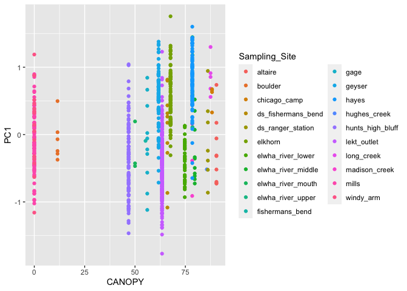<!-- -->

``` r
ggplot(omy_df, aes(x=Pool_frequency, y=PC1, col = Sampling_Site)) + 
  geom_point()
```

    ## Warning: Removed 18 rows containing missing values (geom_point).

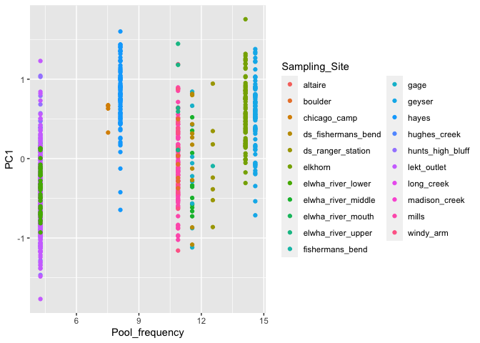<!-- -->

``` r
ggplot(omy_df, aes(x=Logjams, y=PC1, col = Sampling_Site)) + 
  geom_point()
```

    ## Warning: Removed 18 rows containing missing values (geom_point).

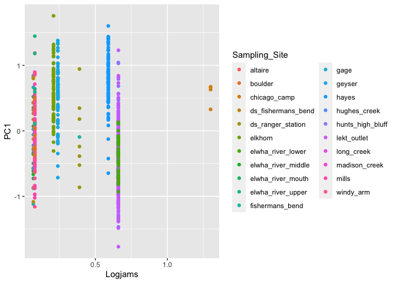<!-- -->

``` r
ggplot(omy_df, aes(x=spawnable_area_steelhd, y=PC1, col = Sampling_Site)) + 
  geom_point()
```

    ## Warning: Removed 18 rows containing missing values (geom_point).

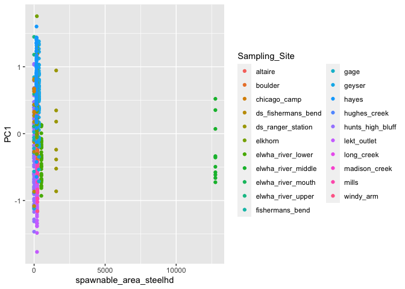<!-- -->

``` r
ggplot(omy_df, aes(x=ST_S36_2015, y=PC1, col = Sampling_Site)) + 
  geom_point()
```

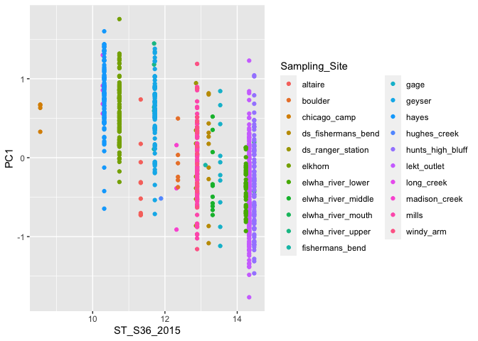<!-- -->

``` r
ggplot(omy_df, aes(x=OUT_DIST, y=PC1, col = Sampling_Site)) + 
  geom_point()
```

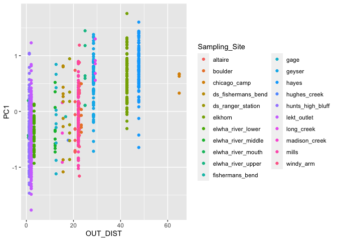<!-- -->

``` r
ggplot(omy_df, aes(x=FlowVel, y=PC1, col = Sampling_Site)) + 
  geom_point()
```

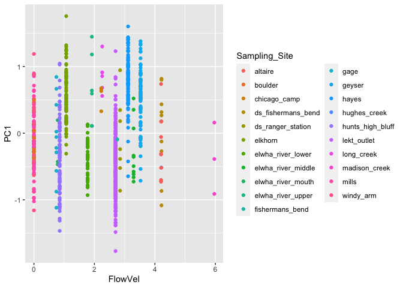<!-- -->

``` r
ggplot(omy_df, aes(x=BFQ, y=PC1, col = Sampling_Site)) + 
  geom_point()
```

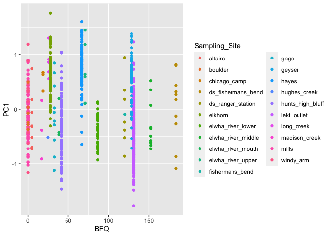<!-- -->

``` r
ggplot(omy_df, aes(x=IP_Steelhd, y=PC1, col = Sampling_Site)) + 
  geom_point()
```

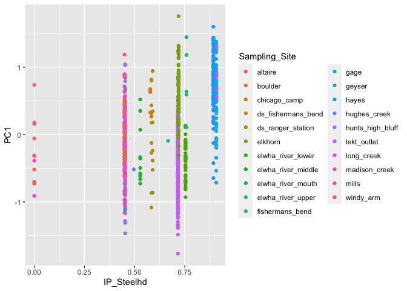<!-- -->

``` r
ggplot(omy_df, aes(x=Percent_gravels, y=PC1, col = Sampling_Site)) + 
  geom_point()
```

    ## Warning: Removed 406 rows containing missing values (geom_point).

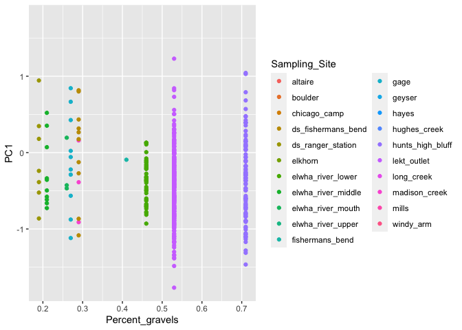<!-- -->

``` r
ggplot(omy_df, aes(x=Percent_fines, y=PC1, col = Sampling_Site)) + 
  geom_point()
```

    ## Warning: Removed 406 rows containing missing values (geom_point).

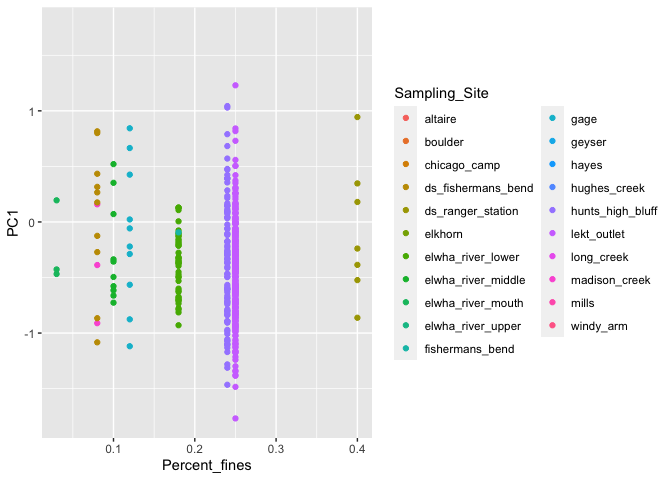<!-- -->

start by visualizing some individual relationships before running
models - adaptive response variable

``` r
ggplot(omy_df, aes(x=CANOPY, y=alleleS_count1, col = Sampling_Site)) + 
  geom_point()
```

    ## Warning: Removed 4 rows containing missing values (geom_point).

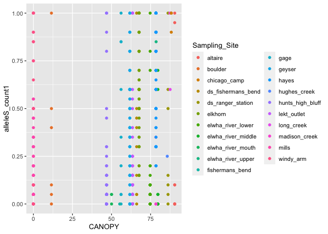<!-- -->

``` r
ggplot(omy_df, aes(x=Pool_frequency, y=alleleS_count1, col = Sampling_Site)) + 
  geom_point()
```

    ## Warning: Removed 22 rows containing missing values (geom_point).

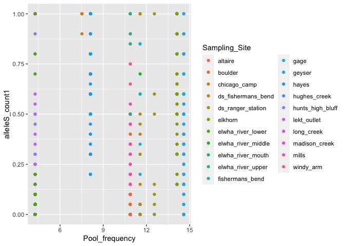<!-- -->

``` r
ggplot(omy_df, aes(x=Logjams, y=alleleS_count1, col = Sampling_Site)) + 
  geom_point()
```

    ## Warning: Removed 22 rows containing missing values (geom_point).

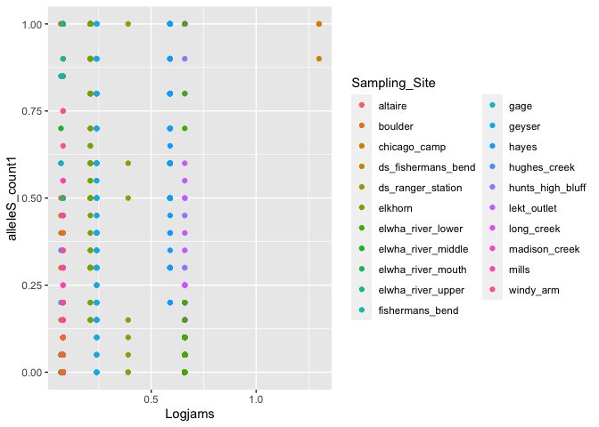<!-- -->

``` r
ggplot(omy_df, aes(x=spawnable_area_steelhd, y=alleleS_count1, col = Sampling_Site)) + 
  geom_point()
```

    ## Warning: Removed 22 rows containing missing values (geom_point).

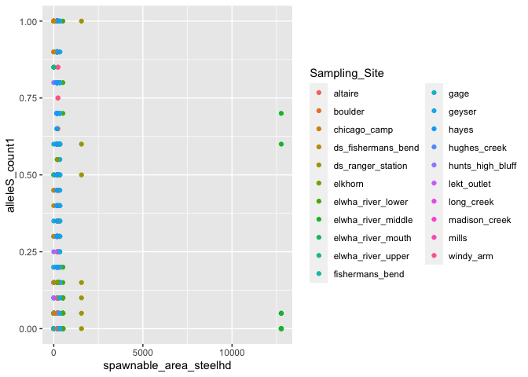<!-- -->

``` r
ggplot(omy_df, aes(x=ST_S36_2015, y=alleleS_count1, col = Sampling_Site)) + 
  geom_point()
```

    ## Warning: Removed 4 rows containing missing values (geom_point).

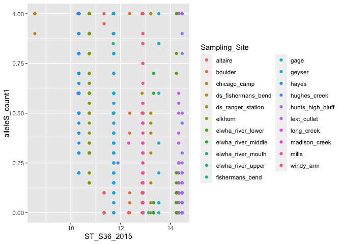<!-- -->

``` r
ggplot(omy_df, aes(x=OUT_DIST, y=alleleS_count1, col = Sampling_Site)) + 
  geom_point()
```

    ## Warning: Removed 4 rows containing missing values (geom_point).

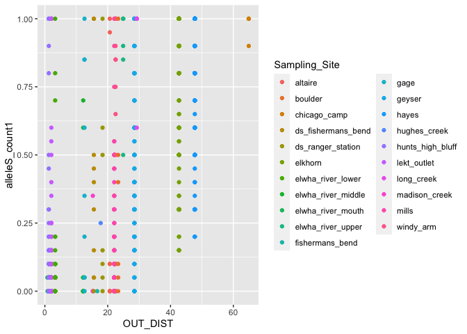<!-- -->

``` r
ggplot(omy_df, aes(x=FlowVel, y=alleleS_count1, col = Sampling_Site)) + 
  geom_point()
```

    ## Warning: Removed 4 rows containing missing values (geom_point).

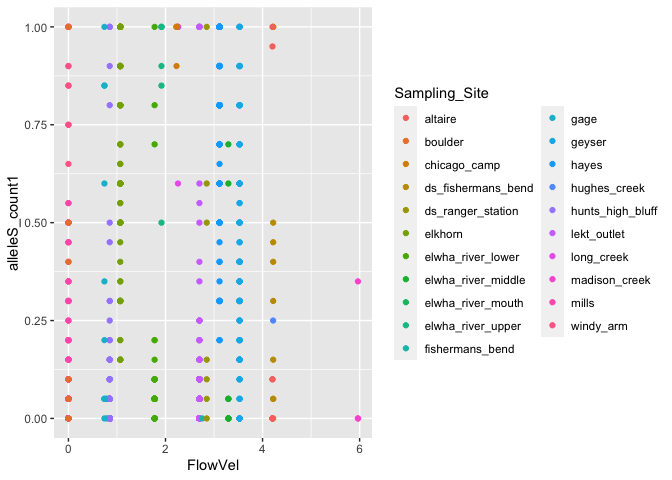<!-- -->

``` r
ggplot(omy_df, aes(x=BFQ, y=alleleS_count1, col = Sampling_Site)) + 
  geom_point()
```

    ## Warning: Removed 4 rows containing missing values (geom_point).

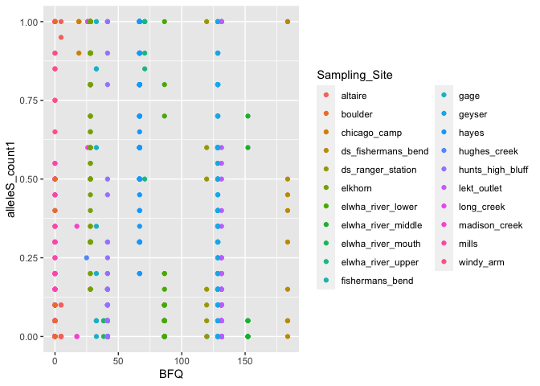<!-- -->

``` r
ggplot(omy_df, aes(x=IP_Steelhd, y=alleleS_count1, col = Sampling_Site)) + 
  geom_point()
```

    ## Warning: Removed 4 rows containing missing values (geom_point).

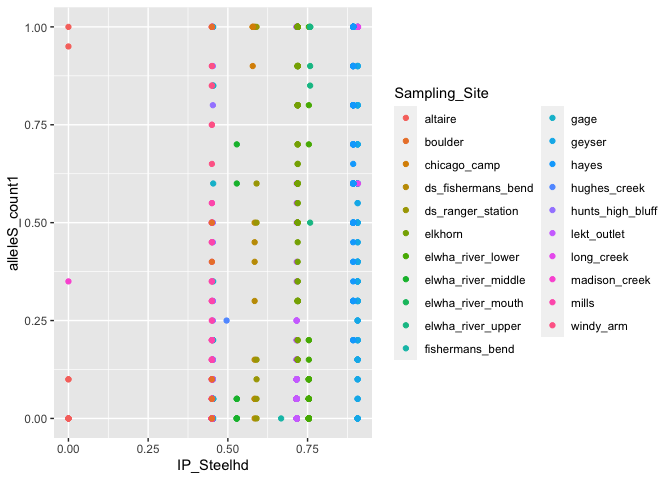<!-- -->

``` r
ggplot(omy_df, aes(x=Percent_gravels, y=alleleS_count1, col = Sampling_Site)) + 
  geom_point()
```

    ## Warning: Removed 409 rows containing missing values (geom_point).

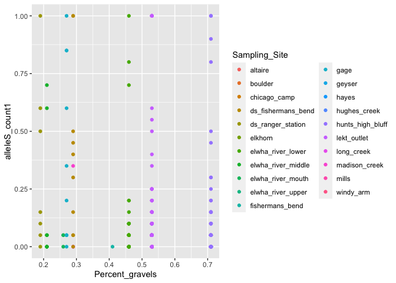<!-- -->

``` r
ggplot(omy_df, aes(x=Percent_fines, y=alleleS_count1, col = Sampling_Site)) + 
  geom_point()
```

    ## Warning: Removed 409 rows containing missing values (geom_point).

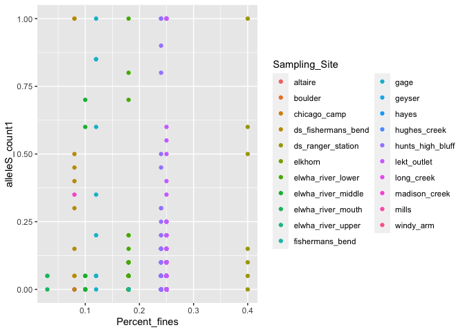<!-- -->

## run some mixed effect models

### sort of following worked examples:

<https://bookdown.org/hhwagner1/LandGenCourse_book/WE_6.html#WE_6>
<https://bookdown.org/hhwagner1/LandGenCourse_book/WE_12.html#WE_12>

### center and scale explainatory variables for PCA

``` r
sample <- omy_df$Sample_ID
PC1 <- omy_df$PC1
PropA <- omy_df$alleleS_count1
site <- omy_df$Sampling_Site
dist <- omy_df$OUT_DIST

for (i in 1:length(colnames(omy_df))){
  if (is.numeric(omy_df[, i])==TRUE)
    omy_df[, i] <- as.numeric(scale(omy_df[, i]))
  else
    omy_df[, i] <- omy_df[, i]
}

## replace values i don't want scaled
omy_df$PC1 <- PC1
omy_df$alleleS_count1 <- PropA
```

check data frame structure

``` r
omy_df$Sampling_Site <- as.factor(omy_df$Sampling_Site)
str(omy_df)
```

    ## 'data.frame':    841 obs. of  18 variables:
    ##  $ Sample_ID             : chr  "51029_E12_351" "51761_17_005" "51761_17_008" "51686_118" ...
    ##  $ Time                  : chr  "Post" "Post" "Post" "Post" ...
    ##  $ Location              : chr  "BD" "BD" "BD" "BD" ...
    ##  $ Sampling_Site         : Factor w/ 21 levels "altaire","boulder",..: 9 9 9 16 16 16 16 16 16 16 ...
    ##  $ Pool_frequency        : num  -0.943 -0.943 -0.943 -0.943 -0.943 ...
    ##  $ Logjams               : num  0.824 0.824 0.824 0.824 0.824 ...
    ##  $ spawnable_area_steelhd: num  -0.13 -0.13 -0.13 -0.264 -0.264 ...
    ##  $ CANOPY                : num  -0.23 -0.23 -0.23 -0.359 -0.359 ...
    ##  $ ST_S36_2015           : num  0.982 0.982 0.982 0.982 0.982 ...
    ##  $ FlowVel               : num  -0.992 -0.992 -0.992 -0.941 -0.941 ...
    ##  $ BFQ                   : num  -0.751 -0.751 -0.751 -0.693 -0.693 ...
    ##  $ IP_Chinook            : num  0.8 0.8 0.8 0.8 0.8 ...
    ##  $ IP_Steelhd            : num  -1.2 -1.2 -1.2 -1.19 -1.19 ...
    ##  $ Percent_gravels       : num  -2.19 -2.19 -2.19 1.41 1.41 ...
    ##  $ Percent_fines         : num  -3.923 -3.923 -3.923 0.197 0.197 ...
    ##  $ OUT_DIST              : num  -0.987 -0.987 -0.987 -0.964 -0.964 ...
    ##  $ PC1                   : num  -0.427 0.195 -0.468 -0.894 -0.799 ...
    ##  $ alleleS_count1        : num  0.05 0.05 0 0.05 0.05 0 0 0.05 0 0.05 ...

response = PC1 (continuous), the loading score of PC1 from the DAPC
analysis using neutral loci OR alleleS_count1 (continuous), the
proportion of summer run alleles (?? check this) explanatory =
environmental vars (standardized) random effect = sampling site

## look at the distribution of the response variable

``` r
hist(omy_df$PC1)
```

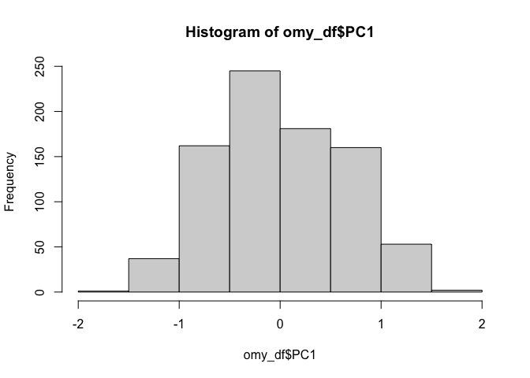<!-- -->

``` r
hist(omy_df$alleleS_count1)
```

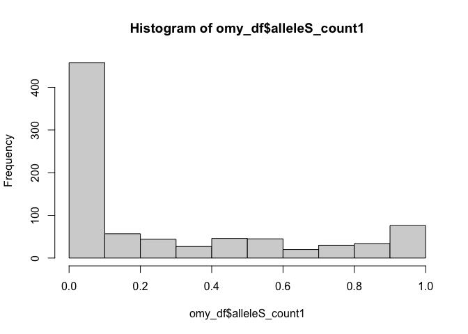<!-- -->

PC1 okay, but will transform alleleS

``` r
omy_df$alleleS_count1_asin <- asin(sqrt(omy_df$alleleS_count1))
hist(omy_df$alleleS_count1_asin)
```

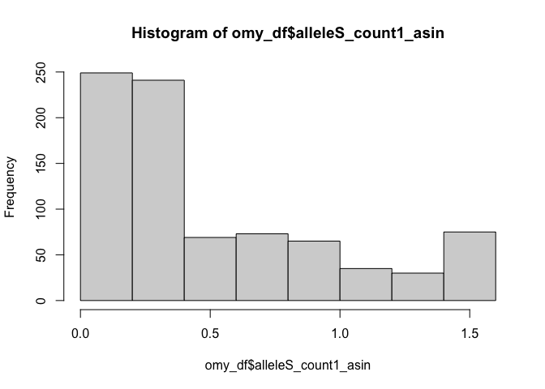<!-- -->

## subset dataframe to include all sites and only environmental variables with no missing data

``` r
omy_df_reduced <- omy_df %>%
  dplyr::select(!Pool_frequency) %>%
  dplyr::select(!Logjams) %>%
  dplyr::select(!spawnable_area_steelhd) %>%
  dplyr::select(!Percent_gravels) %>%
  dplyr::select(!Percent_fines)
```

## fit candidate models for reduced dataset

1.  Null model: OUT_DIST (aka. Rkm)
2.  Full model: ST_S36_2015, FlowVel, BFQ, CANOPY, IP_Steelhd
3.  Temperature model: ST_S36_2015
4.  Flow model: FlowVel, BFQ
5.  Habitat type: CANOPY, IP_Steelhd

## check for multicollinearity (again)

``` r
df <- with(omy_df_reduced, data.frame(ST_S36_2015, FlowVel, BFQ, CANOPY, IP_Steelhd))
usdm::vif(df) 
```

    ##     Variables       VIF
    ## 1 ST_S36_2015  6.096731
    ## 2     FlowVel  9.087211
    ## 3         BFQ 14.649657
    ## 4      CANOPY  2.601199
    ## 5  IP_Steelhd  4.550752

hmm.. remove BFQ from full model

## check for multicollinearity (again)

``` r
df <- with(omy_df_reduced, data.frame(ST_S36_2015, FlowVel, CANOPY, IP_Steelhd))
usdm::vif(df) 
```

    ##     Variables      VIF
    ## 1 ST_S36_2015 1.182756
    ## 2     FlowVel 2.620033
    ## 3      CANOPY 2.534725
    ## 4  IP_Steelhd 1.860629

## set up models

``` r
mod1 <- lmer(PC1 ~ OUT_DIST + (1|Sampling_Site), data = omy_df_reduced, REML = TRUE)
mod2 <- lmer(PC1 ~ ST_S36_2015 + FlowVel+ CANOPY + IP_Steelhd + (1|Sampling_Site), data = omy_df_reduced, REML = TRUE)
mod3 <- lmer(PC1 ~ ST_S36_2015 + (1|Sampling_Site), data = omy_df_reduced, REML = TRUE)
mod4 <- lmer(PC1 ~ FlowVel + BFQ + (1|Sampling_Site), data = omy_df_reduced, REML = TRUE)
mod5 <- lmer(PC1 ~ CANOPY + IP_Steelhd + (1|Sampling_Site), data = omy_df_reduced, REML = TRUE)
```

## check residuals of full model

``` r
plot(mod2, abline = c(0,0))
```

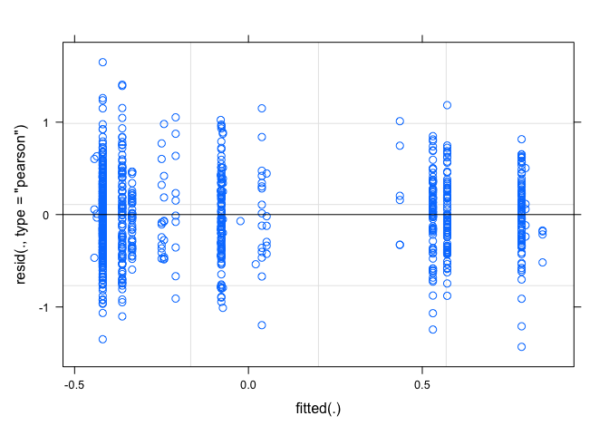<!-- -->

``` r
par(mfrow=c(1,2))
hist(residuals(mod2)) 
qqnorm(residuals(mod2))
```

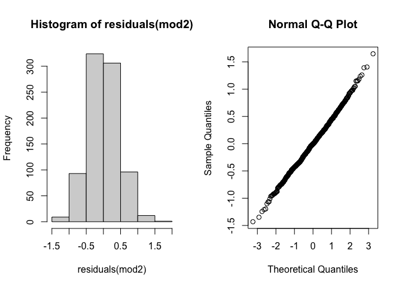<!-- -->

looks okay.

## compare models

``` r
stargazer(mod1, mod2, mod3, mod4, mod5, 
          type = "text",
          digits = 3, 
          ci = TRUE,
          star.cutoffs = c(0.05, 0.01, 0.001),
          digit.separator = "")
```

    ## 
    ## =====================================================================================================
    ##                                                    Dependent variable:                               
    ##                     ---------------------------------------------------------------------------------
    ##                                                            PC1                                       
    ##                           (1)             (2)              (3)              (4)             (5)      
    ## -----------------------------------------------------------------------------------------------------
    ## OUT_DIST               0.400***                                                                      
    ##                     (0.290, 0.510)                                                                   
    ##                                                                                                      
    ## ST_S36_2015                            -0.365***        -0.366***                                    
    ##                                     (-0.442, -0.288) (-0.476, -0.256)                                
    ##                                                                                                      
    ## FlowVel                                  -0.015                           -0.012                     
    ##                                     (-0.105, 0.075)                   (-0.192, 0.168)                
    ##                                                                                                      
    ## CANOPY                                   -0.047                                            0.034     
    ##                                     (-0.144, 0.050)                                   (-0.113, 0.182)
    ##                                                                                                      
    ## IP_Steelhd                              0.146***                                          0.195**    
    ##                                      (0.085, 0.207)                                   (0.070, 0.320) 
    ##                                                                                                      
    ## BFQ                                                                       -0.021                     
    ##                                                                       (-0.234, 0.192)                
    ##                                                                                                      
    ## Constant                -0.003           0.036            -0.032           0.053           0.157     
    ##                     (-0.105, 0.098) (-0.039, 0.112)  (-0.142, 0.078)  (-0.163, 0.269) (-0.023, 0.336)
    ##                                                                                                      
    ## -----------------------------------------------------------------------------------------------------
    ## Observations              841             841              841              841             841      
    ## Log Likelihood         -539.657         -538.300         -540.502        -551.480        -547.571    
    ## Akaike Inf. Crit.      1087.314         1090.600         1089.004        1112.959        1105.142    
    ## Bayesian Inf. Crit.    1106.252         1123.742         1107.942        1136.632        1128.815    
    ## =====================================================================================================
    ## Note:                                                                   *p<0.05; **p<0.01; ***p<0.001

**null model has lowest AIC/BIC**

week 6 tutorial suggests using the ML fit, as AIC is not valid for REML…

``` r
aic_vals <- c(extractAIC(mod1)[2], extractAIC(mod2)[2], extractAIC(mod3)[2], 
              extractAIC(mod4)[2], extractAIC(mod5)[2])
names(aic_vals) <- c("mod1","mod2","mod3", "mod4", "mod5")
aic_vals
```

    ##     mod1     mod2     mod3     mod4     mod5 
    ## 1079.085 1065.695 1080.914 1104.256 1094.744

**hmm here mod2 (full model) shows lowest AIC**

check model validity

``` r
plot(mod2, abline = c(0,0))
```

<!-- -->

``` r
par(mfrow=c(1,2))
hist(residuals(mod2)) 
qqnorm(residuals(mod2))
```

<!-- -->

## estimate variance components

``` r
MuMIn::r.squaredGLMM(mod2)
```

    ## Warning: 'r.squaredGLMM' now calculates a revised statistic. See the help page.

    ##           R2m       R2c
    ## [1,] 0.454985 0.4854203

the fixed effects had a pretty sizable effect (45%) and the total model
explains 48%.

``` r
summary(mod2)
```

    ## Linear mixed model fit by REML ['lmerMod']
    ## Formula: 
    ## PC1 ~ ST_S36_2015 + FlowVel + CANOPY + IP_Steelhd + (1 | Sampling_Site)
    ##    Data: omy_df_reduced
    ## 
    ## REML criterion at convergence: 1076.6
    ## 
    ## Scaled residuals: 
    ##     Min      1Q  Median      3Q     Max 
    ## -3.1881 -0.7124 -0.0066  0.6300  3.6720 
    ## 
    ## Random effects:
    ##  Groups        Name        Variance Std.Dev.
    ##  Sampling_Site (Intercept) 0.01193  0.1092  
    ##  Residual                  0.20164  0.4490  
    ## Number of obs: 841, groups:  Sampling_Site, 21
    ## 
    ## Fixed effects:
    ##             Estimate Std. Error t value
    ## (Intercept)  0.03636    0.03848   0.945
    ## ST_S36_2015 -0.36475    0.03917  -9.312
    ## FlowVel     -0.01460    0.04594  -0.318
    ## CANOPY      -0.04717    0.04962  -0.951
    ## IP_Steelhd   0.14623    0.03125   4.680
    ## 
    ## Correlation of Fixed Effects:
    ##             (Intr) ST_S36 FlowVl CANOPY
    ## ST_S36_2015  0.263                     
    ## FlowVel      0.110  0.039              
    ## CANOPY      -0.134  0.134 -0.719       
    ## IP_Steelhd   0.311  0.204  0.114 -0.252

## now subset data to include only sites with full environmental data (aka sites on mainstem of Elwha)

``` r
omy_n_ms <- omy_df %>%
  drop_na()
```

## fit candidate models

1.  Null model: OUT_DIST (aka. Rkm)
2.  Full model: ST_S36_2015, FlowVel, BFQ, Pool_freq, Logjams, CANOPY,
    IP_Steelhd, spawnable_area_steelhd, percent_gravels, percent_fines
3.  Temperature model: ST_S36_2015
4.  Flow model: FlowVel, BFQ
5.  Habitat type: Pool_freq, Logjams, CANOPY, IP_Steelhd
6.  Substrate: spawnable_area_steelhd, percent_gravels, percent_fines

## check for multicollinearity (again)

``` r
df <- with(omy_n_ms, data.frame(ST_S36_2015, FlowVel, BFQ, Pool_frequency, Logjams, CANOPY, IP_Steelhd, spawnable_area_steelhd, Percent_gravels, Percent_fines))
usdm::vif(df)  ## hmm... not sure why this produces Inf
```

    ##                 Variables VIF
    ## 1             ST_S36_2015 Inf
    ## 2                 FlowVel Inf
    ## 3                     BFQ Inf
    ## 4          Pool_frequency Inf
    ## 5                 Logjams Inf
    ## 6                  CANOPY Inf
    ## 7              IP_Steelhd Inf
    ## 8  spawnable_area_steelhd Inf
    ## 9         Percent_gravels Inf
    ## 10          Percent_fines Inf

``` r
df <- with(omy_n_ms, data.frame(FlowVel, BFQ))
usdm::vif(df)
```

    ##   Variables      VIF
    ## 1   FlowVel 107.7216
    ## 2       BFQ 107.7216

``` r
## remove BFQ

df <- with(omy_n_ms, data.frame(Pool_frequency, Logjams, CANOPY, IP_Steelhd))
usdm::vif(df)
```

    ##        Variables       VIF
    ## 1 Pool_frequency 14.937768
    ## 2        Logjams 11.279564
    ## 3         CANOPY  6.101275
    ## 4     IP_Steelhd  5.811464

``` r
## remove pool_frequency

df <- with(omy_n_ms, data.frame(Logjams, CANOPY, IP_Steelhd))
usdm::vif(df)
```

    ##    Variables      VIF
    ## 1    Logjams 2.166504
    ## 2     CANOPY 4.333278
    ## 3 IP_Steelhd 4.458155

``` r
df <- with(omy_n_ms, data.frame(spawnable_area_steelhd, Percent_gravels, Percent_fines))
usdm::vif(df)
```

    ##                Variables      VIF
    ## 1 spawnable_area_steelhd 1.340629
    ## 2        Percent_gravels 1.423580
    ## 3          Percent_fines 1.290918

``` r
### going back to the full model... removing BFQ and pool_frequency
df <- with(omy_n_ms, data.frame(ST_S36_2015, FlowVel, Logjams, CANOPY, IP_Steelhd, spawnable_area_steelhd, Percent_gravels, Percent_fines))
usdm::vif(df) 
```

    ##                Variables       VIF
    ## 1            ST_S36_2015 43.228549
    ## 2                FlowVel  8.599820
    ## 3                Logjams 24.106355
    ## 4                 CANOPY 37.363997
    ## 5             IP_Steelhd 39.106265
    ## 6 spawnable_area_steelhd  5.335000
    ## 7        Percent_gravels 11.793734
    ## 8          Percent_fines  3.648653

``` r
# try dropping additional variables in the full model? for now just dropping full model from comparison.  
```

``` r
mod1 <- lmer(PC1 ~ OUT_DIST + (1|Sampling_Site), data = omy_n_ms, REML = TRUE)
#mod2 <- lmer(PC1 ~ ST_S36_2015+ FlowVel+ Logjams+ CANOPY+ IP_Steelhd+ spawnable_area_steelhd + (1|Sampling_Site), data = omy_n_ms, REML = TRUE)
mod3 <- lmer(PC1 ~ ST_S36_2015 + (1|Sampling_Site), data = omy_n_ms, REML = TRUE)
mod4 <- lmer(PC1 ~ FlowVel + (1|Sampling_Site), data = omy_n_ms, REML = TRUE)
mod5 <- lmer(PC1 ~ Logjams + CANOPY + IP_Steelhd + (1|Sampling_Site), data = omy_n_ms, REML = TRUE)
```

    ## boundary (singular) fit: see help('isSingular')

``` r
mod6 <- lmer(PC1 ~ spawnable_area_steelhd + Percent_gravels + Percent_fines + (1|Sampling_Site), data = omy_n_ms, REML = TRUE)
```

``` r
aic_vals <- c(extractAIC(mod1)[2], extractAIC(mod3)[2], 
              extractAIC(mod4)[2], extractAIC(mod5)[2], extractAIC(mod6)[2])
names(aic_vals) <- c("mod1","mod3", "mod4", "mod5", "mod6")
aic_vals
```

    ##     mod1     mod3     mod4     mod5     mod6 
    ## 577.4111 578.9816 586.4291 580.7956 586.2074

**null model is lowest**

``` r
plot(mod6, abline = c(0,0))
```

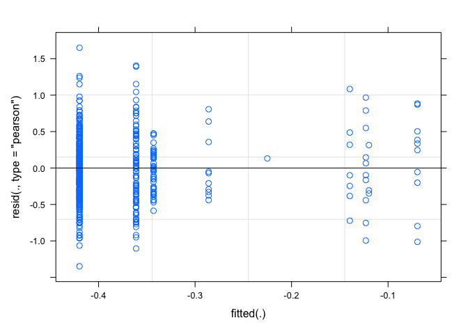<!-- -->

``` r
par(mfrow=c(1,2))
hist(residuals(mod6)) 
qqnorm(residuals(mod6))
```

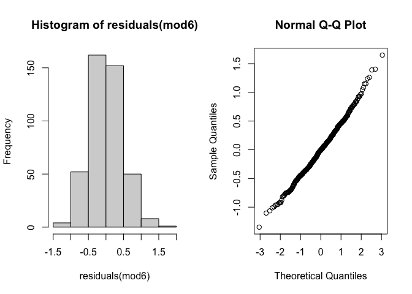<!-- -->

``` r
stargazer(mod1, mod3, mod4, mod5, mod6, 
          type = "text",
          digits = 3, 
          ci = TRUE,
          star.cutoffs = c(0.05, 0.01, 0.001),
          digit.separator = "")
```

    ## 
    ## ==========================================================================================================
    ##                                                        Dependent variable:                                
    ##                        -----------------------------------------------------------------------------------
    ##                                                                PC1                                        
    ##                              (1)             (2)              (3)              (4)              (5)       
    ## ----------------------------------------------------------------------------------------------------------
    ## OUT_DIST                  0.382***                                                                        
    ##                        (0.157, 0.606)                                                                     
    ##                                                                                                           
    ## ST_S36_2015                                -0.362**                                                       
    ##                                        (-0.600, -0.125)                                                   
    ##                                                                                                           
    ## FlowVel                                                      0.058                                        
    ##                                                         (-0.077, 0.192)                                   
    ##                                                                                                           
    ## Logjams                                                                       -0.098                      
    ##                                                                          (-0.206, 0.011)                  
    ##                                                                                                           
    ## CANOPY                                                                        0.057                       
    ##                                                                          (-0.190, 0.303)                  
    ##                                                                                                           
    ## IP_Steelhd                                                                    -0.074                      
    ##                                                                          (-0.219, 0.071)                  
    ##                                                                                                           
    ## spawnable_area_steelhd                                                                         -0.022     
    ##                                                                                           (-0.070, 0.025) 
    ##                                                                                                           
    ## Percent_gravels                                                                                -0.082     
    ##                                                                                           (-0.170, 0.005) 
    ##                                                                                                           
    ## Percent_fines                                                                                  -0.012     
    ##                                                                                           (-0.080, 0.057) 
    ##                                                                                                           
    ## Constant                   -0.038           -0.052         -0.276***        -0.334***        -0.331***    
    ##                        (-0.230, 0.154) (-0.249, 0.146)  (-0.398, -0.154) (-0.475, -0.193) (-0.451, -0.211)
    ##                                                                                                           
    ## ----------------------------------------------------------------------------------------------------------
    ## Observations                 429             429              429              429              429       
    ## Log Likelihood            -288.664         -289.260         -292.996         -293.178         -297.109    
    ## Akaike Inf. Crit.          585.329         586.520          593.991          598.357          606.218     
    ## Bayesian Inf. Crit.        601.574         602.766          610.237          622.726          630.586     
    ## ==========================================================================================================
    ## Note:                                                                        *p<0.05; **p<0.01; ***p<0.001

**again, null model has lowest AIC/BIC**

## now using the adaptive response variable… this is a proportion so go with “family = binomial” in glmer (???) or quasibinomial?

## first use omy_df_reduced dataframe

``` r
mod1 <- glmer(alleleS_count1  ~ OUT_DIST + (1|Sampling_Site), family = "binomial", data = omy_df_reduced)
```

    ## Warning in eval(family$initialize, rho): non-integer #successes in a binomial
    ## glm!

``` r
mod2 <- glmer(alleleS_count1  ~ ST_S36_2015 + FlowVel+ CANOPY + IP_Steelhd + (1|Sampling_Site), family = "binomial", data = omy_df_reduced)
```

    ## Warning in eval(family$initialize, rho): non-integer #successes in a binomial
    ## glm!

    ## boundary (singular) fit: see help('isSingular')

``` r
mod3 <- glmer(alleleS_count1  ~ ST_S36_2015 + (1|Sampling_Site), family = "binomial", data = omy_df_reduced)
```

    ## Warning in eval(family$initialize, rho): non-integer #successes in a binomial
    ## glm!

    ## boundary (singular) fit: see help('isSingular')

``` r
mod4 <- glmer(alleleS_count1  ~ FlowVel + BFQ + (1|Sampling_Site), family = "binomial", data = omy_df_reduced)
```

    ## Warning in eval(family$initialize, rho): non-integer #successes in a binomial
    ## glm!

``` r
mod5 <- glmer(alleleS_count1  ~ CANOPY + IP_Steelhd + (1|Sampling_Site), family = "binomial", data = omy_df_reduced)
```

    ## Warning in eval(family$initialize, rho): non-integer #successes in a binomial
    ## glm!

``` r
plot(mod2, abline = c(0,0))
```

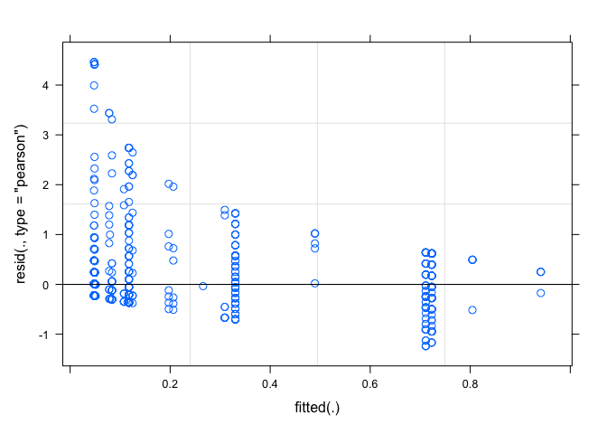<!-- -->

``` r
par(mfrow=c(1,2))
hist(residuals(mod2)) 
qqnorm(residuals(mod2))
```

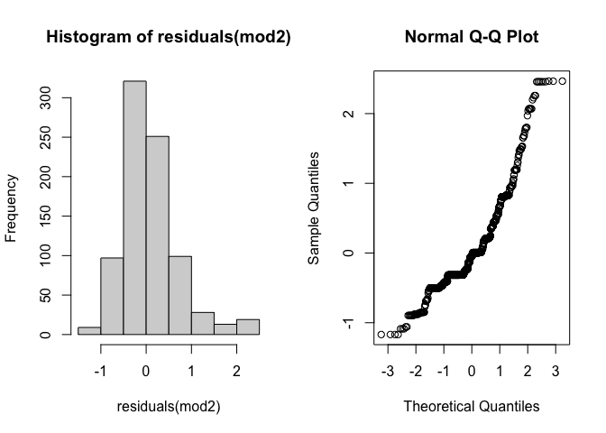<!-- -->

well that’s no good… but anyways.. let’s glance at model AIC’s

``` r
stargazer(mod1, mod2, mod3, mod4, mod5, 
          type = "text",
          digits = 3, 
          ci = TRUE,
          star.cutoffs = c(0.05, 0.01, 0.001),
          digit.separator = "")
```

    ## 
    ## ========================================================================================================
    ##                                                     Dependent variable:                                 
    ##                     ------------------------------------------------------------------------------------
    ##                                                        alleleS_count1                                   
    ##                           (1)              (2)              (3)              (4)              (5)       
    ## --------------------------------------------------------------------------------------------------------
    ## OUT_DIST                1.533***                                                                        
    ##                      (1.157, 1.909)                                                                     
    ##                                                                                                         
    ## ST_S36_2015                             -1.448***        -1.613***                                      
    ##                                      (-1.697, -1.199) (-1.836, -1.390)                                  
    ##                                                                                                         
    ## FlowVel                                  -0.386**                           0.106                       
    ##                                      (-0.672, -0.100)                  (-0.584, 0.795)                  
    ##                                                                                                         
    ## CANOPY                                    0.390*                                             0.287      
    ##                                       (0.091, 0.689)                                    (-0.326, 0.900) 
    ##                                                                                                         
    ## IP_Steelhd                                0.139                                              0.532      
    ##                                      (-0.096, 0.375)                                    (-0.034, 1.097) 
    ##                                                                                                         
    ## BFQ                                                                         -0.394                      
    ##                                                                        (-1.176, 0.387)                  
    ##                                                                                                         
    ## Constant               -1.379***        -1.626***        -1.695***         -1.049**         -0.748*     
    ##                     (-1.795, -0.962) (-1.863, -1.388) (-1.939, -1.452) (-1.797, -0.300) (-1.475, -0.022)
    ##                                                                                                         
    ## --------------------------------------------------------------------------------------------------------
    ## Observations              837              837              837              837              837       
    ## Log Likelihood          -319.640         -309.860         -314.619         -332.373         -330.263    
    ## Akaike Inf. Crit.       645.280          631.720          635.238          672.747          668.526     
    ## Bayesian Inf. Crit.     659.469          660.099          649.427          691.666          687.446     
    ## ========================================================================================================
    ## Note:                                                                      *p<0.05; **p<0.01; ***p<0.001

hmm… well null, full, and temp models have lowest AIC/BICs. need to look
into model fit further.

## second let’s use the omy_n\_ms dataframe

``` r
mod1 <- glmer(alleleS_count1 ~ OUT_DIST + (1|Sampling_Site), family = "binomial", data = omy_n_ms)
```

    ## Warning in eval(family$initialize, rho): non-integer #successes in a binomial
    ## glm!

    ## boundary (singular) fit: see help('isSingular')

``` r
#mod2 <- lmer(alleleS_count1 ~ ST_S36_2015+ FlowVel+ Logjams+ CANOPY+ IP_Steelhd+ spawnable_area_steelhd + (1|Sampling_Site), family = "binomial", data = omy_n_ms)
mod3 <- glmer(alleleS_count1 ~ ST_S36_2015 + (1|Sampling_Site), family = "binomial", data = omy_n_ms)
```

    ## Warning in eval(family$initialize, rho): non-integer #successes in a binomial
    ## glm!

    ## boundary (singular) fit: see help('isSingular')

``` r
mod4 <- glmer(alleleS_count1 ~ FlowVel + (1|Sampling_Site), family = "binomial", data = omy_n_ms)
```

    ## Warning in eval(family$initialize, rho): non-integer #successes in a binomial
    ## glm!

    ## boundary (singular) fit: see help('isSingular')

``` r
mod5 <- glmer(alleleS_count1 ~ Logjams + CANOPY + IP_Steelhd + (1|Sampling_Site), family = "binomial", data = omy_n_ms)
```

    ## Warning in eval(family$initialize, rho): non-integer #successes in a binomial
    ## glm!

    ## boundary (singular) fit: see help('isSingular')

``` r
mod6 <- glmer(alleleS_count1 ~ spawnable_area_steelhd + Percent_gravels + Percent_fines + (1|Sampling_Site), family = "binomial", data = omy_n_ms)
```

    ## Warning in eval(family$initialize, rho): non-integer #successes in a binomial
    ## glm!

    ## boundary (singular) fit: see help('isSingular')

``` r
plot(mod6, abline = c(0,0))
```

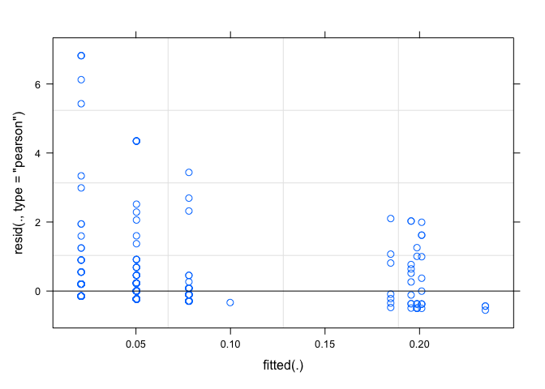<!-- -->

``` r
par(mfrow=c(1,2))
hist(residuals(mod6)) 
qqnorm(residuals(mod6))
```

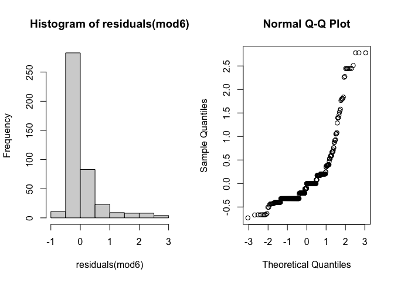<!-- -->

no bueno.

``` r
stargazer(mod1, mod3, mod4, mod5, mod6, 
          type = "text",
          digits = 3, 
          ci = TRUE,
          star.cutoffs = c(0.05, 0.01, 0.001),
          digit.separator = "")
```

    ## 
    ## ==========================================================================================================
    ##                                                        Dependent variable:                                
    ##                        -----------------------------------------------------------------------------------
    ##                                                          alleleS_count1                                   
    ##                              (1)             (2)              (3)              (4)              (5)       
    ## ----------------------------------------------------------------------------------------------------------
    ## OUT_DIST                  2.729***                                                                        
    ##                        (1.553, 3.905)                                                                     
    ##                                                                                                           
    ## ST_S36_2015                               -2.705***                                                       
    ##                                        (-3.915, -1.495)                                                   
    ##                                                                                                           
    ## FlowVel                                                      -0.134                                       
    ##                                                         (-0.693, 0.426)                                   
    ##                                                                                                           
    ## Logjams                                                                      -0.647*                      
    ##                                                                          (-1.284, -0.010)                 
    ##                                                                                                           
    ## CANOPY                                                                        0.729                       
    ##                                                                          (-0.752, 2.210)                  
    ##                                                                                                           
    ## IP_Steelhd                                                                    -0.639                      
    ##                                                                          (-1.677, 0.399)                  
    ##                                                                                                           
    ## spawnable_area_steelhd                                                                         -0.039     
    ##                                                                                           (-0.246, 0.168) 
    ##                                                                                                           
    ## Percent_gravels                                                                               -0.641**    
    ##                                                                                           (-1.078, -0.204)
    ##                                                                                                           
    ## Percent_fines                                                                                  -0.086     
    ##                                                                                           (-0.392, 0.220) 
    ##                                                                                                           
    ## Constant                   -0.602           -0.637         -2.728***        -2.810***        -2.931***    
    ##                        (-1.517, 0.313) (-1.573, 0.299)  (-3.126, -2.329) (-3.743, -1.877) (-3.389, -2.472)
    ##                                                                                                           
    ## ----------------------------------------------------------------------------------------------------------
    ## Observations                 429             429              429              429              429       
    ## Log Likelihood             -89.497         -90.122          -97.974          -88.671          -91.634     
    ## Akaike Inf. Crit.          184.993         186.244          201.949          187.342          193.269     
    ## Bayesian Inf. Crit.        197.178         198.429          214.133          207.649          213.576     
    ## ==========================================================================================================
    ## Note:                                                                        *p<0.05; **p<0.01; ***p<0.001

**here the null model seems to be best**
