elwha_IBE_chinook
================
Kimberly Ledger
2023-03-08

load libraries

``` r
library(tidyverse)
library(ggplot2)
library(psych)
library(corrplot)
library(usdm)
library(lme4)
library(stargazer)
```

## Chinook

``` r
chin_neutral_scores <- read.csv("~/Desktop/LG_Proj4/Elwha_genetics/outputs/Feb2023/chin_n_post_dapc.csv") %>%
  rename(Sample_ID = X) %>%
  dplyr::select(Sample_ID, PC1)

chin_adaptive_scores <- readRDS("~/Desktop/LG_Proj4/Elwha_genetics/outputs/final/IBE_input_Chinook.rds") %>%
  rename(Sample_ID = sampleID) %>%
  dplyr::select(Sample_ID, SpringAlleleFreq)

enviro <- read.csv("~/Desktop/LG_Proj4/Elwha_environmentaldata/outputs/final/enviro_summary_reduced_22Feb2023.csv") %>%
  rename(Sampling_Site = X)

chin_metadata <- read.csv("~/Desktop/LG_Proj4/Elwha_datafiles/2023/Elwha_Chinook_Formatted_wDownstreamLatLongrkm_kjl.csv") %>%
  filter(Time == "Post")
```

join the environmental data to the list of omy collection sites

``` r
chin_sites <- chin_metadata %>%
  distinct(Sampling_Site)
chin_sites
```

    ##   Sampling_Site
    ## 1      Hatchery
    ## 2       Reach 3
    ## 3       Reach 1
    ## 4       Reach 7
    ## 5       Reach 5
    ## 6  Indian Creek
    ## 7  Little River
    ## 8       Reach 2
    ## 9       Reach 4

``` r
chin_sites_enviro <- chin_sites %>%
  left_join(enviro, by = "Sampling_Site")
```

set the single Reach 3,4 fish to Reach 3

``` r
chin_metadata$Sampling_Site[which(chin_metadata$Sampling_Site == "Reach 3,4")] <-"Reach 3"
```

create a data frame

``` r
chin_df <- chin_metadata %>%
  dplyr::select(Sample_ID, Time, Location, Sampling_Site) %>%
  left_join(chin_sites_enviro, by = "Sampling_Site") %>%
  left_join(chin_neutral_scores, by = "Sample_ID") %>%
  separate(Sample_ID, c("Sample_ID", NA)) %>%
  left_join(chin_adaptive_scores, by = "Sample_ID") %>%
  arrange(OUT_DIST) %>%
  drop_na(PC1)
```

### center and scale explainatory variables for PCA

``` r
sample <- chin_df$Sample_ID
PC1 <- chin_df$PC1
PropSpring <- chin_df$SpringAlleleFreq
site <- chin_df$Sampling_Site
dist <- chin_df$OUT_DIST

for (i in 1:length(colnames(chin_df))){
  if (is.numeric(chin_df[, i])==TRUE)
    chin_df[, i] <- as.numeric(scale(chin_df[, i]))
  else
    chin_df[, i] <- chin_df[, i]
}

## replace values i don't want scaled
chin_df$PC1 <- PC1
chin_df$SpringAlleleFreq <- PropSpring
```

check data frame structure

``` r
chin_df$Sampling_Site <- as.factor(chin_df$Sampling_Site)
str(chin_df)
```

    ## 'data.frame':    163 obs. of  20 variables:
    ##  $ Sample_ID       : chr  "17IN0135" "17IN0665" "17IN0673" "17IN1158" ...
    ##  $ Time            : chr  "Post" "Post" "Post" "Post" ...
    ##  $ Location        : chr  "BD" "BD" "BD" "BD" ...
    ##  $ Sampling_Site   : Factor w/ 9 levels "Hatchery","Indian Creek",..: 4 4 4 4 4 4 4 1 1 1 ...
    ##  $ CANOPY          : num  0.368 0.368 0.368 0.368 0.368 ...
    ##  $ SLOPE           : num  -1.03 -1.03 -1.03 -1.03 -1.03 ...
    ##  $ PRECIP          : num  -1.94 -1.94 -1.94 -1.94 -1.94 ...
    ##  $ FlowVel         : num  1.6 1.6 1.6 1.6 1.6 ...
    ##  $ AWAT            : num  0.589 0.589 0.589 0.589 0.589 ...
    ##  $ IP_Steelhd      : num  -0.468 -0.468 -0.468 -0.468 -0.468 ...
    ##  $ IP_Chinook      : num  0.497 0.497 0.497 0.497 0.497 ...
    ##  $ Pool_freq       : num  -0.703 -0.703 -0.703 -0.703 -0.703 ...
    ##  $ Logjams         : num  1 1 1 1 1 ...
    ##  $ Spawnable       : num  -0.0147 -0.0147 -0.0147 -0.0147 -0.0147 ...
    ##  $ fines           : num  -1.58 -1.58 -1.58 -1.58 -1.58 ...
    ##  $ gravels         : num  -0.323 -0.323 -0.323 -0.323 -0.323 ...
    ##  $ MWMT            : num  -0.387 -0.387 -0.387 -0.387 -0.387 ...
    ##  $ OUT_DIST        : num  -1.64 -1.64 -1.64 -1.64 -1.64 ...
    ##  $ PC1             : num  -0.201 -0.425 -0.417 0.645 1.489 ...
    ##  $ SpringAlleleFreq: num  0.875 0.661 0.804 0.875 0.857 ...

response = PC1 (continuous), the loading score of PC1 from the DAPC
analysis using neutral loci OR alleleS_count1 (continuous), the
proportion of summer run alleles (?? check this) explanatory =
environmental vars (standardized) random effect = sampling site

## look at the distribution of the response variable

``` r
hist(chin_df$PC1)
```

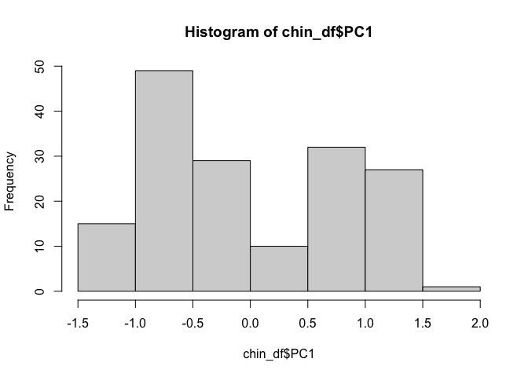<!-- -->

``` r
hist(chin_df$SpringAlleleFreq)
```

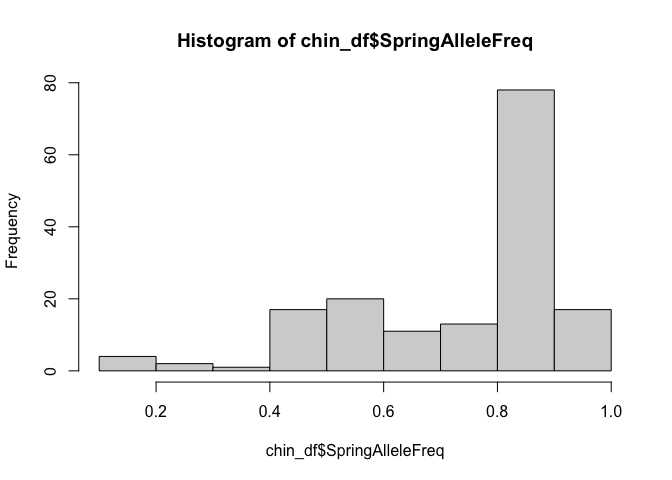<!-- -->

## subset dataframe to include all sites and only environmental variables with no missing data - NO MISSING DATA for Chinook sites

``` r
#chin_df_reduced <- chin_df %>%
#  dplyr::select(!gravels) %>%
#  dplyr::select(!fines)
```

## fit candidate models for datasets

1.  Null model: OUT_DIST (aka. Rkm)
2.  Climate model: MWMT (max weekly max temp) and PRECIP
3.  Flow model: FlowVel, SLOPE
4.  Habitat type: CANOPY, IP_Chinook, Pool_freq, Logjams, spawnable,
    gravel, fines
5.  Full model: CANOPY, SLOPE, PRECIP, FlowVel, AWAT or MWMT,
    IP_Steelhd, Pool_freq, Logjams, Spawnable

## check for multicollinearity - climate model

``` r
df <- with(chin_df, data.frame(MWMT, PRECIP))
usdm::vif(df) 
```

    ##   Variables      VIF
    ## 1      MWMT 1.007411
    ## 2    PRECIP 1.007411

will keep both

## check for multicollinearity - flow model

``` r
df <- with(chin_df, data.frame(FlowVel, SLOPE))
usdm::vif(df) 
```

    ##   Variables      VIF
    ## 1   FlowVel 1.027731
    ## 2     SLOPE 1.027731

will keep both

## check for multicollinearity - habitat model

``` r
df <- with(chin_df, data.frame(CANOPY, IP_Chinook, Pool_freq, Spawnable, Logjams, gravels, fines))
usdm::vif(df) 
```

    ##    Variables         VIF
    ## 1     CANOPY  554.264697
    ## 2 IP_Chinook    1.383113
    ## 3  Pool_freq  252.016183
    ## 4  Spawnable   69.672365
    ## 5    Logjams 1773.151707
    ## 6    gravels   98.699799
    ## 7      fines  257.576125

drop Logjams and CANOPY

## check for multicollinearity - habitat model again

``` r
df <- with(chin_df, data.frame(IP_Chinook, Pool_freq, Spawnable, gravels, fines))
usdm::vif(df) 
```

    ##    Variables      VIF
    ## 1 IP_Chinook 1.181216
    ## 2  Pool_freq 1.189801
    ## 3  Spawnable 1.056226
    ## 4    gravels 1.383715
    ## 5      fines 1.688020

good

## check for multicollinearity - full

``` r
df <- with(chin_df, data.frame(MWMT, PRECIP, FlowVel, SLOPE, IP_Chinook, Pool_freq, Spawnable, gravels, fines))
usdm::vif(df) 
```

    ##    Variables VIF
    ## 1       MWMT Inf
    ## 2     PRECIP Inf
    ## 3    FlowVel Inf
    ## 4      SLOPE Inf
    ## 5 IP_Chinook Inf
    ## 6  Pool_freq Inf
    ## 7  Spawnable Inf
    ## 8    gravels Inf
    ## 9      fines Inf

look at correlations to see what to drop

``` r
corr_full <- corr.test(df, method = "spearman", adjust = "none")
corr_full_plot <- corrplot(corr_full$r, order = "FPC", method = "number", type = "lower", tl.cex = 0.7, tl.col = rgb(0, 0, 0))
```

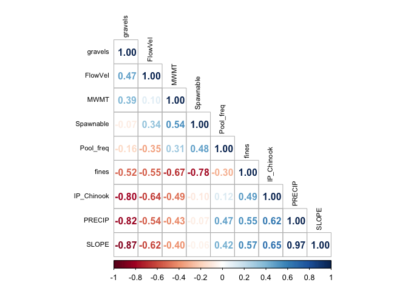<!-- -->

start by dropping SLOPE and gravels

## check for multicollinearity - full

``` r
df <- with(chin_df, data.frame(MWMT, PRECIP, FlowVel, IP_Chinook, Pool_freq, Spawnable, fines))
usdm::vif(df) 
```

    ##    Variables       VIF
    ## 1       MWMT 79.528788
    ## 2     PRECIP  5.051868
    ## 3    FlowVel 19.208490
    ## 4 IP_Chinook 58.350565
    ## 5  Pool_freq  3.106347
    ## 6  Spawnable  2.094716
    ## 7      fines 19.765763

drop MWMT

## check for multicollinearity - full

``` r
df <- with(chin_df, data.frame(PRECIP, FlowVel, IP_Chinook, Pool_freq, Spawnable, fines))
usdm::vif(df) 
```

    ##    Variables      VIF
    ## 1     PRECIP 2.210449
    ## 2    FlowVel 2.593951
    ## 3 IP_Chinook 1.514333
    ## 4  Pool_freq 2.138417
    ## 5  Spawnable 1.847218
    ## 6      fines 3.043235

## set up models - remove random effect

``` r
mod1 <- lm(PC1 ~ OUT_DIST, data = chin_df)
mod2 <- lm(PC1 ~ MWMT + PRECIP, data = chin_df)
mod3 <- lm(PC1 ~ FlowVel + SLOPE, data = chin_df)
mod4 <- lm(PC1 ~ IP_Chinook + Pool_freq + Spawnable + gravels + fines, data = chin_df)
mod5 <- lm(PC1 ~ PRECIP + FlowVel + IP_Chinook + Pool_freq + Spawnable + fines, data = chin_df)
```

## compare models

``` r
stargazer(mod1, mod2, mod3, mod4, mod5, 
          type = "text",
          digits = 3, 
          ci = TRUE,
          star.cutoffs = c(0.05, 0.01, 0.001),
          digit.separator = "")
```

    ## 
    ## ========================================================================================================================
    ##                                                             Dependent variable:                                         
    ##                     ----------------------------------------------------------------------------------------------------
    ##                                                                     PC1                                                 
    ##                             (1)                  (2)                 (3)                 (4)                 (5)        
    ## ------------------------------------------------------------------------------------------------------------------------
    ## OUT_DIST                  -0.138*                                                                                       
    ##                       (-0.268, -0.009)                                                                                  
    ##                                                                                                                         
    ## MWMT                                            0.014                                                                   
    ##                                            (-0.116, 0.144)                                                              
    ##                                                                                                                         
    ## PRECIP                                         -0.134*                                                     -0.186       
    ##                                           (-0.264, -0.003)                                             (-0.381, 0.009)  
    ##                                                                                                                         
    ## FlowVel                                                            -0.030                                  -0.054       
    ##                                                                (-0.162, 0.101)                         (-0.267, 0.158)  
    ##                                                                                                                         
    ## SLOPE                                                              -0.149*                                              
    ##                                                               (-0.280, -0.018)                                          
    ##                                                                                                                         
    ## IP_Chinook                                                                              0.051               0.012       
    ##                                                                                    (-0.101, 0.203)     (-0.161, 0.184)  
    ##                                                                                                                         
    ## Pool_freq                                                                               0.014               0.108       
    ##                                                                                    (-0.131, 0.159)     (-0.087, 0.303)  
    ##                                                                                                                         
    ## Spawnable                                                                               0.073               0.102       
    ##                                                                                    (-0.061, 0.207)     (-0.075, 0.280)  
    ##                                                                                                                         
    ## gravels                                                                                0.168*                           
    ##                                                                                    (0.006, 0.331)                       
    ##                                                                                                                         
    ## fines                                                                                  -0.018               0.026       
    ##                                                                                    (-0.189, 0.152)     (-0.204, 0.255)  
    ##                                                                                                                         
    ## Constant                   0.000                0.000               0.000               0.011               0.003       
    ##                       (-0.129, 0.129)      (-0.130, 0.130)     (-0.129, 0.129)     (-0.122, 0.145)     (-0.131, 0.136)  
    ##                                                                                                                         
    ## ------------------------------------------------------------------------------------------------------------------------
    ## Observations                163                  163                 163                 156                 156        
    ## R2                         0.026                0.025               0.030               0.051               0.053       
    ## Adjusted R2                0.020                0.012               0.018               0.020               0.015       
    ## Residual Std. Error   0.840 (df = 161)    0.844 (df = 160)    0.841 (df = 160)    0.845 (df = 150)    0.847 (df = 149)  
    ## F Statistic         4.380* (df = 1; 161) 2.014 (df = 2; 160) 2.477 (df = 2; 160) 1.617 (df = 5; 150) 1.389 (df = 6; 149)
    ## ========================================================================================================================
    ## Note:                                                                                      *p<0.05; **p<0.01; ***p<0.001

week 6 tutorial suggests using the ML fit, as AIC is not valid for REML…
“The function extractAIC refits the models with ‘REML=FALSE’ to obtain
AIC values that are comparable between models with different fixed
effects or between models fitted with functions lm and lmer.”

``` r
aic_vals <- c(extractAIC(mod1)[2], extractAIC(mod2)[2], extractAIC(mod3)[2], 
              extractAIC(mod4)[2], extractAIC(mod5)[2])
names(aic_vals) <- c("mod1","mod2","mod3", "mod4", "mod5")
aic_vals
```

    ##      mod1      mod2      mod3      mod4      mod5 
    ## -54.74057 -52.41756 -53.33542 -46.52342 -44.82168

**hmm here mod1 (null - rKm) shows lowest AIC with mod3 (flow) close
behind**

## check residuals of model

``` r
plot(mod1, abline = c(0,0))
```

    ## Warning in plot.window(...): "abline" is not a graphical parameter

    ## Warning in plot.xy(xy, type, ...): "abline" is not a graphical parameter

    ## Warning in axis(side = side, at = at, labels = labels, ...): "abline" is not a
    ## graphical parameter

    ## Warning in axis(side = side, at = at, labels = labels, ...): "abline" is not a
    ## graphical parameter

    ## Warning in box(...): "abline" is not a graphical parameter

    ## Warning in title(...): "abline" is not a graphical parameter

    ## Warning in plot.xy(xy.coords(x, y), type = type, ...): "abline" is not a
    ## graphical parameter

    ## Warning in title(sub = sub.caption, ...): "abline" is not a graphical parameter

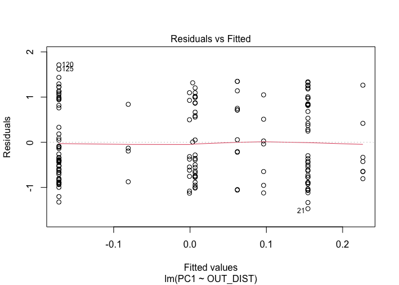<!-- -->

    ## Warning in plot.window(...): "abline" is not a graphical parameter

    ## Warning in plot.xy(xy, type, ...): "abline" is not a graphical parameter

    ## Warning in axis(side = side, at = at, labels = labels, ...): "abline" is not a
    ## graphical parameter

    ## Warning in axis(side = side, at = at, labels = labels, ...): "abline" is not a
    ## graphical parameter

    ## Warning in box(...): "abline" is not a graphical parameter

    ## Warning in title(...): "abline" is not a graphical parameter

    ## Warning in title(sub = sub.caption, ...): "abline" is not a graphical parameter

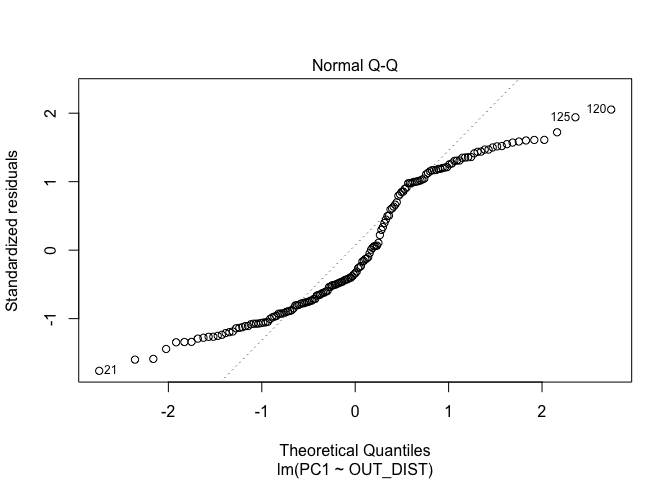<!-- -->

    ## Warning in plot.window(...): "abline" is not a graphical parameter

    ## Warning in plot.xy(xy, type, ...): "abline" is not a graphical parameter

    ## Warning in axis(side = side, at = at, labels = labels, ...): "abline" is not a
    ## graphical parameter

    ## Warning in axis(side = side, at = at, labels = labels, ...): "abline" is not a
    ## graphical parameter

    ## Warning in box(...): "abline" is not a graphical parameter

    ## Warning in title(...): "abline" is not a graphical parameter

    ## Warning in plot.xy(xy.coords(x, y), type = type, ...): "abline" is not a
    ## graphical parameter

    ## Warning in title(sub = sub.caption, ...): "abline" is not a graphical parameter

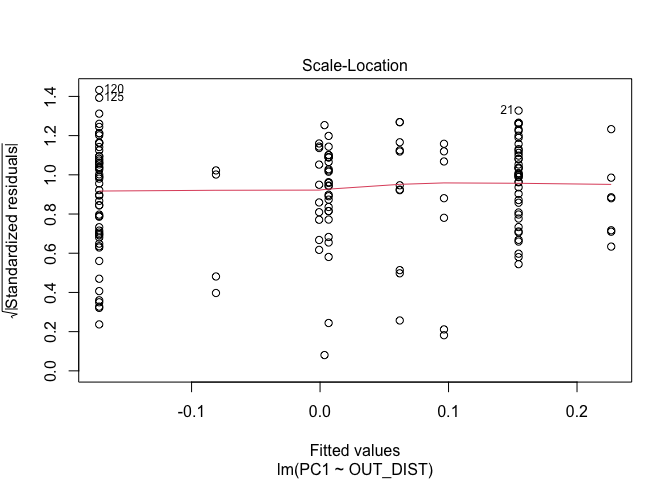<!-- -->

    ## Warning in plot.window(...): "abline" is not a graphical parameter

    ## Warning in plot.xy(xy, type, ...): "abline" is not a graphical parameter

    ## Warning in axis(side = side, at = at, labels = labels, ...): "abline" is not a
    ## graphical parameter

    ## Warning in axis(side = side, at = at, labels = labels, ...): "abline" is not a
    ## graphical parameter

    ## Warning in box(...): "abline" is not a graphical parameter

    ## Warning in title(...): "abline" is not a graphical parameter

    ## Warning in plot.xy(xy.coords(x, y), type = type, ...): "abline" is not a
    ## graphical parameter

    ## Warning in title(sub = sub.caption, ...): "abline" is not a graphical parameter

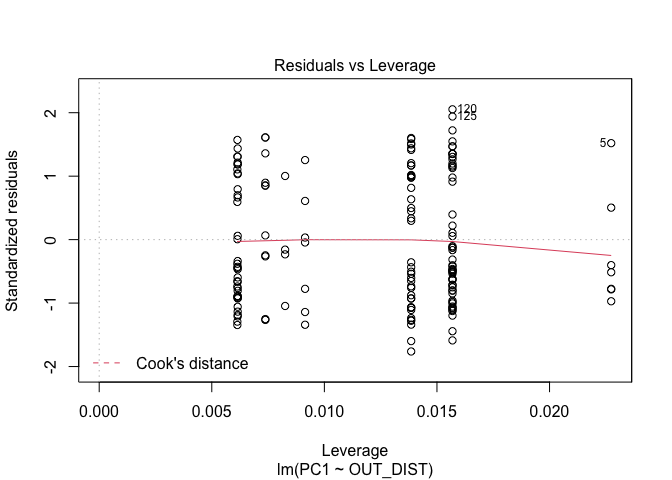<!-- -->

``` r
#par(mfrow=c(1,2))
#hist(residuals(mod1)) 
#qqnorm(residuals(mod1))
```

qq plot a bit funky

## now lets run the adaptive models

GLM

``` r
mod1_glm <- glm(SpringAlleleFreq ~ OUT_DIST , family = "binomial", data = chin_df)
```

    ## Warning in eval(family$initialize): non-integer #successes in a binomial glm!

``` r
mod2_glm <- glm(SpringAlleleFreq ~ MWMT + PRECIP, family = "binomial", data = chin_df)
```

    ## Warning in eval(family$initialize): non-integer #successes in a binomial glm!

``` r
mod3_glm <- glm(SpringAlleleFreq ~ FlowVel + SLOPE, family = "binomial", data = chin_df)
```

    ## Warning in eval(family$initialize): non-integer #successes in a binomial glm!

``` r
mod4_glm <- glm(SpringAlleleFreq ~ IP_Chinook + Pool_freq + Spawnable + gravels + fines, family = "binomial", data = chin_df)
```

    ## Warning in eval(family$initialize): non-integer #successes in a binomial glm!

``` r
mod5_glm <- glm(SpringAlleleFreq ~ PRECIP + FlowVel + IP_Chinook + Pool_freq + Spawnable + fines, family = "binomial", data = chin_df)
```

    ## Warning in eval(family$initialize): non-integer #successes in a binomial glm!

``` r
library(bbmle) # for AICtab
```

    ## Loading required package: stats4

    ## 
    ## Attaching package: 'bbmle'

    ## The following object is masked from 'package:dplyr':
    ## 
    ##     slice

``` r
AICtab(mod1_glm, mod2_glm, mod3_glm, mod4_glm, mod5_glm)
```

    ##          dAIC df
    ## mod3_glm 0.0  3 
    ## mod1_glm 0.6  2 
    ## mod2_glm 2.8  3 
    ## mod4_glm 3.9  6 
    ## mod5_glm 4.4  7

**mod3 (flow) and mod1 (rKM) top models**

``` r
stargazer(mod1_glm, mod2_glm, mod3_glm, mod4_glm, mod5_glm, 
          type = "text",
          digits = 3, 
          ci = TRUE,
          star.cutoffs = c(0.05, 0.01, 0.001),
          digit.separator = "")
```

    ## 
    ## =================================================================================================
    ##                                                 Dependent variable:                              
    ##                   -------------------------------------------------------------------------------
    ##                                                  SpringAlleleFreq                                
    ##                         (1)             (2)             (3)             (4)             (5)      
    ## -------------------------------------------------------------------------------------------------
    ## OUT_DIST              -0.058                                                                     
    ##                   (-0.408, 0.291)                                                                
    ##                                                                                                  
    ## MWMT                                  -0.041                                                     
    ##                                   (-0.383, 0.301)                                                
    ##                                                                                                  
    ## PRECIP                                -0.068                                          -0.048     
    ##                                   (-0.424, 0.287)                                 (-0.561, 0.466)
    ##                                                                                                  
    ## FlowVel                                                0.180                           0.202     
    ##                                                   (-0.216, 0.575)                 (-0.429, 0.833)
    ##                                                                                                  
    ## SLOPE                                                  0.002                                     
    ##                                                   (-0.350, 0.354)                                
    ##                                                                                                  
    ## IP_Chinook                                                            -0.042           0.027     
    ##                                                                   (-0.464, 0.380) (-0.465, 0.519)
    ##                                                                                                  
    ## Pool_freq                                                             -0.155          -0.070     
    ##                                                                   (-0.530, 0.219) (-0.578, 0.439)
    ##                                                                                                  
    ## Spawnable                                                              0.076          -0.034     
    ##                                                                   (-0.341, 0.493) (-0.581, 0.514)
    ##                                                                                                  
    ## gravels                                                               -0.004                     
    ##                                                                   (-0.443, 0.436)                
    ##                                                                                                  
    ## fines                                                                 -0.074           0.016     
    ##                                                                   (-0.536, 0.388) (-0.586, 0.619)
    ##                                                                                                  
    ## Constant             1.026***        1.027***        1.033***        1.034***        1.039***    
    ##                   (0.677, 1.374)  (0.678, 1.376)  (0.682, 1.384)  (0.673, 1.396)  (0.678, 1.400) 
    ##                                                                                                  
    ## -------------------------------------------------------------------------------------------------
    ## Observations            163             163             163             156             156      
    ## Log Likelihood        -74.484         -74.589         -73.170         -72.138         -71.379    
    ## Akaike Inf. Crit.     152.967         155.178         152.339         156.276         156.759    
    ## =================================================================================================
    ## Note:                                                               *p<0.05; **p<0.01; ***p<0.001

## check residuals of model

``` r
plot(mod3_glm, abline = c(0,0))
```

    ## Warning in plot.window(...): "abline" is not a graphical parameter

    ## Warning in plot.xy(xy, type, ...): "abline" is not a graphical parameter

    ## Warning in axis(side = side, at = at, labels = labels, ...): "abline" is not a
    ## graphical parameter

    ## Warning in axis(side = side, at = at, labels = labels, ...): "abline" is not a
    ## graphical parameter

    ## Warning in box(...): "abline" is not a graphical parameter

    ## Warning in title(...): "abline" is not a graphical parameter

    ## Warning in plot.xy(xy.coords(x, y), type = type, ...): "abline" is not a
    ## graphical parameter

    ## Warning in title(sub = sub.caption, ...): "abline" is not a graphical parameter

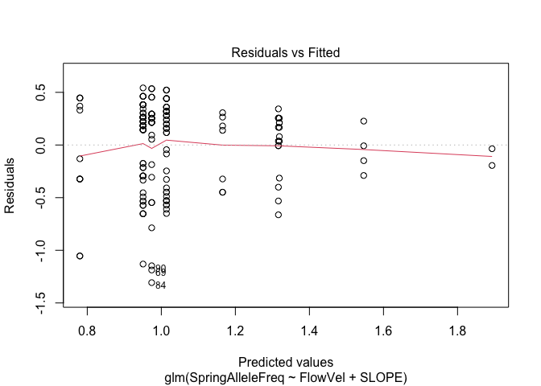<!-- -->

    ## Warning in plot.window(...): "abline" is not a graphical parameter

    ## Warning in plot.xy(xy, type, ...): "abline" is not a graphical parameter

    ## Warning in axis(side = side, at = at, labels = labels, ...): "abline" is not a
    ## graphical parameter

    ## Warning in axis(side = side, at = at, labels = labels, ...): "abline" is not a
    ## graphical parameter

    ## Warning in box(...): "abline" is not a graphical parameter

    ## Warning in title(...): "abline" is not a graphical parameter

    ## Warning in title(sub = sub.caption, ...): "abline" is not a graphical parameter

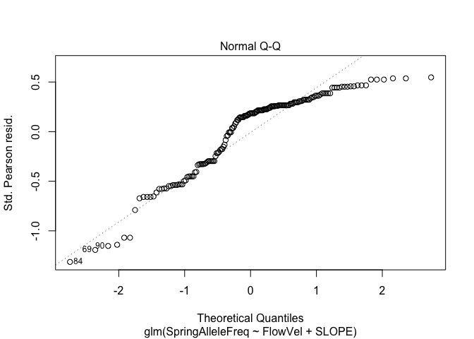<!-- -->

    ## Warning in plot.window(...): "abline" is not a graphical parameter

    ## Warning in plot.xy(xy, type, ...): "abline" is not a graphical parameter

    ## Warning in axis(side = side, at = at, labels = labels, ...): "abline" is not a
    ## graphical parameter

    ## Warning in axis(side = side, at = at, labels = labels, ...): "abline" is not a
    ## graphical parameter

    ## Warning in box(...): "abline" is not a graphical parameter

    ## Warning in title(...): "abline" is not a graphical parameter

    ## Warning in plot.xy(xy.coords(x, y), type = type, ...): "abline" is not a
    ## graphical parameter

    ## Warning in title(sub = sub.caption, ...): "abline" is not a graphical parameter

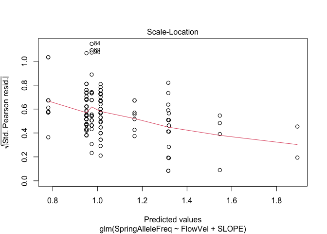<!-- -->

    ## Warning in plot.window(...): "abline" is not a graphical parameter

    ## Warning in plot.xy(xy, type, ...): "abline" is not a graphical parameter

    ## Warning in axis(side = side, at = at, labels = labels, ...): "abline" is not a
    ## graphical parameter

    ## Warning in axis(side = side, at = at, labels = labels, ...): "abline" is not a
    ## graphical parameter

    ## Warning in box(...): "abline" is not a graphical parameter

    ## Warning in title(...): "abline" is not a graphical parameter

    ## Warning in plot.xy(xy.coords(x, y), type = type, ...): "abline" is not a
    ## graphical parameter

    ## Warning in title(sub = sub.caption, ...): "abline" is not a graphical parameter

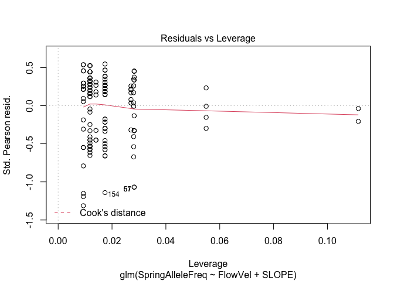<!-- -->

``` r
#par(mfrow=c(1,2))
#hist(residuals(mod3_glm)) 
#qqnorm(residuals(mod3_glm))
```
