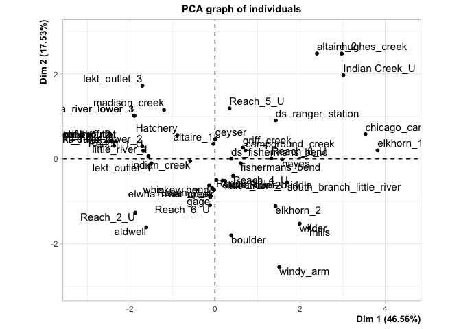
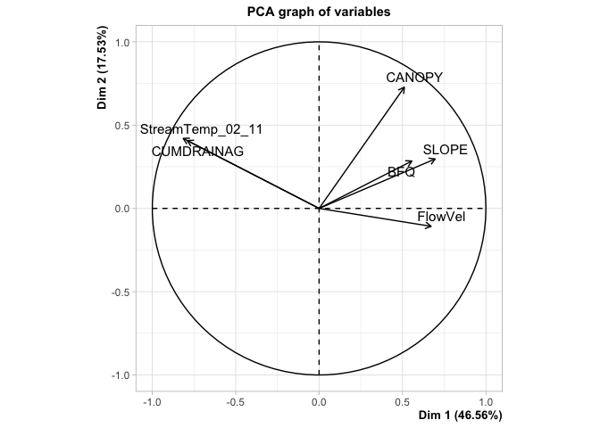
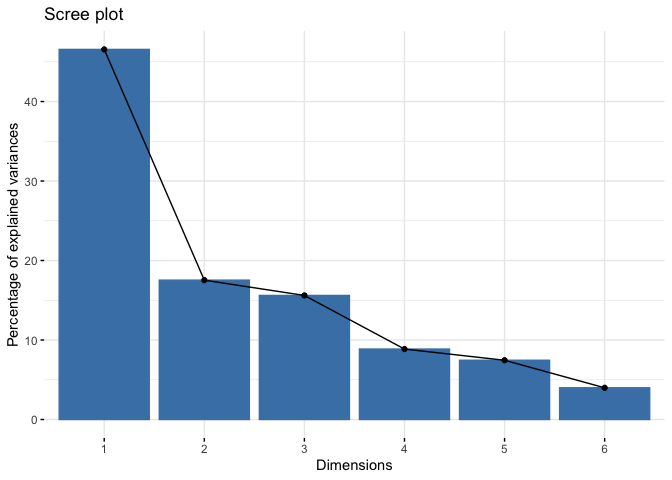
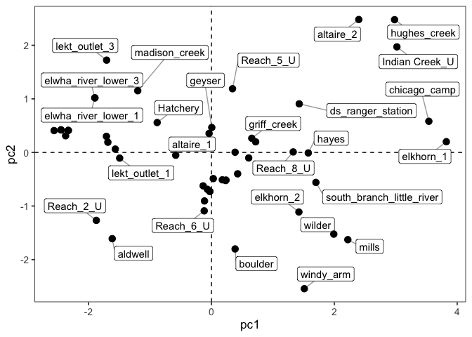

elwha_envr_pca
================
Kimberly Ledger
4/21/2022

run a PCA on the environmental variables

libraries

``` r
library(tidyverse)
library(FactoMineR)
library(factoextra)
library(reshape2)
library(ggrepel)
library(cowplot)
```

#first bring in the final output from elwha_envr_correlations.Rmd

``` r
env_final <- read.csv('~/Desktop/LG_Proj4/Elwha_environmentaldata/outputs/env_final_pops_22April2022.csv')
```

maybe, remove rows/sites that seem to have funky environmental data

``` r
env_final <- env_final %>%
  filter(!row_number() %in% c(50))  #long creek has a very large BFQ...
```

remove columns that are just their to link to genetic data

``` r
env_final1 <- env_final %>% 
  dplyr::select(!long) %>%
  dplyr::select(!lat) %>%
  dplyr::select(!rkm) %>%
  dplyr::select(!main)
```

make final matrix for PCA

``` r
sites <- env_final1$site1

matrix <- env_final1 %>%
  dplyr::select(!site1) %>%
  dplyr::select(!site2)
rownames(matrix) <- sites
#colnames(matrix) <- c("stream temp", ... )
```

center and scale matrix

``` r
for (i in 1:length(colnames(matrix))){
  if (is.numeric(matrix[, i])==TRUE)
    matrix[, i] <- as.numeric(scale(matrix[, i]))
  else
    matrix[, i] <- matrix[, i]
  }
```

run the PCA

``` r
pca1 <- PCA(matrix, graph = FALSE)
```

    ## Warning in PCA(matrix, graph = FALSE): Missing values are imputed by the mean of
    ## the variable: you should use the imputePCA function of the missMDA package

``` r
#pca1
```

``` r
plot.PCA(pca1, axes = c(1,2), choix = c("ind"))
```

<!-- -->

``` r
plot.PCA(pca1, axes = c(1,2), choix = c("var"))
```

<!-- -->

``` r
#fviz_pca_var(pca1, col.var="contrib")+
#scale_color_gradient2(low="blue", mid="white", 
#                      high="red", midpoint=55)+theme_bw()
```

scree plot

``` r
fviz_screeplot(pca1)
```

<!-- -->

``` r
#pull in the first few PCAs
matrix$pc1 <- pca1$ind$coord[, 1] # indexing the first column
matrix$pc2 <- pca1$ind$coord[, 2] 
```

extract variable contribution for the axes

``` r
pca.vars <- pca1$var$coord %>% data.frame
pca.vars$vars <- rownames(pca.vars)
pca.vars.m <- melt(pca.vars, id.vars = "vars")
```

plot

``` r
pc12_points <- ggplot(data = matrix, aes(x = pc1, y = pc2)) +
  geom_hline(yintercept = 0, lty = 2) +
  geom_vline(xintercept = 0, lty = 2) +
  geom_label_repel(aes(label = sites),
                   box.padding   = .5, 
                   #point.padding = 5,
                   segment.color = 'darkgrey') +
  geom_point(size = 3) +
  #stat_ellipse(geom="polygon", aes(fill = Ecotype),  alpha = 0.05, show.legend = FALSE, level = 0.95) +
  scale_color_manual(values = c('darkblue', 'darkgreen', 'darkred')) +
  scale_fill_manual(values = c('darkblue', 'darkgreen', 'darkred')) +
  scale_shape_manual(values=c(15, 19, 17))+
  #xlab(paste("PC1 ", PCA1, "%", sep = '')) + 
  #ylab(paste("PC2 ", PCA2, "%", sep = '')) +
  theme_bw(base_size = 13) +
  theme(panel.grid = element_blank(), 
        panel.border = element_rect(fill= "transparent"),
        legend.position = "bottom")

pc12_points
```

    ## Warning: ggrepel: 23 unlabeled data points (too many overlaps). Consider
    ## increasing max.overlaps

<!-- -->
