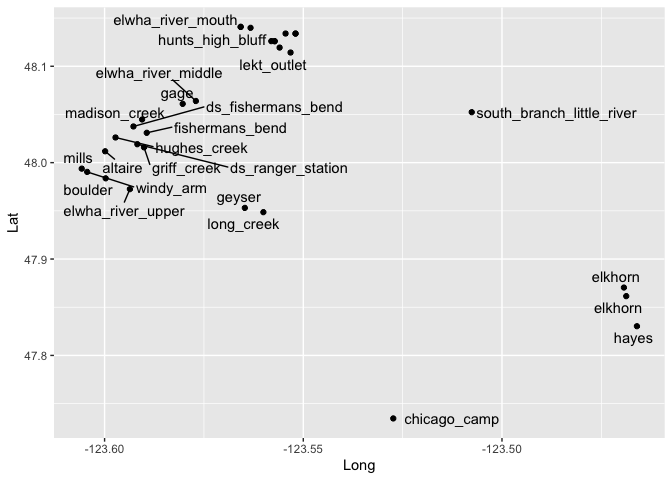
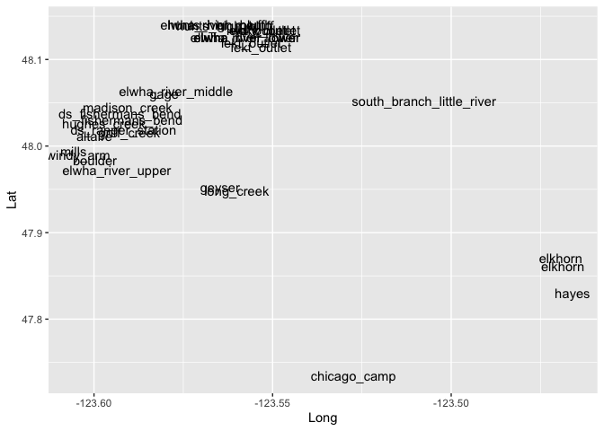
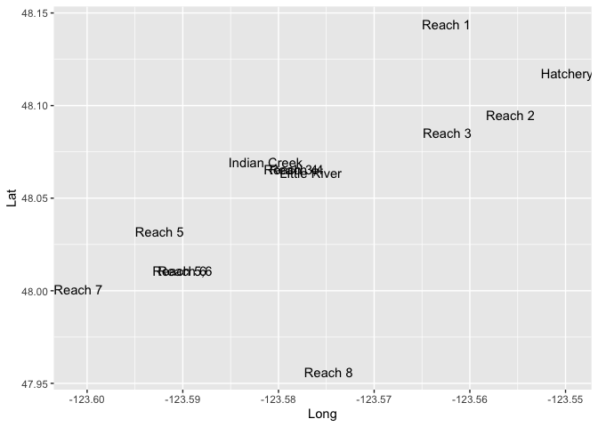
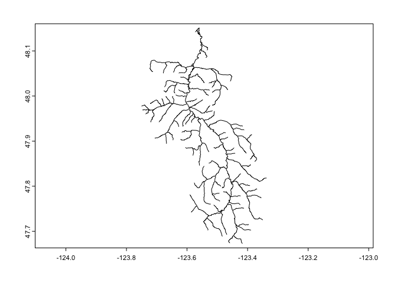

environmental_data_v2
================
Kimberly Ledger
6/3/2022

load libraries

``` r
library(tidyverse)
```

    ## ── Attaching packages ─────────────────────────────────────── tidyverse 1.3.1 ──

    ## ✓ ggplot2 3.3.5     ✓ purrr   0.3.4
    ## ✓ tibble  3.1.6     ✓ dplyr   1.0.8
    ## ✓ tidyr   1.2.0     ✓ stringr 1.4.0
    ## ✓ readr   2.1.2     ✓ forcats 0.5.1

    ## ── Conflicts ────────────────────────────────────────── tidyverse_conflicts() ──
    ## x dplyr::filter() masks stats::filter()
    ## x dplyr::lag()    masks stats::lag()

``` r
library(ggrepel)
```

## Steelhead

read in steelhead metadata that has river km and gps locations of
sampling sites

``` r
onmy_metadata <- read.csv("~/Desktop/LG_Proj4/Elwha_datafiles/Elwha_Steelhead_Formatted_kjl.csv")
head(onmy_metadata)
```

    ##   Sample_ID Year   Smolt Fork_Length NvH_Origin  Sex    Date Time Location
    ## 1  33649_17 2004 Unknown          NA          N <NA> 7/14/04  Pre       ID
    ## 2  33649_18 2004 Unknown          NA          N <NA> 7/14/04  Pre       ID
    ## 3  33649_19 2004 Unknown          NA          N <NA> 7/14/04  Pre       ID
    ## 4  33649_20 2004 Unknown          NA          N <NA> 7/14/04  Pre       ID
    ## 5  33649_23 2004 Unknown          NA          N <NA> 7/14/04  Pre       ID
    ## 6  33649_26 2004 Unknown          NA          N <NA> 7/14/04  Pre       ID
    ##   Run_Timing Life_Stage Life_History_Type      Lat      Long rkm Sampling_Site
    ## 1    Unknown   Juvenile       Land_Locked 48.11933 -123.5535  NA  little_river
    ## 2    Unknown   Juvenile       Land_Locked 48.06303 -123.5770  NA  little_river
    ## 3    Unknown   Juvenile       Land_Locked 48.06303 -123.5770  NA  little_river
    ## 4    Unknown   Juvenile       Land_Locked 48.06303 -123.5770  NA  little_river
    ## 5    Unknown   Juvenile       Land_Locked 48.06303 -123.5770  NA  little_river
    ## 6    Unknown   Juvenile       Land_Locked 48.06303 -123.5770  NA  little_river

filter sites to include only post dam removal samples and create table
of sampling sites

``` r
omy_sites <- onmy_metadata %>%
  filter(Time == "Post") %>%
  distinct(Lat, Long, rkm, Sampling_Site) %>%
  arrange(rkm)
omy_sites
```

    ##         Lat      Long   rkm             Sampling_Site
    ## 1  48.14085 -123.5658  0.00         elwha_river_mouth
    ## 2  48.13988 -123.5633  0.95          hunts_high_bluff
    ## 3  48.14085 -123.5658  0.95          hunts_high_bluff
    ## 4  48.13390 -123.5520  2.13               wdfw_outlet
    ## 5  48.13390 -123.5520  2.13               lekt_outlet
    ## 6  48.12603 -123.5572  3.20         elwha_river_lower
    ## 7  48.12609 -123.5581  3.20         elwha_river_lower
    ## 8  48.12603 -123.5572  3.30         elwha_river_lower
    ## 9  48.11939 -123.5560  4.05               lekt_outlet
    ## 10 48.13396 -123.5545  4.70               lekt_outlet
    ## 11 48.11425 -123.5532  4.70               lekt_outlet
    ## 12 48.06396 -123.5770 12.30        elwha_river_middle
    ## 13 48.06100 -123.5803 13.30                      gage
    ## 14 48.03754 -123.5927 15.70        ds_fishermans_bend
    ## 15 48.03095 -123.5894 16.90           fishermans_bend
    ## 16 48.01913 -123.5918 18.50         ds_ranger_station
    ## 17 48.01181 -123.5999 20.70                   altaire
    ## 18 47.99039 -123.6044 22.50                 windy_arm
    ## 19 47.98373 -123.5997 23.30                   boulder
    ## 20 47.95305 -123.5647 29.40                    geyser
    ## 21 47.87043 -123.4693 43.60                   elkhorn
    ## 22 47.86151 -123.4687 43.60                   elkhorn
    ## 23 47.83032 -123.4660 48.40                     hayes
    ## 24 47.73463 -123.5274 65.10              chicago_camp
    ## 25 48.01589 -123.5901    NA               griff_creek
    ## 26 47.99377 -123.6058    NA                     mills
    ## 27 48.04476 -123.5906    NA             madison_creek
    ## 28 48.02611 -123.5973    NA              hughes_creek
    ## 29 47.94864 -123.5600    NA                long_creek
    ## 30 48.05236 -123.5076    NA south_branch_little_river
    ## 31 47.97252 -123.5936    NA         elwha_river_upper
    ## 32       NA        NA    NA         elwha_river_lower

export

``` r
#write.csv(sites, "onmy_sites.csv")
```

make dataframe of unique rkm for steelhead sites

``` r
rkm_omy <- omy_sites %>%
  distinct(rkm, Sampling_Site) %>%
  drop_na()
```

plot omy sampling locations

``` r
site_plot <- ggplot(omy_sites) + 
  geom_point(data = omy_sites, aes(x = Long, y = Lat, group = Sampling_Site)) +
  geom_text_repel(data = omy_sites, aes(x = Long, y = Lat, group = Sampling_Site, 
                                    label = Sampling_Site), hjust=1, vjust=0.5)
site_plot
```

    ## Warning: Removed 1 rows containing missing values (geom_point).

    ## Warning: Removed 1 rows containing missing values (geom_text_repel).

    ## Warning: ggrepel: 8 unlabeled data points (too many overlaps). Consider
    ## increasing max.overlaps

<!-- -->

plot omy sampling locations

``` r
site_plot <- ggplot(omy_sites) + 
  geom_text(data = omy_sites, aes(x = Long, y = Lat, label = Sampling_Site))

site_plot
```

    ## Warning: Removed 1 rows containing missing values (geom_text).

<!-- -->

## Chinook

read in chinook sites

``` r
chinook_sites <- read.csv("~/Desktop/LG_Proj4/Elwha_environmentaldata/Elwha_Chinook_DownstreamSites.csv")
```

plot

``` r
site_plot <- ggplot(chinook_sites) + 
  geom_text(data = chinook_sites, aes(x = Long, y = Lat, label = Sampling_Site))

site_plot
```

<!-- -->

read in chinook meta data

``` r
chinook <- read.csv("~/Desktop/LG_Proj4/Elwha_datafiles/Elwha_Chinook_Formatted.csv")
```

filter sites to include only post dam removal samples and create table
of sampling sites

``` r
chinook %>%
  filter(Time == "Post") %>%
  distinct(Sampling_Site)
```

    ##    Sampling_Site
    ## 1       Hatchery
    ## 2        Reach 3
    ## 3        Reach 1
    ## 4        Reach 7
    ## 5        Reach 5
    ## 6   Indian Creek
    ## 7   Little River
    ## 8        Reach 2
    ## 9        Reach 4
    ## 10     Reach 3,4

join lat/long with chinook metadata

``` r
chinook_join <- chinook %>%
  left_join(chinook_sites)
```

    ## Joining, by = "Sampling_Site"

save for future use…

``` r
#write.csv(chinook_join, "~/Desktop/LG_Proj4/Elwha_datafiles/Elwha_Chinook_Formatted_wDownstreamLatLongrkm.csv")
```

make dataframe of unique rkm for chinook sites

``` r
rkm_chin <- chinook_sites %>%
  select(rkm, Sampling_Site) 
```

create full sites of rkm sites

``` r
rkm_sites <- rbind(rkm_omy, rkm_chin) %>%
  distinct() %>%
  arrange(rkm)
```

create rkm vector round rkm to nearest tenth (because that is the
resolution of the enviro data)

``` r
rkm_vect <- as.vector(round(rkm_sites$rkm, digits = 1))
rkm_vect
```

    ##  [1]  0.0  0.0  0.9  2.1  2.1  3.2  3.3  3.5  4.0  4.7  6.6  8.3 11.2 11.2 12.1
    ## [16] 12.2 12.3 13.3 15.7 15.7 16.9 18.1 18.1 18.5 19.7 20.7 22.5 23.3 25.9 29.4
    ## [31] 43.6 48.4 65.1

``` r
site_vect <- rkm_sites$Sampling_Site
site_vect
```

    ##  [1] "elwha_river_mouth"  "Reach 1"            "hunts_high_bluff"  
    ##  [4] "wdfw_outlet"        "lekt_outlet"        "elwha_river_lower" 
    ##  [7] "elwha_river_lower"  "Hatchery"           "lekt_outlet"       
    ## [10] "lekt_outlet"        "Reach 2"            "Reach 3"           
    ## [13] "Reach 4"            "Reach 3,4"          "Indian Creek"      
    ## [16] "Little River"       "elwha_river_middle" "gage"              
    ## [19] "ds_fishermans_bend" "Reach 5"            "fishermans_bend"   
    ## [22] "Reach 6"            "Reach 5,6"          "ds_ranger_station" 
    ## [25] "Reach 7"            "altaire"            "windy_arm"         
    ## [28] "boulder"            "Reach 8"            "geyser"            
    ## [31] "elkhorn"            "hayes"              "chicago_camp"

## prep point-based environmental data

1.  read in pebble count, depth, width, etc… data

``` r
avg_elwha_msv <- read.csv("~/Desktop/LG_Proj4/Elwha_environmentaldata/glm_enviro/AVG_Elwha_MVS_AKF.csv")
#head(avg_elwha_msv)
```

filter to retain only environmental variables

``` r
avg_elwha_msv_filter <- avg_elwha_msv %>%
  select(Rkm, Latitude, Longitude, Channel_Gradient, Discharge..BFQ., AVG_Percent_Spawn_Chin, AVG_Percent_Gravels)  %>% # will need to update AVG_Percent_Gravels to AVG_Percent_Steelhead 
  rename(RKM = Rkm, Lat_avg = Latitude, Long_avg = Longitude, Discharge = Discharge..BFQ.) %>%
  mutate(RKM = round(RKM, digits = 1)) %>%
  group_by(RKM) %>%
  summarise(Lat_avg = mean(Lat_avg),   ## these lat/long may no longer be very accurate (?)
            Long_avg = mean(Long_avg),
            Channel_Gradient = mean(Channel_Gradient),
            Discharge = mean(Discharge),
            AVG_Percent_Spawn_Chin = mean(AVG_Percent_Spawn_Chin),
            AVG_Percent_Gravels = mean(AVG_Percent_Gravels))
```

2.  read in channel type data

``` r
channel <- read.csv("~/Desktop/LG_Proj4/Elwha_environmentaldata/glm_enviro/Channel_Type.csv")
#head(channel)
```

filter to retain only environmental variables

``` r
channel_filter <- channel %>%
    select(Rkm, Channel_type) %>%
  rename(RKM = Rkm)
```

3.  read in spawning habitat data

``` r
spawn <- read.csv("~/Desktop/LG_Proj4/Elwha_environmentaldata/glm_enviro/Steelhead_Spawnable_Habitat.csv")
head(spawn)
```

    ##   rkm     Sampling_Site General_habitat Channel_type Area  X
    ## 1 0.8 elwha_river_lower              MS  riffle_pool  187 NA
    ## 2 1.5 elwha_river_lower              MS  riffle_pool  427 NA
    ## 3 1.7 elwha_river_lower              MS  riffle_pool  509 NA
    ## 4 2.0 elwha_river_lower              MS  riffle_pool  204 NA
    ## 5 2.7 elwha_river_lower              MS  riffle_pool  316 NA
    ## 6 3.3 elwha_river_lower              MS  riffle_pool  509 NA

filter to retain only environmental variables

``` r
spawn_filter <- spawn %>%
  select(rkm, General_habitat, Sampling_Site, Channel_type, Area) %>%
  drop_na() %>%
  rename(RKM = rkm, Sampling_Site_spawn = Sampling_Site, Channel_type_spawn = Channel_type, Spawn_area_m2 = Area)
```

4.  read in ecosystem data

``` r
ecosystem_process <- read.csv("~/Desktop/LG_Proj4/Elwha_environmentaldata/glm_enviro/Ecosystem_Processes_Data.csv")
#head(ecosystem_process)
```

filter to retain only environmental variables

``` r
ecosystem_process_filter <- ecosystem_process %>%
  filter(SEASON == "Summer") %>%
  select(SITE, W_WIDTH, CANOPY, FINES, D50, LAT, LONG, rKM) %>%
  rename(RKM = rKM, Lat_eco = LAT, Long_eco = LONG)
```

5.  read in invert data

``` r
invert <- read.csv("~/Desktop/LG_Proj4/Elwha_environmentaldata/glm_enviro/Invertebrate_Summary.csv")
head(invert)
```

    ##   SITE_ID RIVER SECTION HABITAT TYPE SITE_NAME RKM ELEVATION SEGMENT
    ## 1   ELSC7 Elwha   Lower      SC L-FP         7 1.0         3      L1
    ## 2   ELSC8 Elwha   Lower      SC L-FP         8 1.0         3      L1
    ## 3  ELMSNM Elwha   Lower      MS L-FP        NM 1.2         3      L1
    ## 4   ELSC6 Elwha   Lower      SC L-FP         6 1.5         6      L1
    ## 5  ELMSBC Elwha   Lower      MS L-FP        BC 1.7         6      L1
    ## 6  ELSCBC Elwha   Lower      SC L-FP        BC 1.8         6      L1
    ##   SARAH_REACH           NAME DRAIN_AREA WATER_SOURCE   BFW GRADIENT Aliases
    ## 1          NM     Near Mouth        831        Combo  12.3     1.30 ELNMSC2
    ## 2          NM     Near Mouth        831        Combo  21.4     1.36 ELNMSC1
    ## 3          NM     Near Mouth        831           MS  71.8     0.33        
    ## 4          NM     Near Mouth        830           SW  25.4     0.57 ELBCSC2
    ## 5          BC Boston Charley        830           MS 112.5     0.81        
    ## 6          BC Boston Charley        830           GW  10.9     1.48        
    ##   LATITUDE LONGITUDE
    ## 1  48.1432 -123.5622
    ## 2  48.1433 -123.5623
    ## 3  48.1416 -123.5655
    ## 4  48.1401 -123.5645
    ## 5  48.1394 -123.5632
    ## 6  48.1394 -123.5644

filter to retain only environmental variables and for rkm with more than
one invert sample, take mean

``` r
invert_filter <- invert %>%
  select(RKM, BFW, LATITUDE, LONGITUDE) %>%
  drop_na(BFW) %>%
  group_by(RKM) %>%
  summarise(BFW = mean(BFW),
            Lat_invert = mean(LATITUDE),
            Long_invert = mean(LONGITUDE)) # these mean GPS locations may no longer be accurate...  
```

6.  read in pebble data

``` r
pebbles <- read.csv("~/Desktop/LG_Proj4/Elwha_environmentaldata/glm_enviro/Riffle_Pool_Pebbles.csv")
head(pebbles)
```

    ##   Latitude Longitude  Rkm Pebble_count_flow_CFS Riffle_length_up_m
    ## 1 48.14183 -123.5653 0.90                   400                 NA
    ## 2 48.13919 -123.5621 1.35                   400                7.0
    ## 3 48.13732 -123.5609 1.65                   400                8.3
    ## 4 48.13568 -123.5574 1.90                   361                 NA
    ## 5 48.13471 -123.5615 2.00                   400               13.6
    ## 6 48.13399 -123.5537 2.10                   361                 NA
    ##   Riffle_length_down_m Total_riffle_.survey_length_m
    ## 1                   NA                            NA
    ## 2                  7.0                          13.9
    ## 3                  8.3                          16.6
    ## 4                   NA                            NA
    ## 5                 13.6                          27.2
    ## 6                   NA                            NA
    ##   Total_riffle_survey_width_m Total_rifffle_area_m2 Assoc_pool
    ## 1                        46.9                    NA          N
    ## 2                        33.7                 468.7          N
    ## 3                        46.8                 776.1          N
    ## 4                        11.2                    NA          N
    ## 5                        32.0                 870.4          N
    ## 6                          NA                    NA          Y
    ##   Assoc_hab_length_m Assoc_hab_width_m Max_depth Tail_depth Residual_depth
    ## 1                 NA                NA        NA       0.31           0.31
    ## 2                 NA                NA        NA       0.49           0.49
    ## 3                 NA                NA        NA       0.61           0.61
    ## 4                 NA                NA        NA         NA             NA
    ## 5                 NA                NA        NA       0.56           0.56
    ## 6                7.4              13.2      1.15       0.10           1.05

``` r
pebbles_filtered <- pebbles %>%
  select(Latitude, Longitude, Rkm, Pebble_count_flow_CFS, Total_rifffle_area_m2) %>%
  rename(RKM = Rkm, Lat_pebbles = Latitude, Long_pebbles = Longitude)
```

read in the lat/long and rkm base file

``` r
rkm_latlong <- read.csv("~/Desktop/LG_Proj4/Elwha_environmentaldata/glm_enviro/elwharkmlatlong.csv")
head(rkm_latlong)                       
```

    ##        Lat      Long RKM
    ## 1 48.14866 -123.5613 0.0
    ## 2 48.14807 -123.5622 0.1
    ## 3 48.14734 -123.5620 0.2
    ## 4 48.14644 -123.5620 0.3
    ## 5 48.14562 -123.5615 0.4
    ## 6 48.14517 -123.5605 0.5

try joining all environmental data files based on rkm

``` r
join <- rkm_latlong %>%
  left_join(avg_elwha_msv_filter) %>%
  left_join(channel_filter) %>%
  left_join(ecosystem_process_filter) %>%
  left_join(spawn_filter) %>%
  left_join(invert_filter) %>%   
  left_join(pebbles_filtered)
```

    ## Joining, by = "RKM"
    ## Joining, by = "RKM"
    ## Joining, by = "RKM"
    ## Joining, by = "RKM"
    ## Joining, by = "RKM"
    ## Joining, by = "RKM"

there are a few duplicated RKM to have spawn data from both the
mainsteam and tribs

### quality control

check that all lat/long data are within 0.005 degrees (which is \~500m)

``` r
join_lat <- join %>%
  select(Lat, Lat_avg, Lat_eco, Lat_invert, Lat_pebbles) %>%
  mutate(avg = abs(Lat - Lat_avg),
         eco = abs(Lat - Lat_eco), 
         invert = abs(Lat - Lat_invert),
         peb = abs(Lat - Lat_pebbles)) %>%
  filter(avg > 0.005 | eco > 0.005 | invert > 0.005 | peb > 0.005)
```

there are a handful of records from the invert dataset that have some
lat discrepancies.

``` r
join_long <- join %>%
  select(Long, Long_avg, Long_eco, Long_invert, Long_pebbles) %>%
  mutate(avg = abs(Long - Long_avg),
         eco = abs(Long - Long_eco), 
         invert = abs(Long - Long_invert),
         peb = abs(Long - Long_pebbles)) %>%
  filter(avg > 0.005 | eco > 0.005 | invert > 0.005 | peb > 0.005)
```

again, there are a handful of records that have some long discrepancies
in all datasets

do we need to do anything/worry about this??? perhaps not since we’ll be
summarizing data near sites anyways.

## extract environmental data near sites

write loop to extract data - for all values in rkm, extract all rows +/-
0.5 rkm, make unique df for each rkm value

``` r
join$Channel_type <- as.factor(join$Channel_type)
join$General_habitat <- as.factor(join$General_habitat)
```

``` r
df = data.frame()

for (i in rkm_vect) {  #replace with rkm_vect
  r = seq(from = i - 0.5, to = i + 0.5, by = 0.1)
  #print(r)
  tab = filter(join, RKM %in% r)
  #print(tab)
  sum <- tab %>% 
    summarise(count = n(),
              Channel_Gradient = mean(Channel_Gradient, na.rm = TRUE),
              Discharge = mean(Discharge, na.rm = TRUE),
              AVG_Percent_Spawn_Chin = mean(AVG_Percent_Spawn_Chin, na.rm = TRUE),
              AVG_Percent_Gravels = mean(AVG_Percent_Gravels, na.rm = TRUE),
              General_habitat = names(which.max(table(General_habitat))),
              Channel_type = names(which.max(table(Channel_type))),
              W_WIDTH = mean(W_WIDTH, na.rm = TRUE),
              CANOPY = mean(CANOPY, na.rm = TRUE),
              FINES = mean(FINES, na.rm = TRUE),
              D50 = mean(D50, na.rm = TRUE),
              BFW = mean(BFW, na.rm = TRUE), 
              Pebble_count_flow_CFS = mean(Pebble_count_flow_CFS, na.rm = TRUE),
              Total_rifffle_area_m2 = mean(Total_rifffle_area_m2, na.rm = TRUE))
  df <- rbind(df, sum)
}

df$rkm <- rkm_vect
df$Sampling_Site <- site_vect

df
```

    ##    count Channel_Gradient Discharge AVG_Percent_Spawn_Chin AVG_Percent_Gravels
    ## 1      3              NaN       NaN                    NaN                 NaN
    ## 2      3              NaN       NaN                    NaN                 NaN
    ## 3      8      0.001913333  72.01167              0.7166667           0.2400000
    ## 4      7      0.002076667  72.38317              0.8808333           0.4250000
    ## 5      7      0.002076667  72.38317              0.8808333           0.4250000
    ## 6      7      0.000640000  61.51433              0.8111111           0.3222222
    ## 7      7      0.001670000  63.55650              0.8533333           0.3350000
    ## 8     11      0.001395000  58.19875              0.8575000           0.4175000
    ## 9     11      0.003955000  72.82800              0.7950000           0.3725000
    ## 10     8      0.010790000 183.48200              0.6400000           0.2200000
    ## 11     7      0.003980000  96.25950              0.7150000           0.2625000
    ## 12     6              NaN       NaN                    NaN                 NaN
    ## 13     7      0.000000000   0.00000              0.7900000           0.2100000
    ## 14     7      0.000000000   0.00000              0.7900000           0.2100000
    ## 15     9      0.000000000   0.00000              0.7900000           0.2100000
    ## 16     7      0.000400000  19.27925              0.8025000           0.2400000
    ## 17     7      0.007110000 136.24500              0.6600000           0.1800000
    ## 18     7      0.007110000 136.24500              0.6600000           0.1800000
    ## 19     6      0.009830000 150.71600              0.6600000           0.2700000
    ## 20     6      0.009830000 150.71600              0.6600000           0.2700000
    ## 21     7      0.008568333 127.58417              0.6450000           0.2116667
    ## 22     8      0.008363333 125.17467              0.6333333           0.2500000
    ## 23     8      0.008363333 125.17467              0.6333333           0.2500000
    ## 24    11      0.006540000 107.92440              0.7420000           0.1880000
    ## 25     9              NaN       NaN                    NaN                 NaN
    ## 26     9              NaN       NaN                    NaN                 NaN
    ## 27    11              NaN       NaN                    NaN                 NaN
    ## 28    11              NaN       NaN                    NaN                 NaN
    ## 29     7              NaN       NaN                    NaN                 NaN
    ## 30     7              NaN       NaN                    NaN                 NaN
    ## 31     9              NaN       NaN                    NaN                 NaN
    ## 32     9              NaN       NaN                    NaN                 NaN
    ## 33     7              NaN       NaN                    NaN                 NaN
    ##    General_habitat   Channel_type W_WIDTH CANOPY FINES  D50    BFW
    ## 1               MS Island_braided     NaN    NaN   NaN  NaN    NaN
    ## 2               MS Island_braided     NaN    NaN   NaN  NaN    NaN
    ## 3               MS Island_braided     NaN    NaN   NaN  NaN  16.85
    ## 4               MS Island_braided     NaN    NaN   NaN  NaN  26.90
    ## 5               MS Island_braided     NaN    NaN   NaN  NaN  26.90
    ## 6               MS Island_braided     NaN    NaN   NaN  NaN    NaN
    ## 7               MS Island_braided   18.90   53.0     1 66.0  73.00
    ## 8               MS Island_braided     NaN    NaN   NaN  NaN  24.60
    ## 9               MS Island_braided     NaN    NaN   NaN  NaN  65.85
    ## 10              MS Island_braided     NaN    NaN   NaN  NaN  21.40
    ## 11              MS         Canyon   60.50   45.0     5 52.0  47.00
    ## 12              MS     Meandering   35.80    0.0     2 73.0    NaN
    ## 13              MS        Braided   10.90  100.0     5 50.0  16.30
    ## 14              MS        Braided   10.90  100.0     5 50.0  16.30
    ## 15              MS    Pool_riffle   22.50   44.5     3 79.5  22.10
    ## 16              MS    Pool_riffle   22.50   44.5     3 79.5  25.00
    ## 17              MS    Pool_riffle    5.40   89.0     6 71.0  15.50
    ## 18              MS    Pool_riffle     NaN    NaN   NaN  NaN  10.95
    ## 19              MS    Pool_riffle   54.20   27.0     6 49.0    NaN
    ## 20              MS    Pool_riffle   54.20   27.0     6 49.0    NaN
    ## 21              MS Island_braided   39.20   52.0     6 51.0  28.65
    ## 22              MS Island_braided     NaN    NaN   NaN  NaN 114.00
    ## 23              MS Island_braided     NaN    NaN   NaN  NaN 114.00
    ## 24       Tributary Island_braided     NaN    NaN   NaN  NaN  70.90
    ## 25              MS    Pool_riffle   26.45   49.5     1 59.5  48.50
    ## 26              MS    Pool_riffle     NaN    NaN   NaN  NaN    NaN
    ## 27              MS        Braided     NaN    NaN   NaN  NaN    NaN
    ## 28              MS        Braided     NaN    NaN   NaN  NaN    NaN
    ## 29              MS         Canyon     NaN    NaN   NaN  NaN    NaN
    ## 30              MS Island_braided     NaN    NaN   NaN  NaN    NaN
    ## 31              MS Island_braided     NaN    NaN   NaN  NaN  92.15
    ## 32              MS Island_braided     NaN    NaN   NaN  NaN  27.90
    ## 33              MS Island_braided     NaN    NaN   NaN  NaN    NaN
    ##    Pebble_count_flow_CFS Total_rifffle_area_m2  rkm      Sampling_Site
    ## 1                    NaN                   NaN  0.0  elwha_river_mouth
    ## 2                    NaN                   NaN  0.0            Reach 1
    ## 3                    400                   NaN  0.9   hunts_high_bluff
    ## 4                    374                870.40  2.1        wdfw_outlet
    ## 5                    374                870.40  2.1        lekt_outlet
    ## 6                    361                955.75  3.2  elwha_river_lower
    ## 7                    NaN                   NaN  3.3  elwha_river_lower
    ## 8                    361                955.75  3.5           Hatchery
    ## 9                    361               1057.90  4.0        lekt_outlet
    ## 10                   NaN                   NaN  4.7        lekt_outlet
    ## 11                   NaN                   NaN  6.6            Reach 2
    ## 12                   NaN                   NaN  8.3            Reach 3
    ## 13                   NaN                   NaN 11.2            Reach 4
    ## 14                   NaN                   NaN 11.2          Reach 3,4
    ## 15                   NaN                   NaN 12.1       Indian Creek
    ## 16                   NaN                   NaN 12.2       Little River
    ## 17                   325                470.20 12.3 elwha_river_middle
    ## 18                   325                470.20 13.3               gage
    ## 19                   325                121.30 15.7 ds_fishermans_bend
    ## 20                   325                121.30 15.7            Reach 5
    ## 21                   325                454.10 16.9    fishermans_bend
    ## 22                   NaN                   NaN 18.1            Reach 6
    ## 23                   NaN                   NaN 18.1          Reach 5,6
    ## 24                   325                440.80 18.5  ds_ranger_station
    ## 25                   NaN                   NaN 19.7            Reach 7
    ## 26                   NaN                   NaN 20.7            altaire
    ## 27                   NaN                   NaN 22.5          windy_arm
    ## 28                   NaN                   NaN 23.3            boulder
    ## 29                   NaN                   NaN 25.9            Reach 8
    ## 30                   NaN                   NaN 29.4             geyser
    ## 31                   NaN                   NaN 43.6            elkhorn
    ## 32                   NaN                   NaN 48.4              hayes
    ## 33                   NaN                   NaN 65.1       chicago_camp

i don’t understand why not all rows +/- 0.5 rkm from sampling sites are
not filtered correctly in the code above….

try a wider buffer (1KM)

``` r
df_1km = data.frame()

for (i in rkm_vect) {  #replace with rkm_vect
  r = seq(from = i - 1, to = i + 1, by = 0.1)
  #print(r)
  tab = filter(join, RKM %in% r)
  #print(tab)
  sum <- tab %>% 
    summarise(count = n(),
              Channel_Gradient = mean(Channel_Gradient, na.rm = TRUE),
              Discharge = mean(Discharge, na.rm = TRUE),
              AVG_Percent_Spawn_Chin = mean(AVG_Percent_Spawn_Chin, na.rm = TRUE),
              AVG_Percent_Gravels = mean(AVG_Percent_Gravels, na.rm = TRUE),
              General_habitat = names(which.max(table(General_habitat))),
              Channel_type = names(which.max(table(Channel_type))),
              W_WIDTH = mean(W_WIDTH, na.rm = TRUE),
              CANOPY = mean(CANOPY, na.rm = TRUE),
              FINES = mean(FINES, na.rm = TRUE),
              D50 = mean(D50, na.rm = TRUE),
              BFW = mean(BFW, na.rm = TRUE), 
              Pebble_count_flow_CFS = mean(Pebble_count_flow_CFS, na.rm = TRUE),
              Total_rifffle_area_m2 = mean(Total_rifffle_area_m2, na.rm = TRUE))
  df_1km <- rbind(df_1km, sum)
}

df_1km$rkm <- rkm_vect
df_1km$Sampling_Site <- site_vect

df_1km
```

    ##    count Channel_Gradient Discharge AVG_Percent_Spawn_Chin AVG_Percent_Gravels
    ## 1      4              NaN       NaN                    NaN                 NaN
    ## 2      4              NaN       NaN                    NaN                 NaN
    ## 3      9     0.0029540000  89.42820              0.7766667           0.3013333
    ## 4     12     0.0016511111  72.57511              0.8742593           0.3974074
    ## 5     12     0.0016511111  72.57511              0.8742593           0.3974074
    ## 6     11     0.0014442857  62.40957              0.8383333           0.3823810
    ## 7     16     0.0021712500  59.31406              0.8200000           0.3493750
    ## 8     20     0.0024320000  74.82315              0.8298333           0.3636667
    ## 9     21     0.0066466667 112.38283              0.8450000           0.4200000
    ## 10    12     0.0051850000  99.96112              0.7625000           0.3662500
    ## 11    13     0.0028360000  71.20400              0.6620000           0.1850000
    ## 12    10              NaN       NaN                    NaN                 NaN
    ## 13    13     0.0000000000   0.00000              0.7900000           0.2100000
    ## 14    13     0.0000000000   0.00000              0.7900000           0.2100000
    ## 15    19     0.0026366667  58.26783              0.7550000           0.2200000
    ## 16    13     0.0005333333  25.89183              0.7550000           0.2366667
    ## 17    13     0.0071100000 136.24500              0.6600000           0.1800000
    ## 18    13     0.0039550000  87.69350              0.8150000           0.3200000
    ## 19    13     0.0090850000 138.38100              0.6250000           0.2750000
    ## 20    13     0.0090850000 138.38100              0.6250000           0.2750000
    ## 21    11     0.0085683333 127.58417              0.6450000           0.2116667
    ## 22    14     0.0082200000 122.69400              0.6516667           0.2316667
    ## 23    14     0.0082200000 122.69400              0.6516667           0.2316667
    ## 24    22     0.0073000000 113.55600              0.6942857           0.1900000
    ## 25    17     0.0068100000 109.33400              0.7700000           0.1000000
    ## 26    17              NaN       NaN                    NaN                 NaN
    ## 27    23              NaN       NaN                    NaN                 NaN
    ## 28    19              NaN       NaN                    NaN                 NaN
    ## 29    13              NaN       NaN                    NaN                 NaN
    ## 30    13              NaN       NaN                    NaN                 NaN
    ## 31    17              NaN       NaN                    NaN                 NaN
    ## 32    17              NaN       NaN                    NaN                 NaN
    ## 33    13              NaN       NaN                    NaN                 NaN
    ##    General_habitat   Channel_type  W_WIDTH CANOPY    FINES      D50       BFW
    ## 1               MS Island_braided      NaN    NaN      NaN      NaN  16.85000
    ## 2               MS Island_braided      NaN    NaN      NaN      NaN  16.85000
    ## 3               MS Island_braided      NaN    NaN      NaN      NaN  21.12500
    ## 4               MS Island_braided      NaN    NaN      NaN      NaN  31.73333
    ## 5               MS Island_braided      NaN    NaN      NaN      NaN  31.73333
    ## 6               MS Island_braided      NaN    NaN      NaN      NaN  26.30000
    ## 7               MS Island_braided 18.90000   53.0 1.000000 66.00000  68.23333
    ## 8               MS Island_braided 18.90000   53.0 1.000000 66.00000  90.05000
    ## 9               MS Island_braided 36.60000   24.0 0.000000 84.00000  56.47500
    ## 10              MS Island_braided      NaN    NaN      NaN      NaN  21.40000
    ## 11              MS         Canyon 60.50000   45.0 5.000000 52.00000  67.10000
    ## 12              MS     Meandering 35.80000    0.0 2.000000 73.00000       NaN
    ## 13              MS        Braided 18.63333   63.0 3.666667 69.66667  15.50000
    ## 14              MS        Braided 18.63333   63.0 3.666667 69.66667  15.50000
    ## 15              MS    Pool_riffle 20.75000   52.0 3.250000 79.75000  22.48333
    ## 16              MS    Pool_riffle 20.75000   52.0 3.250000 79.75000  23.72000
    ## 17              MS    Pool_riffle 12.95000   46.0 7.500000 58.00000  15.53750
    ## 18              MS    Pool_riffle      NaN    NaN      NaN      NaN  10.95000
    ## 19              MS    Pool_riffle 29.20000   57.5 8.000000 52.50000       NaN
    ## 20              MS    Pool_riffle 29.20000   57.5 8.000000 52.50000       NaN
    ## 21              MS Island_braided 39.20000   52.0 6.000000 51.00000  28.65000
    ## 22              MS Island_braided      NaN    NaN      NaN      NaN 114.00000
    ## 23              MS Island_braided      NaN    NaN      NaN      NaN 114.00000
    ## 24              MS Island_braided  4.10000   91.0 2.000000 50.00000  55.93333
    ## 25              MS    Pool_riffle 26.45000   49.5 1.000000 59.50000  48.50000
    ## 26              MS    Pool_riffle 48.80000    8.0 0.000000 69.00000  71.00000
    ## 27              MS        Braided      NaN    NaN      NaN      NaN       NaN
    ## 28              MS        Braided      NaN    NaN      NaN      NaN       NaN
    ## 29              MS         Canyon      NaN    NaN      NaN      NaN       NaN
    ## 30              MS Island_braided      NaN    NaN      NaN      NaN       NaN
    ## 31              MS Island_braided      NaN    NaN      NaN      NaN  92.15000
    ## 32              MS Island_braided      NaN    NaN      NaN      NaN  29.06667
    ## 33              MS Island_braided      NaN    NaN      NaN      NaN       NaN
    ##    Pebble_count_flow_CFS Total_rifffle_area_m2  rkm      Sampling_Site
    ## 1                    NaN                   NaN  0.0  elwha_river_mouth
    ## 2                    NaN                   NaN  0.0            Reach 1
    ## 3                 380.50                   NaN  0.9   hunts_high_bluff
    ## 4                 370.75                862.00  2.1        wdfw_outlet
    ## 5                 370.75                862.00  2.1        lekt_outlet
    ## 6                 361.00                955.75  3.2  elwha_river_lower
    ## 7                 361.00               1057.90  3.3  elwha_river_lower
    ## 8                 361.00                955.75  3.5           Hatchery
    ## 9                 361.00                955.75  4.0        lekt_outlet
    ## 10                361.00               1057.90  4.7        lekt_outlet
    ## 11                361.00                548.80  6.6            Reach 2
    ## 12                   NaN                   NaN  8.3            Reach 3
    ## 13                   NaN                   NaN 11.2            Reach 4
    ## 14                   NaN                   NaN 11.2          Reach 3,4
    ## 15                325.00                470.20 12.1       Indian Creek
    ## 16                   NaN                   NaN 12.2       Little River
    ## 17                325.00                470.20 12.3 elwha_river_middle
    ## 18                325.00                470.20 13.3               gage
    ## 19                325.00                121.30 15.7 ds_fishermans_bend
    ## 20                325.00                121.30 15.7            Reach 5
    ## 21                325.00                454.10 16.9    fishermans_bend
    ## 22                325.00                458.10 18.1            Reach 6
    ## 23                325.00                458.10 18.1          Reach 5,6
    ## 24                325.00                458.10 18.5  ds_ranger_station
    ## 25                325.00                440.80 19.7            Reach 7
    ## 26                   NaN                   NaN 20.7            altaire
    ## 27                   NaN                   NaN 22.5          windy_arm
    ## 28                   NaN                   NaN 23.3            boulder
    ## 29                   NaN                   NaN 25.9            Reach 8
    ## 30                   NaN                   NaN 29.4             geyser
    ## 31                   NaN                   NaN 43.6            elkhorn
    ## 32                   NaN                   NaN 48.4              hayes
    ## 33                   NaN                   NaN 65.1       chicago_camp

Aimee’s Elwha shapefile

``` r
library(terra)
elwha <- terra::vect("~/Desktop/LG_Proj4/Elwha_environmentaldata/Elwha_streams/Elwha_streams.shp")
```

    ## Warning: [vect] Z coordinates ignored
    ## M coordinates ignored

``` r
#elwha
```

``` r
plot(elwha)
```

<!-- -->
