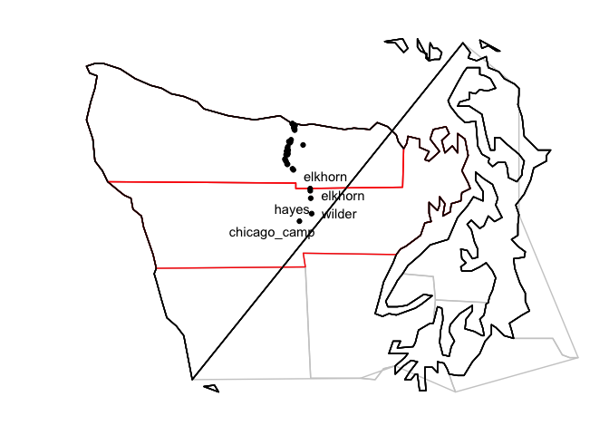
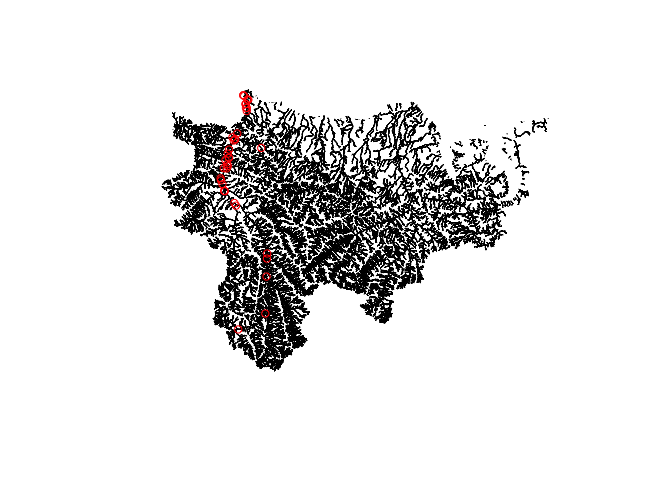

Elwha_EnvironmenalVariables
================
Kimberly Ledger
4/19/2022

libraries

``` r
library(tidyverse)
library(ggplot2)
library(maps)
library(mapdata)
library(ggrepel)
library(sf)
library(rgdal)
library(raster)
library(terra)
```

read in steelhead metadata that has river km and gps locations of
sampling sites

**I changed Time == During individuals to Time == Pre in
Elwha_Steelhead_Formatted_kjl.csv**

``` r
onmy_metadata <- read.csv("~/Desktop/LG_Proj4/Elwha_datafiles/Elwha_Steelhead_Formatted_kjl.csv")
head(onmy_metadata)
```

    ##   Sample_ID Year   Smolt Fork_Length NvH_Origin  Sex    Date Time Location
    ## 1  33649_17 2004 Unknown          NA          N <NA> 7/14/04  Pre       ID
    ## 2  33649_18 2004 Unknown          NA          N <NA> 7/14/04  Pre       ID
    ## 3  33649_19 2004 Unknown          NA          N <NA> 7/14/04  Pre       ID
    ## 4  33649_20 2004 Unknown          NA          N <NA> 7/14/04  Pre       ID
    ## 5  33649_23 2004 Unknown          NA          N <NA> 7/14/04  Pre       ID
    ## 6  33649_26 2004 Unknown          NA          N <NA> 7/14/04  Pre       ID
    ##   Run_Timing Life_Stage Life_History_Type      Lat      Long rkm Sampling_Site
    ## 1    Unknown   Juvenile       Land_Locked 48.11933 -123.5535  NA  little_river
    ## 2    Unknown   Juvenile       Land_Locked 48.06303 -123.5770  NA  little_river
    ## 3    Unknown   Juvenile       Land_Locked 48.06303 -123.5770  NA  little_river
    ## 4    Unknown   Juvenile       Land_Locked 48.06303 -123.5770  NA  little_river
    ## 5    Unknown   Juvenile       Land_Locked 48.06303 -123.5770  NA  little_river
    ## 6    Unknown   Juvenile       Land_Locked 48.06303 -123.5770  NA  little_river

create table of sampling sites

``` r
sites <- onmy_metadata %>%
  distinct(Lat, Long, rkm, Sampling_Site) %>%
  arrange(rkm)
sites
```

    ##         Lat      Long   rkm             Sampling_Site
    ## 1  48.14085 -123.5658  0.00         elwha_river_mouth
    ## 2  48.13988 -123.5633  0.95          hunts_high_bluff
    ## 3  48.14085 -123.5658  0.95          hunts_high_bluff
    ## 4  48.13390 -123.5520  2.13               wdfw_outlet
    ## 5  48.13390 -123.5520  2.13               lekt_outlet
    ## 6  48.12603 -123.5572  3.20         elwha_river_lower
    ## 7  48.12609 -123.5581  3.20         elwha_river_lower
    ## 8  48.12603 -123.5572  3.30         elwha_river_lower
    ## 9  48.11939 -123.5560  4.05               lekt_outlet
    ## 10 48.13396 -123.5545  4.70               lekt_outlet
    ## 11 48.11425 -123.5532  4.70               lekt_outlet
    ## 12 48.06396 -123.5770 12.30        elwha_river_middle
    ## 13 48.06100 -123.5803 13.30                      gage
    ## 14 48.03754 -123.5927 15.70        ds_fishermans_bend
    ## 15 48.03095 -123.5894 16.90           fishermans_bend
    ## 16 48.01913 -123.5918 18.50         ds_ranger_station
    ## 17 48.01181 -123.5924 19.20                   altaire
    ## 18 48.01181 -123.5999 20.70                   altaire
    ## 19 47.99039 -123.6044 22.50                 windy_arm
    ## 20 47.98373 -123.5997 23.30                   boulder
    ## 21 47.97197 -123.5920 25.20              whiskey_bend
    ## 22 47.95305 -123.5647 29.40                    geyser
    ## 23 47.87043 -123.4693 43.60                   elkhorn
    ## 24 47.86151 -123.4687 43.60                   elkhorn
    ## 25 47.83032 -123.4660 48.40                     hayes
    ## 26 47.76611 -123.4612 58.20                    wilder
    ## 27 47.73463 -123.5274 65.10              chicago_camp
    ## 28 48.11933 -123.5535    NA              little_river
    ## 29 48.06303 -123.5770    NA              little_river
    ## 30 48.05236 -123.5076    NA south_branch_little_river
    ## 31 48.06656 -123.5844    NA              indian_creek
    ## 32 48.04476 -123.5906    NA             madison_creek
    ## 33 48.07399 -123.5728    NA                   aldwell
    ## 34 47.97252 -123.5936    NA                 cat_creek
    ## 35 48.03017 -123.5885    NA          campground_creek
    ## 36 48.01589 -123.5901    NA               griff_creek
    ## 37 47.99377 -123.6058    NA                     mills
    ## 38 48.02611 -123.5973    NA              hughes_creek
    ## 39 47.94864 -123.5600    NA                long_creek
    ## 40 47.97252 -123.5936    NA         elwha_river_upper
    ## 41       NA        NA    NA         elwha_river_lower

create NW washington base map

``` r
state <- map_data("state")

washington <- subset(state, region=="washington")
counties <- map_data("county")
washington_county <- subset(counties, region=="washington")
clallam_co <- subset(washington_county, subregion=="clallam")
jefferson_co <- subset(washington_county, subregion=="jefferson")

map <- ggplot(data=washington, mapping=aes(x=long, y=lat, group=group)) + 
  coord_fixed(1.3) + 
  geom_polygon(color="black", fill=NA) + 
  geom_polygon(data=washington_county, fill=NA, color="gray80") + 
  geom_polygon(color="black", fill=NA) + 
  geom_polygon(data=clallam_co, fill=NA, color="red") + 
  geom_polygon(color="black", fill=NA) + 
  geom_polygon(data=jefferson_co, fill=NA, color="red") + 
  geom_polygon(color="black", fill=NA) + 
  xlim(-125, -122)+
  ylim(47,48.5) + 
  ylab("Latitude") +
  xlab("Longitude") +
  theme(axis.title.x=element_blank(), axis.text.x=element_blank(), axis.ticks.x=element_blank(),
        axis.title.y=element_blank(), axis.text.y=element_blank(), axis.ticks.y=element_blank()) +
  theme_void()

#map
```

plot map with sites

``` r
site_map <- map + 
  geom_point(data = sites, aes(x = Long, y = Lat, group = Sampling_Site)) +
  geom_text_repel(data = sites, aes(x = Long, y = Lat, group = Sampling_Site, 
                                    label = Sampling_Site), hjust=1, vjust=0.5)

site_map
```

    ## Warning: Removed 1 rows containing missing values (geom_point).

    ## Warning: Removed 1 rows containing missing values (geom_text_repel).

    ## Warning: ggrepel: 35 unlabeled data points (too many overlaps). Consider
    ## increasing max.overlaps

<!-- -->

plot just the sampling locations

``` r
site_plot <- ggplot(sites) + 
  geom_point(data = sites, aes(x = Long, y = Lat, group = Sampling_Site)) +
  geom_text_repel(data = sites, aes(x = Long, y = Lat, group = Sampling_Site, 
                                    label = Sampling_Site), hjust=1, vjust=0.5)
site_plot
```

    ## Warning: Removed 1 rows containing missing values (geom_point).

    ## Warning: Removed 1 rows containing missing values (geom_text_repel).

    ## Warning: ggrepel: 14 unlabeled data points (too many overlaps). Consider
    ## increasing max.overlaps

<!-- -->

lat/long plot looks quite funny… reproject?

reproject site locations to match terrainworks data

``` r
all_sites <- sites[-41,]
coordinates(all_sites) <- c('Long', 'Lat')
all_sites@proj4string <- CRS('+proj=longlat +datum=WGS84 +no_defs +ellps=WGS84 +towgs84=0,0,0')
sites_utm <- spTransform(all_sites, CRS('+proj=utm +zone=11 +datum=NAD83 +units=m +no_defs')) 
plot(sites_utm)
```

<!-- -->

read in TerrainWorks

``` r
#tw <- st_read("~/Desktop/LG_Proj4/TerrainWorks_Dung_Elwha_Corrected/Terrainworks_Dung_Elwha.shp")
tw <- readOGR("~/Desktop/LG_Proj4/TerrainWorks_Dung_Elwha_Corrected/Terrainworks_Dung_Elwha.shp")
```

    ## OGR data source with driver: ESRI Shapefile 
    ## Source: "/Users/kim/Desktop/LG_Proj4/TerrainWorks_Dung_Elwha_Corrected/Terrainworks_Dung_Elwha.shp", layer: "Terrainworks_Dung_Elwha"
    ## with 62738 features
    ## It has 62 fields
    ## Integer64 fields read as strings:  ID DOWN_ID CHAN_ID STRM_ORDER BeavHab Fish FISH_RESID roadX

``` r
tw
```

    ## class       : SpatialLinesDataFrame 
    ## features    : 62738 
    ## extent      : -4066.923, 70804.23, 5299449, 5353874  (xmin, xmax, ymin, ymax)
    ## crs         : +proj=utm +zone=11 +datum=NAD83 +units=m +no_defs 
    ## variables   : 62
    ## names       :   ID, DOWN_ID, CHAN_ID, LENGTH_M,        AREA_SQKM,  ELEV_M,      OUT_DIST,      SRC_DIST,     FROM_DIST, GRADIENT, MAX_GRAD_D, LAKE, STRM_ORDER, AZIMTH_DEG, WIDTH_M, ... 
    ## min values  :    1,       0,       1,    4.184, 0.00200000009499,       0,             0,             0,             0,        0,          0,    0,          1,          0,   0.068, ... 
    ## max values  : 9999,    9999,    9999,  171.508,    833.043029785, 2124.06, 73.2139968872, 73.2600021362, 72.7829971313,  1.81637,      1.816,    1,          7,     358.91,  41.646, ...

check projection

``` r
#tw$geometry
tw@proj4string
```

    ## Coordinate Reference System:
    ## Deprecated Proj.4 representation:
    ##  +proj=utm +zone=11 +datum=NAD83 +units=m +no_defs 
    ## WKT2 2019 representation:
    ## PROJCRS["NAD83 / UTM zone 11N",
    ##     BASEGEOGCRS["NAD83",
    ##         DATUM["North American Datum 1983",
    ##             ELLIPSOID["GRS 1980",6378137,298.257222101,
    ##                 LENGTHUNIT["metre",1]]],
    ##         PRIMEM["Greenwich",0,
    ##             ANGLEUNIT["degree",0.0174532925199433]],
    ##         ID["EPSG",4269]],
    ##     CONVERSION["UTM zone 11N",
    ##         METHOD["Transverse Mercator",
    ##             ID["EPSG",9807]],
    ##         PARAMETER["Latitude of natural origin",0,
    ##             ANGLEUNIT["Degree",0.0174532925199433],
    ##             ID["EPSG",8801]],
    ##         PARAMETER["Longitude of natural origin",-117,
    ##             ANGLEUNIT["Degree",0.0174532925199433],
    ##             ID["EPSG",8802]],
    ##         PARAMETER["Scale factor at natural origin",0.9996,
    ##             SCALEUNIT["unity",1],
    ##             ID["EPSG",8805]],
    ##         PARAMETER["False easting",500000,
    ##             LENGTHUNIT["metre",1],
    ##             ID["EPSG",8806]],
    ##         PARAMETER["False northing",0,
    ##             LENGTHUNIT["metre",1],
    ##             ID["EPSG",8807]]],
    ##     CS[Cartesian,2],
    ##         AXIS["(E)",east,
    ##             ORDER[1],
    ##             LENGTHUNIT["metre",1]],
    ##         AXIS["(N)",north,
    ##             ORDER[2],
    ##             LENGTHUNIT["metre",1]],
    ##     ID["EPSG",26911]]

``` r
map <- ggplot() + 
  geom_polygon(data = tw, aes(x = long, y = lat, group = group), colour = "black", fill = NA)
#map
```

``` r
plot(tw)
points(sites_utm, col = "red")
```

<!-- -->

try to rasterize stream power from Terrain works

``` r
emptyraster <- rast(xmin = -4067, xmax = 30000, ymin = 5299449, ymax = 5353874, resolution = 30)

#strmpow <- rasterize(tw, emptyraster, field = "StrmPow", fun = mean, background = NA)
```

read in NorWeST data

``` r
nw_lines <- vect('~/Desktop/LG_Proj4/Elwha_environmentaldata/NorWeST_PredictedStreamTempPoints_WACoast_MWMT/NorWeST_PredictedStreamTempPoints_WACoast_MWMT.shp')

nw_lines
```

    ##  class       : SpatVector 
    ##  geometry    : points 
    ##  dimensions  : 37101, 51  (geometries, attributes)
    ##  extent      : 704904.4, 1008608, 1838591, 2127196  (xmin, xmax, ymin, ymax)
    ##  source      : NorWeST_PredictedStreamTempPoints_WACoast_MWMT.shp
    ##  coord. ref. : GNLCC 
    ##  names       : OBSPRED_ID       FTYPE WATERBODY TAILWATER  ELEV CANOPY   SLOPE
    ##  type        :      <int>       <chr>     <int>     <int> <num>  <num>   <num>
    ##  values      :     100160 StreamRiver         0         0 531.4  67.72 0.03554
    ##                    100161 StreamRiver         0         0   472  92.29 0.03554
    ##                    100162 StreamRiver         0         0 442.3  91.88 0.03554
    ##  PRECIP CUMDRAINAG   Y_COORD (and 41 more)
    ##   <num>      <num>     <num>              
    ##    2762       8.17 1.846e+06              
    ##    2762       8.17 1.846e+06              
    ##    2762       8.17 1.847e+06

``` r
nw_lines@ptr[["names"]]
```

    ##  [1] "OBSPRED_ID" "FTYPE"      "WATERBODY"  "TAILWATER"  "ELEV"      
    ##  [6] "CANOPY"     "SLOPE"      "PRECIP"     "CUMDRAINAG" "Y_COORD"   
    ## [11] "NLCD11PC"   "GLACIER"    "BFI"        "Air_Temp"   "Flow"      
    ## [16] "S1_93_11"   "S2_02_11"   "S3_1993"    "S4_1994"    "S5_1995"   
    ## [21] "S6_1996"    "S7_1997"    "S8_1998"    "S9_1999"    "S10_2000"  
    ## [26] "S11_2001"   "S12_2002"   "S13_2003"   "S14_2004"   "S15_2005"  
    ## [31] "S16_2006"   "S17_2007"   "S18_2008"   "S19_2009"   "S20_2010"  
    ## [36] "S21_2011"   "S22_PredSE" "S23_1C"     "S24_1C_D"   "S25_2C"    
    ## [41] "S26_2C_D"   "S27_3C"     "S28_3C_D"   "S29_2040"   "S30_2040D" 
    ## [46] "S31_2080"   "S32_2080D"  "S33_2012"   "S34_2013"   "S35_2014"  
    ## [51] "S36_2015"

``` r
#for norwest, need list of the columns wanted
nw_list <- list('ELEV',
                'CANOPY',
                'SLOPE',
                'PRECIP',
                'CUMDRAINAG',
                'Flow',
                'S1_93_11')
```

``` r
nw_lines_buffer <- buffer(nw_lines, 1000)

#rasterize the shapefile, reproject, and then extract
#norwest_sites <- lapply(nw_list, function(i){
#   tmp <- rasterize(nw_lines_buffer, XXXX, field=paste(i), background = NA)
#   #tmp <- project(tmp, "+proj=longlat +datum=WGS84 +no_defs")
#   tmp[tmp<(-20)] <- NA #remove missing data
#   terra::extract(tmp, sites_utm, xy = TRUE, method = 'simple', touches = TRUE, na.rm=TRUE)
# })
 
 #combine all the individual dataframes together
#norwest_df <- do.call("cbind", norwest_sites)
```
