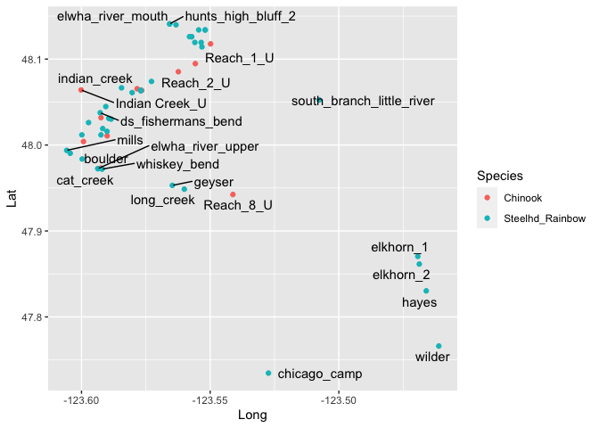

Elwha_EnvironmenalVariables
================
Kimberly Ledger
4/19/2022

#Extract environmental variables

libraries

``` r
library(tidyverse)
library(ggplot2)
library(maps)
library(mapdata)
library(ggrepel)
#library(sf)
#library(rgdal)
library(raster)
library(terra)
```

read in steelhead metadata that has river km and gps locations of
sampling sites

**I changed Time == During individuals to Time == Pre in
Elwha_Steelhead_Formatted_kjl.csv**

``` r
onmy_metadata <- read.csv("~/Desktop/LG_Proj4/Elwha_datafiles/Elwha_Steelhead_Formatted_kjl.csv")
head(onmy_metadata)
```

    ##   Sample_ID Year   Smolt Fork_Length NvH_Origin  Sex    Date Time Location
    ## 1  33649_17 2004 Unknown          NA          N <NA> 7/14/04  Pre       ID
    ## 2  33649_18 2004 Unknown          NA          N <NA> 7/14/04  Pre       ID
    ## 3  33649_19 2004 Unknown          NA          N <NA> 7/14/04  Pre       ID
    ## 4  33649_20 2004 Unknown          NA          N <NA> 7/14/04  Pre       ID
    ## 5  33649_23 2004 Unknown          NA          N <NA> 7/14/04  Pre       ID
    ## 6  33649_26 2004 Unknown          NA          N <NA> 7/14/04  Pre       ID
    ##   Run_Timing Life_Stage Life_History_Type      Lat      Long rkm Sampling_Site
    ## 1    Unknown   Juvenile       Land_Locked 48.11933 -123.5535  NA  little_river
    ## 2    Unknown   Juvenile       Land_Locked 48.06303 -123.5770  NA  little_river
    ## 3    Unknown   Juvenile       Land_Locked 48.06303 -123.5770  NA  little_river
    ## 4    Unknown   Juvenile       Land_Locked 48.06303 -123.5770  NA  little_river
    ## 5    Unknown   Juvenile       Land_Locked 48.06303 -123.5770  NA  little_river
    ## 6    Unknown   Juvenile       Land_Locked 48.06303 -123.5770  NA  little_river

create table of sampling sites

``` r
sites <- onmy_metadata %>%
  distinct(Lat, Long, rkm, Sampling_Site) %>%
  arrange(rkm)
sites
```

    ##         Lat      Long   rkm             Sampling_Site
    ## 1  48.14085 -123.5658  0.00         elwha_river_mouth
    ## 2  48.13988 -123.5633  0.95          hunts_high_bluff
    ## 3  48.14085 -123.5658  0.95          hunts_high_bluff
    ## 4  48.13390 -123.5520  2.13               wdfw_outlet
    ## 5  48.13390 -123.5520  2.13               lekt_outlet
    ## 6  48.12603 -123.5572  3.20         elwha_river_lower
    ## 7  48.12609 -123.5581  3.20         elwha_river_lower
    ## 8  48.12603 -123.5572  3.30         elwha_river_lower
    ## 9  48.11939 -123.5560  4.05               lekt_outlet
    ## 10 48.13396 -123.5545  4.70               lekt_outlet
    ## 11 48.11425 -123.5532  4.70               lekt_outlet
    ## 12 48.06396 -123.5770 12.30        elwha_river_middle
    ## 13 48.06100 -123.5803 13.30                      gage
    ## 14 48.03754 -123.5927 15.70        ds_fishermans_bend
    ## 15 48.03095 -123.5894 16.90           fishermans_bend
    ## 16 48.01913 -123.5918 18.50         ds_ranger_station
    ## 17 48.01181 -123.5924 19.20                   altaire
    ## 18 48.01181 -123.5999 20.70                   altaire
    ## 19 47.99039 -123.6044 22.50                 windy_arm
    ## 20 47.98373 -123.5997 23.30                   boulder
    ## 21 47.97197 -123.5920 25.20              whiskey_bend
    ## 22 47.95305 -123.5647 29.40                    geyser
    ## 23 47.87043 -123.4693 43.60                   elkhorn
    ## 24 47.86151 -123.4687 43.60                   elkhorn
    ## 25 47.83032 -123.4660 48.40                     hayes
    ## 26 47.76611 -123.4612 58.20                    wilder
    ## 27 47.73463 -123.5274 65.10              chicago_camp
    ## 28 48.11933 -123.5535    NA              little_river
    ## 29 48.06303 -123.5770    NA              little_river
    ## 30 48.05236 -123.5076    NA south_branch_little_river
    ## 31 48.06656 -123.5844    NA              indian_creek
    ## 32 48.04476 -123.5906    NA             madison_creek
    ## 33 48.07399 -123.5728    NA                   aldwell
    ## 34 47.97252 -123.5936    NA                 cat_creek
    ## 35 48.03017 -123.5885    NA          campground_creek
    ## 36 48.01589 -123.5901    NA               griff_creek
    ## 37 47.99377 -123.6058    NA                     mills
    ## 38 48.02611 -123.5973    NA              hughes_creek
    ## 39 47.94864 -123.5600    NA                long_creek
    ## 40 47.97252 -123.5936    NA         elwha_river_upper
    ## 41       NA        NA    NA         elwha_river_lower

i saved this sites table and combined with the Chinook salmon reaches

#read in ALL site locations

``` r
all_sites <- read.csv("~/Desktop/LG_Proj4/Elwha_environmentaldata/elwha_allsites.csv")
```

create NW washington base map

``` r
state <- map_data("state")

washington <- subset(state, region=="washington")
counties <- map_data("county")
washington_county <- subset(counties, region=="washington")
clallam_co <- subset(washington_county, subregion=="clallam")
jefferson_co <- subset(washington_county, subregion=="jefferson")

map <- ggplot(data=washington, mapping=aes(x=long, y=lat, group=group)) + 
  coord_fixed(1.3) + 
  geom_polygon(color="black", fill=NA) + 
  geom_polygon(data=washington_county, fill=NA, color="gray80") + 
  geom_polygon(color="black", fill=NA) + 
  geom_polygon(data=clallam_co, fill=NA, color="red") + 
  geom_polygon(color="black", fill=NA) + 
  geom_polygon(data=jefferson_co, fill=NA, color="red") + 
  geom_polygon(color="black", fill=NA) + 
  xlim(-125, -122)+
  ylim(47,48.5) + 
  ylab("Latitude") +
  xlab("Longitude") +
  theme(axis.title.x=element_blank(), axis.text.x=element_blank(), axis.ticks.x=element_blank(),
        axis.title.y=element_blank(), axis.text.y=element_blank(), axis.ticks.y=element_blank()) +
  theme_void()

#map
```

plot map with sites

``` r
site_map <- map + 
  geom_point(data = sites, aes(x = Long, y = Lat, group = Sampling_Site)) +
  geom_text_repel(data = sites, aes(x = Long, y = Lat, group = Sampling_Site, 
                                    label = Sampling_Site), hjust=1, vjust=0.5)

site_map
```

    ## Warning: Removed 1 rows containing missing values (geom_point).

    ## Warning: Removed 1 rows containing missing values (geom_text_repel).

    ## Warning: ggrepel: 35 unlabeled data points (too many overlaps). Consider
    ## increasing max.overlaps

<!-- -->

plot just the sampling locations

``` r
site_plot <- ggplot(all_sites) + 
  geom_point(data = all_sites, aes(x = Long, y = Lat, col = Species, group = sites_renamed)) +
  geom_text_repel(data = all_sites, aes(x = Long, y = Lat, group = sites_renamed, 
                                    label = sites_renamed), hjust=1, vjust=0.5)
site_plot
```

    ## Warning: Removed 1 rows containing missing values (geom_point).

    ## Warning: Removed 1 rows containing missing values (geom_text_repel).

    ## Warning: ggrepel: 30 unlabeled data points (too many overlaps). Consider
    ## increasing max.overlaps

<!-- -->

reproject site locations to match terrainworks data

``` r
all_sites2 <- all_sites[-52,]
sites_vect <- vect(all_sites2, geom=c("Long", "Lat"), crs="EPSG: 4326")

Species <- all_sites2$Species
```

read in bioclim layer to use a base raster

``` r
#load in the bioclim rasters
bio_layer <- rast("~/Desktop/LG_Proj4/Elwha_environmentaldata/wc2.1_30s_prec/wc2.1_30s_prec_01.tif")

#check projection of raster 
crs(bio_layer)
```

    ## [1] "GEOGCRS[\"WGS 84\",\n    DATUM[\"World Geodetic System 1984\",\n        ELLIPSOID[\"WGS 84\",6378137,298.257223563,\n            LENGTHUNIT[\"metre\",1]]],\n    PRIMEM[\"Greenwich\",0,\n        ANGLEUNIT[\"degree\",0.0174532925199433]],\n    CS[ellipsoidal,2],\n        AXIS[\"geodetic latitude (Lat)\",north,\n            ORDER[1],\n            ANGLEUNIT[\"degree\",0.0174532925199433]],\n        AXIS[\"geodetic longitude (Lon)\",east,\n            ORDER[2],\n            ANGLEUNIT[\"degree\",0.0174532925199433]],\n    ID[\"EPSG\",4326]]"

``` r
#going to crop to save space prior to dealing with correlated variables for bioclim
x_min <- xmin(sites_vect)
x_max <- xmax(sites_vect)
y_min <- ymin(sites_vect)
y_max <- ymax(sites_vect)

#create extent object by slightly increasing the min/max values from data
ext <- rast(xmin= (x_min - 0.2), xmax =(x_max + 0.2), 
            ymin= (y_min -0.2), ymax = (y_max + 0.2))

#define crs of this raster
crs(ext) <- crs(bio_layer)

#crop all layers in the stack
bio_crop <- crop(bio_layer, ext)

#plot to double check alignment
plot(bio_crop)
points(sites_vect, col = as.factor(Species))
```

<!-- -->

read in TerrainWorks

``` r
tw <- terra::vect("~/Desktop/LG_Proj4/TerrainWorks_Dung_Elwha_Corrected/Terrainworks_Dung_Elwha.shp")
tw
```

    ##  class       : SpatVector 
    ##  geometry    : lines 
    ##  dimensions  : 62738, 62  (geometries, attributes)
    ##  extent      : -4066.923, 70804.23, 5299449, 5353874  (xmin, xmax, ymin, ymax)
    ##  source      : Terrainworks_Dung_Elwha.shp
    ##  coord. ref. : NAD83 / UTM zone 11N (EPSG:26911) 
    ##  names       :    ID DOWN_ID CHAN_ID LENGTH_M AREA_SQKM ELEV_M OUT_DIST
    ##  type        : <int>   <int>   <int>    <num>     <num>  <num>    <num>
    ##  values      :     1       0       1    8.685       833      0        0
    ##                    2       1       1    40.35       833      0    0.017
    ##                    3       2       1    12.15     832.4  0.001    0.061
    ##  SRC_DIST FROM_DIST GRADIENT (and 52 more)
    ##     <num>     <num>    <num>              
    ##     73.26         0  0.00063              
    ##     73.24     0.017  0.00057              
    ##      73.2     0.061  0.00033

project sites into crs used by TerrainWorks

``` r
sites_tw <- terra::project(sites_vect, "+proj=utm +zone=11 +datum=NAD83 +units=m +no_defs")
```

plot TerrainWorks data with sites

``` r
plot(tw)
points(sites_tw, col = "red")
```

<!-- -->

reproject cropped bioclim layer to TerrainWorks CRS for cropping and
rasterization template

``` r
bio1 <- terra::project(bio_crop, "+proj=utm +zone=11 +datum=NAD83 +units=m +no_defs")

tw_crop <- crop(tw, bio1)
plot(tw_crop)
points(sites_tw, col = "red")
```

<!-- -->

for TerrainWorks, create list of environmental layers we want to keep

``` r
tw_crop@ptr[["names"]]
```

    ##  [1] "ID"         "DOWN_ID"    "CHAN_ID"    "LENGTH_M"   "AREA_SQKM" 
    ##  [6] "ELEV_M"     "OUT_DIST"   "SRC_DIST"   "FROM_DIST"  "GRADIENT"  
    ## [11] "MAX_GRAD_D" "LAKE"       "STRM_ORDER" "AZIMTH_DEG" "WIDTH_M"   
    ## [16] "DEPTH_M"    "SINUOSITY"  "Basin_ID"   "MNANPRC_M"  "MEANANNCMS"
    ## [21] "VAL_WIDTH"  "FP_WIDTH"   "p_trib"     "FlowVel"    "BFQ"       
    ## [26] "StrmPow"    "BeavHab"    "VWI_Floor"  "Fish"       "FISH_RESID"
    ## [31] "IP_COHO"    "IP_Chinook" "IP_Steelhd" "PWCT_IP"    "P_DF_AVE"  
    ## [36] "DF_Junct"   "GEP_Cum"    "GEP"        "GEP_DEL"    "Strm_Name" 
    ## [41] "DSID"       "UniqueID"   "roadX"      "RdDensUp"   "RdDensDown"
    ## [46] "RdDensLoc"  "RdDensR"    "RdDensL"    "RdWEPP_Yld" "RdWEPP_Cum"
    ## [51] "GRAIP"      "GRAIPCum"   "slope_loc"  "slope_cum"  "LwrLat"    
    ## [56] "LwrLon"     "UprLat"     "UprLon"     "UniqueCHID" "UniqueDID" 
    ## [61] "MidLat"     "MidLon"

``` r
#for terrainwork, need list of the columns wanted
tw_list <- list('FlowVel', #Flow velocity (m/s) at bankfull depth
                'StrmPow', #Stream power
                'BFQ', #discharge
                'ELEV_M', #elevation (m) of downstream end of reach
                'GRADIENT', #Original gradient
                'FROM_DIST', #distance (km) from channel mouth to downstream end of reach 
                'FISH_RESID', #extent of resident fish habitat which can occur upstream
                'IP_Chinook', #Chinook intrinsic habitat potential
                'IP_Steelhd', #Steelhead intrinsic habitat potential
                'STRM_ORDER', #Strahler (1952) stream order 
                'WIDTH_M', #bankfull width (m)
                'DEPTH_M') #bankfull depth (m)
```

``` r
tw_lines_buffer <- buffer(tw_crop, 500)

sites_tw_buffer <- buffer(sites_tw, 100)
#plot(sites_tw_buffer)

#rasterize the shapefile, reproject, and then extract
tw_sites <- lapply(tw_list, function(i){
   tmp <- rasterize(tw_lines_buffer, bio1, field=paste(i), background = NA)
   tmp[tmp<(-20)] <- NA #remove missing data
   terra::extract(tmp, sites_tw, xy = TRUE, method = 'simple', touches = TRUE, na.rm=TRUE)
 })

#rasterize the shapefile, reproject, and then extract
tw_sites1 <- lapply(tw_list, function(i){
   tmp <- rasterize(tw_lines_buffer, bio1, field=paste(i), background = NA)
   tmp[tmp<(-20)] <- NA #remove missing data
   terra::extract(tmp, sites_tw_buffer, xy = TRUE, method = 'simple', touches = TRUE, na.rm=TRUE)
 })
 
#rasterize the shapefile, reproject, and then extract
tw_sites2 <- lapply(tw_list, function(i){
   tmp <- rasterize(tw_lines_buffer, bio1, field=paste(i), background = NA)
   tmp[tmp<(-20)] <- NA #remove missing data
   terra::extract(tmp, sites_tw, xy = TRUE, method = 'bilinear', touches = TRUE, na.rm=TRUE)
 })

#rasterize the shapefile, reproject, and then extract
tw_sites3 <- lapply(tw_list, function(i){
   tmp <- rasterize(tw_lines_buffer, bio1, field=paste(i), background = NA)
   tmp[tmp<(-20)] <- NA #remove missing data
   terra::extract(tmp, sites_tw_buffer, xy = TRUE, method = 'bilinear', touches = TRUE, na.rm=TRUE)
 })

#combine all the individual dataframes together
tw_df <- do.call("cbind", tw_sites2)

#remove duplicates (id, x, and y repeat many times from cbind, maybe expore left_join in the future here)
tw_df <- tw_df[!duplicated(as.list(tw_df))]
```

i’m not sure what the best way is to buffer and extract sites… will go
with bilinear method for now…

**for terrainworks data, i used the bilinear extraction method for each
site**

not all these tw variables seem to useful or calculated in the correct
way…

``` r
tw_df_trim <- tw_df %>%
  dplyr::select(!FROM_DIST) %>%
  dplyr::select(!FISH_RESID) %>%
  dplyr::select(!IP_Chinook) %>%
  dplyr::select(!IP_Steelhd) %>%
  dplyr::select(!STRM_ORDER) %>%
  dplyr::select(!x) %>%
  dplyr::select(!y) %>%
  dplyr::select(!ID)
```

read in NorWeST data

``` r
nw_lines <- vect('~/Desktop/LG_Proj4/Elwha_environmentaldata/NorWeST_PredictedStreamTempLines_WACoast_Aug/NorWeST_PredictedStreamTempLines_WACoast_Aug.shp')

nw_lines
```

    ##  class       : SpatVector 
    ##  geometry    : lines 
    ##  dimensions  : 37101, 53  (geometries, attributes)
    ##  extent      : 704740.6, 1009024, 1838450, 2127528  (xmin, xmax, ymin, ymax)
    ##  source      : NorWeST_PredictedStreamTempLines_WACoast_Aug.shp
    ##  coord. ref. : GNLCC 
    ##  names       : OBSPRED_ID       FTYPE WATERBODY TAILWATER  ELEV CANOPY   SLOPE
    ##  type        :      <int>       <chr>     <int>     <int> <num>  <num>   <num>
    ##  values      :     100001 StreamRiver         0         0   147  83.74 0.04526
    ##                    100002 StreamRiver         0         0  85.8  74.02 0.04526
    ##                    100003 StreamRiver         0         0 69.81  21.45 0.04526
    ##  PRECIP CUMDRAINAG   Y_COORD (and 43 more)
    ##   <num>      <num>     <num>              
    ##    2861       2.11 1.839e+06              
    ##    2861       2.11  1.84e+06              
    ##    2861       2.11  1.84e+06

``` r
nw_lines@ptr[["names"]]
```

    ##  [1] "OBSPRED_ID" "FTYPE"      "WATERBODY"  "TAILWATER"  "ELEV"      
    ##  [6] "CANOPY"     "SLOPE"      "PRECIP"     "CUMDRAINAG" "Y_COORD"   
    ## [11] "NLCD11PC"   "GLACIER"    "BFI"        "Air_Aug"    "Flow_Aug"  
    ## [16] "S1_93_11"   "S2_02_11"   "S3_1993"    "S4_1994"    "S5_1995"   
    ## [21] "S6_1996"    "S7_1997"    "S8_1998"    "S9_1999"    "S10_2000"  
    ## [26] "S11_2001"   "S12_2002"   "S13_2003"   "S14_2004"   "S15_2005"  
    ## [31] "S16_2006"   "S17_2007"   "S18_2008"   "S19_2009"   "S20_2010"  
    ## [36] "S21_2011"   "S22_PredSE" "S23_1C"     "S24_1C_D"   "S25_2C"    
    ## [41] "S26_2C_D"   "S27_3C"     "S28_3C_D"   "S29_2040"   "S30_2040D" 
    ## [46] "S31_2080"   "S32_2080D"  "S33_2012"   "S34_2013"   "COMID"     
    ## [51] "GNIS_NAME"  "S35_2014"   "S36_2015"

reproject cropped bioclim layer to NorWeST CRS for cropping and
rasterization template

``` r
bio2 <- terra::project(bio_crop, crs(nw_lines))

nw_crop <- crop(nw_lines, bio2)

#convert site crs to match NorWeST
sites_nw <- terra::project(sites_vect, crs(nw_lines)) 

spp_col <- as.factor(Species)

sites_nw_onmy <- sites_nw[spp_col == "Steelhd_Rainbow"]
sites_nw_chin <- sites_nw[spp_col == "Chinook"]

plot(nw_crop)
points(sites_nw_onmy)
```

<!-- -->

``` r
plot(nw_crop)
points(sites_nw_chin)
```

<!-- -->

temp and flow seem to output odd results using the bilinear extraction
methods… will try a simple extraction in a buffer zone around sites and
then average the values that makes sense

``` r
nw_lines@ptr[["names"]]
```

    ##  [1] "OBSPRED_ID" "FTYPE"      "WATERBODY"  "TAILWATER"  "ELEV"      
    ##  [6] "CANOPY"     "SLOPE"      "PRECIP"     "CUMDRAINAG" "Y_COORD"   
    ## [11] "NLCD11PC"   "GLACIER"    "BFI"        "Air_Aug"    "Flow_Aug"  
    ## [16] "S1_93_11"   "S2_02_11"   "S3_1993"    "S4_1994"    "S5_1995"   
    ## [21] "S6_1996"    "S7_1997"    "S8_1998"    "S9_1999"    "S10_2000"  
    ## [26] "S11_2001"   "S12_2002"   "S13_2003"   "S14_2004"   "S15_2005"  
    ## [31] "S16_2006"   "S17_2007"   "S18_2008"   "S19_2009"   "S20_2010"  
    ## [36] "S21_2011"   "S22_PredSE" "S23_1C"     "S24_1C_D"   "S25_2C"    
    ## [41] "S26_2C_D"   "S27_3C"     "S28_3C_D"   "S29_2040"   "S30_2040D" 
    ## [46] "S31_2080"   "S32_2080D"  "S33_2012"   "S34_2013"   "COMID"     
    ## [51] "GNIS_NAME"  "S35_2014"   "S36_2015"

``` r
#for norwest, need list of the columns wanted
nw_list1 <- list('ELEV',
                'CANOPY',
                'SLOPE',
                'PRECIP',
                'CUMDRAINAG')

nw_list2 <- list('Flow_Aug',
                'S1_93_11',
                'S2_02_11')
```

``` r
nw_lines_buffer <- buffer(nw_lines, 500)

sites_nw_buffer <- buffer(sites_nw, 500)

#rasterize the shapefile, reproject, and then extract
nw_sites1 <- lapply(nw_list1, function(i){
   tmp <- rasterize(nw_lines_buffer, bio2, field=paste(i), background = NA)
   tmp[tmp<(-20)] <- NA #remove missing data
   terra::extract(tmp, sites_nw, xy = TRUE, method = 'bilinear', touches = TRUE, na.rm=TRUE)
 })

#combine all the individual dataframes together
nw_df1 <- do.call("cbind", nw_sites1)
#remove duplicates (id, x, and y repeat many times from cbind, maybe expore left_join in the future here)
nw_df1 <- nw_df1[!duplicated(as.list(nw_df1))]
 
#rasterize the shapefile, reproject, and then extract
nw_sites2 <- lapply(nw_list2, function(i){
   tmp <- rasterize(nw_lines_buffer, bio2, field=paste(i), background = NA)
   tmp[tmp<(-20)] <- NA #remove missing data
   terra::extract(tmp, sites_nw_buffer, xy = TRUE, method = 'simple', touches = TRUE, na.rm=TRUE)
 })
 
#combine all the individual dataframes together
nw_df2 <- do.call("cbind", nw_sites2)

#remove duplicates (id, x, and y repeat many times from cbind, maybe expore left_join in the future here)
nw_df2 <- nw_df2[!duplicated(as.list(nw_df2))]

nw_df2$ID <- as.factor(nw_df2$ID)

nw_df2_ave <- nw_df2 %>%
  group_by(ID) %>% 
  summarise(Flow_Aug = mean(Flow_Aug, na.rm = TRUE), 
            StreamTemp_93_11 = mean(S1_93_11, na.rm = TRUE),
            StreamTemp_02_11 = mean(S2_02_11, na.rm = TRUE))

nw_df <- cbind(nw_df1, nw_df2_ave)

#remove repeatitive ID column
nw_df <- nw_df[,-1] 
```

trim out some varibles from nw_df

``` r
nw_df_trim <- nw_df %>%
  dplyr::select(!x) %>%
  dplyr::select(!y) %>%
  dplyr::select(!ID) %>%
  dplyr::select(!Flow_Aug)  #no variation among sites
```

combine environmental dataframes

``` r
all_enviro <- cbind(all_sites2, nw_df_trim, tw_df_trim)

write.csv(all_enviro, "~/Desktop/LG_Proj4/Elwha_environmentaldata/outputs/environ_extract_22April2022.csv")
```
