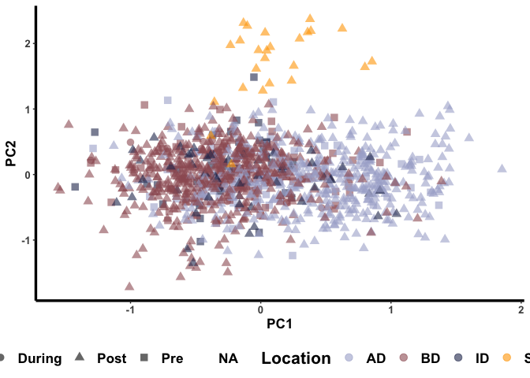
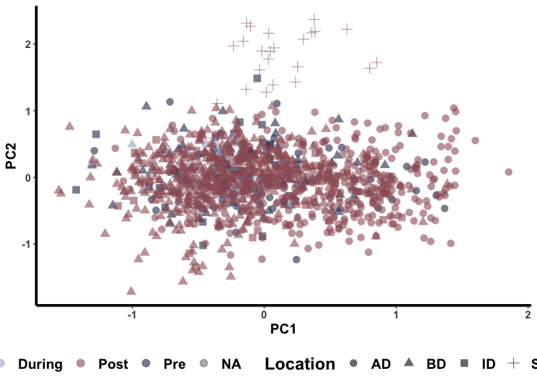

Elwha Steelhead Pop Gen - Time
================
Kimberly Ledger
3/17/2022

taking a different approach to pop genetics analyses - some of this is
copied from previous code…

### load libraries

``` r
library(vcfR) #this package is used to visualize and manipulate VCF files
library(adegenet) #this package is used for analysis of genetic/genomic data 
library(dplyr) # data manipulation
library(tidyr) # data manipulation
library(dartR)
#library(pegas) #a package for pop gen data analysis
#library(poppr) #a package for pop gen data analysis
```

# Part 1: Prepare the data

## read in the steelhead (Oncorhynchus mykiss) metadata

``` r
onmy_metadata <- read.csv("~/Desktop/LG_Proj4/Elwha_datafiles/Elwha_Steelhead_Formatted.csv")
head(onmy_metadata)
```

    ##   Sample_ID Year   Smolt Fork_Length NvH_Origin  Sex    Date Time Location
    ## 1  33649_17 2004 Unknown          NA          N <NA> 7/14/04  Pre       ID
    ## 2  33649_18 2004 Unknown          NA          N <NA> 7/14/04  Pre       ID
    ## 3  33649_19 2004 Unknown          NA          N <NA> 7/14/04  Pre       ID
    ## 4  33649_20 2004 Unknown          NA          N <NA> 7/14/04  Pre       ID
    ## 5  33649_23 2004 Unknown          NA          N <NA> 7/14/04  Pre       ID
    ## 6  33649_26 2004 Unknown          NA          N <NA> 7/14/04  Pre       ID
    ##   Run_Timing Life_Stage Life_History_Type      Lat      Long rkm Sampling_Site
    ## 1    Unknown   Juvenile       Land_Locked 48.11933 -123.5535  NA  little_river
    ## 2    Unknown   Juvenile       Land_Locked 48.06303 -123.5770  NA  little_river
    ## 3    Unknown   Juvenile       Land_Locked 48.06303 -123.5770  NA  little_river
    ## 4    Unknown   Juvenile       Land_Locked 48.06303 -123.5770  NA  little_river
    ## 5    Unknown   Juvenile       Land_Locked 48.06303 -123.5770  NA  little_river
    ## 6    Unknown   Juvenile       Land_Locked 48.06303 -123.5770  NA  little_river

## create column in sample metadata for location and timing

``` r
onmy_metadata <- onmy_metadata %>%
  unite("TimePlace", c(Time, Location), sep= "_", remove = FALSE)
```

## read in the VCF file and extract genotypes

``` r
onmy_vcf <- read.vcfR("~/Desktop/LG_Proj4/Elwha_datafiles/Elwha_GTSeq_Sans_CCT.vcf")
```

    ## Scanning file to determine attributes.
    ## File attributes:
    ##   meta lines: 35
    ##   header_line: 36
    ##   variant count: 336
    ##   column count: 1178
    ## Meta line 35 read in.
    ## All meta lines processed.
    ## gt matrix initialized.
    ## Character matrix gt created.
    ##   Character matrix gt rows: 336
    ##   Character matrix gt cols: 1178
    ##   skip: 0
    ##   nrows: 336
    ##   row_num: 0
    ## Processed variant: 336
    ## All variants processed

``` r
onmy_gt <- extract.gt(onmy_vcf)
```

## read in loci metadata

``` r
onmy_loci_meta <- read.csv("~/Desktop/LG_Proj4/Elwha_datafiles/Steelhead_Locus_Key_kjl.csv")
```

## read in SNP coordinate data

``` r
onmy_snp_coord <- read.csv("~/Desktop/LG_Proj4/Elwha_datafiles/SNP_Coordinates_CRITFC.csv")
```

join loci metadata and SNP coords

``` r
onmy_locus_join <- onmy_snp_coord %>%
  left_join(onmy_loci_meta, by = "Locus")
```

note: loci on chromosome 25 do not have neutral/adaptive metadata
included

## join all metatdata to extracted genotypes

``` r
onmy_snp <- rownames(onmy_gt)

onmy_gt_df <- as.data.frame(onmy_gt)
onmy_gt_df$SNP <- onmy_snp

onmy_gt_meta <- onmy_locus_join %>%
  left_join(onmy_gt_df, by = "SNP")
```

## filter the metatdata to seperate neutral and adaptive loci

``` r
onmy_neutral <- onmy_gt_meta %>%
  filter(Status == "Neutral")
onmy_adaptive <- onmy_gt_meta %>%
  filter(Status == "Adaptive")
```

## make dataframe of just gt’s of neutral loci

``` r
onmy_n_gt <- onmy_neutral[,c(5,13:1181)]
rownames(onmy_n_gt) <- onmy_neutral$SNP
onmy_n_gt <- onmy_n_gt[,-1] 
```

## transpose neutral genotypes and combine with sample metadata

``` r
onmy_n_gt_t <- t(onmy_n_gt)
onmy_n_gt_t <- as.data.frame(onmy_n_gt_t)
onmy_n_gt_t$Sample_ID <- rownames(onmy_n_gt_t)

onmy_n_df <- onmy_n_gt_t %>%
  left_join(onmy_metadata, by = "Sample_ID")
```

## now that the gt’s and metadata are in the same order, create a genind object

``` r
geno_n <- onmy_n_df[,c(1:242)]
rownames(geno_n) <- onmy_n_df[,243]
col_geno_n <- gsub("\\.", "_", colnames(geno_n))
colnames(geno_n) <- col_geno_n

meta_n <- onmy_n_df[,-c(1:242)]

loci <- colnames(geno_n)
ind <- rownames(geno_n)
location <- meta_n$Location
time <- meta_n$Time
tp <- meta_n$TimePlace

# make multiple genind objects each with different population criteria... maybe there is a way to code all this into one object? 
onmy_genind_loc <- df2genind(geno_n,
                         sep="/",
                         ind.names=ind,
                         loc.names=loci, 
                         pop = location,
                         ploidy = 2)
```

    ## Warning in df2genind(geno_n, sep = "/", ind.names = ind, loc.names = loci, :
    ## Markers with no scored alleles have been removed

``` r
onmy_genind_loc
```

    ## /// GENIND OBJECT /////////
    ## 
    ##  // 1,169 individuals; 222 loci; 442 alleles; size: 2.2 Mb
    ## 
    ##  // Basic content
    ##    @tab:  1169 x 442 matrix of allele counts
    ##    @loc.n.all: number of alleles per locus (range: 1-2)
    ##    @loc.fac: locus factor for the 442 columns of @tab
    ##    @all.names: list of allele names for each locus
    ##    @ploidy: ploidy of each individual  (range: 2-2)
    ##    @type:  codom
    ##    @call: df2genind(X = geno_n, sep = "/", ind.names = ind, loc.names = loci, 
    ##     pop = location, ploidy = 2)
    ## 
    ##  // Optional content
    ##    @pop: population of each individual (group size range: 25-568)

``` r
onmy_genind_time <- df2genind(geno_n,
                         sep="/",
                         ind.names=ind,
                         loc.names=loci, 
                         pop = time,
                         ploidy = 2)
```

    ## Warning in df2genind(geno_n, sep = "/", ind.names = ind, loc.names = loci, :
    ## Markers with no scored alleles have been removed

``` r
onmy_genind_time
```

    ## /// GENIND OBJECT /////////
    ## 
    ##  // 1,169 individuals; 222 loci; 442 alleles; size: 2.2 Mb
    ## 
    ##  // Basic content
    ##    @tab:  1169 x 442 matrix of allele counts
    ##    @loc.n.all: number of alleles per locus (range: 1-2)
    ##    @loc.fac: locus factor for the 442 columns of @tab
    ##    @all.names: list of allele names for each locus
    ##    @ploidy: ploidy of each individual  (range: 2-2)
    ##    @type:  codom
    ##    @call: df2genind(X = geno_n, sep = "/", ind.names = ind, loc.names = loci, 
    ##     pop = time, ploidy = 2)
    ## 
    ##  // Optional content
    ##    @pop: population of each individual (group size range: 43-937)

``` r
onmy_genind_tp <- df2genind(geno_n,
                         sep="/",
                         ind.names=ind,
                         loc.names=loci, 
                         pop = tp,
                         ploidy = 2)
```

    ## Warning in df2genind(geno_n, sep = "/", ind.names = ind, loc.names = loci, :
    ## Markers with no scored alleles have been removed

``` r
onmy_genind_tp
```

    ## /// GENIND OBJECT /////////
    ## 
    ##  // 1,169 individuals; 222 loci; 442 alleles; size: 2.2 Mb
    ## 
    ##  // Basic content
    ##    @tab:  1169 x 442 matrix of allele counts
    ##    @loc.n.all: number of alleles per locus (range: 1-2)
    ##    @loc.fac: locus factor for the 442 columns of @tab
    ##    @all.names: list of allele names for each locus
    ##    @ploidy: ploidy of each individual  (range: 2-2)
    ##    @type:  codom
    ##    @call: df2genind(X = geno_n, sep = "/", ind.names = ind, loc.names = loci, 
    ##     pop = tp, ploidy = 2)
    ## 
    ##  // Optional content
    ##    @pop: population of each individual (group size range: 25-447)

# Part 2: HW test

## check for deviations from hardy-weinberg equilibrium (global) in the neutral loci

``` r
onmy_neutral_hw <- data.frame(round(pegas::hw.test(onmy_genind_loc, B = 0), digits = 3)) #skipping permutation test

onmy_neutral_out_of_hw <- onmy_neutral_hw %>%
  filter(Pr.chi.2... < 0.05)

nrow(onmy_neutral_out_of_hw)
```

    ## [1] 53

## check for deviations from hardy-weinberg equilibrium at the population level - LOCATION AS POP

``` r
onmy_neutral_hw_test <- data.frame(sapply(seppop(onmy_genind_loc), 
                              function(ls) pegas::hw.test(ls, B = 0)[,3])) #skipping permutation test
```

    ## Warning: There are individuals with missing population information in the data
    ## set. If you want to retain these, use the option `keepNA = TRUE`.

``` r
onmy_neutral_hw_chisq <- t(data.matrix(onmy_neutral_hw_test))

Chisq.fdr <- matrix(p.adjust(onmy_neutral_hw_chisq,method="fdr"), 
                    nrow=nrow(onmy_neutral_hw_chisq))

# proportion of loci out of HWE 
alpha=0.05
Prop.loci.out.of.HWE <- data.frame(Chisq=apply(onmy_neutral_hw_chisq<alpha, 2, mean),
                                   Chisq.fdr=apply(Chisq.fdr<alpha, 2, mean))
#Prop.loci.out.of.HWE %>%
#  filter(Chisq >= 0.5)
Prop.loci.out.of.HWE %>%
  filter(Chisq.fdr >= 0.5)
```

    ##                      Chisq Chisq.fdr
    ## NC_035103_1_23730945  0.75      0.50
    ## NC_035092_1_46432462  0.75      0.75
    ## NC_035093_1_14488587  0.50      0.50
    ## NC_035095_1_23702093  0.50      0.50
    ## NC_035093_1_41462973  0.75      0.75
    ## NC_035080_1_3391469   0.50      0.50
    ## NC_035087_1_24411085  0.50      0.50
    ## NC_035083_1_19036977  0.50      0.50
    ## NC_035078_1_38922611  0.75      0.50
    ## NC_035091_1_44094440  0.75      0.75
    ## NC_035086_1_63650747  0.50      0.50
    ## NC_035092_1_16334074  0.75      0.75

``` r
# for each population, the proportion of loci out of HWE
Prop.pops.out.of.HWE <- data.frame(Chisq=apply(onmy_neutral_hw_chisq<alpha, 1, mean), 
           Chisq.fdr=apply(Chisq.fdr<alpha, 1, mean))
Prop.pops.out.of.HWE   
```

    ##           Chisq   Chisq.fdr
    ## ID   0.10810811 0.027027027
    ## AD   0.17567568 0.108108108
    ## BD   0.16216216 0.058558559
    ## SBLR 0.04054054 0.009009009

## check for deviations from hardy-weinberg equilibrium at the population level - TIME AS POP

``` r
onmy_neutral_hw_test <- data.frame(sapply(seppop(onmy_genind_time), 
                              function(ls) pegas::hw.test(ls, B = 0)[,3])) #skipping permutation test
```

    ## Warning: There are individuals with missing population information in the data
    ## set. If you want to retain these, use the option `keepNA = TRUE`.

``` r
onmy_neutral_hw_chisq <- t(data.matrix(onmy_neutral_hw_test))

Chisq.fdr <- matrix(p.adjust(onmy_neutral_hw_chisq,method="fdr"), 
                    nrow=nrow(onmy_neutral_hw_chisq))

# proportion of loci out of HWE 
alpha=0.05
Prop.loci.out.of.HWE <- data.frame(Chisq=apply(onmy_neutral_hw_chisq<alpha, 2, mean),
                                   Chisq.fdr=apply(Chisq.fdr<alpha, 2, mean))
#Prop.loci.out.of.HWE %>%
#  filter(Chisq >= 0.5)
Prop.loci.out.of.HWE %>%
  filter(Chisq.fdr >= 0.5)
```

    ##                          Chisq Chisq.fdr
    ## NC_035092_1_46432462 0.6666667 0.6666667
    ## NC_035093_1_41462973 0.6666667 0.6666667
    ## NC_035091_1_44094440 0.6666667 0.6666667

``` r
# for each population, the proportion of loci out of HWE
Prop.pops.out.of.HWE <- data.frame(Chisq=apply(onmy_neutral_hw_chisq<alpha, 1, mean), 
           Chisq.fdr=apply(Chisq.fdr<alpha, 1, mean))
Prop.pops.out.of.HWE   
```

    ##             Chisq  Chisq.fdr
    ## Pre    0.09459459 0.02252252
    ## During 0.05405405 0.00000000
    ## Post   0.26126126 0.12162162

## check for deviations from hardy-weinberg equilibrium at the population level - TIME/LOCATION AS POP

``` r
onmy_neutral_hw_test <- data.frame(sapply(seppop(onmy_genind_tp), 
                              function(ls) pegas::hw.test(ls, B = 0)[,3])) #skipping permutation test
```

    ## Warning: There are individuals with missing population information in the data
    ## set. If you want to retain these, use the option `keepNA = TRUE`.

``` r
onmy_neutral_hw_chisq <- t(data.matrix(onmy_neutral_hw_test))

Chisq.fdr <- matrix(p.adjust(onmy_neutral_hw_chisq,method="fdr"), 
                    nrow=nrow(onmy_neutral_hw_chisq))

# proportion of loci out of HWE 
alpha=0.05
Prop.loci.out.of.HWE <- data.frame(Chisq=apply(onmy_neutral_hw_chisq<alpha, 2, mean),
                                   Chisq.fdr=apply(Chisq.fdr<alpha, 2, mean))
#Prop.loci.out.of.HWE %>%
#  filter(Chisq >= 0.5)
Prop.loci.out.of.HWE %>%
  filter(Chisq.fdr >= 0.5)
```

    ##                      Chisq Chisq.fdr
    ## NC_035091_1_44094440 0.625     0.625

``` r
# for each population, the proportion of loci out of HWE
Prop.pops.out.of.HWE <- data.frame(Chisq=apply(onmy_neutral_hw_chisq<alpha, 1, mean), 
           Chisq.fdr=apply(Chisq.fdr<alpha, 1, mean))
Prop.pops.out.of.HWE             
```

    ##                Chisq   Chisq.fdr
    ## Pre_ID    0.07207207 0.009009009
    ## Pre_AD    0.04954955 0.000000000
    ## Pre_BD    0.09009009 0.009009009
    ## During_BD 0.05405405 0.000000000
    ## Post_BD   0.15765766 0.054054054
    ## Post_ID   0.07657658 0.022522523
    ## Post_AD   0.18468468 0.085585586
    ## Post_SBLR 0.04054054 0.009009009

**only one loci out of HWE when both location and time are considered
(and accounting for FDR)**

# Part 3: DAPC and PCA

``` r
#dapc <- dapc(onmy_genind_loc, n.pca = 20, n.da = 10, var.contrib = TRUE, pca.info=TRUE)
```

**Error in if (any(f1 \< tol)) { : missing value where TRUE/FALSE
needed**

``` r
gelin_n <- gi2gl(onmy_genind_loc)
```

    ## Starting gi2gl 
    ## Completed: gi2gl

``` r
pca_n <- glPca(gelin_n, center = T, scale = F, nf = 50)
```

``` r
PCn <- data.frame(pca_n$scores)

PCn %>% ggplot(aes(x=PC1, y = PC2)) + geom_point(aes(col = location, shape = time), size = 3, alpha=0.6) + 
  labs(color = "Location", shape = "Time")+
  scale_color_manual(values=c("#A9AFD1", "#9D5C63","#29335C", "orange")) + 
  theme_classic() + 
  theme(axis.text = element_text(size = 10, face = "bold"), 
        axis.title = element_text(size = 13, face = "bold"), 
        axis.line = element_line(size = 1.2),
        axis.title.y = element_text(angle = 90),
        legend.position = "bottom", 
        legend.box = "horizontal", 
        legend.title = element_text(face = "bold", size = 16), 
        legend.text = element_text(size = 13, face = "bold"),
        plot.title = element_text(size = 18, face = "bold")) 
```

    ## Warning: Removed 8 rows containing missing values (geom_point).

<!-- -->

``` r
PCn %>% ggplot(aes(x=PC1, y = PC2)) + geom_point(aes(col = time, shape = location), size = 3, alpha=0.6) + 
  labs(color = "Time", shape = "Location")+
  scale_color_manual(values=c("#A9AFD1", "#9D5C63","#29335C")) + 
  theme_classic() + 
  theme(axis.text = element_text(size = 10, face = "bold"), 
        axis.title = element_text(size = 13, face = "bold"), 
        axis.line = element_line(size = 1.2),
        axis.title.y = element_text(angle = 90),
        legend.position = "bottom", 
        legend.box = "horizontal", 
        legend.title = element_text(face = "bold", size = 16), 
        legend.text = element_text(size = 13, face = "bold"),
        plot.title = element_text(size = 18, face = "bold")) 
```

    ## Warning: Removed 8 rows containing missing values (geom_point).

<!-- -->
