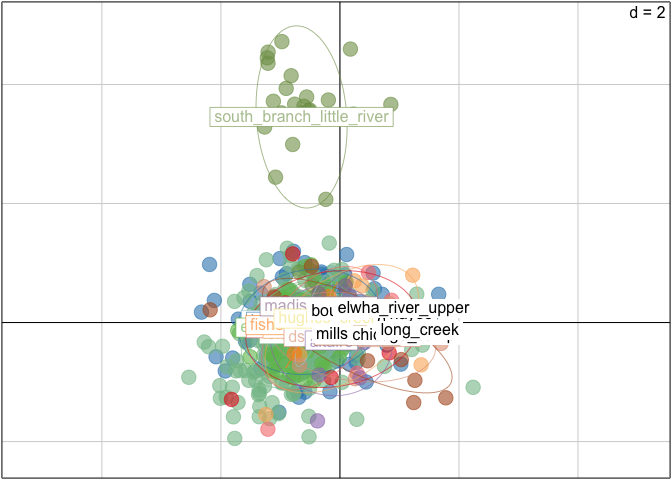
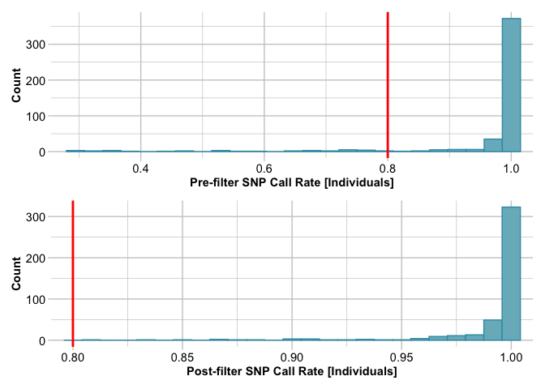
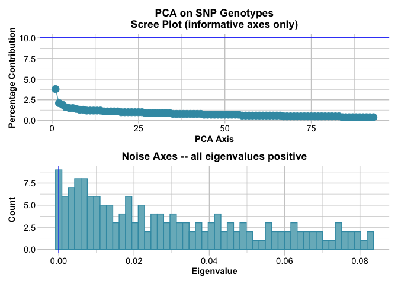

steelhead_PCA_LEA
================
Kimberly Ledger
4/12/2022

# looking at O.mykiss population structure using all non-outlier loci

load libraries

``` r
library(adegenet) #this package is used for analysis of genetic/genomic data 
library(dplyr) # data manipulation
library(tidyr) # data manipulation
library(forcats)
```

# Part 1: create genind objects

``` r
onmy_n_df <- read.csv("outputs/my_nonoutlierloci.csv")
```

## create a genind object for all samples using time/location as population

``` r
geno_n <- onmy_n_df[,c(2:316)]
rownames(geno_n) <- onmy_n_df$Sample_ID
col_geno_n <- gsub("\\.", "_", colnames(geno_n))
colnames(geno_n) <- col_geno_n

meta_n <- onmy_n_df[,-c(1:316)]

loci <- colnames(geno_n)
ind <- rownames(geno_n)
location <- meta_n$Location
time <- meta_n$Time
tp <- meta_n$Time_Location

onmy_genind_tp <- df2genind(geno_n,
                         sep="/",
                         ind.names=ind,
                         loc.names=loci, 
                         pop = tp,
                         ploidy = 2)
onmy_genind_tp
```

    ## /// GENIND OBJECT /////////
    ## 
    ##  // 1,380 individuals; 315 loci; 630 alleles; size: 3.6 Mb
    ## 
    ##  // Basic content
    ##    @tab:  1380 x 630 matrix of allele counts
    ##    @loc.n.all: number of alleles per locus (range: 2-2)
    ##    @loc.fac: locus factor for the 630 columns of @tab
    ##    @all.names: list of allele names for each locus
    ##    @ploidy: ploidy of each individual  (range: 2-2)
    ##    @type:  codom
    ##    @call: df2genind(X = geno_n, sep = "/", ind.names = ind, loc.names = loci, 
    ##     pop = tp, ploidy = 2)
    ## 
    ##  // Optional content
    ##    @pop: population of each individual (group size range: 24-414)

here i will subset PRE, DURING, and POST dam individuals

``` r
geno_pre <- onmy_n_df %>%
  filter(Time == "Pre") %>%
  dplyr::mutate(Location = fct_relevel(Location, "BD", "SBLR", "ID", "AD")) %>% 
  arrange(Location, rkm)

geno_during <- onmy_n_df %>%
  filter(Time == "During") %>%
  arrange(Location, rkm)

geno_post <- onmy_n_df %>%
  filter(Time == "Post") %>%
  dplyr::mutate(Location = fct_relevel(Location, "BD", "SBLR", "ID", "AD")) %>% 
  arrange(Location, rkm)
```

## create genind objects from pre and post dam samples (during excluded because there are few)

``` r
geno_n_pre <- geno_pre[,c(2:316)]
rownames(geno_n_pre) <- geno_pre$Sample_ID
col_geno_n_pre <- gsub("\\.", "_", colnames(geno_n_pre))
colnames(geno_n_pre) <- col_geno_n_pre

meta_pre <- geno_pre[,-c(1:316)]

pre_loci <- colnames(geno_n_pre)
pre_ind <- rownames(geno_n_pre)
pre_location <- meta_pre$Location
pre_rkm <- meta_pre$rkm
pre_site <- meta_pre$Sampling_Site

onmy_genind_pre_location <- df2genind(geno_n_pre,
                         sep="/",
                         ind.names=pre_ind,
                         loc.names=pre_loci, 
                         pop = pre_location,     
                         ploidy = 2)
onmy_genind_pre_site <- df2genind(geno_n_pre,
                         sep="/",
                         ind.names=pre_ind,
                         loc.names=pre_loci, 
                         pop = pre_site,      
                         ploidy = 2)
onmy_genind_pre_location
```

    ## /// GENIND OBJECT /////////
    ## 
    ##  // 462 individuals; 315 loci; 624 alleles; size: 1.3 Mb
    ## 
    ##  // Basic content
    ##    @tab:  462 x 624 matrix of allele counts
    ##    @loc.n.all: number of alleles per locus (range: 1-2)
    ##    @loc.fac: locus factor for the 624 columns of @tab
    ##    @all.names: list of allele names for each locus
    ##    @ploidy: ploidy of each individual  (range: 2-2)
    ##    @type:  codom
    ##    @call: df2genind(X = geno_n_pre, sep = "/", ind.names = pre_ind, loc.names = pre_loci, 
    ##     pop = pre_location, ploidy = 2)
    ## 
    ##  // Optional content
    ##    @pop: population of each individual (group size range: 78-153)

``` r
onmy_genind_pre_site
```

    ## /// GENIND OBJECT /////////
    ## 
    ##  // 462 individuals; 315 loci; 624 alleles; size: 1.3 Mb
    ## 
    ##  // Basic content
    ##    @tab:  462 x 624 matrix of allele counts
    ##    @loc.n.all: number of alleles per locus (range: 1-2)
    ##    @loc.fac: locus factor for the 624 columns of @tab
    ##    @all.names: list of allele names for each locus
    ##    @ploidy: ploidy of each individual  (range: 2-2)
    ##    @type:  codom
    ##    @call: df2genind(X = geno_n_pre, sep = "/", ind.names = pre_ind, loc.names = pre_loci, 
    ##     pop = pre_site, ploidy = 2)
    ## 
    ##  // Optional content
    ##    @pop: population of each individual (group size range: 12-84)

``` r
geno_n_post <- geno_post[,c(2:316)]
rownames(geno_n_post) <- geno_post$Sample_ID
col_geno_n_post <- gsub("\\.", "_", colnames(geno_n_post))
colnames(geno_n_post) <- col_geno_n_post

meta_post <- geno_post[,-c(1:316)]

post_loci <- colnames(geno_n_post)
post_ind <- rownames(geno_n_post)
post_location <- meta_post$Location
post_rkm <- meta_post$rkm
post_site <- meta_post$Sampling_Site

onmy_genind_post_location <- df2genind(geno_n_post,
                         sep="/",
                         ind.names=post_ind,
                         loc.names=post_loci, 
                         pop = post_location,
                         ploidy = 2)

onmy_genind_post_site <- df2genind(geno_n_post,
                         sep="/",
                         ind.names=post_ind,
                         loc.names=post_loci, 
                         pop = post_site,
                         ploidy = 2)
onmy_genind_post_location
```

    ## /// GENIND OBJECT /////////
    ## 
    ##  // 875 individuals; 315 loci; 627 alleles; size: 2.4 Mb
    ## 
    ##  // Basic content
    ##    @tab:  875 x 627 matrix of allele counts
    ##    @loc.n.all: number of alleles per locus (range: 1-2)
    ##    @loc.fac: locus factor for the 627 columns of @tab
    ##    @all.names: list of allele names for each locus
    ##    @ploidy: ploidy of each individual  (range: 2-2)
    ##    @type:  codom
    ##    @call: df2genind(X = geno_n_post, sep = "/", ind.names = post_ind, loc.names = post_loci, 
    ##     pop = post_location, ploidy = 2)
    ## 
    ##  // Optional content
    ##    @pop: population of each individual (group size range: 24-414)

``` r
onmy_genind_post_site
```

    ## /// GENIND OBJECT /////////
    ## 
    ##  // 875 individuals; 315 loci; 627 alleles; size: 2.4 Mb
    ## 
    ##  // Basic content
    ##    @tab:  875 x 627 matrix of allele counts
    ##    @loc.n.all: number of alleles per locus (range: 1-2)
    ##    @loc.fac: locus factor for the 627 columns of @tab
    ##    @all.names: list of allele names for each locus
    ##    @ploidy: ploidy of each individual  (range: 2-2)
    ##    @type:  codom
    ##    @call: df2genind(X = geno_n_post, sep = "/", ind.names = post_ind, loc.names = post_loci, 
    ##     pop = post_site, ploidy = 2)
    ## 
    ##  // Optional content
    ##    @pop: population of each individual (group size range: 1-259)

# Part 2: Hardy-Weinberg equilibrium

## check for deviations from hardy-weinberg equilibrium at the population level - TIME/LOCATION AS POP

``` r
onmy_neutral_hw_test <- data.frame(sapply(seppop(onmy_genind_tp), 
                              function(ls) pegas::hw.test(ls, B = 0)[,3])) #skipping permutation test
```

    ## Warning: There are individuals with missing population information in the data
    ## set. If you want to retain these, use the option `keepNA = TRUE`.

    ## Warning in hw.test.loci(x = x, B = B, ...): The following locus was ignored: NC_035094_1_36268423
    ## (not the same ploidy for all individuals, or too many missing data)

``` r
onmy_neutral_hw_chisq <- t(data.matrix(onmy_neutral_hw_test))

Chisq.fdr <- matrix(p.adjust(onmy_neutral_hw_chisq,method="fdr"), 
                    nrow=nrow(onmy_neutral_hw_chisq))

# proportion of loci out of HWE 
alpha=0.05
Prop.loci.out.of.HWE <- data.frame(Chisq=apply(onmy_neutral_hw_chisq<alpha, 2, mean),
                                   Chisq.fdr=apply(Chisq.fdr<alpha, 2, mean))
#Prop.loci.out.of.HWE %>%
#  filter(Chisq >= 0.5)
Prop.loci.out.of.HWE %>%
  filter(Chisq.fdr >= 0.5)
```

    ##                          Chisq Chisq.fdr
    ## NC_035086_1_30372084 1.0000000 1.0000000
    ## NC_035092_1_16334074 0.6666667 0.6666667
    ## NC_035092_1_44116456 1.0000000 0.8888889
    ## NC_035080_1_68318464 0.7777778 0.7777778
    ## NC_035087_1_37031757 0.6666667 0.5555556
    ## NC_035091_1_44094440 0.6666667 0.6666667
    ## NC_035079_1_38336651 1.0000000 1.0000000
    ## NW_24                0.8888889 0.7777778

``` r
# for each population, the proportion of loci out of HWE
Prop.pops.out.of.HWE <- data.frame(Chisq=apply(onmy_neutral_hw_chisq<alpha, 1, mean), 
           Chisq.fdr=apply(Chisq.fdr<alpha, 1, mean))
Prop.pops.out.of.HWE             
```

    ##                Chisq  Chisq.fdr
    ## Pre_ID    0.23809524 0.10476190
    ## Pre_SBLR  0.12063492 0.05396825
    ## Pre_AD    0.16190476 0.06031746
    ## Pre_BD    0.08571429 0.02857143
    ## During_BD         NA         NA
    ## Post_BD   0.15873016 0.08253968
    ## Post_ID   0.10476190 0.04444444
    ## Post_AD   0.20317460 0.12380952
    ## Post_SBLR 0.04126984 0.01587302

**8 loci** consistently out of HWE **no locations** consistently out of
HWE

## check for deviations from hardy-weinberg equilibrium at the population level - PRE-DAM samples with LOCATION AS POP

``` r
onmy_neutral_hw_test <- data.frame(sapply(seppop(onmy_genind_pre_location), 
                              function(ls) pegas::hw.test(ls, B = 0)[,3])) #skipping permutation test

onmy_neutral_hw_chisq <- t(data.matrix(onmy_neutral_hw_test))

Chisq.fdr <- matrix(p.adjust(onmy_neutral_hw_chisq,method="fdr"), 
                    nrow=nrow(onmy_neutral_hw_chisq))

# proportion of loci out of HWE 
alpha=0.05
Prop.loci.out.of.HWE <- data.frame(Chisq=apply(onmy_neutral_hw_chisq<alpha, 2, mean),
                                   Chisq.fdr=apply(Chisq.fdr<alpha, 2, mean))
#Prop.loci.out.of.HWE %>%
#  filter(Chisq >= 0.5)
Prop.loci.out.of.HWE %>%
  filter(Chisq.fdr >= 0.5)
```

    ##                      Chisq Chisq.fdr
    ## NC_035086_1_30372084  1.00      1.00
    ## NC_035092_1_16334074  0.75      0.75
    ## NC_035092_1_44116456  1.00      1.00
    ## NC_035092_1_46432462  0.50      0.50
    ## NC_035103_1_23730945  0.50      0.50
    ## NC_035083_1_57239957  0.75      0.75
    ## NC_035080_1_68318464  1.00      1.00
    ## NC_035095_1_23702093  0.75      0.50
    ## NC_035081_1_40927121  0.75      0.75
    ## NC_035087_1_37031757  0.75      0.75
    ## NC_035091_1_44094440  0.75      0.75
    ## NC_035093_1_41462973  0.50      0.50
    ## NC_035093_1_64697703  0.50      0.50
    ## NC_035078_1_54044836  0.75      0.50
    ## NC_035078_1_67119313  0.50      0.50
    ## NC_035079_1_38336651  1.00      1.00
    ## NC_035085_1_36338472  0.75      0.50
    ## NW_24                 1.00      1.00

``` r
# for each population, the proportion of loci out of HWE
Prop.pops.out.of.HWE <- data.frame(Chisq=apply(onmy_neutral_hw_chisq<alpha, 1, mean), 
           Chisq.fdr=apply(Chisq.fdr<alpha, 1, mean))
Prop.pops.out.of.HWE             
```

    ##           Chisq  Chisq.fdr
    ## BD   0.08571429 0.03174603
    ## SBLR 0.12063492 0.05396825
    ## ID   0.23809524 0.10476190
    ## AD   0.16190476 0.06031746

## check for deviations from hardy-weinberg equilibrium at the population level - POST-DAM samples with LOCATION AS POP

``` r
onmy_neutral_hw_test <- data.frame(sapply(seppop(onmy_genind_post_location), 
                              function(ls) pegas::hw.test(ls, B = 0)[,3])) #skipping permutation test

onmy_neutral_hw_chisq <- t(data.matrix(onmy_neutral_hw_test))

Chisq.fdr <- matrix(p.adjust(onmy_neutral_hw_chisq,method="fdr"), 
                    nrow=nrow(onmy_neutral_hw_chisq))

# proportion of loci out of HWE 
alpha=0.05
Prop.loci.out.of.HWE <- data.frame(Chisq=apply(onmy_neutral_hw_chisq<alpha, 2, mean),
                                   Chisq.fdr=apply(Chisq.fdr<alpha, 2, mean))
#Prop.loci.out.of.HWE %>%
#  filter(Chisq >= 0.5)
Prop.loci.out.of.HWE %>%
  filter(Chisq.fdr >= 0.5)
```

    ##                      Chisq Chisq.fdr
    ## NC_035086_1_30372084  1.00      1.00
    ## NC_035086_1_63650747  0.50      0.50
    ## NC_035092_1_16334074  0.75      0.75
    ## NC_035092_1_44116456  1.00      0.75
    ## NC_035092_1_46432462  0.75      0.50
    ## NC_035103_1_23730945  0.50      0.50
    ## NC_035099_1_10095418  0.50      0.50
    ## NC_035083_1_19036977  0.50      0.50
    ## NC_035080_1_68318464  0.75      0.75
    ## NC_035095_1_23702093  0.50      0.50
    ## NC_035081_1_61772669  0.75      0.75
    ## NC_035087_1_37031757  0.75      0.50
    ## NC_035091_1_44094440  0.75      0.75
    ## NC_035093_1_14488587  0.50      0.50
    ## NC_035093_1_20693754  0.75      0.50
    ## NC_035093_1_41462973  0.75      0.50
    ## NC_035082_1_51490760  0.50      0.50
    ## NC_035078_1_38922611  0.75      0.50
    ## NC_035078_1_52384497  0.75      0.75
    ## NC_035078_1_54044836  0.75      0.50
    ## NC_035079_1_38336651  1.00      1.00
    ## NC_035104_1_11607954  0.50      0.50
    ## NC_035098_1_24247865  0.50      0.50
    ## NW_24                 0.75      0.75

``` r
# for each population, the proportion of loci out of HWE
Prop.pops.out.of.HWE <- data.frame(Chisq=apply(onmy_neutral_hw_chisq<alpha, 1, mean), 
           Chisq.fdr=apply(Chisq.fdr<alpha, 1, mean))
Prop.pops.out.of.HWE             
```

    ##           Chisq  Chisq.fdr
    ## BD   0.15873016 0.08253968
    ## SBLR 0.04126984 0.01587302
    ## ID   0.10476190 0.04761905
    ## AD   0.20317460 0.12380952

do we need to filter additional loci???

# Part 3: assessing population structure

## start with running PCAs using adegenet package and genind object with all individuals

extract allele frequencies

``` r
x.onmy <- tab(onmy_genind_tp, freq = T, NA.method = "mean") 
```

``` r
pca.onmy <- dudi.pca(df = x.onmy, center = T, scale = F, scannf = FALSE, nf = 200)
```

pc1 vs pc2

``` r
s.class(pca.onmy$li, fac=pop(onmy_genind_tp),
        xax=1, yax=2, col=transp(funky(15),.6),
        axesel=FALSE, cstar=0, cpoint=3)
```

<!-- -->

pc2 v pc3

``` r
s.class(pca.onmy$li, fac=pop(onmy_genind_tp),
        xax=2, yax=3, col=transp(funky(15),.6),
        axesel=FALSE, cstar=0, cpoint=3)
```

<!-- -->

``` r
#add.scatter.eig(pca.onmy$eig[1:50],3,2,3, ratio=.3)
```

## PCAs using adegenet package and genind object with predam individuals by site

extract allele frequencies

``` r
pre.onmy_site <- tab(onmy_genind_pre_site, freq = T, NA.method = "mean") 
```

``` r
pca.onmy.pre_site <- dudi.pca(df = pre.onmy_site, center = T, scale = F, scannf = FALSE, nf = 200)
```

``` r
s.class(pca.onmy.pre_site$li, fac=pop(onmy_genind_pre_site),
        xax=1, yax=2, col=transp(funky(14),.6),
        axesel=FALSE, cstar=0, cpoint=3)
```

<!-- -->

``` r
#pca.legend(pca.onmy.pre, groups = pre_site)
#add.scatter.eig(pca.onmy.pre$eig[1:50],3,1,2, ratio=.3)
```

## PCAs using adegenet package and genind object with predam individuals by location

extract allele frequencies

``` r
pre.onmy_location <- tab(onmy_genind_pre_location, freq = T, NA.method = "mean") 
```

``` r
pca.onmy.pre_location <- dudi.pca(df = pre.onmy_location, center = T, scale = F, scannf = FALSE, nf = 200)
```

``` r
s.class(pca.onmy.pre_location$li, fac=pop(onmy_genind_pre_location),
        xax=1, yax=2, col=transp(c("blue", "darkgreen", "orange", "red"),.6),
        axesel=FALSE, cstar=0, cpoint=3)
```

<!-- -->

## PCAs using adegenet package and genind object with postdam individuals by site

extract allele frequencies

``` r
post.onmy_site <- tab(onmy_genind_post_site, freq = T, NA.method = "mean") 
```

``` r
pca.onmy.post_site <- dudi.pca(df = post.onmy_site, center = T, scale = F, scannf = FALSE, nf = 200)
```

``` r
s.class(pca.onmy.post_site$li, fac=pop(onmy_genind_post_site),
        xax=1, yax=2, col=transp(funky(14),.6),
        axesel=FALSE, cstar=0, cpoint=3)
```

<!-- -->

``` r
#add.scatter.eig(pca.onmy.post$eig[1:50],3,1,2, ratio=.3)
```

## PCAs using adegenet package and genind object with postdam individuals by location

extract allele frequencies

``` r
post.onmy_location <- tab(onmy_genind_post_location, freq = T, NA.method = "mean") 
```

``` r
pca.onmy.post_location <- dudi.pca(df = post.onmy_location, center = T, scale = F, scannf = FALSE, nf = 200)
```

``` r
s.class(pca.onmy.post_location$li, fac=pop(onmy_genind_post_location),
        xax=1, yax=2, col=transp(c("blue", "darkgreen", "orange", "red"), .6),
        axesel=FALSE, cstar=0, cpoint=3)
```

<!-- -->

``` r
#add.scatter.eig(pca.onmy.post$eig[1:50],3,1,2, ratio=.3)
```

# Part 4: convet genind to genlight objects

``` r
#install_github("green-striped-gecko/dartR")
library(dartR)

genlit_all <- gi2gl(onmy_genind_tp)
```

    ## Starting gi2gl 
    ## Starting gl.compliance.check 
    ##   Processing genlight object with SNP data
    ##   Checking coding of SNPs
    ##     SNP data scored NA, 0, 1 or 2 confirmed
    ##   Checking locus metrics and flags
    ##   Recalculating locus metrics
    ##   Checking for monomorphic loci
    ##     No monomorphic loci detected
    ##   Checking whether individual names are unique.
    ##   Checking for individual metrics
    ##   Warning: Creating a slot for individual metrics
    ##   Checking for population assignments
    ##     Population assignments confirmed
    ##   Spelling of coordinates checked and changed if necessary to lat/lon
    ## Completed: gl.compliance.check 
    ## Completed: gi2gl

``` r
genlit_pre_site <- gi2gl(onmy_genind_pre_site)
```

    ## Starting gi2gl 
    ## Starting gl.compliance.check 
    ##   Processing genlight object with SNP data
    ##   Checking coding of SNPs
    ##     SNP data scored NA, 0, 1 or 2 confirmed
    ##   Checking locus metrics and flags
    ##   Recalculating locus metrics
    ##   Checking for monomorphic loci
    ##     Dataset contains monomorphic loci
    ##   Checking whether individual names are unique.
    ##   Checking for individual metrics
    ##   Warning: Creating a slot for individual metrics
    ##   Checking for population assignments
    ##     Population assignments confirmed
    ##   Spelling of coordinates checked and changed if necessary to lat/lon
    ## Completed: gl.compliance.check 
    ## Completed: gi2gl

``` r
genlit_pre_location <- gi2gl(onmy_genind_pre_location)
```

    ## Starting gi2gl 
    ## Starting gl.compliance.check 
    ##   Processing genlight object with SNP data
    ##   Checking coding of SNPs
    ##     SNP data scored NA, 0, 1 or 2 confirmed
    ##   Checking locus metrics and flags
    ##   Recalculating locus metrics
    ##   Checking for monomorphic loci
    ##     Dataset contains monomorphic loci
    ##   Checking whether individual names are unique.
    ##   Checking for individual metrics
    ##   Warning: Creating a slot for individual metrics
    ##   Checking for population assignments
    ##     Population assignments confirmed
    ##   Spelling of coordinates checked and changed if necessary to lat/lon
    ## Completed: gl.compliance.check 
    ## Completed: gi2gl

``` r
genlit_post_site <- gi2gl(onmy_genind_post_site)
```

    ## Starting gi2gl 
    ## Starting gl.compliance.check 
    ##   Processing genlight object with SNP data
    ##   Checking coding of SNPs
    ##     SNP data scored NA, 0, 1 or 2 confirmed
    ##   Checking locus metrics and flags
    ##   Recalculating locus metrics
    ##   Checking for monomorphic loci
    ##     Dataset contains monomorphic loci
    ##   Checking whether individual names are unique.
    ##   Checking for individual metrics
    ##   Warning: Creating a slot for individual metrics
    ##   Checking for population assignments
    ##     Population assignments confirmed
    ##   Spelling of coordinates checked and changed if necessary to lat/lon
    ## Completed: gl.compliance.check 
    ## Completed: gi2gl

``` r
genlit_post_location <- gi2gl(onmy_genind_post_location)
```

    ## Starting gi2gl 
    ## Starting gl.compliance.check 
    ##   Processing genlight object with SNP data
    ##   Checking coding of SNPs
    ##     SNP data scored NA, 0, 1 or 2 confirmed
    ##   Checking locus metrics and flags
    ##   Recalculating locus metrics
    ##   Checking for monomorphic loci
    ##     Dataset contains monomorphic loci
    ##   Checking whether individual names are unique.
    ##   Checking for individual metrics
    ##   Warning: Creating a slot for individual metrics
    ##   Checking for population assignments
    ##     Population assignments confirmed
    ##   Spelling of coordinates checked and changed if necessary to lat/lon
    ## Completed: gl.compliance.check 
    ## Completed: gi2gl

# consider filtering genlight objects prior to running a PCA or PCoA?

prep for pca (a) Filter stringently on call rate, using a threshold of
at least 95% loci called. (b) Remove individuals for which call rate is
exceptionally low, say \<80%. (c) Impute the remaining missing values on
a population‐by‐population basis, where populations can be considered
panmictic.

``` r
genlit_filter <- gl.filter.callrate(genlit_pre_site, method="loc", threshold=0.90)
```

    ## Starting gl.filter.callrate 
    ##   Processing genlight object with SNP data
    ##   Warning: Data may include monomorphic loci in call rate calculations for filtering
    ##   Recalculating Call Rate
    ##   Removing loci based on Call Rate, threshold = 0.9

<!-- -->

    ## Completed: gl.filter.callrate

``` r
genlit_filter <- gl.filter.callrate(genlit_filter, method="ind", threshold=0.80)
```

    ## Starting gl.filter.callrate 
    ##   Processing genlight object with SNP data
    ##   Warning: Data may include monomorphic loci in call rate calculations for filtering
    ##   Recalculating Call Rate
    ##   Removing individuals based on Call Rate, threshold = 0.8 
    ##   Individuals deleted (CallRate <=  0.8 ):
    ## 33869_C17_01[elwha_river_lower], 34261_T1_007[elwha_river_lower], 34261_T14_014[elwha_river_lower], 34261_T2_054[elwha_river_lower], 34336_C2_008[elwha_river_lower], 34336_C5_015[elwha_river_lower], 34336_C5_016[elwha_river_lower], 34336_C6_007[elwha_river_lower], 34336_C7_005[elwha_river_lower], 34942_034[elwha_river_lower], 34942_050[elwha_river_lower], 50824_062[elwha_river_lower], 51254_C2_029[elwha_river_lower], 51254_C5_001[elwha_river_lower], 51254_C6_027[elwha_river_lower], 51524_C6_057[elwha_river_lower], 33651_124[south_branch_little_river], 33651_127[south_branch_little_river], 33651_128[south_branch_little_river], 33651_131[south_branch_little_river], 33651_133[south_branch_little_river], 33651_138[south_branch_little_river], 33651_139[south_branch_little_river], 33651_140[south_branch_little_river], 33651_141[south_branch_little_river], 33651_143[south_branch_little_river], 33651_144[south_branch_little_river], 33694_093[altaire], 33649_31[little_river], 33649_48[little_river], 34185_005[whiskey_bend], 33696_011[elkhorn], 33697_007[hayes], 34748_ELWH_07_ONMY_9_073[wilder],

<!-- -->

    ##   Note: Locus metrics not recalculated
    ##   Note: Resultant monomorphic loci not deleted
    ## Completed: gl.filter.callrate

``` r
genlit_filter <- gl.impute(genlit_filter, method="random")
```

    ## Starting gl.impute 
    ##   Processing genlight object with SNP data
    ##   Residual missing values were filled randomly drawing from the global allele profiles by locus
    ## Completed: gl.impute

``` r
pcoa <- gl.pcoa(genlit_filter)
```

    ## Starting gl.pcoa 
    ##   Processing genlight object with SNP data
    ##   Warning: Number of loci is less than the number of individuals to be represented
    ##   Performing a PCA, individuals as entities, loci as attributes, SNP genotype as state

<!-- -->

    ## Completed: gl.pcoa

this is for pre-dam samples only

``` r
library(directlabels)
gl.pcoa.plot(pcoa, genlit_filter, xaxis = 1, yaxis =2, ellipse = TRUE, plevel = 0.9)
```

    ## Starting gl.pcoa.plot 
    ##   Processing an ordination file (glPca)
    ##   Processing genlight object with SNP data
    ##   Plotting populations in a space defined by the SNPs
    ##   Preparing plot .... please wait

<!-- -->

    ## Completed: gl.pcoa.plot

##PCA using filtered genlight object

``` r
pca <- glPca(genlit_filter, center = T, scale = F, nf = 50)
s.class(pca$scores, pop(genlit_filter),
        xax=1, yax=2, col=transp(funky(14),.6),
        axesel=FALSE, cstar=0, cpoint=3)
```

<!-- -->

filtering the genlight object does not seem to make a big difference…

# Part 5: STRUCTURE analyses

## Clustering with SNMF (similar to ‘STRUCTURE’)

this uses the package LEA

``` r
library('LEA')
```

### convert the genlight object to geno - will work with pre and post dam individuals seperately

``` r
geno_pre <- gl2geno(genlit_pre_location, outfile = "gl_geno_pre", outpath = "~/Desktop/LG_Proj4/Elwha_genetics/geno/")
```

    ## Starting gl2geno 
    ##   Processing genlight object with SNP data
    ##   Monomorphic alleles generated during conversion were removed. 
    ##   Output files: gl_geno_pre.geno.lfmm. 
    ## Completed: gl2geno

``` r
geno_post <- gl2geno(genlit_post_location, outfile = "gl_geno_post", outpath = "~/Desktop/LG_Proj4/Elwha_genetics/geno/")
```

    ## Starting gl2geno 
    ##   Processing genlight object with SNP data
    ##   Monomorphic alleles generated during conversion were removed. 
    ##   Output files: gl_geno_post.geno.lfmm. 
    ## Completed: gl2geno

## predam STRUCTURE only

estimate K

``` r
snmf2 <- LEA::snmf("~/Desktop/LG_Proj4/Elwha_genetics/geno/gl_geno_pre.geno", K=1:8, ploidy=2, entropy=T, 
                   alpha=100, project="new")
```

    ## The project is saved into :
    ##  geno/gl_geno_pre.snmfProject 
    ## 
    ## To load the project, use:
    ##  project = load.snmfProject("geno/gl_geno_pre.snmfProject")
    ## 
    ## To remove the project, use:
    ##  remove.snmfProject("geno/gl_geno_pre.snmfProject")
    ## 
    ## [1] 434231746
    ## [1] "*************************************"
    ## [1] "*          create.dataset            *"
    ## [1] "*************************************"
    ## summary of the options:
    ## 
    ##         -n (number of individuals)                 462
    ##         -L (number of loci)                        618
    ##         -s (seed random init)                      434231746
    ##         -r (percentage of masked data)             0.05
    ##         -x (genotype file in .geno format)         /Users/kim/Desktop/LG_Proj4/Elwha_genetics/geno/gl_geno_pre.geno
    ##         -o (output file in .geno format)           /Users/kim/Desktop/LG_Proj4/Elwha_genetics/geno/gl_geno_pre.snmf/masked/gl_geno_pre_I.geno
    ## 
    ##  Write genotype file with masked data, /Users/kim/Desktop/LG_Proj4/Elwha_genetics/geno/gl_geno_pre.snmf/masked/gl_geno_pre_I.geno:       OK.
    ## 
    ## [1] "*************************************"
    ## [1] "* sNMF K = 1  repetition 1      *"
    ## [1] "*************************************"
    ## summary of the options:
    ## 
    ##         -n (number of individuals)             462
    ##         -L (number of loci)                    618
    ##         -K (number of ancestral pops)          1
    ##         -x (input file)                        /Users/kim/Desktop/LG_Proj4/Elwha_genetics/geno/gl_geno_pre.snmf/masked/gl_geno_pre_I.geno
    ##         -q (individual admixture file)         /Users/kim/Desktop/LG_Proj4/Elwha_genetics/geno/gl_geno_pre.snmf/K1/run1/gl_geno_pre_r1.1.Q
    ##         -g (ancestral frequencies file)        /Users/kim/Desktop/LG_Proj4/Elwha_genetics/geno/gl_geno_pre.snmf/K1/run1/gl_geno_pre_r1.1.G
    ##         -i (number max of iterations)          200
    ##         -a (regularization parameter)          100
    ##         -s (seed random init)                  140402915137986
    ##         -e (tolerance error)                   1E-05
    ##         -p (number of processes)               1
    ##         - diploid
    ## 
    ## Read genotype file /Users/kim/Desktop/LG_Proj4/Elwha_genetics/geno/gl_geno_pre.snmf/masked/gl_geno_pre_I.geno:       OK.
    ## 
    ## 
    ## Main algorithm:
    ## 
    ## Least-square error: 125309.853045
    ## Write individual ancestry coefficient file /Users/kim/Desktop/LG_Proj4/Elwha_genetics/geno/gl_geno_pre.snmf/K1/run1/gl_geno_pre_r1.1.Q:      OK.
    ## Write ancestral allele frequency coefficient file /Users/kim/Desktop/LG_Proj4/Elwha_genetics/geno/gl_geno_pre.snmf/K1/run1/gl_geno_pre_r1.1.G:   OK.
    ## 
    ## [1] "*************************************"
    ## [1] "*    cross-entropy estimation       *"
    ## [1] "*************************************"
    ## summary of the options:
    ## 
    ##         -n (number of individuals)         462
    ##         -L (number of loci)                618
    ##         -K (number of ancestral pops)      1
    ##         -x (genotype file)                 /Users/kim/Desktop/LG_Proj4/Elwha_genetics/geno/gl_geno_pre.geno
    ##         -q (individual admixture)          /Users/kim/Desktop/LG_Proj4/Elwha_genetics/geno/gl_geno_pre.snmf/K1/run1/gl_geno_pre_r1.1.Q
    ##         -g (ancestral frequencies)         /Users/kim/Desktop/LG_Proj4/Elwha_genetics/geno/gl_geno_pre.snmf/K1/run1/gl_geno_pre_r1.1.G
    ##         -i (with masked genotypes)         /Users/kim/Desktop/LG_Proj4/Elwha_genetics/geno/gl_geno_pre.snmf/masked/gl_geno_pre_I.geno
    ##         - diploid
    ## 
    ## Cross-Entropy (all data):     0.731638
    ## Cross-Entropy (masked data):  0.736157
    ## The project is saved into :
    ##  geno/gl_geno_pre.snmfProject 
    ## 
    ## To load the project, use:
    ##  project = load.snmfProject("geno/gl_geno_pre.snmfProject")
    ## 
    ## To remove the project, use:
    ##  remove.snmfProject("geno/gl_geno_pre.snmfProject")
    ## 
    ## [1] "*************************************"
    ## [1] "* sNMF K = 2  repetition 1      *"
    ## [1] "*************************************"
    ## summary of the options:
    ## 
    ##         -n (number of individuals)             462
    ##         -L (number of loci)                    618
    ##         -K (number of ancestral pops)          2
    ##         -x (input file)                        /Users/kim/Desktop/LG_Proj4/Elwha_genetics/geno/gl_geno_pre.snmf/masked/gl_geno_pre_I.geno
    ##         -q (individual admixture file)         /Users/kim/Desktop/LG_Proj4/Elwha_genetics/geno/gl_geno_pre.snmf/K2/run1/gl_geno_pre_r1.2.Q
    ##         -g (ancestral frequencies file)        /Users/kim/Desktop/LG_Proj4/Elwha_genetics/geno/gl_geno_pre.snmf/K2/run1/gl_geno_pre_r1.2.G
    ##         -i (number max of iterations)          200
    ##         -a (regularization parameter)          100
    ##         -s (seed random init)                  4623382834011298242
    ##         -e (tolerance error)                   1E-05
    ##         -p (number of processes)               1
    ##         - diploid
    ## 
    ## Read genotype file /Users/kim/Desktop/LG_Proj4/Elwha_genetics/geno/gl_geno_pre.snmf/masked/gl_geno_pre_I.geno:       OK.
    ## 
    ## 
    ## Main algorithm:
    ##  [                                                                           ]
    ##  [=========================================]
    ## Number of iterations: 110
    ## 
    ## Least-square error: 123669.327271
    ## Write individual ancestry coefficient file /Users/kim/Desktop/LG_Proj4/Elwha_genetics/geno/gl_geno_pre.snmf/K2/run1/gl_geno_pre_r1.2.Q:      OK.
    ## Write ancestral allele frequency coefficient file /Users/kim/Desktop/LG_Proj4/Elwha_genetics/geno/gl_geno_pre.snmf/K2/run1/gl_geno_pre_r1.2.G:   OK.
    ## 
    ## [1] "*************************************"
    ## [1] "*    cross-entropy estimation       *"
    ## [1] "*************************************"
    ## summary of the options:
    ## 
    ##         -n (number of individuals)         462
    ##         -L (number of loci)                618
    ##         -K (number of ancestral pops)      2
    ##         -x (genotype file)                 /Users/kim/Desktop/LG_Proj4/Elwha_genetics/geno/gl_geno_pre.geno
    ##         -q (individual admixture)          /Users/kim/Desktop/LG_Proj4/Elwha_genetics/geno/gl_geno_pre.snmf/K2/run1/gl_geno_pre_r1.2.Q
    ##         -g (ancestral frequencies)         /Users/kim/Desktop/LG_Proj4/Elwha_genetics/geno/gl_geno_pre.snmf/K2/run1/gl_geno_pre_r1.2.G
    ##         -i (with masked genotypes)         /Users/kim/Desktop/LG_Proj4/Elwha_genetics/geno/gl_geno_pre.snmf/masked/gl_geno_pre_I.geno
    ##         - diploid
    ## 
    ## Cross-Entropy (all data):     0.721175
    ## Cross-Entropy (masked data):  0.729993
    ## The project is saved into :
    ##  geno/gl_geno_pre.snmfProject 
    ## 
    ## To load the project, use:
    ##  project = load.snmfProject("geno/gl_geno_pre.snmfProject")
    ## 
    ## To remove the project, use:
    ##  remove.snmfProject("geno/gl_geno_pre.snmfProject")
    ## 
    ## [1] "*************************************"
    ## [1] "* sNMF K = 3  repetition 1      *"
    ## [1] "*************************************"
    ## summary of the options:
    ## 
    ##         -n (number of individuals)             462
    ##         -L (number of loci)                    618
    ##         -K (number of ancestral pops)          3
    ##         -x (input file)                        /Users/kim/Desktop/LG_Proj4/Elwha_genetics/geno/gl_geno_pre.snmf/masked/gl_geno_pre_I.geno
    ##         -q (individual admixture file)         /Users/kim/Desktop/LG_Proj4/Elwha_genetics/geno/gl_geno_pre.snmf/K3/run1/gl_geno_pre_r1.3.Q
    ##         -g (ancestral frequencies file)        /Users/kim/Desktop/LG_Proj4/Elwha_genetics/geno/gl_geno_pre.snmf/K3/run1/gl_geno_pre_r1.3.G
    ##         -i (number max of iterations)          200
    ##         -a (regularization parameter)          100
    ##         -s (seed random init)                  434231746
    ##         -e (tolerance error)                   1E-05
    ##         -p (number of processes)               1
    ##         - diploid
    ## 
    ## Read genotype file /Users/kim/Desktop/LG_Proj4/Elwha_genetics/geno/gl_geno_pre.snmf/masked/gl_geno_pre_I.geno:       OK.
    ## 
    ## 
    ## Main algorithm:
    ##  [                                                                           ]
    ##  [==========================]
    ## Number of iterations: 70
    ## 
    ## Least-square error: 121520.139566
    ## Write individual ancestry coefficient file /Users/kim/Desktop/LG_Proj4/Elwha_genetics/geno/gl_geno_pre.snmf/K3/run1/gl_geno_pre_r1.3.Q:      OK.
    ## Write ancestral allele frequency coefficient file /Users/kim/Desktop/LG_Proj4/Elwha_genetics/geno/gl_geno_pre.snmf/K3/run1/gl_geno_pre_r1.3.G:   OK.
    ## 
    ## [1] "*************************************"
    ## [1] "*    cross-entropy estimation       *"
    ## [1] "*************************************"
    ## summary of the options:
    ## 
    ##         -n (number of individuals)         462
    ##         -L (number of loci)                618
    ##         -K (number of ancestral pops)      3
    ##         -x (genotype file)                 /Users/kim/Desktop/LG_Proj4/Elwha_genetics/geno/gl_geno_pre.geno
    ##         -q (individual admixture)          /Users/kim/Desktop/LG_Proj4/Elwha_genetics/geno/gl_geno_pre.snmf/K3/run1/gl_geno_pre_r1.3.Q
    ##         -g (ancestral frequencies)         /Users/kim/Desktop/LG_Proj4/Elwha_genetics/geno/gl_geno_pre.snmf/K3/run1/gl_geno_pre_r1.3.G
    ##         -i (with masked genotypes)         /Users/kim/Desktop/LG_Proj4/Elwha_genetics/geno/gl_geno_pre.snmf/masked/gl_geno_pre_I.geno
    ##         - diploid
    ## 
    ## Cross-Entropy (all data):     0.705592
    ## Cross-Entropy (masked data):  0.720051
    ## The project is saved into :
    ##  geno/gl_geno_pre.snmfProject 
    ## 
    ## To load the project, use:
    ##  project = load.snmfProject("geno/gl_geno_pre.snmfProject")
    ## 
    ## To remove the project, use:
    ##  remove.snmfProject("geno/gl_geno_pre.snmfProject")
    ## 
    ## [1] "*************************************"
    ## [1] "* sNMF K = 4  repetition 1      *"
    ## [1] "*************************************"
    ## summary of the options:
    ## 
    ##         -n (number of individuals)             462
    ##         -L (number of loci)                    618
    ##         -K (number of ancestral pops)          4
    ##         -x (input file)                        /Users/kim/Desktop/LG_Proj4/Elwha_genetics/geno/gl_geno_pre.snmf/masked/gl_geno_pre_I.geno
    ##         -q (individual admixture file)         /Users/kim/Desktop/LG_Proj4/Elwha_genetics/geno/gl_geno_pre.snmf/K4/run1/gl_geno_pre_r1.4.Q
    ##         -g (ancestral frequencies file)        /Users/kim/Desktop/LG_Proj4/Elwha_genetics/geno/gl_geno_pre.snmf/K4/run1/gl_geno_pre_r1.4.G
    ##         -i (number max of iterations)          200
    ##         -a (regularization parameter)          100
    ##         -s (seed random init)                  140402915137986
    ##         -e (tolerance error)                   1E-05
    ##         -p (number of processes)               1
    ##         - diploid
    ## 
    ## Read genotype file /Users/kim/Desktop/LG_Proj4/Elwha_genetics/geno/gl_geno_pre.snmf/masked/gl_geno_pre_I.geno:       OK.
    ## 
    ## 
    ## Main algorithm:
    ##  [                                                                           ]
    ##  [================]
    ## Number of iterations: 44
    ## 
    ## Least-square error: 120428.966415
    ## Write individual ancestry coefficient file /Users/kim/Desktop/LG_Proj4/Elwha_genetics/geno/gl_geno_pre.snmf/K4/run1/gl_geno_pre_r1.4.Q:      OK.
    ## Write ancestral allele frequency coefficient file /Users/kim/Desktop/LG_Proj4/Elwha_genetics/geno/gl_geno_pre.snmf/K4/run1/gl_geno_pre_r1.4.G:   OK.
    ## 
    ## [1] "*************************************"
    ## [1] "*    cross-entropy estimation       *"
    ## [1] "*************************************"
    ## summary of the options:
    ## 
    ##         -n (number of individuals)         462
    ##         -L (number of loci)                618
    ##         -K (number of ancestral pops)      4
    ##         -x (genotype file)                 /Users/kim/Desktop/LG_Proj4/Elwha_genetics/geno/gl_geno_pre.geno
    ##         -q (individual admixture)          /Users/kim/Desktop/LG_Proj4/Elwha_genetics/geno/gl_geno_pre.snmf/K4/run1/gl_geno_pre_r1.4.Q
    ##         -g (ancestral frequencies)         /Users/kim/Desktop/LG_Proj4/Elwha_genetics/geno/gl_geno_pre.snmf/K4/run1/gl_geno_pre_r1.4.G
    ##         -i (with masked genotypes)         /Users/kim/Desktop/LG_Proj4/Elwha_genetics/geno/gl_geno_pre.snmf/masked/gl_geno_pre_I.geno
    ##         - diploid
    ## 
    ## Cross-Entropy (all data):     0.698838
    ## Cross-Entropy (masked data):  0.717875
    ## The project is saved into :
    ##  geno/gl_geno_pre.snmfProject 
    ## 
    ## To load the project, use:
    ##  project = load.snmfProject("geno/gl_geno_pre.snmfProject")
    ## 
    ## To remove the project, use:
    ##  remove.snmfProject("geno/gl_geno_pre.snmfProject")
    ## 
    ## [1] "*************************************"
    ## [1] "* sNMF K = 5  repetition 1      *"
    ## [1] "*************************************"
    ## summary of the options:
    ## 
    ##         -n (number of individuals)             462
    ##         -L (number of loci)                    618
    ##         -K (number of ancestral pops)          5
    ##         -x (input file)                        /Users/kim/Desktop/LG_Proj4/Elwha_genetics/geno/gl_geno_pre.snmf/masked/gl_geno_pre_I.geno
    ##         -q (individual admixture file)         /Users/kim/Desktop/LG_Proj4/Elwha_genetics/geno/gl_geno_pre.snmf/K5/run1/gl_geno_pre_r1.5.Q
    ##         -g (ancestral frequencies file)        /Users/kim/Desktop/LG_Proj4/Elwha_genetics/geno/gl_geno_pre.snmf/K5/run1/gl_geno_pre_r1.5.G
    ##         -i (number max of iterations)          200
    ##         -a (regularization parameter)          100
    ##         -s (seed random init)                  140402915137986
    ##         -e (tolerance error)                   1E-05
    ##         -p (number of processes)               1
    ##         - diploid
    ## 
    ## Read genotype file /Users/kim/Desktop/LG_Proj4/Elwha_genetics/geno/gl_geno_pre.snmf/masked/gl_geno_pre_I.geno:       OK.
    ## 
    ## 
    ## Main algorithm:
    ##  [                                                                           ]
    ##  [========]
    ## Number of iterations: 21
    ## 
    ## Least-square error: 119369.895957
    ## Write individual ancestry coefficient file /Users/kim/Desktop/LG_Proj4/Elwha_genetics/geno/gl_geno_pre.snmf/K5/run1/gl_geno_pre_r1.5.Q:      OK.
    ## Write ancestral allele frequency coefficient file /Users/kim/Desktop/LG_Proj4/Elwha_genetics/geno/gl_geno_pre.snmf/K5/run1/gl_geno_pre_r1.5.G:   OK.
    ## 
    ## [1] "*************************************"
    ## [1] "*    cross-entropy estimation       *"
    ## [1] "*************************************"
    ## summary of the options:
    ## 
    ##         -n (number of individuals)         462
    ##         -L (number of loci)                618
    ##         -K (number of ancestral pops)      5
    ##         -x (genotype file)                 /Users/kim/Desktop/LG_Proj4/Elwha_genetics/geno/gl_geno_pre.geno
    ##         -q (individual admixture)          /Users/kim/Desktop/LG_Proj4/Elwha_genetics/geno/gl_geno_pre.snmf/K5/run1/gl_geno_pre_r1.5.Q
    ##         -g (ancestral frequencies)         /Users/kim/Desktop/LG_Proj4/Elwha_genetics/geno/gl_geno_pre.snmf/K5/run1/gl_geno_pre_r1.5.G
    ##         -i (with masked genotypes)         /Users/kim/Desktop/LG_Proj4/Elwha_genetics/geno/gl_geno_pre.snmf/masked/gl_geno_pre_I.geno
    ##         - diploid
    ## 
    ## Cross-Entropy (all data):     0.690248
    ## Cross-Entropy (masked data):  0.714901
    ## The project is saved into :
    ##  geno/gl_geno_pre.snmfProject 
    ## 
    ## To load the project, use:
    ##  project = load.snmfProject("geno/gl_geno_pre.snmfProject")
    ## 
    ## To remove the project, use:
    ##  remove.snmfProject("geno/gl_geno_pre.snmfProject")
    ## 
    ## [1] "*************************************"
    ## [1] "* sNMF K = 6  repetition 1      *"
    ## [1] "*************************************"
    ## summary of the options:
    ## 
    ##         -n (number of individuals)             462
    ##         -L (number of loci)                    618
    ##         -K (number of ancestral pops)          6
    ##         -x (input file)                        /Users/kim/Desktop/LG_Proj4/Elwha_genetics/geno/gl_geno_pre.snmf/masked/gl_geno_pre_I.geno
    ##         -q (individual admixture file)         /Users/kim/Desktop/LG_Proj4/Elwha_genetics/geno/gl_geno_pre.snmf/K6/run1/gl_geno_pre_r1.6.Q
    ##         -g (ancestral frequencies file)        /Users/kim/Desktop/LG_Proj4/Elwha_genetics/geno/gl_geno_pre.snmf/K6/run1/gl_geno_pre_r1.6.G
    ##         -i (number max of iterations)          200
    ##         -a (regularization parameter)          100
    ##         -s (seed random init)                  140402915137986
    ##         -e (tolerance error)                   1E-05
    ##         -p (number of processes)               1
    ##         - diploid
    ## 
    ## Read genotype file /Users/kim/Desktop/LG_Proj4/Elwha_genetics/geno/gl_geno_pre.snmf/masked/gl_geno_pre_I.geno:       OK.
    ## 
    ## 
    ## Main algorithm:
    ##  [                                                                           ]
    ##  [===========================================================================]
    ## Number of iterations: 200
    ## 
    ## Least-square error: 118445.345853
    ## Write individual ancestry coefficient file /Users/kim/Desktop/LG_Proj4/Elwha_genetics/geno/gl_geno_pre.snmf/K6/run1/gl_geno_pre_r1.6.Q:      OK.
    ## Write ancestral allele frequency coefficient file /Users/kim/Desktop/LG_Proj4/Elwha_genetics/geno/gl_geno_pre.snmf/K6/run1/gl_geno_pre_r1.6.G:   OK.
    ## 
    ## [1] "*************************************"
    ## [1] "*    cross-entropy estimation       *"
    ## [1] "*************************************"
    ## summary of the options:
    ## 
    ##         -n (number of individuals)         462
    ##         -L (number of loci)                618
    ##         -K (number of ancestral pops)      6
    ##         -x (genotype file)                 /Users/kim/Desktop/LG_Proj4/Elwha_genetics/geno/gl_geno_pre.geno
    ##         -q (individual admixture)          /Users/kim/Desktop/LG_Proj4/Elwha_genetics/geno/gl_geno_pre.snmf/K6/run1/gl_geno_pre_r1.6.Q
    ##         -g (ancestral frequencies)         /Users/kim/Desktop/LG_Proj4/Elwha_genetics/geno/gl_geno_pre.snmf/K6/run1/gl_geno_pre_r1.6.G
    ##         -i (with masked genotypes)         /Users/kim/Desktop/LG_Proj4/Elwha_genetics/geno/gl_geno_pre.snmf/masked/gl_geno_pre_I.geno
    ##         - diploid
    ## 
    ## Cross-Entropy (all data):     0.68542
    ## Cross-Entropy (masked data):  0.718778
    ## The project is saved into :
    ##  geno/gl_geno_pre.snmfProject 
    ## 
    ## To load the project, use:
    ##  project = load.snmfProject("geno/gl_geno_pre.snmfProject")
    ## 
    ## To remove the project, use:
    ##  remove.snmfProject("geno/gl_geno_pre.snmfProject")
    ## 
    ## [1] "*************************************"
    ## [1] "* sNMF K = 7  repetition 1      *"
    ## [1] "*************************************"
    ## summary of the options:
    ## 
    ##         -n (number of individuals)             462
    ##         -L (number of loci)                    618
    ##         -K (number of ancestral pops)          7
    ##         -x (input file)                        /Users/kim/Desktop/LG_Proj4/Elwha_genetics/geno/gl_geno_pre.snmf/masked/gl_geno_pre_I.geno
    ##         -q (individual admixture file)         /Users/kim/Desktop/LG_Proj4/Elwha_genetics/geno/gl_geno_pre.snmf/K7/run1/gl_geno_pre_r1.7.Q
    ##         -g (ancestral frequencies file)        /Users/kim/Desktop/LG_Proj4/Elwha_genetics/geno/gl_geno_pre.snmf/K7/run1/gl_geno_pre_r1.7.G
    ##         -i (number max of iterations)          200
    ##         -a (regularization parameter)          100
    ##         -s (seed random init)                  140402915137986
    ##         -e (tolerance error)                   1E-05
    ##         -p (number of processes)               1
    ##         - diploid
    ## 
    ## Read genotype file /Users/kim/Desktop/LG_Proj4/Elwha_genetics/geno/gl_geno_pre.snmf/masked/gl_geno_pre_I.geno:       OK.
    ## 
    ## 
    ## Main algorithm:
    ##  [                                                                           ]
    ##  [=====================]
    ## Number of iterations: 57
    ## 
    ## Least-square error: 117366.203259
    ## Write individual ancestry coefficient file /Users/kim/Desktop/LG_Proj4/Elwha_genetics/geno/gl_geno_pre.snmf/K7/run1/gl_geno_pre_r1.7.Q:      OK.
    ## Write ancestral allele frequency coefficient file /Users/kim/Desktop/LG_Proj4/Elwha_genetics/geno/gl_geno_pre.snmf/K7/run1/gl_geno_pre_r1.7.G:   OK.
    ## 
    ## [1] "*************************************"
    ## [1] "*    cross-entropy estimation       *"
    ## [1] "*************************************"
    ## summary of the options:
    ## 
    ##         -n (number of individuals)         462
    ##         -L (number of loci)                618
    ##         -K (number of ancestral pops)      7
    ##         -x (genotype file)                 /Users/kim/Desktop/LG_Proj4/Elwha_genetics/geno/gl_geno_pre.geno
    ##         -q (individual admixture)          /Users/kim/Desktop/LG_Proj4/Elwha_genetics/geno/gl_geno_pre.snmf/K7/run1/gl_geno_pre_r1.7.Q
    ##         -g (ancestral frequencies)         /Users/kim/Desktop/LG_Proj4/Elwha_genetics/geno/gl_geno_pre.snmf/K7/run1/gl_geno_pre_r1.7.G
    ##         -i (with masked genotypes)         /Users/kim/Desktop/LG_Proj4/Elwha_genetics/geno/gl_geno_pre.snmf/masked/gl_geno_pre_I.geno
    ##         - diploid
    ## 
    ## Cross-Entropy (all data):     0.678905
    ## Cross-Entropy (masked data):  0.715396
    ## The project is saved into :
    ##  geno/gl_geno_pre.snmfProject 
    ## 
    ## To load the project, use:
    ##  project = load.snmfProject("geno/gl_geno_pre.snmfProject")
    ## 
    ## To remove the project, use:
    ##  remove.snmfProject("geno/gl_geno_pre.snmfProject")
    ## 
    ## [1] "*************************************"
    ## [1] "* sNMF K = 8  repetition 1      *"
    ## [1] "*************************************"
    ## summary of the options:
    ## 
    ##         -n (number of individuals)             462
    ##         -L (number of loci)                    618
    ##         -K (number of ancestral pops)          8
    ##         -x (input file)                        /Users/kim/Desktop/LG_Proj4/Elwha_genetics/geno/gl_geno_pre.snmf/masked/gl_geno_pre_I.geno
    ##         -q (individual admixture file)         /Users/kim/Desktop/LG_Proj4/Elwha_genetics/geno/gl_geno_pre.snmf/K8/run1/gl_geno_pre_r1.8.Q
    ##         -g (ancestral frequencies file)        /Users/kim/Desktop/LG_Proj4/Elwha_genetics/geno/gl_geno_pre.snmf/K8/run1/gl_geno_pre_r1.8.G
    ##         -i (number max of iterations)          200
    ##         -a (regularization parameter)          100
    ##         -s (seed random init)                  4617827293813922242
    ##         -e (tolerance error)                   1E-05
    ##         -p (number of processes)               1
    ##         - diploid
    ## 
    ## Read genotype file /Users/kim/Desktop/LG_Proj4/Elwha_genetics/geno/gl_geno_pre.snmf/masked/gl_geno_pre_I.geno:       OK.
    ## 
    ## 
    ## Main algorithm:
    ##  [                                                                           ]
    ##  [====================================================================]
    ## Number of iterations: 182
    ## 
    ## Least-square error: 116640.525063
    ## Write individual ancestry coefficient file /Users/kim/Desktop/LG_Proj4/Elwha_genetics/geno/gl_geno_pre.snmf/K8/run1/gl_geno_pre_r1.8.Q:      OK.
    ## Write ancestral allele frequency coefficient file /Users/kim/Desktop/LG_Proj4/Elwha_genetics/geno/gl_geno_pre.snmf/K8/run1/gl_geno_pre_r1.8.G:   OK.
    ## 
    ## [1] "*************************************"
    ## [1] "*    cross-entropy estimation       *"
    ## [1] "*************************************"
    ## summary of the options:
    ## 
    ##         -n (number of individuals)         462
    ##         -L (number of loci)                618
    ##         -K (number of ancestral pops)      8
    ##         -x (genotype file)                 /Users/kim/Desktop/LG_Proj4/Elwha_genetics/geno/gl_geno_pre.geno
    ##         -q (individual admixture)          /Users/kim/Desktop/LG_Proj4/Elwha_genetics/geno/gl_geno_pre.snmf/K8/run1/gl_geno_pre_r1.8.Q
    ##         -g (ancestral frequencies)         /Users/kim/Desktop/LG_Proj4/Elwha_genetics/geno/gl_geno_pre.snmf/K8/run1/gl_geno_pre_r1.8.G
    ##         -i (with masked genotypes)         /Users/kim/Desktop/LG_Proj4/Elwha_genetics/geno/gl_geno_pre.snmf/masked/gl_geno_pre_I.geno
    ##         - diploid
    ## 
    ## Cross-Entropy (all data):     0.673899
    ## Cross-Entropy (masked data):  0.709478
    ## The project is saved into :
    ##  geno/gl_geno_pre.snmfProject 
    ## 
    ## To load the project, use:
    ##  project = load.snmfProject("geno/gl_geno_pre.snmfProject")
    ## 
    ## To remove the project, use:
    ##  remove.snmfProject("geno/gl_geno_pre.snmfProject")

``` r
par(mfrow=c(1,1))
plot(snmf2, col="blue4", cex=1.4, pch=19)
```

<!-- -->

for now i will use K=5

``` r
K = 5
pre_snmf_5 <- LEA::snmf("~/Desktop/LG_Proj4/Elwha_genetics/geno/gl_geno_pre.geno", K=K, ploidy=2, entropy=T, alpha=100, project="new")
```

    ## The project is saved into :
    ##  geno/gl_geno_pre.snmfProject 
    ## 
    ## To load the project, use:
    ##  project = load.snmfProject("geno/gl_geno_pre.snmfProject")
    ## 
    ## To remove the project, use:
    ##  remove.snmfProject("geno/gl_geno_pre.snmfProject")
    ## 
    ## [1] 1037070194
    ## [1] "*************************************"
    ## [1] "*          create.dataset            *"
    ## [1] "*************************************"
    ## summary of the options:
    ## 
    ##         -n (number of individuals)                 462
    ##         -L (number of loci)                        618
    ##         -s (seed random init)                      1037070194
    ##         -r (percentage of masked data)             0.05
    ##         -x (genotype file in .geno format)         /Users/kim/Desktop/LG_Proj4/Elwha_genetics/geno/gl_geno_pre.geno
    ##         -o (output file in .geno format)           /Users/kim/Desktop/LG_Proj4/Elwha_genetics/geno/gl_geno_pre.snmf/masked/gl_geno_pre_I.geno
    ## 
    ##  Write genotype file with masked data, /Users/kim/Desktop/LG_Proj4/Elwha_genetics/geno/gl_geno_pre.snmf/masked/gl_geno_pre_I.geno:       OK.
    ## 
    ## [1] "*************************************"
    ## [1] "* sNMF K = 5  repetition 1      *"
    ## [1] "*************************************"
    ## summary of the options:
    ## 
    ##         -n (number of individuals)             462
    ##         -L (number of loci)                    618
    ##         -K (number of ancestral pops)          5
    ##         -x (input file)                        /Users/kim/Desktop/LG_Proj4/Elwha_genetics/geno/gl_geno_pre.snmf/masked/gl_geno_pre_I.geno
    ##         -q (individual admixture file)         /Users/kim/Desktop/LG_Proj4/Elwha_genetics/geno/gl_geno_pre.snmf/K5/run1/gl_geno_pre_r1.5.Q
    ##         -g (ancestral frequencies file)        /Users/kim/Desktop/LG_Proj4/Elwha_genetics/geno/gl_geno_pre.snmf/K5/run1/gl_geno_pre_r1.5.G
    ##         -i (number max of iterations)          200
    ##         -a (regularization parameter)          100
    ##         -s (seed random init)                  4622382068579463026
    ##         -e (tolerance error)                   1E-05
    ##         -p (number of processes)               1
    ##         - diploid
    ## 
    ## Read genotype file /Users/kim/Desktop/LG_Proj4/Elwha_genetics/geno/gl_geno_pre.snmf/masked/gl_geno_pre_I.geno:       OK.
    ## 
    ## 
    ## Main algorithm:
    ##  [                                                                           ]
    ##  [==============================================================]
    ## Number of iterations: 166
    ## 
    ## Least-square error: 119326.501989
    ## Write individual ancestry coefficient file /Users/kim/Desktop/LG_Proj4/Elwha_genetics/geno/gl_geno_pre.snmf/K5/run1/gl_geno_pre_r1.5.Q:      OK.
    ## Write ancestral allele frequency coefficient file /Users/kim/Desktop/LG_Proj4/Elwha_genetics/geno/gl_geno_pre.snmf/K5/run1/gl_geno_pre_r1.5.G:   OK.
    ## 
    ## [1] "*************************************"
    ## [1] "*    cross-entropy estimation       *"
    ## [1] "*************************************"
    ## summary of the options:
    ## 
    ##         -n (number of individuals)         462
    ##         -L (number of loci)                618
    ##         -K (number of ancestral pops)      5
    ##         -x (genotype file)                 /Users/kim/Desktop/LG_Proj4/Elwha_genetics/geno/gl_geno_pre.geno
    ##         -q (individual admixture)          /Users/kim/Desktop/LG_Proj4/Elwha_genetics/geno/gl_geno_pre.snmf/K5/run1/gl_geno_pre_r1.5.Q
    ##         -g (ancestral frequencies)         /Users/kim/Desktop/LG_Proj4/Elwha_genetics/geno/gl_geno_pre.snmf/K5/run1/gl_geno_pre_r1.5.G
    ##         -i (with masked genotypes)         /Users/kim/Desktop/LG_Proj4/Elwha_genetics/geno/gl_geno_pre.snmf/masked/gl_geno_pre_I.geno
    ##         - diploid
    ## 
    ## Cross-Entropy (all data):     0.690203
    ## Cross-Entropy (masked data):  0.710551
    ## The project is saved into :
    ##  geno/gl_geno_pre.snmfProject 
    ## 
    ## To load the project, use:
    ##  project = load.snmfProject("geno/gl_geno_pre.snmfProject")
    ## 
    ## To remove the project, use:
    ##  remove.snmfProject("geno/gl_geno_pre.snmfProject")

plot ancestral populations - samples are sorted by location and river km

``` r
qmatrix = LEA::Q(pre_snmf_5, K = K)

par(mar=c(4,4,0.5,0.5))
barplot(t(qmatrix), col=RColorBrewer::brewer.pal(9,"Paired"), 
        border=NA, space=0, xlab="Individuals", 
        ylab="Admixture coefficients")
#Add population labels to the axis:
#for (i in 1:length(pre_site)){
#  axis(1, at=median(which(pre_site==pre_site[i])), labels=pre_site[i])}
#Add population labels to the axis:
for (i in 1:length(pre_location)){
  axis(1, at=min(which(pre_location==pre_location[i])), labels=pre_location[i])}
```

<!-- -->

## POSTdam STRUCTURE only

estimate K

``` r
snmf2 <- LEA::snmf("~/Desktop/LG_Proj4/Elwha_genetics/geno/gl_geno_post.geno", K=1:8, ploidy=2, entropy=T, alpha=100, project="new")
```

    ## The project is saved into :
    ##  geno/gl_geno_post.snmfProject 
    ## 
    ## To load the project, use:
    ##  project = load.snmfProject("geno/gl_geno_post.snmfProject")
    ## 
    ## To remove the project, use:
    ##  remove.snmfProject("geno/gl_geno_post.snmfProject")
    ## 
    ## [1] 1589060169
    ## [1] "*************************************"
    ## [1] "*          create.dataset            *"
    ## [1] "*************************************"
    ## summary of the options:
    ## 
    ##         -n (number of individuals)                 875
    ##         -L (number of loci)                        624
    ##         -s (seed random init)                      1589060169
    ##         -r (percentage of masked data)             0.05
    ##         -x (genotype file in .geno format)         /Users/kim/Desktop/LG_Proj4/Elwha_genetics/geno/gl_geno_post.geno
    ##         -o (output file in .geno format)           /Users/kim/Desktop/LG_Proj4/Elwha_genetics/geno/gl_geno_post.snmf/masked/gl_geno_post_I.geno
    ## 
    ##  Write genotype file with masked data, /Users/kim/Desktop/LG_Proj4/Elwha_genetics/geno/gl_geno_post.snmf/masked/gl_geno_post_I.geno:     OK.
    ## 
    ## [1] "*************************************"
    ## [1] "* sNMF K = 1  repetition 1      *"
    ## [1] "*************************************"
    ## summary of the options:
    ## 
    ##         -n (number of individuals)             875
    ##         -L (number of loci)                    624
    ##         -K (number of ancestral pops)          1
    ##         -x (input file)                        /Users/kim/Desktop/LG_Proj4/Elwha_genetics/geno/gl_geno_post.snmf/masked/gl_geno_post_I.geno
    ##         -q (individual admixture file)         /Users/kim/Desktop/LG_Proj4/Elwha_genetics/geno/gl_geno_post.snmf/K1/run1/gl_geno_post_r1.1.Q
    ##         -g (ancestral frequencies file)        /Users/kim/Desktop/LG_Proj4/Elwha_genetics/geno/gl_geno_post.snmf/K1/run1/gl_geno_post_r1.1.G
    ##         -i (number max of iterations)          200
    ##         -a (regularization parameter)          100
    ##         -s (seed random init)                  140404069966409
    ##         -e (tolerance error)                   1E-05
    ##         -p (number of processes)               1
    ##         - diploid
    ## 
    ## Read genotype file /Users/kim/Desktop/LG_Proj4/Elwha_genetics/geno/gl_geno_post.snmf/masked/gl_geno_post_I.geno:     OK.
    ## 
    ## 
    ## Main algorithm:
    ## 
    ## Least-square error: 233894.446195
    ## Write individual ancestry coefficient file /Users/kim/Desktop/LG_Proj4/Elwha_genetics/geno/gl_geno_post.snmf/K1/run1/gl_geno_post_r1.1.Q:        OK.
    ## Write ancestral allele frequency coefficient file /Users/kim/Desktop/LG_Proj4/Elwha_genetics/geno/gl_geno_post.snmf/K1/run1/gl_geno_post_r1.1.G: OK.
    ## 
    ## [1] "*************************************"
    ## [1] "*    cross-entropy estimation       *"
    ## [1] "*************************************"
    ## summary of the options:
    ## 
    ##         -n (number of individuals)         875
    ##         -L (number of loci)                624
    ##         -K (number of ancestral pops)      1
    ##         -x (genotype file)                 /Users/kim/Desktop/LG_Proj4/Elwha_genetics/geno/gl_geno_post.geno
    ##         -q (individual admixture)          /Users/kim/Desktop/LG_Proj4/Elwha_genetics/geno/gl_geno_post.snmf/K1/run1/gl_geno_post_r1.1.Q
    ##         -g (ancestral frequencies)         /Users/kim/Desktop/LG_Proj4/Elwha_genetics/geno/gl_geno_post.snmf/K1/run1/gl_geno_post_r1.1.G
    ##         -i (with masked genotypes)         /Users/kim/Desktop/LG_Proj4/Elwha_genetics/geno/gl_geno_post.snmf/masked/gl_geno_post_I.geno
    ##         - diploid
    ## 
    ## Cross-Entropy (all data):     0.715581
    ## Cross-Entropy (masked data):  0.719911
    ## The project is saved into :
    ##  geno/gl_geno_post.snmfProject 
    ## 
    ## To load the project, use:
    ##  project = load.snmfProject("geno/gl_geno_post.snmfProject")
    ## 
    ## To remove the project, use:
    ##  remove.snmfProject("geno/gl_geno_post.snmfProject")
    ## 
    ## [1] "*************************************"
    ## [1] "* sNMF K = 2  repetition 1      *"
    ## [1] "*************************************"
    ## summary of the options:
    ## 
    ##         -n (number of individuals)             875
    ##         -L (number of loci)                    624
    ##         -K (number of ancestral pops)          2
    ##         -x (input file)                        /Users/kim/Desktop/LG_Proj4/Elwha_genetics/geno/gl_geno_post.snmf/masked/gl_geno_post_I.geno
    ##         -q (individual admixture file)         /Users/kim/Desktop/LG_Proj4/Elwha_genetics/geno/gl_geno_post.snmf/K2/run1/gl_geno_post_r1.2.Q
    ##         -g (ancestral frequencies file)        /Users/kim/Desktop/LG_Proj4/Elwha_genetics/geno/gl_geno_post.snmf/K2/run1/gl_geno_post_r1.2.G
    ##         -i (number max of iterations)          200
    ##         -a (regularization parameter)          100
    ##         -s (seed random init)                  140404069966409
    ##         -e (tolerance error)                   1E-05
    ##         -p (number of processes)               1
    ##         - diploid
    ## 
    ## Read genotype file /Users/kim/Desktop/LG_Proj4/Elwha_genetics/geno/gl_geno_post.snmf/masked/gl_geno_post_I.geno:     OK.
    ## 
    ## 
    ## Main algorithm:
    ##  [                                                                           ]
    ##  [=================]
    ## Number of iterations: 46
    ## 
    ## Least-square error: 230993.294215
    ## Write individual ancestry coefficient file /Users/kim/Desktop/LG_Proj4/Elwha_genetics/geno/gl_geno_post.snmf/K2/run1/gl_geno_post_r1.2.Q:        OK.
    ## Write ancestral allele frequency coefficient file /Users/kim/Desktop/LG_Proj4/Elwha_genetics/geno/gl_geno_post.snmf/K2/run1/gl_geno_post_r1.2.G: OK.
    ## 
    ## [1] "*************************************"
    ## [1] "*    cross-entropy estimation       *"
    ## [1] "*************************************"
    ## summary of the options:
    ## 
    ##         -n (number of individuals)         875
    ##         -L (number of loci)                624
    ##         -K (number of ancestral pops)      2
    ##         -x (genotype file)                 /Users/kim/Desktop/LG_Proj4/Elwha_genetics/geno/gl_geno_post.geno
    ##         -q (individual admixture)          /Users/kim/Desktop/LG_Proj4/Elwha_genetics/geno/gl_geno_post.snmf/K2/run1/gl_geno_post_r1.2.Q
    ##         -g (ancestral frequencies)         /Users/kim/Desktop/LG_Proj4/Elwha_genetics/geno/gl_geno_post.snmf/K2/run1/gl_geno_post_r1.2.G
    ##         -i (with masked genotypes)         /Users/kim/Desktop/LG_Proj4/Elwha_genetics/geno/gl_geno_post.snmf/masked/gl_geno_post_I.geno
    ##         - diploid
    ## 
    ## Cross-Entropy (all data):     0.705615
    ## Cross-Entropy (masked data):  0.713397
    ## The project is saved into :
    ##  geno/gl_geno_post.snmfProject 
    ## 
    ## To load the project, use:
    ##  project = load.snmfProject("geno/gl_geno_post.snmfProject")
    ## 
    ## To remove the project, use:
    ##  remove.snmfProject("geno/gl_geno_post.snmfProject")
    ## 
    ## [1] "*************************************"
    ## [1] "* sNMF K = 3  repetition 1      *"
    ## [1] "*************************************"
    ## summary of the options:
    ## 
    ##         -n (number of individuals)             875
    ##         -L (number of loci)                    624
    ##         -K (number of ancestral pops)          3
    ##         -x (input file)                        /Users/kim/Desktop/LG_Proj4/Elwha_genetics/geno/gl_geno_post.snmf/masked/gl_geno_post_I.geno
    ##         -q (individual admixture file)         /Users/kim/Desktop/LG_Proj4/Elwha_genetics/geno/gl_geno_post.snmf/K3/run1/gl_geno_post_r1.3.Q
    ##         -g (ancestral frequencies file)        /Users/kim/Desktop/LG_Proj4/Elwha_genetics/geno/gl_geno_post.snmf/K3/run1/gl_geno_post_r1.3.G
    ##         -i (number max of iterations)          200
    ##         -a (regularization parameter)          100
    ##         -s (seed random init)                  140404069966409
    ##         -e (tolerance error)                   1E-05
    ##         -p (number of processes)               1
    ##         - diploid
    ## 
    ## Read genotype file /Users/kim/Desktop/LG_Proj4/Elwha_genetics/geno/gl_geno_post.snmf/masked/gl_geno_post_I.geno:     OK.
    ## 
    ## 
    ## Main algorithm:
    ##  [                                                                           ]
    ##  [============================]
    ## Number of iterations: 74
    ## 
    ## Least-square error: 229351.663578
    ## Write individual ancestry coefficient file /Users/kim/Desktop/LG_Proj4/Elwha_genetics/geno/gl_geno_post.snmf/K3/run1/gl_geno_post_r1.3.Q:        OK.
    ## Write ancestral allele frequency coefficient file /Users/kim/Desktop/LG_Proj4/Elwha_genetics/geno/gl_geno_post.snmf/K3/run1/gl_geno_post_r1.3.G: OK.
    ## 
    ## [1] "*************************************"
    ## [1] "*    cross-entropy estimation       *"
    ## [1] "*************************************"
    ## summary of the options:
    ## 
    ##         -n (number of individuals)         875
    ##         -L (number of loci)                624
    ##         -K (number of ancestral pops)      3
    ##         -x (genotype file)                 /Users/kim/Desktop/LG_Proj4/Elwha_genetics/geno/gl_geno_post.geno
    ##         -q (individual admixture)          /Users/kim/Desktop/LG_Proj4/Elwha_genetics/geno/gl_geno_post.snmf/K3/run1/gl_geno_post_r1.3.Q
    ##         -g (ancestral frequencies)         /Users/kim/Desktop/LG_Proj4/Elwha_genetics/geno/gl_geno_post.snmf/K3/run1/gl_geno_post_r1.3.G
    ##         -i (with masked genotypes)         /Users/kim/Desktop/LG_Proj4/Elwha_genetics/geno/gl_geno_post.snmf/masked/gl_geno_post_I.geno
    ##         - diploid
    ## 
    ## Cross-Entropy (all data):     0.699684
    ## Cross-Entropy (masked data):  0.71016
    ## The project is saved into :
    ##  geno/gl_geno_post.snmfProject 
    ## 
    ## To load the project, use:
    ##  project = load.snmfProject("geno/gl_geno_post.snmfProject")
    ## 
    ## To remove the project, use:
    ##  remove.snmfProject("geno/gl_geno_post.snmfProject")
    ## 
    ## [1] "*************************************"
    ## [1] "* sNMF K = 4  repetition 1      *"
    ## [1] "*************************************"
    ## summary of the options:
    ## 
    ##         -n (number of individuals)             875
    ##         -L (number of loci)                    624
    ##         -K (number of ancestral pops)          4
    ##         -x (input file)                        /Users/kim/Desktop/LG_Proj4/Elwha_genetics/geno/gl_geno_post.snmf/masked/gl_geno_post_I.geno
    ##         -q (individual admixture file)         /Users/kim/Desktop/LG_Proj4/Elwha_genetics/geno/gl_geno_post.snmf/K4/run1/gl_geno_post_r1.4.Q
    ##         -g (ancestral frequencies file)        /Users/kim/Desktop/LG_Proj4/Elwha_genetics/geno/gl_geno_post.snmf/K4/run1/gl_geno_post_r1.4.G
    ##         -i (number max of iterations)          200
    ##         -a (regularization parameter)          100
    ##         -s (seed random init)                  140404069966409
    ##         -e (tolerance error)                   1E-05
    ##         -p (number of processes)               1
    ##         - diploid
    ## 
    ## Read genotype file /Users/kim/Desktop/LG_Proj4/Elwha_genetics/geno/gl_geno_post.snmf/masked/gl_geno_post_I.geno:     OK.
    ## 
    ## 
    ## Main algorithm:
    ##  [                                                                           ]
    ##  [===================]
    ## Number of iterations: 51
    ## 
    ## Least-square error: 227787.280868
    ## Write individual ancestry coefficient file /Users/kim/Desktop/LG_Proj4/Elwha_genetics/geno/gl_geno_post.snmf/K4/run1/gl_geno_post_r1.4.Q:        OK.
    ## Write ancestral allele frequency coefficient file /Users/kim/Desktop/LG_Proj4/Elwha_genetics/geno/gl_geno_post.snmf/K4/run1/gl_geno_post_r1.4.G: OK.
    ## 
    ## [1] "*************************************"
    ## [1] "*    cross-entropy estimation       *"
    ## [1] "*************************************"
    ## summary of the options:
    ## 
    ##         -n (number of individuals)         875
    ##         -L (number of loci)                624
    ##         -K (number of ancestral pops)      4
    ##         -x (genotype file)                 /Users/kim/Desktop/LG_Proj4/Elwha_genetics/geno/gl_geno_post.geno
    ##         -q (individual admixture)          /Users/kim/Desktop/LG_Proj4/Elwha_genetics/geno/gl_geno_post.snmf/K4/run1/gl_geno_post_r1.4.Q
    ##         -g (ancestral frequencies)         /Users/kim/Desktop/LG_Proj4/Elwha_genetics/geno/gl_geno_post.snmf/K4/run1/gl_geno_post_r1.4.G
    ##         -i (with masked genotypes)         /Users/kim/Desktop/LG_Proj4/Elwha_genetics/geno/gl_geno_post.snmf/masked/gl_geno_post_I.geno
    ##         - diploid
    ## 
    ## Cross-Entropy (all data):     0.694707
    ## Cross-Entropy (masked data):  0.709504
    ## The project is saved into :
    ##  geno/gl_geno_post.snmfProject 
    ## 
    ## To load the project, use:
    ##  project = load.snmfProject("geno/gl_geno_post.snmfProject")
    ## 
    ## To remove the project, use:
    ##  remove.snmfProject("geno/gl_geno_post.snmfProject")
    ## 
    ## [1] "*************************************"
    ## [1] "* sNMF K = 5  repetition 1      *"
    ## [1] "*************************************"
    ## summary of the options:
    ## 
    ##         -n (number of individuals)             875
    ##         -L (number of loci)                    624
    ##         -K (number of ancestral pops)          5
    ##         -x (input file)                        /Users/kim/Desktop/LG_Proj4/Elwha_genetics/geno/gl_geno_post.snmf/masked/gl_geno_post_I.geno
    ##         -q (individual admixture file)         /Users/kim/Desktop/LG_Proj4/Elwha_genetics/geno/gl_geno_post.snmf/K5/run1/gl_geno_post_r1.5.Q
    ##         -g (ancestral frequencies file)        /Users/kim/Desktop/LG_Proj4/Elwha_genetics/geno/gl_geno_post.snmf/K5/run1/gl_geno_post_r1.5.G
    ##         -i (number max of iterations)          200
    ##         -a (regularization parameter)          100
    ##         -s (seed random init)                  140404069966409
    ##         -e (tolerance error)                   1E-05
    ##         -p (number of processes)               1
    ##         - diploid
    ## 
    ## Read genotype file /Users/kim/Desktop/LG_Proj4/Elwha_genetics/geno/gl_geno_post.snmf/masked/gl_geno_post_I.geno:     OK.
    ## 
    ## 
    ## Main algorithm:
    ##  [                                                                           ]
    ##  [=================================================================]
    ## Number of iterations: 174
    ## 
    ## Least-square error: 226313.988050
    ## Write individual ancestry coefficient file /Users/kim/Desktop/LG_Proj4/Elwha_genetics/geno/gl_geno_post.snmf/K5/run1/gl_geno_post_r1.5.Q:        OK.
    ## Write ancestral allele frequency coefficient file /Users/kim/Desktop/LG_Proj4/Elwha_genetics/geno/gl_geno_post.snmf/K5/run1/gl_geno_post_r1.5.G: OK.
    ## 
    ## [1] "*************************************"
    ## [1] "*    cross-entropy estimation       *"
    ## [1] "*************************************"
    ## summary of the options:
    ## 
    ##         -n (number of individuals)         875
    ##         -L (number of loci)                624
    ##         -K (number of ancestral pops)      5
    ##         -x (genotype file)                 /Users/kim/Desktop/LG_Proj4/Elwha_genetics/geno/gl_geno_post.geno
    ##         -q (individual admixture)          /Users/kim/Desktop/LG_Proj4/Elwha_genetics/geno/gl_geno_post.snmf/K5/run1/gl_geno_post_r1.5.Q
    ##         -g (ancestral frequencies)         /Users/kim/Desktop/LG_Proj4/Elwha_genetics/geno/gl_geno_post.snmf/K5/run1/gl_geno_post_r1.5.G
    ##         -i (with masked genotypes)         /Users/kim/Desktop/LG_Proj4/Elwha_genetics/geno/gl_geno_post.snmf/masked/gl_geno_post_I.geno
    ##         - diploid
    ## 
    ## Cross-Entropy (all data):     0.689693
    ## Cross-Entropy (masked data):  0.707424
    ## The project is saved into :
    ##  geno/gl_geno_post.snmfProject 
    ## 
    ## To load the project, use:
    ##  project = load.snmfProject("geno/gl_geno_post.snmfProject")
    ## 
    ## To remove the project, use:
    ##  remove.snmfProject("geno/gl_geno_post.snmfProject")
    ## 
    ## [1] "*************************************"
    ## [1] "* sNMF K = 6  repetition 1      *"
    ## [1] "*************************************"
    ## summary of the options:
    ## 
    ##         -n (number of individuals)             875
    ##         -L (number of loci)                    624
    ##         -K (number of ancestral pops)          6
    ##         -x (input file)                        /Users/kim/Desktop/LG_Proj4/Elwha_genetics/geno/gl_geno_post.snmf/masked/gl_geno_post_I.geno
    ##         -q (individual admixture file)         /Users/kim/Desktop/LG_Proj4/Elwha_genetics/geno/gl_geno_post.snmf/K6/run1/gl_geno_post_r1.6.Q
    ##         -g (ancestral frequencies file)        /Users/kim/Desktop/LG_Proj4/Elwha_genetics/geno/gl_geno_post.snmf/K6/run1/gl_geno_post_r1.6.G
    ##         -i (number max of iterations)          200
    ##         -a (regularization parameter)          100
    ##         -s (seed random init)                  140404069966409
    ##         -e (tolerance error)                   1E-05
    ##         -p (number of processes)               1
    ##         - diploid
    ## 
    ## Read genotype file /Users/kim/Desktop/LG_Proj4/Elwha_genetics/geno/gl_geno_post.snmf/masked/gl_geno_post_I.geno:     OK.
    ## 
    ## 
    ## Main algorithm:
    ##  [                                                                           ]
    ##  [===========================================================================]
    ## Number of iterations: 200
    ## 
    ## Least-square error: 224914.993937
    ## Write individual ancestry coefficient file /Users/kim/Desktop/LG_Proj4/Elwha_genetics/geno/gl_geno_post.snmf/K6/run1/gl_geno_post_r1.6.Q:        OK.
    ## Write ancestral allele frequency coefficient file /Users/kim/Desktop/LG_Proj4/Elwha_genetics/geno/gl_geno_post.snmf/K6/run1/gl_geno_post_r1.6.G: OK.
    ## 
    ## [1] "*************************************"
    ## [1] "*    cross-entropy estimation       *"
    ## [1] "*************************************"
    ## summary of the options:
    ## 
    ##         -n (number of individuals)         875
    ##         -L (number of loci)                624
    ##         -K (number of ancestral pops)      6
    ##         -x (genotype file)                 /Users/kim/Desktop/LG_Proj4/Elwha_genetics/geno/gl_geno_post.geno
    ##         -q (individual admixture)          /Users/kim/Desktop/LG_Proj4/Elwha_genetics/geno/gl_geno_post.snmf/K6/run1/gl_geno_post_r1.6.Q
    ##         -g (ancestral frequencies)         /Users/kim/Desktop/LG_Proj4/Elwha_genetics/geno/gl_geno_post.snmf/K6/run1/gl_geno_post_r1.6.G
    ##         -i (with masked genotypes)         /Users/kim/Desktop/LG_Proj4/Elwha_genetics/geno/gl_geno_post.snmf/masked/gl_geno_post_I.geno
    ##         - diploid
    ## 
    ## Cross-Entropy (all data):     0.685243
    ## Cross-Entropy (masked data):  0.706619
    ## The project is saved into :
    ##  geno/gl_geno_post.snmfProject 
    ## 
    ## To load the project, use:
    ##  project = load.snmfProject("geno/gl_geno_post.snmfProject")
    ## 
    ## To remove the project, use:
    ##  remove.snmfProject("geno/gl_geno_post.snmfProject")
    ## 
    ## [1] "*************************************"
    ## [1] "* sNMF K = 7  repetition 1      *"
    ## [1] "*************************************"
    ## summary of the options:
    ## 
    ##         -n (number of individuals)             875
    ##         -L (number of loci)                    624
    ##         -K (number of ancestral pops)          7
    ##         -x (input file)                        /Users/kim/Desktop/LG_Proj4/Elwha_genetics/geno/gl_geno_post.snmf/masked/gl_geno_post_I.geno
    ##         -q (individual admixture file)         /Users/kim/Desktop/LG_Proj4/Elwha_genetics/geno/gl_geno_post.snmf/K7/run1/gl_geno_post_r1.7.Q
    ##         -g (ancestral frequencies file)        /Users/kim/Desktop/LG_Proj4/Elwha_genetics/geno/gl_geno_post.snmf/K7/run1/gl_geno_post_r1.7.G
    ##         -i (number max of iterations)          200
    ##         -a (regularization parameter)          100
    ##         -s (seed random init)                  140404069966409
    ##         -e (tolerance error)                   1E-05
    ##         -p (number of processes)               1
    ##         - diploid
    ## 
    ## Read genotype file /Users/kim/Desktop/LG_Proj4/Elwha_genetics/geno/gl_geno_post.snmf/masked/gl_geno_post_I.geno:     OK.
    ## 
    ## 
    ## Main algorithm:
    ##  [                                                                           ]
    ##  [========================]
    ## Number of iterations: 65
    ## 
    ## Least-square error: 223398.107616
    ## Write individual ancestry coefficient file /Users/kim/Desktop/LG_Proj4/Elwha_genetics/geno/gl_geno_post.snmf/K7/run1/gl_geno_post_r1.7.Q:        OK.
    ## Write ancestral allele frequency coefficient file /Users/kim/Desktop/LG_Proj4/Elwha_genetics/geno/gl_geno_post.snmf/K7/run1/gl_geno_post_r1.7.G: OK.
    ## 
    ## [1] "*************************************"
    ## [1] "*    cross-entropy estimation       *"
    ## [1] "*************************************"
    ## summary of the options:
    ## 
    ##         -n (number of individuals)         875
    ##         -L (number of loci)                624
    ##         -K (number of ancestral pops)      7
    ##         -x (genotype file)                 /Users/kim/Desktop/LG_Proj4/Elwha_genetics/geno/gl_geno_post.geno
    ##         -q (individual admixture)          /Users/kim/Desktop/LG_Proj4/Elwha_genetics/geno/gl_geno_post.snmf/K7/run1/gl_geno_post_r1.7.Q
    ##         -g (ancestral frequencies)         /Users/kim/Desktop/LG_Proj4/Elwha_genetics/geno/gl_geno_post.snmf/K7/run1/gl_geno_post_r1.7.G
    ##         -i (with masked genotypes)         /Users/kim/Desktop/LG_Proj4/Elwha_genetics/geno/gl_geno_post.snmf/masked/gl_geno_post_I.geno
    ##         - diploid
    ## 
    ## Cross-Entropy (all data):     0.680031
    ## Cross-Entropy (masked data):  0.703948
    ## The project is saved into :
    ##  geno/gl_geno_post.snmfProject 
    ## 
    ## To load the project, use:
    ##  project = load.snmfProject("geno/gl_geno_post.snmfProject")
    ## 
    ## To remove the project, use:
    ##  remove.snmfProject("geno/gl_geno_post.snmfProject")
    ## 
    ## [1] "*************************************"
    ## [1] "* sNMF K = 8  repetition 1      *"
    ## [1] "*************************************"
    ## summary of the options:
    ## 
    ##         -n (number of individuals)             875
    ##         -L (number of loci)                    624
    ##         -K (number of ancestral pops)          8
    ##         -x (input file)                        /Users/kim/Desktop/LG_Proj4/Elwha_genetics/geno/gl_geno_post.snmf/masked/gl_geno_post_I.geno
    ##         -q (individual admixture file)         /Users/kim/Desktop/LG_Proj4/Elwha_genetics/geno/gl_geno_post.snmf/K8/run1/gl_geno_post_r1.8.Q
    ##         -g (ancestral frequencies file)        /Users/kim/Desktop/LG_Proj4/Elwha_genetics/geno/gl_geno_post.snmf/K8/run1/gl_geno_post_r1.8.G
    ##         -i (number max of iterations)          200
    ##         -a (regularization parameter)          100
    ##         -s (seed random init)                  140404069966409
    ##         -e (tolerance error)                   1E-05
    ##         -p (number of processes)               1
    ##         - diploid
    ## 
    ## Read genotype file /Users/kim/Desktop/LG_Proj4/Elwha_genetics/geno/gl_geno_post.snmf/masked/gl_geno_post_I.geno:     OK.
    ## 
    ## 
    ## Main algorithm:
    ##  [                                                                           ]
    ##  [===========================================================================]
    ## Number of iterations: 200
    ## 
    ## Least-square error: 222076.794353
    ## Write individual ancestry coefficient file /Users/kim/Desktop/LG_Proj4/Elwha_genetics/geno/gl_geno_post.snmf/K8/run1/gl_geno_post_r1.8.Q:        OK.
    ## Write ancestral allele frequency coefficient file /Users/kim/Desktop/LG_Proj4/Elwha_genetics/geno/gl_geno_post.snmf/K8/run1/gl_geno_post_r1.8.G: OK.
    ## 
    ## [1] "*************************************"
    ## [1] "*    cross-entropy estimation       *"
    ## [1] "*************************************"
    ## summary of the options:
    ## 
    ##         -n (number of individuals)         875
    ##         -L (number of loci)                624
    ##         -K (number of ancestral pops)      8
    ##         -x (genotype file)                 /Users/kim/Desktop/LG_Proj4/Elwha_genetics/geno/gl_geno_post.geno
    ##         -q (individual admixture)          /Users/kim/Desktop/LG_Proj4/Elwha_genetics/geno/gl_geno_post.snmf/K8/run1/gl_geno_post_r1.8.Q
    ##         -g (ancestral frequencies)         /Users/kim/Desktop/LG_Proj4/Elwha_genetics/geno/gl_geno_post.snmf/K8/run1/gl_geno_post_r1.8.G
    ##         -i (with masked genotypes)         /Users/kim/Desktop/LG_Proj4/Elwha_genetics/geno/gl_geno_post.snmf/masked/gl_geno_post_I.geno
    ##         - diploid
    ## 
    ## Cross-Entropy (all data):     0.676088
    ## Cross-Entropy (masked data):  0.70301
    ## The project is saved into :
    ##  geno/gl_geno_post.snmfProject 
    ## 
    ## To load the project, use:
    ##  project = load.snmfProject("geno/gl_geno_post.snmfProject")
    ## 
    ## To remove the project, use:
    ##  remove.snmfProject("geno/gl_geno_post.snmfProject")

``` r
par(mfrow=c(1,1))
plot(snmf2, col="blue4", cex=1.4, pch=19)
```

<!-- -->

not sure what k to use… for now i will use K=4

``` r
K = 4
post_snmf_4 <- LEA::snmf("~/Desktop/LG_Proj4/Elwha_genetics/geno/gl_geno_post.geno", K=K, ploidy=2, entropy=T, alpha=100, project="new")
```

    ## The project is saved into :
    ##  geno/gl_geno_post.snmfProject 
    ## 
    ## To load the project, use:
    ##  project = load.snmfProject("geno/gl_geno_post.snmfProject")
    ## 
    ## To remove the project, use:
    ##  remove.snmfProject("geno/gl_geno_post.snmfProject")
    ## 
    ## [1] 904429931
    ## [1] "*************************************"
    ## [1] "*          create.dataset            *"
    ## [1] "*************************************"
    ## summary of the options:
    ## 
    ##         -n (number of individuals)                 875
    ##         -L (number of loci)                        624
    ##         -s (seed random init)                      904429931
    ##         -r (percentage of masked data)             0.05
    ##         -x (genotype file in .geno format)         /Users/kim/Desktop/LG_Proj4/Elwha_genetics/geno/gl_geno_post.geno
    ##         -o (output file in .geno format)           /Users/kim/Desktop/LG_Proj4/Elwha_genetics/geno/gl_geno_post.snmf/masked/gl_geno_post_I.geno
    ## 
    ##  Write genotype file with masked data, /Users/kim/Desktop/LG_Proj4/Elwha_genetics/geno/gl_geno_post.snmf/masked/gl_geno_post_I.geno:     OK.
    ## 
    ## [1] "*************************************"
    ## [1] "* sNMF K = 4  repetition 1      *"
    ## [1] "*************************************"
    ## summary of the options:
    ## 
    ##         -n (number of individuals)             875
    ##         -L (number of loci)                    624
    ##         -K (number of ancestral pops)          4
    ##         -x (input file)                        /Users/kim/Desktop/LG_Proj4/Elwha_genetics/geno/gl_geno_post.snmf/masked/gl_geno_post_I.geno
    ##         -q (individual admixture file)         /Users/kim/Desktop/LG_Proj4/Elwha_genetics/geno/gl_geno_post.snmf/K4/run1/gl_geno_post_r1.4.Q
    ##         -g (ancestral frequencies file)        /Users/kim/Desktop/LG_Proj4/Elwha_genetics/geno/gl_geno_post.snmf/K4/run1/gl_geno_post_r1.4.G
    ##         -i (number max of iterations)          200
    ##         -a (regularization parameter)          100
    ##         -s (seed random init)                  4617315518866030955
    ##         -e (tolerance error)                   1E-05
    ##         -p (number of processes)               1
    ##         - diploid
    ## 
    ## Read genotype file /Users/kim/Desktop/LG_Proj4/Elwha_genetics/geno/gl_geno_post.snmf/masked/gl_geno_post_I.geno:     OK.
    ## 
    ## 
    ## Main algorithm:
    ##  [                                                                           ]
    ##  [===============================================]
    ## Number of iterations: 125
    ## 
    ## Least-square error: 227594.783391
    ## Write individual ancestry coefficient file /Users/kim/Desktop/LG_Proj4/Elwha_genetics/geno/gl_geno_post.snmf/K4/run1/gl_geno_post_r1.4.Q:        OK.
    ## Write ancestral allele frequency coefficient file /Users/kim/Desktop/LG_Proj4/Elwha_genetics/geno/gl_geno_post.snmf/K4/run1/gl_geno_post_r1.4.G: OK.
    ## 
    ## [1] "*************************************"
    ## [1] "*    cross-entropy estimation       *"
    ## [1] "*************************************"
    ## summary of the options:
    ## 
    ##         -n (number of individuals)         875
    ##         -L (number of loci)                624
    ##         -K (number of ancestral pops)      4
    ##         -x (genotype file)                 /Users/kim/Desktop/LG_Proj4/Elwha_genetics/geno/gl_geno_post.geno
    ##         -q (individual admixture)          /Users/kim/Desktop/LG_Proj4/Elwha_genetics/geno/gl_geno_post.snmf/K4/run1/gl_geno_post_r1.4.Q
    ##         -g (ancestral frequencies)         /Users/kim/Desktop/LG_Proj4/Elwha_genetics/geno/gl_geno_post.snmf/K4/run1/gl_geno_post_r1.4.G
    ##         -i (with masked genotypes)         /Users/kim/Desktop/LG_Proj4/Elwha_genetics/geno/gl_geno_post.snmf/masked/gl_geno_post_I.geno
    ##         - diploid
    ## 
    ## Cross-Entropy (all data):     0.69443
    ## Cross-Entropy (masked data):  0.710546
    ## The project is saved into :
    ##  geno/gl_geno_post.snmfProject 
    ## 
    ## To load the project, use:
    ##  project = load.snmfProject("geno/gl_geno_post.snmfProject")
    ## 
    ## To remove the project, use:
    ##  remove.snmfProject("geno/gl_geno_post.snmfProject")

plot ancestral populations - samples are sorted by location and river km

``` r
qmatrix = LEA::Q(post_snmf_4, K = K)

par(mar=c(4,4,0.5,0.5))
barplot(t(qmatrix), col=RColorBrewer::brewer.pal(9,"Paired"), 
        border=NA, space=0, xlab="Individuals", 
        ylab="Admixture coefficients")
#Add population labels to the axis:
#for (i in 1:length(pre_site)){
#  axis(1, at=median(which(pre_site==pre_site[i])), labels=pre_site[i])}
#Add population labels to the axis:
for (i in 1:length(pre_location)){
  axis(1, at=min(which(pre_location==pre_location[i])), labels=pre_location[i])}
```

<!-- -->
