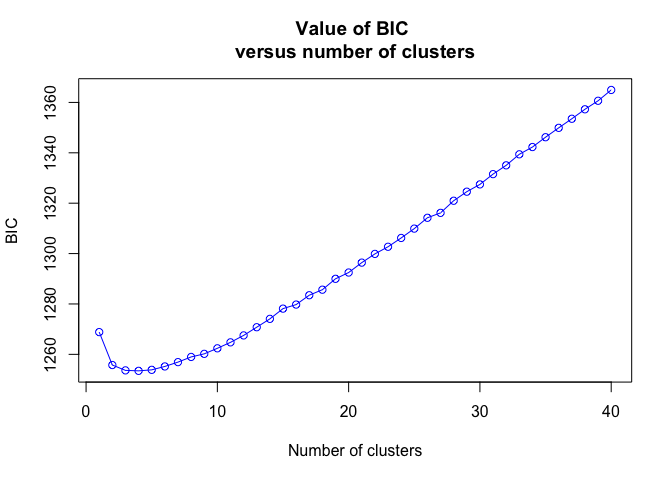
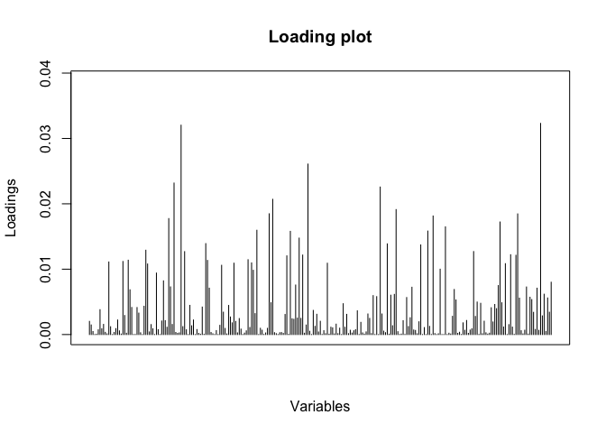
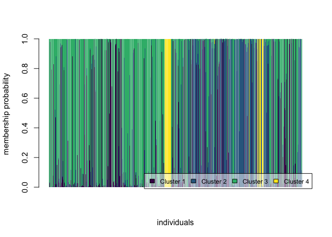
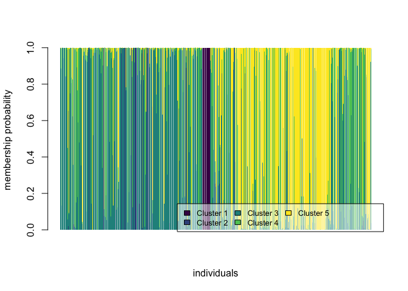

steelhead_PCA_DAPC
================
Kimberly Ledger
4/12/2022

# looking at O.mykiss population structure

load libraries

``` r
library(adegenet) #this package is used for analysis of genetic/genomic data 
library(dplyr) # data manipulation
library(tidyr) # data manipulation
library(forcats)
library(ggplot2)
```

# Part 1: create genind objects

``` r
#onmy_n_df <- read.csv("outputs/onmy_loci4genstr_outflank_hwe.csv")
onmy_n_df <- read.csv("outputs/omy_loci4genstr_outflank_hwe_oneadapt.csv")
```

here i will subset PRE and POST dam individuals

``` r
geno_pre <- onmy_n_df %>%
  filter(Time == "Pre") %>%
  dplyr::mutate(Location = fct_relevel(Location, "BD", "SBLR", "ID", "AD")) %>% 
  arrange(Location, rkm)

geno_post <- onmy_n_df %>%
  filter(Time == "Post") %>%
  dplyr::mutate(Location = fct_relevel(Location, "BD", "SBLR", "ID", "AD")) %>% 
  arrange(Location, rkm)
```

## create genind objects from pre and post dam samples

``` r
#geno_n_pre <- geno_pre[,c(2:296)]        #for "outputs/onmy_loci4genstr_outflank_hwe.csv" use 296 
geno_n_pre <- geno_pre[,c(2:264)]        #for "outputs/omy_loci4genstr_outflank_hwe_oneadapt.csv" use 264

rownames(geno_n_pre) <- geno_pre$Sample_ID
col_geno_n_pre <- gsub("\\.", "_", colnames(geno_n_pre))
colnames(geno_n_pre) <- col_geno_n_pre

#meta_pre <- geno_pre[,-c(1:297)]
meta_pre <- geno_pre[,-c(1:264)]

pre_loci <- colnames(geno_n_pre)
pre_ind <- rownames(geno_n_pre)
pre_location <- meta_pre$Location
pre_rkm <- meta_pre$rkm
pre_site <- meta_pre$Sampling_Site

onmy_genind_pre_location <- df2genind(geno_n_pre,
                         sep="/",
                         ind.names=pre_ind,
                         loc.names=pre_loci, 
                         pop = pre_location,     
                         ploidy = 2)
onmy_genind_pre_site <- df2genind(geno_n_pre,
                         sep="/",
                         ind.names=pre_ind,
                         loc.names=pre_loci, 
                         pop = pre_site,      
                         ploidy = 2)
onmy_genind_pre_location
```

    ## /// GENIND OBJECT /////////
    ## 
    ##  // 459 individuals; 263 loci; 519 alleles; size: 1.1 Mb
    ## 
    ##  // Basic content
    ##    @tab:  459 x 519 matrix of allele counts
    ##    @loc.n.all: number of alleles per locus (range: 1-2)
    ##    @loc.fac: locus factor for the 519 columns of @tab
    ##    @all.names: list of allele names for each locus
    ##    @ploidy: ploidy of each individual  (range: 2-2)
    ##    @type:  codom
    ##    @call: df2genind(X = geno_n_pre, sep = "/", ind.names = pre_ind, loc.names = pre_loci, 
    ##     pop = pre_location, ploidy = 2)
    ## 
    ##  // Optional content
    ##    @pop: population of each individual (group size range: 69-160)

``` r
onmy_genind_pre_site
```

    ## /// GENIND OBJECT /////////
    ## 
    ##  // 459 individuals; 263 loci; 519 alleles; size: 1.1 Mb
    ## 
    ##  // Basic content
    ##    @tab:  459 x 519 matrix of allele counts
    ##    @loc.n.all: number of alleles per locus (range: 1-2)
    ##    @loc.fac: locus factor for the 519 columns of @tab
    ##    @all.names: list of allele names for each locus
    ##    @ploidy: ploidy of each individual  (range: 2-2)
    ##    @type:  codom
    ##    @call: df2genind(X = geno_n_pre, sep = "/", ind.names = pre_ind, loc.names = pre_loci, 
    ##     pop = pre_site, ploidy = 2)
    ## 
    ##  // Optional content
    ##    @pop: population of each individual (group size range: 1-81)

``` r
#geno_n_post <- geno_post[,c(2:297)]
geno_n_post <- geno_post[,c(2:264)]

rownames(geno_n_post) <- geno_post$Sample_ID
col_geno_n_post <- gsub("\\.", "_", colnames(geno_n_post))
colnames(geno_n_post) <- col_geno_n_post

#meta_post <- geno_post[,-c(1:297)]
meta_post <- geno_post[,-c(1:264)]

post_loci <- colnames(geno_n_post)
post_ind <- rownames(geno_n_post)
post_location <- meta_post$Location
post_rkm <- meta_post$rkm
post_site <- meta_post$Sampling_Site

onmy_genind_post_location <- df2genind(geno_n_post,
                         sep="/",
                         ind.names=post_ind,
                         loc.names=post_loci, 
                         pop = post_location,
                         ploidy = 2)

onmy_genind_post_site <- df2genind(geno_n_post,
                         sep="/",
                         ind.names=post_ind,
                         loc.names=post_loci, 
                         pop = post_site,
                         ploidy = 2)
onmy_genind_post_location
```

    ## /// GENIND OBJECT /////////
    ## 
    ##  // 863 individuals; 263 loci; 522 alleles; size: 2 Mb
    ## 
    ##  // Basic content
    ##    @tab:  863 x 522 matrix of allele counts
    ##    @loc.n.all: number of alleles per locus (range: 1-2)
    ##    @loc.fac: locus factor for the 522 columns of @tab
    ##    @all.names: list of allele names for each locus
    ##    @ploidy: ploidy of each individual  (range: 2-2)
    ##    @type:  codom
    ##    @call: df2genind(X = geno_n_post, sep = "/", ind.names = post_ind, loc.names = post_loci, 
    ##     pop = post_location, ploidy = 2)
    ## 
    ##  // Optional content
    ##    @pop: population of each individual (group size range: 22-396)

``` r
onmy_genind_post_site
```

    ## /// GENIND OBJECT /////////
    ## 
    ##  // 863 individuals; 263 loci; 522 alleles; size: 2 Mb
    ## 
    ##  // Basic content
    ##    @tab:  863 x 522 matrix of allele counts
    ##    @loc.n.all: number of alleles per locus (range: 1-2)
    ##    @loc.fac: locus factor for the 522 columns of @tab
    ##    @all.names: list of allele names for each locus
    ##    @ploidy: ploidy of each individual  (range: 2-2)
    ##    @type:  codom
    ##    @call: df2genind(X = geno_n_post, sep = "/", ind.names = post_ind, loc.names = post_loci, 
    ##     pop = post_site, ploidy = 2)
    ## 
    ##  // Optional content
    ##    @pop: population of each individual (group size range: 1-252)

# Part 2: Hardy-Weinberg equilibrium - AS OF 17 May 2022 HWE was checkin in “steeloutliertest.Rmd”

# Part 4: convet genind to genlight objects

``` r
#install_github("green-striped-gecko/dartR")
library(dartR)

genlit_pre_site <- gi2gl(onmy_genind_pre_site)
```

    ## Starting gi2gl 
    ## Starting gl.compliance.check 
    ##   Processing genlight object with SNP data
    ##   Checking coding of SNPs
    ##     SNP data scored NA, 0, 1 or 2 confirmed
    ##   Checking locus metrics and flags
    ##   Recalculating locus metrics
    ##   Checking for monomorphic loci
    ##     Dataset contains monomorphic loci
    ##   Checking whether individual names are unique.
    ##   Checking for individual metrics
    ##   Warning: Creating a slot for individual metrics
    ##   Checking for population assignments
    ##     Population assignments confirmed
    ##   Spelling of coordinates checked and changed if necessary to lat/lon
    ## Completed: gl.compliance.check 
    ## Completed: gi2gl

``` r
genlit_pre_location <- gi2gl(onmy_genind_pre_location)
```

    ## Starting gi2gl 
    ## Starting gl.compliance.check 
    ##   Processing genlight object with SNP data
    ##   Checking coding of SNPs
    ##     SNP data scored NA, 0, 1 or 2 confirmed
    ##   Checking locus metrics and flags
    ##   Recalculating locus metrics
    ##   Checking for monomorphic loci
    ##     Dataset contains monomorphic loci
    ##   Checking whether individual names are unique.
    ##   Checking for individual metrics
    ##   Warning: Creating a slot for individual metrics
    ##   Checking for population assignments
    ##     Population assignments confirmed
    ##   Spelling of coordinates checked and changed if necessary to lat/lon
    ## Completed: gl.compliance.check 
    ## Completed: gi2gl

``` r
genlit_post_site <- gi2gl(onmy_genind_post_site)
```

    ## Starting gi2gl 
    ## Starting gl.compliance.check 
    ##   Processing genlight object with SNP data
    ##   Checking coding of SNPs
    ##     SNP data scored NA, 0, 1 or 2 confirmed
    ##   Checking locus metrics and flags
    ##   Recalculating locus metrics
    ##   Checking for monomorphic loci
    ##     Dataset contains monomorphic loci
    ##   Checking whether individual names are unique.
    ##   Checking for individual metrics
    ##   Warning: Creating a slot for individual metrics
    ##   Checking for population assignments
    ##     Population assignments confirmed
    ##   Spelling of coordinates checked and changed if necessary to lat/lon
    ## Completed: gl.compliance.check 
    ## Completed: gi2gl

``` r
genlit_post_location <- gi2gl(onmy_genind_post_location)
```

    ## Starting gi2gl 
    ## Starting gl.compliance.check 
    ##   Processing genlight object with SNP data
    ##   Checking coding of SNPs
    ##     SNP data scored NA, 0, 1 or 2 confirmed
    ##   Checking locus metrics and flags
    ##   Recalculating locus metrics
    ##   Checking for monomorphic loci
    ##     Dataset contains monomorphic loci
    ##   Checking whether individual names are unique.
    ##   Checking for individual metrics
    ##   Warning: Creating a slot for individual metrics
    ##   Checking for population assignments
    ##     Population assignments confirmed
    ##   Spelling of coordinates checked and changed if necessary to lat/lon
    ## Completed: gl.compliance.check 
    ## Completed: gi2gl

### consider filtering genlight objects prior to running a PCA or PCoA?

prep for pca (a) Filter stringently on call rate, using a threshold of
at least 95% loci called. (b) Remove individuals for which call rate is
exceptionally low, say \<80%. (c) Impute the remaining missing values on
a population‐by‐population basis, where populations can be considered
panmictic.

``` r
#genlit_filter <- gl.filter.callrate(genlit_pre_site, method="loc", threshold=0.90)
#genlit_filter <- gl.filter.callrate(genlit_filter, method="ind", threshold=0.80)
#genlit_filter <- gl.impute(genlit_filter, method="random")
#pcoa <- gl.pcoa(genlit_filter)
```

## PCA using genlight object

set color palette

``` r
library(viridisLite)
mycol = viridisLite::viridis(4, alpha = 0.6)
```

``` r
pca_pre <- glPca(genlit_pre_location, center = T, scale = F, nf = 50)
s.class(pca_pre$scores, pop(genlit_pre_location),
        xax=1, yax=2, col=mycol,
        axesel=FALSE, cstar=0, cpoint=3)
```

<!-- -->

``` r
pca_post <- glPca(genlit_post_location, center = T, scale = F, nf = 50)
s.class(pca_post$scores, pop(genlit_post_location),
        xax=1, yax=2, col=mycol,
        axesel=FALSE, cstar=0, cpoint=3)
```

<!-- -->

# Part 5: DAPC

i am following this tutorial:
<https://adegenet.r-forge.r-project.org/files/tutorial-dapc.pdf>

find clusters

``` r
grp_pre <- find.clusters(genlit_pre_location, max.n.clust=40, n.pca=100)
```

<!-- -->

    ## Choose the number of clusters (>=2):

check Kstat

``` r
grp_pre$Kstat
```

    ##      K=1      K=2      K=3      K=4      K=5      K=6      K=7      K=8 
    ## 1268.836 1255.761 1253.636 1253.451 1253.849 1255.196 1256.919 1258.967 
    ##      K=9     K=10     K=11     K=12     K=13     K=14     K=15     K=16 
    ## 1260.198 1262.397 1264.765 1267.514 1270.772 1274.079 1278.145 1279.757 
    ##     K=17     K=18     K=19     K=20     K=21     K=22     K=23     K=24 
    ## 1283.465 1285.662 1289.981 1292.478 1296.409 1299.867 1302.699 1306.199 
    ##     K=25     K=26     K=27     K=28     K=29     K=30     K=31     K=32 
    ## 1309.909 1314.204 1316.159 1320.969 1324.564 1327.456 1331.542 1335.026 
    ##     K=33     K=34     K=35     K=36     K=37     K=38     K=39     K=40 
    ## 1339.407 1342.292 1346.190 1349.904 1353.513 1357.273 1360.650 1364.948

will use K=2 and K=3 since BIC stops decreasing all that much beyond
there…

``` r
grp_pre_2 <- find.clusters(genlit_pre_location, max.n.clust=40, n.clust = 2)
```

    ## Choose the number PCs to retain (>=1):

``` r
grp_pre_3 <- find.clusters(genlit_pre_location, max.n.clust=40, n.clust = 3)
```

<!-- -->

    ## Choose the number PCs to retain (>=1):

run dapc

``` r
dapc_pre_2 <- dapc(genlit_pre_location, grp_pre_2$grp, n.pca = 40, n.da = 10) #keep first 40 PCs; and 10 n.da
dapc_pre_3 <- dapc(genlit_pre_location, grp_pre_3$grp, n.pca = 40, n.da = 10) #keep first 40 PCs; and 10 n.da
```

dapc output

``` r
dapc_pre_2
```

    ##  #################################################
    ##  # Discriminant Analysis of Principal Components #
    ##  #################################################
    ## class: dapc
    ## $call: dapc.genlight(x = genlit_pre_location, pop = grp_pre_2$grp, n.pca = 40, 
    ##     n.da = 10)
    ## 
    ## $n.pca: 40 first PCs of PCA used
    ## $n.da: 1 discriminant functions saved
    ## $var (proportion of conserved variance): 0.467
    ## 
    ## $eig (eigenvalues): 2981  vector    length content                   
    ## 1 $eig      1      eigenvalues               
    ## 2 $grp      459    prior group assignment    
    ## 3 $prior    2      prior group probabilities 
    ## 4 $assign   459    posterior group assignment
    ## 5 $pca.cent 263    centring vector of PCA    
    ## 6 $pca.norm 263    scaling vector of PCA     
    ## 7 $pca.eig  256    eigenvalues of PCA        
    ## 
    ##   data.frame    nrow ncol content                                          
    ## 1 $tab          459  40   retained PCs of PCA                              
    ## 2 $means        2    40   group means                                      
    ## 3 $loadings     40   1    loadings of variables                            
    ## 4 $ind.coord    459  1    coordinates of individuals (principal components)
    ## 5 $grp.coord    2    1    coordinates of groups                            
    ## 6 $posterior    459  2    posterior membership probabilities               
    ## 7 $pca.loadings 263  40   PCA loadings of original variables               
    ## 8 $var.contr    263  1    contribution of original variables

``` r
dapc_pre_3
```

    ##  #################################################
    ##  # Discriminant Analysis of Principal Components #
    ##  #################################################
    ## class: dapc
    ## $call: dapc.genlight(x = genlit_pre_location, pop = grp_pre_3$grp, n.pca = 40, 
    ##     n.da = 10)
    ## 
    ## $n.pca: 40 first PCs of PCA used
    ## $n.da: 2 discriminant functions saved
    ## $var (proportion of conserved variance): 0.467
    ## 
    ## $eig (eigenvalues): 1559 553.6  vector    length content                   
    ## 1 $eig      2      eigenvalues               
    ## 2 $grp      459    prior group assignment    
    ## 3 $prior    3      prior group probabilities 
    ## 4 $assign   459    posterior group assignment
    ## 5 $pca.cent 263    centring vector of PCA    
    ## 6 $pca.norm 263    scaling vector of PCA     
    ## 7 $pca.eig  256    eigenvalues of PCA        
    ## 
    ##   data.frame    nrow ncol content                                          
    ## 1 $tab          459  40   retained PCs of PCA                              
    ## 2 $means        3    40   group means                                      
    ## 3 $loadings     40   2    loadings of variables                            
    ## 4 $ind.coord    459  2    coordinates of individuals (principal components)
    ## 5 $grp.coord    3    2    coordinates of groups                            
    ## 6 $posterior    459  3    posterior membership probabilities               
    ## 7 $pca.loadings 263  40   PCA loadings of original variables               
    ## 8 $var.contr    263  2    contribution of original variables

plot DAPC using scatter()

``` r
scatter(dapc_pre_2, col = viridis(2, alpha = 0.6))
```

<!-- -->

``` r
scatter(dapc_pre_3, col = viridis(3, alpha = 0.6))
```

<!-- -->

plot DAPC using ggplot

``` r
dapc_pre_2_scores <- as.data.frame(dapc_pre_2$tab)
dapc_pre_2_scores$Assigned_Pop <- dapc_pre_2$grp
dapc_pre_2_scores$Original_Pop <- meta_pre$Location

set.seed(9)
dapc_p2 <- ggplot(dapc_pre_2_scores, aes(x=PC1, y=PC2, colour=Assigned_Pop)) 
dapc_p2 <- dapc_p2 + geom_point(size=2, aes(shape = Original_Pop)) 
dapc_p2 <- dapc_p2 + stat_ellipse(level = 0.95, size = 1)
dapc_p2 <- dapc_p2 + scale_color_manual(values = viridis(3)) 
dapc_p2 <- dapc_p2 + geom_hline(yintercept = 0) 
dapc_p2 <- dapc_p2 + geom_vline(xintercept = 0) 
dapc_p2 <- dapc_p2 + theme_bw()

dapc_p2
```

<!-- -->

plot DAPC using ggplot

``` r
dapc_pre_3_scores <- as.data.frame(dapc_pre_3$tab)
dapc_pre_3_scores$Assigned_Pop <- dapc_pre_3$grp
dapc_pre_3_scores$Original_Pop <- meta_pre$Location

set.seed(9)
dapc_p3 <- ggplot(dapc_pre_3_scores, aes(x=PC1, y=PC2, colour=Assigned_Pop)) 
dapc_p3 <- dapc_p3 + geom_point(size=2, aes(shape = Original_Pop)) 
dapc_p3 <- dapc_p3 + stat_ellipse(level = 0.95, size = 1)
dapc_p3 <- dapc_p3 + scale_color_manual(values = viridis(3)) 
dapc_p3 <- dapc_p3 + geom_hline(yintercept = 0) 
dapc_p3 <- dapc_p3 + geom_vline(xintercept = 0) 
dapc_p3 <- dapc_p3 + theme_bw()
dapc_p3
```

<!-- -->

which loci have the greatest contribution?

``` r
set.seed(4)
loadingplot(dapc_pre_2$var.contr, axis=1,
                       thres=.07, lab.jitter=1)
```

<!-- -->

    ## NULL

``` r
loadingplot(dapc_pre_3$var.contr, axis=1,
                       thres=.07, lab.jitter=1)
```

<!-- -->

    ## NULL

``` r
loadingplot(dapc_pre_3$var.contr, axis=2,
                       thres=.07, lab.jitter=1)
```

<!-- -->

    ## NULL

look at loci with \>0.05 contribution to pc axis

``` r
data.frame(dapc_pre_3$var.contr) %>%
  filter(LD2 > 0.05)
```

    ## [1] LD1 LD2
    ## <0 rows> (or 0-length row.names)

``` r
#pre_loci[146]
```

## this is Omy_RAD3209-10 on omy 18 (Adaptive. Basin-wide, top-outlier)

``` r
#summary(dapc_pre_2)
#summary(dapc_pre_3)
```

genotype compostion plot - individuals are ordered from BD to AD

``` r
compoplot(dapc_pre_2, posi="bottomright",
          txt.leg=paste("Cluster", 1:2), xlab="individuals", col=viridis(2))
```

<!-- -->

``` r
compoplot(dapc_pre_3, posi="bottomright",
          txt.leg=paste("Cluster", 1:3), xlab="individuals", col=viridis(3))
```

<!-- -->

make easier to interpret DAPC plot using ggplot

``` r
dapc.results <- as.data.frame(dapc_pre_2$posterior)
dapc.results$pop <- meta_pre$Location
dapc.results$indNames <- rownames(dapc.results)
dapc.results <- pivot_longer(dapc.results, -c(pop, indNames))  #pivot table to be able to use ggplot 
```

rename columns and plot

``` r
colnames(dapc.results) <- c("Original_Pop","Sample","Assigned_Pop","Posterior_membership_probability")

p2 <- ggplot(dapc.results, aes(x=Sample, y=Posterior_membership_probability, fill=Assigned_Pop))
p2 <- p2 + geom_bar(stat='identity') 
p2 <- p2 + scale_fill_manual(values = viridis(3)) 
p2 <- p2 + facet_grid(~Original_Pop, scales = "free")
p2 <- p2 + theme(axis.text.x = element_blank())
p2
```

<!-- -->

make easier to interpret DAPC plot using ggplot

``` r
dapc.results <- as.data.frame(dapc_pre_3$posterior)
dapc.results$pop <- meta_pre$Location
dapc.results$indNames <- rownames(dapc.results)
dapc.results <- pivot_longer(dapc.results, -c(pop, indNames))  #pivot table to be able to use ggplot 
```

rename columns and plot

``` r
colnames(dapc.results) <- c("Original_Pop","Sample","Assigned_Pop","Posterior_membership_probability")

p3 <- ggplot(dapc.results, aes(x=Sample, y=Posterior_membership_probability, fill=Assigned_Pop))
p3 <- p3 + geom_bar(stat='identity') 
p3 <- p3 + scale_fill_manual(values = viridis(3)) 
p3 <- p3 + facet_grid(~Original_Pop, scales = "free")
p3 <- p3 + theme(axis.text.x = element_blank())
p3
```

<!-- -->

make combined figure for predam individuals…

``` r
library(cowplot)

pre_plot <- plot_grid(dapc_p2, p2, dapc_p3, p3, labels = "AUTO", ncol =2)
pre_plot
```

<!-- -->

``` r
#ggsave2("outputs/pre_plot.png", width = 14, height = 8)
```

# Now analyses post-removal dam individuals

find clusters

``` r
grp_post <- find.clusters(genlit_post_location, max.n.clust=40, n.pca=100)
```

<!-- -->

    ## Choose the number of clusters (>=2):

check Kstat

``` r
grp_post$Kstat
```

    ##      K=1      K=2      K=3      K=4      K=5      K=6      K=7      K=8 
    ## 2301.139 2291.136 2285.779 2284.254 2281.594 2279.858 2278.967 2278.809 
    ##      K=9     K=10     K=11     K=12     K=13     K=14     K=15     K=16 
    ## 2279.585 2280.790 2282.278 2284.325 2285.979 2287.439 2289.884 2292.573 
    ##     K=17     K=18     K=19     K=20     K=21     K=22     K=23     K=24 
    ## 2295.163 2297.647 2298.953 2301.191 2306.314 2309.362 2310.433 2314.123 
    ##     K=25     K=26     K=27     K=28     K=29     K=30     K=31     K=32 
    ## 2317.515 2321.069 2321.817 2325.758 2329.077 2332.114 2335.706 2337.400 
    ##     K=33     K=34     K=35     K=36     K=37     K=38     K=39     K=40 
    ## 2341.687 2345.366 2348.969 2352.594 2357.256 2359.594 2364.008 2367.426

will use K=2 to K=5 since BIC stops decreasing all that much beyond
there…

``` r
grp_post_2 <- find.clusters(genlit_post_location, max.n.clust=40, n.clust = 2)
```

    ## Choose the number PCs to retain (>=1):

``` r
grp_post_3 <- find.clusters(genlit_post_location, max.n.clust=40, n.clust = 3)
```

<!-- -->

    ## Choose the number PCs to retain (>=1):

``` r
grp_post_4 <- find.clusters(genlit_post_location, max.n.clust=40, n.clust = 4)
```

    ## Choose the number PCs to retain (>=1):

``` r
grp_post_5 <- find.clusters(genlit_post_location, max.n.clust=40, n.clust = 5)
```

    ## Choose the number PCs to retain (>=1):

run dapc

``` r
dapc_post_2 <- dapc(genlit_post_location, grp_post_2$grp, n.pca = 40, n.da = 10) #keep first 40 PCs; and 10 n.da
dapc_post_3 <- dapc(genlit_post_location, grp_post_3$grp, n.pca = 40, n.da = 10) #keep first 40 PCs; and 10 n.da
dapc_post_4 <- dapc(genlit_post_location, grp_post_4$grp, n.pca = 40, n.da = 10) #keep first 40 PCs; and 10 n.da
dapc_post_5 <- dapc(genlit_post_location, grp_post_5$grp, n.pca = 40, n.da = 10) #keep first 40 PCs; and 10 n.da
```

dapc outputs

``` r
dapc_post_2
```

    ##  #################################################
    ##  # Discriminant Analysis of Principal Components #
    ##  #################################################
    ## class: dapc
    ## $call: dapc.genlight(x = genlit_post_location, pop = grp_post_2$grp, 
    ##     n.pca = 40, n.da = 10)
    ## 
    ## $n.pca: 40 first PCs of PCA used
    ## $n.da: 1 discriminant functions saved
    ## $var (proportion of conserved variance): 0.408
    ## 
    ## $eig (eigenvalues): 2207  vector    length content                   
    ## 1 $eig      1      eigenvalues               
    ## 2 $grp      863    prior group assignment    
    ## 3 $prior    2      prior group probabilities 
    ## 4 $assign   863    posterior group assignment
    ## 5 $pca.cent 263    centring vector of PCA    
    ## 6 $pca.norm 263    scaling vector of PCA     
    ## 7 $pca.eig  259    eigenvalues of PCA        
    ## 
    ##   data.frame    nrow ncol content                                          
    ## 1 $tab          863  40   retained PCs of PCA                              
    ## 2 $means        2    40   group means                                      
    ## 3 $loadings     40   1    loadings of variables                            
    ## 4 $ind.coord    863  1    coordinates of individuals (principal components)
    ## 5 $grp.coord    2    1    coordinates of groups                            
    ## 6 $posterior    863  2    posterior membership probabilities               
    ## 7 $pca.loadings 263  40   PCA loadings of original variables               
    ## 8 $var.contr    263  1    contribution of original variables

``` r
dapc_post_3
```

    ##  #################################################
    ##  # Discriminant Analysis of Principal Components #
    ##  #################################################
    ## class: dapc
    ## $call: dapc.genlight(x = genlit_post_location, pop = grp_post_3$grp, 
    ##     n.pca = 40, n.da = 10)
    ## 
    ## $n.pca: 40 first PCs of PCA used
    ## $n.da: 2 discriminant functions saved
    ## $var (proportion of conserved variance): 0.408
    ## 
    ## $eig (eigenvalues): 1171 789  vector    length content                   
    ## 1 $eig      2      eigenvalues               
    ## 2 $grp      863    prior group assignment    
    ## 3 $prior    3      prior group probabilities 
    ## 4 $assign   863    posterior group assignment
    ## 5 $pca.cent 263    centring vector of PCA    
    ## 6 $pca.norm 263    scaling vector of PCA     
    ## 7 $pca.eig  259    eigenvalues of PCA        
    ## 
    ##   data.frame    nrow ncol content                                          
    ## 1 $tab          863  40   retained PCs of PCA                              
    ## 2 $means        3    40   group means                                      
    ## 3 $loadings     40   2    loadings of variables                            
    ## 4 $ind.coord    863  2    coordinates of individuals (principal components)
    ## 5 $grp.coord    3    2    coordinates of groups                            
    ## 6 $posterior    863  3    posterior membership probabilities               
    ## 7 $pca.loadings 263  40   PCA loadings of original variables               
    ## 8 $var.contr    263  2    contribution of original variables

``` r
dapc_post_4
```

    ##  #################################################
    ##  # Discriminant Analysis of Principal Components #
    ##  #################################################
    ## class: dapc
    ## $call: dapc.genlight(x = genlit_post_location, pop = grp_post_4$grp, 
    ##     n.pca = 40, n.da = 10)
    ## 
    ## $n.pca: 40 first PCs of PCA used
    ## $n.da: 3 discriminant functions saved
    ## $var (proportion of conserved variance): 0.408
    ## 
    ## $eig (eigenvalues): 633.1 495.8 367.5  vector    length content                   
    ## 1 $eig      3      eigenvalues               
    ## 2 $grp      863    prior group assignment    
    ## 3 $prior    4      prior group probabilities 
    ## 4 $assign   863    posterior group assignment
    ## 5 $pca.cent 263    centring vector of PCA    
    ## 6 $pca.norm 263    scaling vector of PCA     
    ## 7 $pca.eig  259    eigenvalues of PCA        
    ## 
    ##   data.frame    nrow ncol content                                          
    ## 1 $tab          863  40   retained PCs of PCA                              
    ## 2 $means        4    40   group means                                      
    ## 3 $loadings     40   3    loadings of variables                            
    ## 4 $ind.coord    863  3    coordinates of individuals (principal components)
    ## 5 $grp.coord    4    3    coordinates of groups                            
    ## 6 $posterior    863  4    posterior membership probabilities               
    ## 7 $pca.loadings 263  40   PCA loadings of original variables               
    ## 8 $var.contr    263  3    contribution of original variables

``` r
dapc_post_5
```

    ##  #################################################
    ##  # Discriminant Analysis of Principal Components #
    ##  #################################################
    ## class: dapc
    ## $call: dapc.genlight(x = genlit_post_location, pop = grp_post_5$grp, 
    ##     n.pca = 40, n.da = 10)
    ## 
    ## $n.pca: 40 first PCs of PCA used
    ## $n.da: 4 discriminant functions saved
    ## $var (proportion of conserved variance): 0.408
    ## 
    ## $eig (eigenvalues): 536.5 423.7 254.4 230.5  vector    length content                   
    ## 1 $eig      4      eigenvalues               
    ## 2 $grp      863    prior group assignment    
    ## 3 $prior    5      prior group probabilities 
    ## 4 $assign   863    posterior group assignment
    ## 5 $pca.cent 263    centring vector of PCA    
    ## 6 $pca.norm 263    scaling vector of PCA     
    ## 7 $pca.eig  259    eigenvalues of PCA        
    ## 
    ##   data.frame    nrow ncol content                                          
    ## 1 $tab          863  40   retained PCs of PCA                              
    ## 2 $means        5    40   group means                                      
    ## 3 $loadings     40   4    loadings of variables                            
    ## 4 $ind.coord    863  4    coordinates of individuals (principal components)
    ## 5 $grp.coord    5    4    coordinates of groups                            
    ## 6 $posterior    863  5    posterior membership probabilities               
    ## 7 $pca.loadings 263  40   PCA loadings of original variables               
    ## 8 $var.contr    263  4    contribution of original variables

plot DAPC using scatter()

``` r
scatter(dapc_post_2, col = viridis(2, alpha = 0.6))
```

<!-- -->

``` r
scatter(dapc_post_3, col = viridis(3, alpha = 0.6))
```

<!-- -->

``` r
scatter(dapc_post_4, col = viridis(4, alpha = 0.6))
```

<!-- -->

``` r
scatter(dapc_post_5, col = viridis(5, alpha = 0.6))
```

<!-- -->

plot DAPC using ggplot

``` r
dapc_post_3_scores <- as.data.frame(dapc_post_3$tab)
dapc_post_3_scores$Assigned_Pop <- dapc_post_3$grp
dapc_post_3_scores$Original_Pop <- meta_post$Location

set.seed(9)
dapc_d3 <- ggplot(dapc_post_3_scores, aes(x=PC1, y=PC2, colour=Assigned_Pop)) 
dapc_d3 <- dapc_d3 + geom_point(size=2, aes(shape = Original_Pop)) 
dapc_d3 <- dapc_d3 + stat_ellipse(level = 0.95, size = 1)
dapc_d3 <- dapc_d3 + scale_color_manual(values = viridis(4)) 
dapc_d3 <- dapc_d3 + geom_hline(yintercept = 0) 
dapc_d3 <- dapc_d3 + geom_vline(xintercept = 0) 
dapc_d3 <- dapc_d3 + theme_bw()
dapc_d3
```

<!-- -->

plot DAPC using ggplot

``` r
dapc_post_4_scores <- as.data.frame(dapc_post_4$tab)
dapc_post_4_scores$Assigned_Pop <- dapc_post_4$grp
dapc_post_4_scores$Original_Pop <- meta_post$Location

set.seed(9)
dapc_d4 <- ggplot(dapc_post_4_scores, aes(x=PC1, y=PC2, colour=Assigned_Pop)) 
dapc_d4 <- dapc_d4 + geom_point(size=2, aes(shape = Original_Pop)) 
dapc_d4 <- dapc_d4 + stat_ellipse(level = 0.95, size = 1)
dapc_d4 <- dapc_d4 + scale_color_manual(values = viridis(4)) 
dapc_d4 <- dapc_d4 + geom_hline(yintercept = 0) 
dapc_d4 <- dapc_d4 + geom_vline(xintercept = 0) 
dapc_d4 <- dapc_d4 + theme_bw()
dapc_d4
```

<!-- -->

genotype compostion plot for 2 to 5 clusters

``` r
compoplot(dapc_post_2, posi="bottomright",
          txt.leg=paste("Cluster", 1:2), xlab="individuals", col=viridis(2))
```

<!-- -->

``` r
compoplot(dapc_post_3, posi="bottomright",
          txt.leg=paste("Cluster", 1:3), xlab="individuals", col=viridis(3))
```

<!-- -->

``` r
compoplot(dapc_post_4, posi="bottomright",
          txt.leg=paste("Cluster", 1:4), xlab="individuals", col=viridis(4))
```

<!-- -->

``` r
compoplot(dapc_post_5, posi="bottomright",
          txt.leg=paste("Cluster", 1:5), xlab="individuals", col=viridis(5))
```

<!-- -->

make easier to interpret membership probability plot using ggplot

``` r
dapc.results.d3 <- as.data.frame(dapc_post_3$posterior)
dapc.results.d3$pop <- meta_post$Location
dapc.results.d3$indNames <- rownames(dapc.results.d3)
dapc.results.d3  <- pivot_longer(dapc.results.d3, -c(pop, indNames))  #pivot table to be able to use ggplot 
```

rename columns and plot

``` r
colnames(dapc.results.d3) <- c("Original_Pop","Sample","Assigned_Pop","Posterior_membership_probability")

d3 <- ggplot(dapc.results.d3, aes(x=Sample, y=Posterior_membership_probability, fill=Assigned_Pop))
d3 <- d3 + geom_bar(stat='identity') 
d3 <- d3 + scale_fill_manual(values = viridis(4)) 
d3 <- d3 + facet_grid(~Original_Pop, scales = "free")
d3 <- d3 + theme(axis.text.x = element_blank())
d3
```

<!-- -->

make easier to interpret membership probability plot using ggplot

``` r
dapc.results.d4 <- as.data.frame(dapc_post_4$posterior)
dapc.results.d4$pop <- meta_post$Location
dapc.results.d4$indNames <- rownames(dapc.results.d4)
dapc.results.d4  <- pivot_longer(dapc.results.d4, -c(pop, indNames))  #pivot table to be able to use ggplot 
```

rename columns and plot

``` r
colnames(dapc.results.d4) <- c("Original_Pop","Sample","Assigned_Pop","Posterior_membership_probability")

d4 <- ggplot(dapc.results.d4, aes(x=Sample, y=Posterior_membership_probability, fill=Assigned_Pop))
d4 <- d4 + geom_bar(stat='identity') 
d4 <- d4 + scale_fill_manual(values = viridis(4)) 
d4 <- d4 + facet_grid(~Original_Pop, scales = "free")
d4 <- d4 + theme(axis.text.x = element_blank())
d4
```

<!-- -->

make combined figure for post dam samples …

``` r
library(cowplot)

post_plot <- plot_grid(dapc_d3, d3, dapc_d4, d4, labels = "AUTO", ncol =2)
post_plot
```

<!-- -->

``` r
#ggsave2("outputs/post_plot.png", width = 14, height = 8)
```
