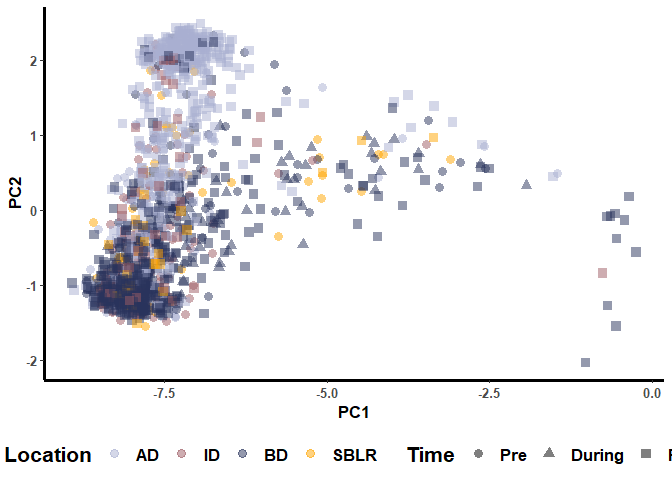
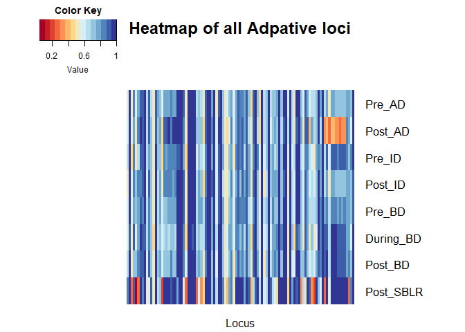
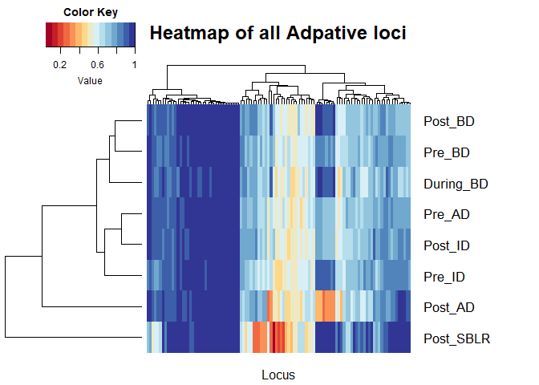

steelhead\_adaptive\_analyses
================
Jong Yoon Jeon
Mar 14 2022

\#\#Load packages

``` r
library(vcfR)
```

    ## 
    ##    *****       ***   vcfR   ***       *****
    ##    This is vcfR 1.12.0 
    ##      browseVignettes('vcfR') # Documentation
    ##      citation('vcfR') # Citation
    ##    *****       *****      *****       *****

``` r
library(adegenet)
```

    ## Loading required package: ade4

    ## 
    ##    /// adegenet 2.1.5 is loaded ////////////
    ## 
    ##    > overview: '?adegenet'
    ##    > tutorials/doc/questions: 'adegenetWeb()' 
    ##    > bug reports/feature requests: adegenetIssues()

``` r
library(pegas)
```

    ## Loading required package: ape

    ## Registered S3 method overwritten by 'pegas':
    ##   method      from
    ##   print.amova ade4

    ## 
    ## Attaching package: 'pegas'

    ## The following object is masked from 'package:ape':
    ## 
    ##     mst

    ## The following object is masked from 'package:ade4':
    ## 
    ##     amova

    ## The following objects are masked from 'package:vcfR':
    ## 
    ##     getINFO, write.vcf

``` r
library(poppr)
```

    ## Warning: multiple methods tables found for 'direction'

    ## Warning: multiple methods tables found for 'gridDistance'

    ## This is poppr version 2.9.3. To get started, type package?poppr
    ## OMP parallel support: available

``` r
library(dplyr)
```

    ## 
    ## Attaching package: 'dplyr'

    ## The following objects are masked from 'package:stats':
    ## 
    ##     filter, lag

    ## The following objects are masked from 'package:base':
    ## 
    ##     intersect, setdiff, setequal, union

``` r
library(readr)
library(readxl)
library(tibble)
library(dartR)
```

    ## Loading required package: ggplot2

    ## Registered S3 method overwritten by 'GGally':
    ##   method from   
    ##   +.gg   ggplot2

    ## Registered S3 method overwritten by 'genetics':
    ##   method      from 
    ##   [.haplotype pegas

    ## **** Welcome to dartR ****

    ## Be aware that owing to CRAN requirements and compatibility reasons not all functions of the packages may run yet, as some dependencies could be missing. Hence for a most enjoyable experience we recommend to run the function

    ## gl.install.vanilla.dartR()

    ## This installs all missing and required packages for your version of dartR. 
    ## For citation information please use:

    ## citation('dartR')

    ## 
    ## **** Have fun using dartR! ****

\#\#Load data

``` r
steelhead.metadata <- read_csv("C:/Users/jyj55/Desktop/LGC-DGS_2022/Team_project/Steelhead_genotype/Elwha_Steelhead_Formatted.csv")
```

    ## Rows: 1693 Columns: 15
    ## -- Column specification --------------------------------------------------------
    ## Delimiter: ","
    ## chr (10): Sample_ID, Smolt, NvH_Origin, Sex, Date, Time, Location, Run_Timin...
    ## dbl  (5): Year, Fork_Length, Lat, Long, rkm
    ## 
    ## i Use `spec()` to retrieve the full column specification for this data.
    ## i Specify the column types or set `show_col_types = FALSE` to quiet this message.

``` r
steelhead.vcf <- read.vcfR("C:/Users/jyj55/Desktop/LGC-DGS_2022/Team_project/Steelhead_genotype/Elwha_GTSeq_Sans_CCT.vcf.gz")
```

    ## Scanning file to determine attributes.
    ## File attributes:
    ##   meta lines: 35
    ##   header_line: 36
    ##   variant count: 336
    ##   column count: 1178
    ## Meta line 35 read in.
    ## All meta lines processed.
    ## gt matrix initialized.
    ## Character matrix gt created.
    ##   Character matrix gt rows: 336
    ##   Character matrix gt cols: 1178
    ##   skip: 0
    ##   nrows: 336
    ##   row_num: 0
    ## Processed variant: 336
    ## All variants processed

``` r
steelhead.genind <- vcfR2genind(steelhead.vcf, sep = "/")
steelhead.snp <- read_csv("C:/Users/jyj55/Desktop/LGC-DGS_2022/Team_project/Steelhead_genotype/SNP_Coordinates_CRITFC.csv")
```

    ## Rows: 367 Columns: 7
    ## -- Column specification --------------------------------------------------------
    ## Delimiter: ","
    ## chr (4): Locus, chromosome, Scaffold, SNP
    ## dbl (3): snp coordinate in genome, Other, Physical_Position
    ## 
    ## i Use `spec()` to retrieve the full column specification for this data.
    ## i Specify the column types or set `show_col_types = FALSE` to quiet this message.

``` r
Steelhead.Locus_Key <- read_excel("C:/Users/jyj55/Desktop/LGC-DGS_2022/Team_project/Steelhead_genotype/Steelhead_Locus_Key.xlsx")
```

\#\#Make a dataframe to store population info

``` r
steelhead_pop <- matrix(NA, nrow=nrow(steelhead.genind@tab), ncol=8)
steelhead_pop <- as.data.frame(steelhead_pop)
names(steelhead_pop) <- c("Sample_ID", "NvH", "Time", "Location", "Run_Timing", "Life_History_Trait", "Lat", "Long")
```

\#\#Store pop info for each individual

``` r
for (i in 1:nrow(steelhead.genind@tab)){
  steelhead_pop$Sample_ID[i] <- rownames(steelhead.genind@tab)[i]
  steelhead_pop$NvH[i] <- steelhead.metadata %>% filter(Sample_ID == rownames(steelhead.genind@tab)[i]) %>% select(NvH_Origin)
  steelhead_pop$Time[i] <- steelhead.metadata %>% filter(Sample_ID == rownames(steelhead.genind@tab)[i]) %>% select(Time)
  steelhead_pop$Location[i] <- steelhead.metadata %>% filter(Sample_ID == rownames(steelhead.genind@tab)[i]) %>% select(Location)
  steelhead_pop$Run_Timing[i] <- steelhead.metadata %>% filter(Sample_ID == rownames(steelhead.genind@tab)[i]) %>% select(Run_Timing)
  steelhead_pop$Life_History_Type[i] <- steelhead.metadata %>% filter(Sample_ID == rownames(steelhead.genind@tab)[i]) %>% select(Life_History_Type)
  steelhead_pop$X[i] <- steelhead.metadata %>% filter(Sample_ID == rownames(steelhead.genind@tab)[i]) %>% select(Long)
  steelhead_pop$Y[i] <- steelhead.metadata %>% filter(Sample_ID == rownames(steelhead.genind@tab)[i]) %>% select(Lat)
}
invisible(steelhead_pop$NvH[lengths(steelhead_pop$NvH) == 0] <- NA_character_)
invisible(steelhead_pop$Time[lengths(steelhead_pop$Time) == 0] <- NA_character_)
invisible(steelhead_pop$Location[lengths(steelhead_pop$Location) == 0] <- NA_character_)
invisible(steelhead_pop$Run_Timing[lengths(steelhead_pop$Run_Timing) == 0] <- NA_character_)
invisible(steelhead_pop$Life_History_Type[lengths(steelhead_pop$Life_History_Type) == 0] <- NA_character_)
invisible(steelhead_pop$X[lengths(steelhead_pop$X) == 0] <- NA_character_)
invisible(steelhead_pop$Y[lengths(steelhead_pop$Y) == 0] <- NA_character_)
steelhead_coord <- cbind(steelhead_pop$Sample_ID, steelhead_pop$X, steelhead_pop$Y)
steelhead.genind@other$xy <- steelhead_coord
```

\#\#Divide pop by “Time” and “Location”

``` r
strata(steelhead.genind) <- steelhead_pop
setPop(steelhead.genind) <- ~Time/Location
```

\#\#Filter adaptive loci only, removing “character(0)” loci

``` r
steelhead_adaptive <- Steelhead.Locus_Key %>% filter(grepl('Adaptive', Steelhead.Locus_Key$`SNPeff Annotation output`))
for (i in 1:nrow(steelhead_adaptive)){
  steelhead_adaptive$SnpPos[i] <- steelhead.snp %>% filter(Locus == steelhead_adaptive[i,]$`SNPPIT or Alias`) %>% select(SNP)
}
```

    ## Warning: Unknown or uninitialised column: `SnpPos`.

``` r
toRetain <- steelhead_adaptive$SnpPos[lengths(steelhead_adaptive$SnpPos) != 0] #Remove loci without name (character(0))
toRetain <- gsub("\\.", "_", unlist(toRetain)) # Replace ".' to "_"
steelhead_adaptive.genind <- steelhead.genind[loc=unlist(toRetain)]
```

    ## Warning: the following specified loci do not exist: NC_035086_1_10773803,
    ## NC_035098_1_40502475

``` r
# steelhead_adaptive.genind locus name change from SnpPos to SnpName? - manually after allele frequency calculation
```

\#\#HWE test for each pop (by “Time” or by “Location”)

``` r
strata(steelhead_adaptive.genind) <- steelhead_pop

setPop(steelhead_adaptive.genind) <- ~Time #by "Time"
steelhead_time_hwt <- seppop(steelhead_adaptive.genind) %>% lapply(hw.test, B = 0)
```

    ## Warning: There are individuals with missing population information in the data
    ## set. If you want to retain these, use the option `keepNA = TRUE`.

``` r
write.table(steelhead_time_hwt, file = "steelhead_time_hwt.txt", sep = "\t")

setPop(steelhead_adaptive.genind) <- ~Location #by "Location"
steelhead_location_hwt <- seppop(steelhead_adaptive.genind) %>% lapply(hw.test, B = 0)
```

    ## Warning: There are individuals with missing population information in the data
    ## set. If you want to retain these, use the option `keepNA = TRUE`.

``` r
write.table(steelhead_location_hwt, file = "steelhead_location_hwt.txt", sep = "\t")
```

\#\#Transform to genpop object and calculate allele frequencies

``` r
#Assigne population by "Time" + "Location"
setPop(steelhead_adaptive.genind) <- ~Time/Location
steelhead_adaptive.genpop <- genind2genpop(steelhead_adaptive.genind)
```

    ## 
    ##  Converting data from a genind to a genpop object... 
    ## 
    ## ...done.

``` r
steelhead_af <- makefreq(steelhead_adaptive.genpop, missing = NA)
```

    ## 
    ##  Finding allelic frequencies from a genpop object... 
    ## 
    ## ...done.

\#\#PCA using only adaptive loci

``` r
library(ggplot2)
steelhead_adaptive.genlight <- gi2gl(steelhead_adaptive.genind)
```

    ## Starting gi2gl 
    ## Completed: gi2gl

``` r
steelhead_adaptive.pca <- glPca(steelhead_adaptive.genlight, center = F, scale = F, nf =50)
steelhead_adaptive.PCA <- as.data.frame(steelhead_adaptive.pca$scores)
steelhead_pop$Location <- factor(steelhead_pop$Location, levels = c("AD", "ID", "BD", "SBLR")) 
steelhead_adaptive.PCA$Color <- steelhead_pop$Location
steelhead_adaptive.PCA$Color <- unlist(steelhead_adaptive.PCA$Color)
steelhead_pop$Time <- factor(steelhead_pop$Time, levels = c("Pre", "During", "Post")) 
steelhead_adaptive.PCA$Shape <- steelhead_pop$Time
steelhead_adaptive.PCA$Shape <- unlist(steelhead_adaptive.PCA$Shape)
steelhead_adaptive.PCA %>% ggplot(aes(x=PC1, y = PC2)) + geom_point(aes(col = Color, shape = Shape), size = 3, alpha=0.8) + 
  labs(color = "Location", shape = "Time")+
  theme_classic() + 
  theme(axis.text = element_text(size = 10, face = "bold"), 
        axis.title = element_text(size = 13, face = "bold"), 
        axis.line = element_line(size = 1.2),
        axis.title.y = element_text(angle = 90),
        legend.position = "bottom", 
        legend.box = "horizontal", 
        legend.title = element_text(face = "bold", size = 16), 
        legend.text = element_text(size = 13, face = "bold"),
        plot.title = element_text(size = 18, face = "bold"))
```

    ## Warning: Removed 8 rows containing missing values (geom_point).

<!-- -->

\#\#Plot allele frequency heatmaps

``` r
library(RColorBrewer)
library(gplots)
```

    ## Registered S3 method overwritten by 'gplots':
    ##   method         from 
    ##   reorder.factor gdata

    ## 
    ## Attaching package: 'gplots'

    ## The following object is masked from 'package:stats':
    ## 
    ##     lowess

``` r
#Change row order as following: Pre_AD, Pre_ID, Pre_BD, During_BD, Post_AD, Post_ID, Post_BD, Post_SBLR, NA_NA
steelhead_af_ordered <- steelhead_af[c(2, 8, 1, 7, 3, 5, 6, 9, 4),]
write.table(steelhead_af_ordered, "steelhead_af.txt", sep = "\t")
steelhead_af_pruned <- read.delim("C:/Users/jyj55/Desktop/LGC-DGS_2022/Team_project/Analysis/Steelhead analysis/steelhead_af_pruned.txt", row.names=1) #Reread manually pruned table to have major allele frequency only for each locus 
steelhead_af_pruned <- as.matrix(steelhead_af_pruned)
steelhead_af_pruned <- steelhead_af_pruned[,order(colnames(steelhead_af_pruned))]
heatmap_color <- colorRampPalette(brewer.pal(10,"RdYlBu"))
steelhead.heatmap_all <- heatmap.2(steelhead_af_pruned, col=heatmap_color, Rowv = FALSE, Colv = FALSE, dendrogram = "none", trace = "none", density.info = "none", xlab = "Locus", labCol = "", margins = c(2.5,10))
```

<!-- -->

``` r
steelhead_af_005 <- read.delim("C:/Users/jyj55/Desktop/LGC-DGS_2022/Team_project/Analysis/Steelhead analysis/steelhead_af_pruned_005.txt", row.names=1) #Manually filtered loci to include higher 5% of them in terms of absolute value of allele frequency change between PreDam and PostDam for any of AD, ID, BD
steelhead_af_005 <- as.matrix(steelhead_af_005)
steelhead.heatmap_005 <- heatmap.2(steelhead_af_005, col=heatmap_color, Rowv = FALSE, Colv = FALSE, dendrogram = "none", trace = "none", density.info = "none", margins = c(10,10))
```

<!-- -->
