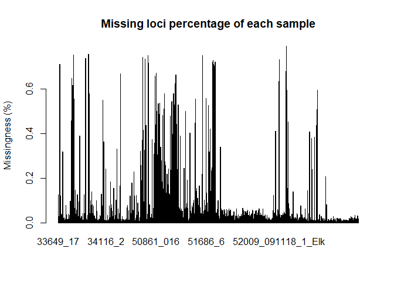
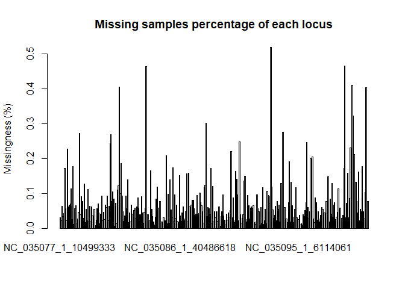
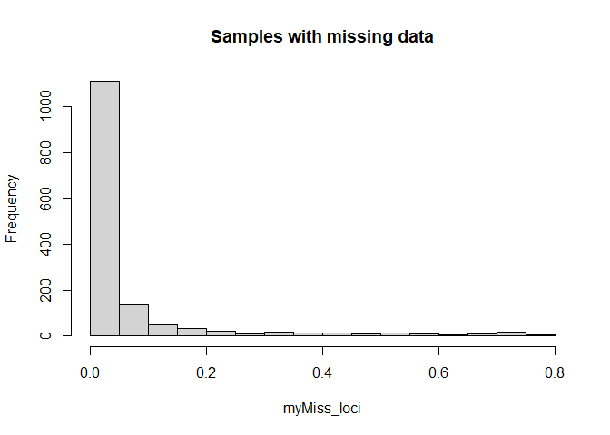
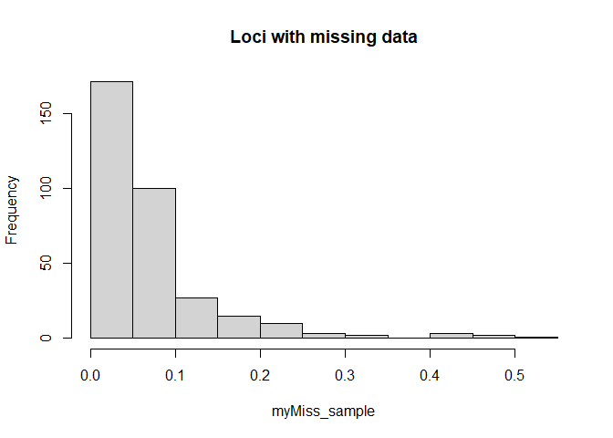

steelhead\_adaptive\_analyses\_in\_use
================
Jong Yoon Jeon
5/8/2022

\#\#Load libraries

``` r
library(adegenet)
```

    ## Loading required package: ade4

    ## 
    ##    /// adegenet 2.1.5 is loaded ////////////
    ## 
    ##    > overview: '?adegenet'
    ##    > tutorials/doc/questions: 'adegenetWeb()' 
    ##    > bug reports/feature requests: adegenetIssues()

``` r
library(pegas)
```

    ## Loading required package: ape

    ## Registered S3 method overwritten by 'pegas':
    ##   method      from
    ##   print.amova ade4

    ## 
    ## Attaching package: 'pegas'

    ## The following object is masked from 'package:ape':
    ## 
    ##     mst

    ## The following object is masked from 'package:ade4':
    ## 
    ##     amova

``` r
library(genetics)
```

    ## Loading required package: combinat

    ## 
    ## Attaching package: 'combinat'

    ## The following object is masked from 'package:utils':
    ## 
    ##     combn

    ## Loading required package: gdata

    ## gdata: Unable to locate valid perl interpreter
    ## gdata: 
    ## gdata: read.xls() will be unable to read Excel XLS and XLSX files
    ## gdata: unless the 'perl=' argument is used to specify the location of a
    ## gdata: valid perl intrpreter.
    ## gdata: 
    ## gdata: (To avoid display of this message in the future, please ensure
    ## gdata: perl is installed and available on the executable search path.)

    ## gdata: Unable to load perl libaries needed by read.xls()
    ## gdata: to support 'XLX' (Excel 97-2004) files.

    ## 

    ## gdata: Unable to load perl libaries needed by read.xls()
    ## gdata: to support 'XLSX' (Excel 2007+) files.

    ## 

    ## gdata: Run the function 'installXLSXsupport()'
    ## gdata: to automatically download and install the perl
    ## gdata: libaries needed to support Excel XLS and XLSX formats.

    ## 
    ## Attaching package: 'gdata'

    ## The following object is masked from 'package:stats':
    ## 
    ##     nobs

    ## The following object is masked from 'package:utils':
    ## 
    ##     object.size

    ## The following object is masked from 'package:base':
    ## 
    ##     startsWith

    ## Loading required package: gtools

    ## 
    ## Attaching package: 'gtools'

    ## The following object is masked from 'package:adegenet':
    ## 
    ##     chr

    ## Loading required package: MASS

    ## Loading required package: mvtnorm

    ## Registered S3 method overwritten by 'genetics':
    ##   method      from 
    ##   [.haplotype pegas

    ## 

    ## NOTE: THIS PACKAGE IS NOW OBSOLETE.

    ## 

    ##   The R-Genetics project has developed an set of enhanced genetics

    ##   packages to replace 'genetics'. Please visit the project homepage

    ##   at http://rgenetics.org for informtion.

    ## 

    ## 
    ## Attaching package: 'genetics'

    ## The following objects are masked from 'package:pegas':
    ## 
    ##     haplotype, LD

    ## The following objects are masked from 'package:base':
    ## 
    ##     %in%, as.factor, order

``` r
library(dartR)
```

    ## Loading required package: ggplot2

    ## Registered S3 method overwritten by 'GGally':
    ##   method from   
    ##   +.gg   ggplot2

    ## Warning: multiple methods tables found for 'direction'

    ## Warning: multiple methods tables found for 'gridDistance'

    ## **** Welcome to dartR ****

    ## Be aware that owing to CRAN requirements and compatibility reasons not all functions of the packages may run yet, as some dependencies could be missing. Hence for a most enjoyable experience we recommend to run the function

    ## gl.install.vanilla.dartR()

    ## This installs all missing and required packages for your version of dartR. 
    ## For citation information please use:

    ## citation('dartR')

    ## 
    ## **** Have fun using dartR! ****

``` r
library(dplyr)
```

    ## 
    ## Attaching package: 'dplyr'

    ## The following object is masked from 'package:MASS':
    ## 
    ##     select

    ## The following objects are masked from 'package:gdata':
    ## 
    ##     combine, first, last

    ## The following objects are masked from 'package:stats':
    ## 
    ##     filter, lag

    ## The following objects are masked from 'package:base':
    ## 
    ##     intersect, setdiff, setequal, union

``` r
library(tidyverse)
```

    ## -- Attaching packages --------------------------------------- tidyverse 1.3.1 --

    ## v tibble  3.1.6     v purrr   0.3.4
    ## v tidyr   1.1.4     v stringr 1.4.0
    ## v readr   2.1.1     v forcats 0.5.1

    ## -- Conflicts ------------------------------------------ tidyverse_conflicts() --
    ## x dplyr::combine() masks gdata::combine()
    ## x dplyr::filter()  masks stats::filter()
    ## x dplyr::first()   masks gdata::first()
    ## x purrr::keep()    masks gdata::keep()
    ## x dplyr::lag()     masks stats::lag()
    ## x dplyr::last()    masks gdata::last()
    ## x dplyr::select()  masks MASS::select()

``` r
library(factoextra)
```

    ## Welcome! Want to learn more? See two factoextra-related books at https://goo.gl/ve3WBa

``` r
#library(OutFLANK)
library(hierfstat)
```

    ## 
    ## Attaching package: 'hierfstat'

    ## The following object is masked from 'package:genetics':
    ## 
    ##     allele.count

    ## The following objects are masked from 'package:ape':
    ## 
    ##     pcoa, varcomp

    ## The following objects are masked from 'package:adegenet':
    ## 
    ##     Hs, read.fstat

``` r
library(cowplot)
library(GGally)
library(stringr)
library(tidyr)
library(ggpubr)
```

    ## 
    ## Attaching package: 'ggpubr'

    ## The following object is masked from 'package:cowplot':
    ## 
    ##     get_legend

    ## The following object is masked from 'package:ape':
    ## 
    ##     rotate

``` r
library(poppr)
```

    ## This is poppr version 2.9.3. To get started, type package?poppr
    ## OMP parallel support: available

``` r
library(readr)
library(readxl)
library(tibble)
library(vcfR)
```

    ## 
    ##    *****       ***   vcfR   ***       *****
    ##    This is vcfR 1.12.0 
    ##      browseVignettes('vcfR') # Documentation
    ##      citation('vcfR') # Citation
    ##    *****       *****      *****       *****

    ## 
    ## Attaching package: 'vcfR'

    ## The following objects are masked from 'package:pegas':
    ## 
    ##     getINFO, write.vcf

\#\#Load data

``` r
meta <- read_csv("C:/Users/jyj55/Desktop/LGC-DGS_2022/Team_project/Steelhead_genotype/Elwha_Steelhead_Formatted_kjl.csv")
```

    ## Rows: 1693 Columns: 16
    ## -- Column specification --------------------------------------------------------
    ## Delimiter: ","
    ## chr (11): Sample_ID, Smolt, NvH_Origin, Sex, Date, Time, Location, Run_Timin...
    ## dbl  (5): Year, Fork_Length, Lat, Long, rkm
    ## 
    ## i Use `spec()` to retrieve the full column specification for this data.
    ## i Specify the column types or set `show_col_types = FALSE` to quiet this message.

``` r
snp <- read_csv("C:/Users/jyj55/Desktop/LGC-DGS_2022/Team_project/Steelhead_genotype/SNP_Coordinates_CRITFC.csv")
```

    ## Rows: 367 Columns: 7
    ## -- Column specification --------------------------------------------------------
    ## Delimiter: ","
    ## chr (4): Locus, chromosome, Scaffold, SNP
    ## dbl (3): snp coordinate in genome, Other, Physical_Position
    ## 
    ## i Use `spec()` to retrieve the full column specification for this data.
    ## i Specify the column types or set `show_col_types = FALSE` to quiet this message.

``` r
Locus_Key <- read_excel("C:/Users/jyj55/Desktop/LGC-DGS_2022/Team_project/Steelhead_genotype/Steelhead_Locus_Key.xlsx")
for (i in 1:nrow(Locus_Key)){
  Locus_Key$SnpPos[i] <- snp %>% filter(Locus == Locus_Key[i,]$`SNPPIT or Alias`) %>% dplyr::select(SNP)
}
```

    ## Warning: Unknown or uninitialised column: `SnpPos`.

``` r
Locus_Key$SnpPos <- gsub("\\.1", "_1", Locus_Key$SnpPos) # Replace ".' to "_" in loci names

vcf <- read.vcfR("C:/Users/jyj55/Desktop/LGC-DGS_2022/Team_project/Steelhead_genotype/Elwha_GTSeq_Sans_CCT.vcf.gz")
```

    ## Scanning file to determine attributes.
    ## File attributes:
    ##   meta lines: 35
    ##   header_line: 36
    ##   variant count: 334
    ##   column count: 1477
    ## Meta line 35 read in.
    ## All meta lines processed.
    ## gt matrix initialized.
    ## Character matrix gt created.
    ##   Character matrix gt rows: 334
    ##   Character matrix gt cols: 1477
    ##   skip: 0
    ##   nrows: 334
    ##   row_num: 0
    ## Processed variant: 334
    ## All variants processed

``` r
gt.vcf <- as.data.frame(t(extract.gt(vcf, return.alleles = TRUE))) #t for transpose rows and columns
gt.vcf <- gt.vcf[order(rownames(gt.vcf)),order(colnames(gt.vcf))] #Order samples and loci
colnames(gt.vcf) <- gsub("\\.", "_", colnames(gt.vcf)) # Replace ".' to "_" in loci names
```

\#Remove individuals with &gt;20% missing data

``` r
meta <- meta %>% mutate(TimePlace = paste(Time, "_", Location))
dim(meta)
```

    ## [1] 1693   17

``` r
gt.vcf <- rownames_to_column(gt.vcf, var="Sample_ID")
dim(gt.vcf)
```

    ## [1] 1468  335

``` r
metageno <- left_join(meta, gt.vcf, by="Sample_ID")
dim(metageno)
```

    ## [1] 1693  351

``` r
metageno <- metageno %>% filter(rownames(metageno) %in% rownames(gt.vcf))
dim(metageno)
```

    ## [1] 1468  351

``` r
metageno <- metageno[!is.na(metageno$Time) & !is.na(metageno$Location),] #Remove individuals without pop info
dim(metageno)
```

    ## [1] 1468  351

``` r
#Reverse the first column (=Sample_ID) to rownames (index)
gt.vcf1 <- gt.vcf[,-1]
rownames(gt.vcf1) <- gt.vcf[,1]
gt.vcf <- gt.vcf1
rm(gt.vcf1)

metageno1 <- metageno[,-1]
metageno2 <- as.matrix(metageno)
row.names(metageno1) <- metageno2[,1]
```

    ## Warning: Setting row names on a tibble is deprecated.

``` r
metageno <- metageno1
rm(metageno1)
rm(metageno2)

#check missing loci percentage of each sample
myMiss_loci <- apply(gt.vcf, MARGIN = 1, function(x){ sum(is.na(x)) })
myMiss_loci <- myMiss_loci/ncol(gt.vcf)
length(myMiss_loci) # = 1468 which is the length of samples
```

    ## [1] 1468

``` r
barplot(myMiss_loci, main = "Missing loci percentage of each sample")
title(ylab = "Missingness (%)")
```

<!-- -->

``` r
#check missing samples percentage of each locus
myMiss_sample <- apply(gt.vcf, MARGIN = 2, function(x){ sum(is.na(x)) })
myMiss_sample <- myMiss_sample/nrow(gt.vcf)
length(myMiss_sample) # = 334 which is the length of loci, so we should use myMiss_loci for filtering samples with high missing data percentage
```

    ## [1] 334

``` r
barplot(myMiss_sample, main = "Missing samples percentage of each locus")
title(ylab = "Missingness (%)")
```

<!-- -->

``` r
hist(myMiss_loci, main = "Samples with missing data")
```

<!-- -->

``` r
hist(myMiss_sample, main = "Loci with missing data")
```

<!-- -->

``` r
geno <- metageno[,-c(1:16)]
row.names(geno) <- rownames(metageno)
```

    ## Warning: Setting row names on a tibble is deprecated.

``` r
geno_MissLoci  <- geno %>% mutate(myMiss_loci) %>% filter(myMiss_loci < 0.2) 
geno_filtered <- geno_MissLoci %>% select(., -"myMiss_loci")
rownames(geno_filtered) <- rownames(geno_MissLoci)
```

    ## Warning: Setting row names on a tibble is deprecated.

``` r
metageno3 <- metageno %>% filter(rownames(metageno) %in% rownames(geno_filtered))
metageno <- metageno3
rm(metageno3)
#check how the filtering changed the dataset
dim(metageno[,-c(1:16)])
```

    ## [1] 1324  334

``` r
meta <- metageno[,c(1:16)] #return only metadata of filtered samples
row.names(meta) <- rownames(metageno)
```

    ## Warning: Setting row names on a tibble is deprecated.

\#Store data by Time and Location or Steelhead

``` r
loci <- colnames(geno_filtered)
ind <- rownames(geno_filtered)
place <- metageno$Location

#Divide data by Time
meta_pre <- meta %>% filter(Time=="Pre")
meta_post <- meta %>% filter(Time=="Post")
pop_pre <- meta_pre$Location
pop_post <- meta_post$Location

metag <- cbind(geno_filtered,meta)
geno_pre <- metag %>% filter(Time=="Pre")
geno_pre <- geno_pre[,c(1:334)]
geno_post <- metag %>% filter(Time=="Post")
geno_post <- geno_post[,c(1:334)]
ind_pre <- rownames(geno_pre)
ind_post <- rownames(geno_post)

#Separate Steelhead data
metageno_sh <- metageno %>% filter(Life_History_Type == "Steelhead")
meta_sh <- metageno_sh[,c(1:16)] #return only metadata of filtered samples
row.names(meta_sh) <- rownames(metageno_sh)
```

    ## Warning: Setting row names on a tibble is deprecated.

``` r
#Divide Steelhead data by Time
meta_sh_pre <- meta_sh %>% filter(Time=="Pre")
meta_sh_post <- meta_sh %>% filter(Time=="Post")
pop_sh_pre <- meta_sh_pre$Location
pop_sh_post <- meta_sh_post$Location

geno_filtered_sh <- metageno_sh[,-c(1:16)]
metag_sh <- cbind(geno_filtered_sh,meta_sh)
geno_sh_pre <- metag_sh %>% filter(Time=="Pre")
geno_sh_pre <- geno_sh_pre[,c(1:334)]
geno_sh_post <- metag_sh %>% filter(Time=="Post")
geno_sh_post <- geno_sh_post[,c(1:334)]
ind_sh_pre <- rownames(geno_sh_pre)
ind_sh_post <- rownames(geno_sh_post)
```

\#\#Convert to genind

``` r
dgenind <- df2genind(geno_filtered, 
          sep="/",
          ind.names=ind,
          loc.names=loci, 
          pop = place,
          ploidy = 2)
```

    ## Warning in df2genind(geno_filtered, sep = "/", ind.names = ind, loc.names =
    ## loci, : Individuals with no scored loci have been removed

``` r
dgenind_pre <- df2genind(geno_pre, 
          sep="/",
          ind.names=ind_pre,
          loc.names=loci, 
          pop = pop_pre,
          ploidy = 2)
```

    ## Warning in df2genind(geno_pre, sep = "/", ind.names = ind_pre, loc.names =
    ## loci, : Individuals with no scored loci have been removed

``` r
dgenind_post <- df2genind(geno_post, 
          sep="/",
          ind.names=ind_post,
          loc.names=loci, 
          pop = pop_post,
          ploidy = 2)  
```

    ## Warning in df2genind(geno_post, sep = "/", ind.names = ind_post, loc.names =
    ## loci, : Individuals with no scored loci have been removed

``` r
#dgenind_sh_pre <- df2genind(geno_sh_pre, 
#          sep="/",
#          ind.names=ind_sh_pre,
#          loc.names=loci, 
#          pop = pop_sh_pre,
#          ploidy = 2)

#dgenind_sh_post <- df2genind(geno_sh_post, 
#          sep="/",
#          ind.names=ind_sh_post,
#          loc.names=loci, 
#          pop = pop_sh_post,
#          ploidy = 2) 
```

\#\#Filter adaptive loci only, removing “character(0)” loci

``` r
#adaptive <- Locus_Key %>% filter(grepl('Adaptive', Locus_Key$`SNPeff Annotation output`))
#toRetain <- adaptive$SnpPos[1:112] #Remove loci without name (character(0))
#dgenind_adp <- dgenind[loc=unlist(toRetain)]

#Change loci names from SnpPos to SnpName (="SNPPIT or Alias")
#for (i in 1:ncol(gt.vcf)){
#  colnames(gt.vcf)[i] <- as.character(Locus_Key[(which(Locus_Key$SnpPos == substr(colnames(gt.vcf)[i], 1, #nchar(colnames(gt.vcf)[i])))),3]) #3rd column of "adaptive" includes SnpName
#} 


#adaptive.gt.vcf <- gt.vcf[, names(gt.vcf) %in% toRetain] #Retain adaptive loci only
```

\#\#LD test among adaptive loci

``` r
#LD_adp <- pair.ia(dgenind_adp, sample=1028)
```
