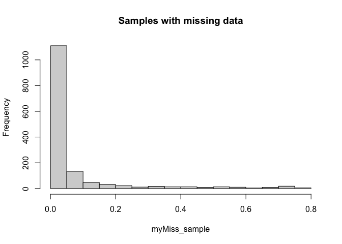
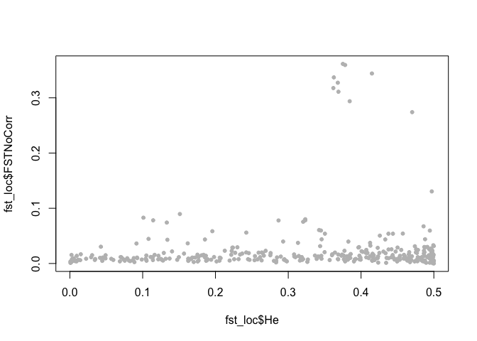

steelhead_outliertest
================
Kimberly Ledger
4/8/2022

### load libraries

``` r
library(vcfR) #this package is used to visualize and manipulate VCF files
library(adegenet) #this package is used for analysis of genetic/genomic data 
library(dplyr) # data manipulation
library(tidyr) # data manipulation
```

# Part 1: Prepare the data

## read in the steelhead (Oncorhynchus mykiss) metadata - replace with UPDATED version

``` r
onmy_metadata <- read.csv("~/Desktop/LG_Proj4/Elwha_datafiles/Elwha_Steelhead_Formatted.csv")
head(onmy_metadata)
```

    ##   Sample_ID Year   Smolt Fork_Length NvH_Origin  Sex    Date Time Location
    ## 1  33649_17 2004 Unknown          NA          N <NA> 7/14/04  Pre       ID
    ## 2  33649_18 2004 Unknown          NA          N <NA> 7/14/04  Pre       ID
    ## 3  33649_19 2004 Unknown          NA          N <NA> 7/14/04  Pre       ID
    ## 4  33649_20 2004 Unknown          NA          N <NA> 7/14/04  Pre       ID
    ## 5  33649_23 2004 Unknown          NA          N <NA> 7/14/04  Pre       ID
    ## 6  33649_26 2004 Unknown          NA          N <NA> 7/14/04  Pre       ID
    ##   Run_Timing Life_Stage Life_History_Type      Lat      Long rkm Sampling_Site
    ## 1    Unknown   Juvenile       Land_Locked 48.11933 -123.5535  NA  little_river
    ## 2    Unknown   Juvenile       Land_Locked 48.06303 -123.5770  NA  little_river
    ## 3    Unknown   Juvenile       Land_Locked 48.06303 -123.5770  NA  little_river
    ## 4    Unknown   Juvenile       Land_Locked 48.06303 -123.5770  NA  little_river
    ## 5    Unknown   Juvenile       Land_Locked 48.06303 -123.5770  NA  little_river
    ## 6    Unknown   Juvenile       Land_Locked 48.06303 -123.5770  NA  little_river

``` r
nrow(onmy_metadata)
```

    ## [1] 1693

### create column to represent both location (AD/ID/BD/SBLR) and time (pre/during/post)

``` r
onmy_metadata <- onmy_metadata %>%
  unite("Time_Location", c(Time, Location), sep= "_", remove = FALSE)
```

## read in the VCF file

``` r
onmy_vcf <- read.vcfR("~/Desktop/LG_Proj4/Elwha_datafiles/Elwha_GTSeq_Sans_CCT.vcf")
```

    ## Scanning file to determine attributes.
    ## File attributes:
    ##   meta lines: 35
    ##   header_line: 36
    ##   variant count: 334
    ##   column count: 1477
    ## Meta line 35 read in.
    ## All meta lines processed.
    ## gt matrix initialized.
    ## Character matrix gt created.
    ##   Character matrix gt rows: 334
    ##   Character matrix gt cols: 1477
    ##   skip: 0
    ##   nrows: 334
    ##   row_num: 0
    ## Processed variant: 334
    ## All variants processed

``` r
onmy_vcf
```

    ## ***** Object of Class vcfR *****
    ## 1468 samples
    ## 30 CHROMs
    ## 334 variants
    ## Object size: 3.9 Mb
    ## 7.133 percent missing data
    ## *****        *****         *****

# Part 2: use Fst to identify outliers

## to do this i will use OutFLANK

this starts with extracting the genotypes from the vcfR object

``` r
geno <- extract.gt(onmy_vcf)
dim(geno)
```

    ## [1]  334 1468

``` r
head(geno[,1:10])
```

    ##                      33649_17 33649_18 33649_19 33649_20 33649_23 33649_26
    ## NC_035086.1_7508221  "0/1"    NA       NA       "0/1"    NA       "0/0"   
    ## NC_035086.1_10852282 "0/0"    "0/0"    "0/1"    "0/0"    "0/1"    "0/1"   
    ## NC_035086.1_30372084 "0/1"    "0/1"    "0/1"    "0/1"    "0/1"    "0/1"   
    ## NC_035086.1_32872704 "0/1"    "0/0"    "0/1"    "0/0"    "1/1"    "0/0"   
    ## NC_035086.1_38704654 "0/0"    "0/0"    "0/0"    "0/0"    "0/0"    "0/0"   
    ## NC_035086.1_40486618 "0/1"    "1/1"    "0/0"    "0/1"    "0/1"    "1/1"   
    ##                      33649_29 33649_30 33649_31 33649_32
    ## NC_035086.1_7508221  "0/0"    NA       NA       "0/1"   
    ## NC_035086.1_10852282 "1/1"    "0/1"    NA       "0/1"   
    ## NC_035086.1_30372084 "0/0"    "0/1"    "0/1"    "0/1"   
    ## NC_035086.1_32872704 "0/1"    "0/1"    "0/1"    "0/1"   
    ## NC_035086.1_38704654 "0/0"    "0/0"    NA       "0/0"   
    ## NC_035086.1_40486618 "0/0"    "0/0"    NA       "1/1"

## check vcf file for missing data

``` r
myMiss_loci <- apply(geno, MARGIN = 2, function(x){ sum(is.na(x)) })
myMiss_loci <- myMiss_loci/nrow(geno)

barplot(myMiss_loci, main = "Loci")
title(ylab = "Missingness (%)")
```

<!-- -->

``` r
myMiss_sample <- apply(geno, MARGIN = 1, function(x){ sum(is.na(x)) })
myMiss_sample <- myMiss_sample/ncol(geno)

barplot(myMiss_sample, main = "Samples")
title(ylab = "Missingness (%)")
```

<!-- -->

``` r
hist(myMiss_sample, main = "Samples with missing data")
```

<!-- -->

## for now just keep only samples with \<20% missing data

``` r
onmy_vcf@gt <- onmy_vcf@gt[, c(TRUE, myMiss_sample < 0.2)]
onmy_vcf
```

    ## ***** Object of Class vcfR *****
    ## 1380 samples
    ## 30 CHROMs
    ## 334 variants
    ## Object size: 3.7 Mb
    ## 7.041 percent missing data
    ## *****        *****         *****

``` r
geno_filtered <- extract.gt(onmy_vcf)
dim(geno_filtered)
```

    ## [1]  334 1380

``` r
samples <- colnames(geno_filtered)
snp <- rownames(geno_filtered)
```

**% missing data** does not change very much with sample filtering…  
now, we have 1380 samples

Notice that as our genotypes look like 0/0, 0/1, and 1/1. But OutFLANK
wants them to be 0, 1, or 2. The code below fixes this problem:

``` r
G <- geno_filtered  #we are doing this because we will be running a lot of different things with G, and if we mess up we want to be able to go back to geno

G[geno_filtered %in% c("0/0")] <- 0
G[geno_filtered  %in% c("0/1")] <- 1
G[geno_filtered %in% c("1/1")] <- 2
G[is.na(G)] <- 9
tG <- t(G)
dim(tG)
```

    ## [1] 1380  334

now i need to match the population metadata to the genotypes

``` r
samples_df <- data.frame(samples)
colnames(samples_df) <- "Sample_ID"

samples_pop <- samples_df %>%
  left_join(onmy_metadata, by = "Sample_ID")
```

**note**: there are a few individuals with missing metadata

Now tG should be in the input format OutFLANK needs, with SNPs as
columns and individuals as rows.

Now we can calculate Fst for each SNP: locusNames= names our loci 1,2,3
etc popNames= names our populations with the “Location” or
“Sampling_Site” labels

## use “Time_Location” as population

``` r
library(OutFLANK)
```

    ## Loading required package: qvalue

``` r
fst_loc <- MakeDiploidFSTMat(tG,locusNames=rownames(geno_filtered),popNames=samples_pop$Time_Location)
```

    ## Calculating FSTs, may take a few minutes...

``` r
head(fst_loc)
```

    ##              LocusName          He           FST            T1          T2
    ## 1  NC_035086.1_7508221 0.468965146  0.0018664297  4.380259e-04 0.234686511
    ## 2 NC_035086.1_10852282 0.263571704  0.0154851179  2.048232e-03 0.132270984
    ## 3 NC_035086.1_30372084 0.498373388  0.0001114916  2.778404e-05 0.249203076
    ## 4 NC_035086.1_32872704 0.489431244 -0.0021390229 -5.234074e-04 0.244694613
    ## 5 NC_035086.1_38704654 0.007662722 -0.0001236784 -4.740460e-07 0.003832893
    ## 6 NC_035086.1_40486618 0.483283991  0.0046726687  1.130610e-03 0.241962312
    ##      FSTNoCorr     T1NoCorr    T2NoCorr meanAlleleFreq
    ## 1 0.0065129869 1.529412e-03 0.234824936      0.6245690
    ## 2 0.0199310871 2.637590e-03 0.132335478      0.8438228
    ## 3 0.0005448073 1.357737e-04 0.249214094      0.5285185
    ## 4 0.0013777654 3.372554e-04 0.244784353      0.5726937
    ## 5 0.0042044245 1.612311e-05 0.003834795      0.9961538
    ## 6 0.0084190753 2.037892e-03 0.242056519      0.5914221

Fst and He calcuated for each locus

``` r
hist(fst_loc$FST, breaks = 50)
```

<!-- -->

Once we’ve calculated Fst between the populations for each SNP
individually, we want to determine whether some SNPs are statistical
outliers - that is, more differentiated than we would expect. OutFLANK
does this by fitting a Chi-Squared distribution to the data and looking
to see if the tails of the Chi-Squared distribution have more SNPs than
expected:

### Before running OutFLANK, check for loci with low sample sizes or unusual values of uncorrected Fst

``` r
plot(fst_loc$FST, fst_loc$FSTNoCorr, 
     xlim=c(-0.01,0.4), ylim=c(-0.01,0.4),
     pch=20)
abline(0,1)
```

<!-- -->

i believe everything looks good here… no major outliers…

### also check for that the Fst distribution looks chi-squared distributed

``` r
plot(fst_loc$He, fst_loc$FSTNoCorr, pch=20, col="grey")
```

<!-- -->

no large Fst values associated with loci of low heterozygosity… i think
we are good to go

``` r
hist(fst_loc$FSTNoCorr, breaks=seq(0,0.4, by=0.001))
```

<!-- -->

``` r
hist(fst_loc$FSTNoCorr[fst_loc$He>0.1], breaks=seq(0,0.4, by=0.001))
```

<!-- -->

it doesn’t look like much changes when i remove samples with \<0.1
heterozygosity…

details on OutFLANK can be found here:
<http://rstudio-pubs-static.s3.amazonaws.com/305384_9aee1c1046394fb9bd8e449453d72847.html>

``` r
OF <- OutFLANK(fst_loc,LeftTrimFraction=0.05,RightTrimFraction=0.1,
         Hmin=0.1,NumberOfSamples=9,qthreshold=0.05)
## check paramaters... these are default except for a RightTrimFraction of 0.1
## the RightTrimFraction determines how many of the highest Fst values are removed before estimating th shape of the fst distribution through likelihood.  when there are potentially a large number of loci affected by spatially heterogeneous selection, it can be worth trying a higher RightTrimFraction. 
## the lowest RightTrimFraction that runs is 0.07 and there are 18 outliers
## RightTrimFraction of 0.1 has 19 outliers 
## RightTrimFraction of 0.15 has 18 outliers 
## WILL GO WITH RightTrimFraction = 0.1, because it will allow me to be more conservative in what i am considering neutral loci 
## NumberOfSamples= number of space/time populations - tried many values here and the result never changed


OutFLANKResultsPlotter(OF,withOutliers=T,
                       NoCorr=T,Hmin=0.1,binwidth=0.005,
                       Zoom=F,RightZoomFraction=0.05,titletext=NULL)
```

<!-- -->

which SNPs are statistical outliers?

``` r
P1 <- pOutlierFinderChiSqNoCorr(fst_loc,Fstbar=OF$FSTNoCorrbar,
                                dfInferred=OF$dfInferred,qthreshold=0.05,Hmin=0.1)  

outliers <- P1$OutlierFlag==TRUE #which of the SNPs are outliers?
table(outliers)
```

    ## outliers
    ## FALSE  TRUE 
    ##   266    19

``` r
outlier_table <- P1 %>%
  filter(OutlierFlag == "TRUE")
head(outlier_table)
```

    ##              LocusName        He        FST          T1         T2  FSTNoCorr
    ## 1  NC_035077.1_7354513 0.4858409 0.06374420 0.015693445 0.24619408 0.06730910
    ## 2 NC_035081.1_34973485 0.3233935 0.07433827 0.012205695 0.16419127 0.07817664
    ## 3 NC_035081.1_47337540 0.3204759 0.07169978 0.011658421 0.16260050 0.07554867
    ## 4 NC_035081.1_56162785 0.3233670 0.07629173 0.012529482 0.16423119 0.08010751
    ## 5 NC_035081.1_61828903 0.2866567 0.07373754 0.010740180 0.14565418 0.07790586
    ## 6 NC_035087.1_14764807 0.1010330 0.07917963 0.004067549 0.05137115 0.08297454
    ##      T1NoCorr  T2NoCorr meanAlleleFreq     pvalues pvaluesRightTail    qvalues
    ## 1 0.016577250 0.2462854      0.5841400 0.008641176      0.004320588 0.03486790
    ## 2 0.012840841 0.1642542      0.7971586 0.003145019      0.001572509 0.01545604
    ## 3 0.012288866 0.1626616      0.7996032 0.004019395      0.002009697 0.01812668
    ## 4 0.013161113 0.1642931      0.7971809 0.002625446      0.001312723 0.01545604
    ## 5 0.011352672 0.1457230      0.8266063 0.003225608      0.001612804 0.01545604
    ## 6 0.004264227 0.0513920      0.9466357 0.002007006      0.001003503 0.01282254
    ##   OutlierFlag
    ## 1        TRUE
    ## 2        TRUE
    ## 3        TRUE
    ## 4        TRUE
    ## 5        TRUE
    ## 6        TRUE

the Fst outlier test identified **19 outlier SNPs**

Now we can make a manhattan plot! We can even plot the outliers in a
different color:

``` r
P1$num <- c(1:334)
plot(P1$num,P1$FST,xlab="Position",ylab="FST",col=rgb(0,0,0,alpha=0.1))
points(P1$num[outliers],P1$FST[outliers],col="magenta")
```

<!-- -->

## compare Fst outliers to GTseq panel w/ putitively neutral/adaptive designation

## read in loci metadata

``` r
onmy_loci_meta <- read.csv("~/Desktop/LG_Proj4/Elwha_datafiles/Steelhead_Locus_Key_kjl.csv")
```

## read in SNP coordinate data

``` r
onmy_snp_coord <- read.csv("~/Desktop/LG_Proj4/Elwha_datafiles/SNP_Coordinates_CRITFC.csv")
```

join loci metadata and SNP coords

``` r
onmy_locus_join <- onmy_snp_coord %>%
  left_join(onmy_loci_meta, by = "Locus")
```

join outlier info to metadata for only the loci included in the vcf

``` r
onmy_snp <- onmy_locus_join %>%
  rename(LocusName = SNP) %>%
  right_join(P1)
```

    ## Joining, by = "LocusName"

filter for only outliers

``` r
onmy_snp_outliers <- onmy_snp %>%
  filter(OutlierFlag == TRUE)
onmy_snp_outliers
```

    ##              Locus chromosome snp.coordinate.in.genome    Scaffold
    ## 1   Omy_BAMBI4.238      omy11                 24411085 NC_035087.1
    ## 2     Omy_ca050-64      omy17                 48651793 NC_035093.1
    ## 3       Omy_g12-82      omy11                 14764807 NC_035087.1
    ## 4     Omy_GREB1_05      omy28                 11618027 NC_035104.1
    ## 5     Omy_GREB1_09      omy28                 11641623 NC_035104.1
    ## 6    Omy_LDHB-2_i6      omy21                 24130559 NC_035097.1
    ## 7  Omy_RAD15709-53      omy28                 11667915 NC_035104.1
    ## 8  Omy_RAD47080-54      omy28                 11667915 NC_035104.1
    ## 9  Omy_RAD72528-44      omy01                  7354513 NC_035077.1
    ## 10  Omy_SECC22b-88      omy05                 61828903 NC_035081.1
    ## 11  Omy28_11625241      omy28                 11625241 NC_035104.1
    ## 12  Omy28_11632591      omy28                 11632591 NC_035104.1
    ## 13  Omy28_11658853      omy28                 11658853 NC_035104.1
    ## 14  Omy28_11667578      omy28                 11667578 NC_035104.1
    ## 15  Omy28_11671116      omy28                 11671116 NC_035104.1
    ## 16  Omy28_11676622      omy28                 11676622 NC_035104.1
    ## 17  Omy28_11683204      omy28                 11683204 NC_035104.1
    ## 18       OmyR14589      omy05                 56162785 NC_035081.1
    ## 19       OmyR19198      omy05                 34973485 NC_035081.1
    ## 20       OmyR33562      omy05                 47337540 NC_035081.1
    ##               LocusName Other Physical_Position    Locus_Name1   Status
    ## 1  NC_035087.1_24411085     0          24411085  Omy_BAMBI4238  Neutral
    ## 2  NC_035093.1_48651793     0          48651793    Omy_ca05064  Neutral
    ## 3  NC_035087.1_14764807     0          14764807      Omy_g1282  Neutral
    ## 4  NC_035104.1_11618027     0          11618027   Omy_GREB1_05 Adaptive
    ## 5  NC_035104.1_11641623     0          11641623   Omy_GREB1_09 Adaptive
    ## 6  NC_035097.1_24130559     0          24130559   Omy_LDHB2_i6  Neutral
    ## 7  NC_035104.1_11667915     0          11667915 Omy_RAD1570953 Adaptive
    ## 8  NC_035104.1_11667915     0          11667915 Omy_RAD4708054 Adaptive
    ## 9   NC_035077.1_7354513     0           7354513 Omy_RAD7252844 Adaptive
    ## 10 NC_035081.1_61828903     0          61828903  Omy_SECC22b88  Neutral
    ## 11 NC_035104.1_11625241     0          11625241 Chr28_11625241 Adaptive
    ## 12 NC_035104.1_11632591     0          11632591 Chr28_11632591 Adaptive
    ## 13 NC_035104.1_11658853     0          11658853 Chr28_11658853 Adaptive
    ## 14 NC_035104.1_11667578     0          11667578 Chr28_11667578 Adaptive
    ## 15 NC_035104.1_11671116     0          11671116 Chr28_11671116 Adaptive
    ## 16 NC_035104.1_11676622     0          11676622 Chr28_11676622 Adaptive
    ## 17 NC_035104.1_11683204     0          11683204 Chr28_11683204 Adaptive
    ## 18 NC_035081.1_56162785     0          56162785      OmyR14589 Adaptive
    ## 19 NC_035081.1_34973485     0          34973485      OmyR19198 Adaptive
    ## 20 NC_035081.1_47337540     0          47337540      OmyR33562 Adaptive
    ##                                              SNPeff.Annotation.output
    ## 1                                                             Neutral
    ## 2                                                             Neutral
    ## 3                                                             Neutral
    ## 4                                                Adaptive. Run timing
    ## 5                                                Adaptive. Run Timing
    ## 6                                                             Neutral
    ## 7  Adaptive. Natal site Isothermality. Basin-wide, run-time - related
    ## 8                                                Adaptive. Run Timing
    ## 9  Adaptive. Range of annual air temperature. Basin-wide, top-outlier
    ## 10                                          Neutral. Possible linkage
    ## 11                                               Adaptive. Run Timing
    ## 12                                               Adaptive. Run Timing
    ## 13                                               Adaptive. Run Timing
    ## 14                                               Adaptive. Run Timing
    ## 15                                               Adaptive. Run Timing
    ## 16                                               Adaptive. Run Timing
    ## 17                                               Adaptive. Run Timing
    ## 18                                    Adaptive. Residency vs anadromy
    ## 19                                    Adaptive. Residency vs anadromy
    ## 20                                    Adaptive. Residency vs anadromy
    ##                                  Source
    ## 1                     Young unpublished
    ## 2                     Narum et al. 2010
    ## 3             DeKoning unpublished. WSU
    ## 4          Micheletti et al unpublished
    ## 5          Micheletti et al unpublished
    ## 6                Aguilar and Garza 2008
    ## 7            Gen Assess BPA report 2017
    ## 8                Hess et al 2016, ProcB
    ## 9        Micheletti et al 2018 Mol Ecol
    ## 10                 Campbell unpublished
    ## 11 Micheletti et al. 2018, BMC Evol Bio
    ## 12 Micheletti et al. 2018, BMC Evol Bio
    ## 13       Micheletti et al 2018 Mol Ecol
    ## 14       Micheletti et al 2018 Mol Ecol
    ## 15       Micheletti et al 2018 Mol Ecol
    ## 16       Micheletti et al 2018 Mol Ecol
    ## 17       Micheletti et al 2018 Mol Ecol
    ## 18  Kathleen O Malley from Devon Pearse
    ## 19  Kathleen O Malley from Devon Pearse
    ## 20  Kathleen O Malley from Devon Pearse
    ##                                          Notes        He        FST          T1
    ## 1                                              0.1511199 0.08656523 0.006659109
    ## 2                                              0.1331435 0.07032864 0.004754280
    ## 3                                              0.1010330 0.07917963 0.004067549
    ## 4                                              0.4702291 0.27042398 0.067295804
    ## 5                                              0.3781539 0.35594293 0.072623075
    ## 6                                              0.1144482 0.07414973 0.004311201
    ## 7                                              0.4149259 0.34036449 0.075947162
    ## 8                                              0.4149259 0.34036449 0.075947162
    ## 9                                              0.4858409 0.06374420 0.015693445
    ## 10 Omy_SECC22b-88 and OMS00169 are linked loci 0.2866567 0.07373754 0.010740180
    ## 11                                             0.3680651 0.32327747 0.063587248
    ## 12                                             0.4972020 0.12607574 0.032146113
    ## 13                                             0.3625938 0.33298677 0.064677602
    ## 14                                             0.3619650 0.31291733 0.060373623
    ## 15                                             0.3750000 0.35524242 0.071601156
    ## 16                                             0.3843716 0.28794348 0.058564683
    ## 17                                             0.3689544 0.30648096 0.060151397
    ## 18                                             0.3233670 0.07629173 0.012529482
    ## 19                                             0.3233935 0.07433827 0.012205695
    ## 20                                             0.3204759 0.07169978 0.011658421
    ##            T2  FSTNoCorr    T1NoCorr   T2NoCorr meanAlleleFreq      pvalues
    ## 1  0.07692591 0.08954303 0.006890288 0.07694946      0.9176602 1.082454e-03
    ## 2  0.06760091 0.07416622 0.005015885 0.06763032      0.9282853 4.572043e-03
    ## 3  0.05137115 0.08297454 0.004264227 0.05139200      0.9466357 2.007006e-03
    ## 4  0.24885294 0.27406955 0.068229398 0.24894921      0.6220060 1.923350e-11
    ## 5  0.20403011 0.35947430 0.073371979 0.20410911      0.7468260 4.440892e-15
    ## 6  0.05814183 0.07818447 0.004547793 0.05816747      0.9390625 3.142719e-03
    ## 7  0.22313480 0.34408283 0.076808223 0.22322597      0.7062452 1.998401e-14
    ## 8  0.22313480 0.34408283 0.076808223 0.22322597      0.7062452 1.998401e-14
    ## 9  0.24619408 0.06730910 0.016577250 0.24628543      0.5841400 8.641176e-03
    ## 10 0.14565418 0.07790586 0.011352672 0.14572296      0.8266063 3.225608e-03
    ## 11 0.19669557 0.32733555 0.064411790 0.19677603      0.7568413 1.032507e-13
    ## 12 0.25497462 0.13051840 0.033292952 0.25508244      0.5374033 2.194597e-05
    ## 13 0.19423475 0.33701133 0.065486189 0.19431450      0.7621128 3.996803e-14
    ## 14 0.19293793 0.31765392 0.061316239 0.19302843      0.7627119 2.675637e-13
    ## 15 0.20155576 0.36141224 0.072888360 0.20167651      0.7500000 3.552714e-15
    ## 16 0.20338951 0.29381115 0.059789720 0.20349711      0.7404459 2.777556e-12
    ## 17 0.19626471 0.31101850 0.061068699 0.19635069      0.7559743 5.131451e-13
    ## 18 0.16423119 0.08010751 0.013161113 0.16429314      0.7971809 2.625446e-03
    ## 19 0.16419127 0.07817664 0.012840841 0.16425418      0.7971586 3.145019e-03
    ## 20 0.16260050 0.07554867 0.012288866 0.16266158      0.7996032 4.019395e-03
    ##    pvaluesRightTail      qvalues OutlierFlag num
    ## 1      5.412270e-04 7.544376e-03        TRUE 143
    ## 2      2.286021e-03 1.947351e-02        TRUE 200
    ## 3      1.003503e-03 1.282254e-02        TRUE 142
    ## 4      9.616752e-12 1.638410e-10        TRUE 252
    ## 5      2.220446e-15 1.702342e-13        TRUE 255
    ## 6      1.571359e-03 1.545604e-02        TRUE 187
    ## 7      9.992007e-15 5.107026e-13        TRUE 258
    ## 8      9.992007e-15 5.107026e-13        TRUE 258
    ## 9      4.320588e-03 3.486790e-02        TRUE  19
    ## 10     1.612804e-03 1.545604e-02        TRUE 138
    ## 11     5.162537e-14 1.583178e-12        TRUE 253
    ## 12     1.097299e-05 1.682525e-04        TRUE 254
    ## 13     1.998401e-14 7.660539e-13        TRUE 256
    ## 14     1.337819e-13 3.418870e-12        TRUE 257
    ## 15     1.776357e-15 1.702342e-13        TRUE 259
    ## 16     1.388778e-12 2.661824e-11        TRUE 260
    ## 17     2.565725e-13 5.620160e-12        TRUE 261
    ## 18     1.312723e-03 1.545604e-02        TRUE 136
    ## 19     1.572509e-03 1.545604e-02        TRUE 132
    ## 20     2.009697e-03 1.812668e-02        TRUE 134

there are now 20 rows because the SNP NC_035104.1_11667915 has duplicate
loci metadata.

look at non-outliers

``` r
onmy_snp_adapt_nonoutlier <- onmy_snp %>%
  filter(OutlierFlag != TRUE) %>%
  filter(Status == "Adaptive")
onmy_snp_adapt_nonoutlier
```

    ##              Locus chromosome snp.coordinate.in.genome    Scaffold
    ## 1  Omy_RAD10733-10      omy10                 41411754 NC_035086.1
    ## 2   Omy_RAD1186-59      omy25                 70252314 NC_035101.1
    ## 3  Omy_RAD12566-14      omy14                 44125336 NC_035090.1
    ## 4  Omy_RAD13034-67      omy26                 12537039 NC_035102.1
    ## 5  Omy_RAD13073-16      omy05                 13954598 NC_035081.1
    ## 6  Omy_RAD13499-13      omy03                 38408941 NC_035079.1
    ## 7  Omy_RAD14033-46      omy25                 60064021 NC_035101.1
    ## 8  Omy_RAD17849-16      omy16                 44116456 NC_035092.1
    ## 9  Omy_RAD19578-59      omy12                 67131514 NC_035088.1
    ## 10 Omy_RAD20917-11      omy02                 52384497 NC_035078.1
    ## 11 Omy_RAD22123-69      omy17                 23756920 NC_035093.1
    ## 12 Omy_RAD23894-58      omy05                 40927121 NC_035081.1
    ## 13 Omy_RAD24287-74      omy08                 28035734 NC_035084.1
    ## 14 Omy_RAD25042-68      omy02                 32793123 NC_035078.1
    ## 15   Omy_RAD2567-8      omy07                 43793241 NC_035083.1
    ## 16 Omy_RAD26691-36      omy12                 47284987 NC_035088.1
    ## 17 Omy_RAD28236-38      omy08                 40399499 NC_035084.1
    ## 18 Omy_RAD30619-61      omy07                 42710419 NC_035083.1
    ## 19 Omy_RAD31408-67      omy16                 48341010 NC_035092.1
    ## 20  Omy_RAD3209-10      omy18                 50984953 NC_035094.1
    ## 21 Omy_RAD33122-47      omy12                 66078752 NC_035088.1
    ## 22 Omy_RAD33798-24      omy03                 38336651 NC_035079.1
    ## 23 Omy_RAD35005-13      omy21                 37188435 NC_035097.1
    ## 24  Omy_RAD35149-9      omy06                 60182501 NC_035082.1
    ## 25  Omy_RAD35417-9      omy06                 15867514 NC_035082.1
    ## 26  Omy_RAD3651-48      omy23                 32029860 NC_035099.1
    ## 27    Omy_RAD366-7      omy07                  6230066 NC_035083.1
    ## 28 Omy_RAD37816-68      omy02                 73500031 NC_035078.1
    ## 29 Omy_RAD38406-19      omy12                 48181130 NC_035088.1
    ## 30  Omy_RAD3926-22      omy14                 45345547 NC_035090.1
    ## 31 Omy_RAD40132-55      omy16                 62784779 NC_035092.1
    ## 32 Omy_RAD40520-48          *                       24          NW
    ## 33 Omy_RAD40641-58      omy16                 17858278 NC_035092.1
    ## 34 Omy_RAD41594-34      omy26                  5600475 NC_035102.1
    ## 35 Omy_RAD42465-32      omy18                 25034287 NC_035094.1
    ## 36 Omy_RAD42793-59      omy11                 51408522 NC_035087.1
    ## 37 Omy_RAD43573-37      omy06                  1745954 NC_035082.1
    ## 38 Omy_RAD43694-41      omy17                 57728549 NC_035093.1
    ## 39 Omy_RAD46314-35      omy02                 78480158 NC_035078.1
    ## 40 Omy_RAD46452-51      omy28                 27516610 NC_035104.1
    ## 41 Omy_RAD46672-27      omy17                 58256353 NC_035093.1
    ## 42  Omy_RAD4848-14      omy23                  5493648 NC_035099.1
    ## 43 Omy_RAD49111-35      omy19                 40050111 NC_035095.1
    ## 44 Omy_RAD50632-21      omy01                 38986533 NC_035077.1
    ## 45  Omy_RAD5374-56      omy11                  6186937 NC_035087.1
    ## 46 Omy_RAD55404-54      omy14                 43876869 NC_035090.1
    ## 47 Omy_RAD55997-10      omy24                 27405886 NC_035100.1
    ## 48 Omy_RAD57916-29      omy01                 44429931 NC_035077.1
    ## 49 Omy_RAD59758-41      omy25                 40219356 NC_035101.1
    ## 50 Omy_RAD60135-12      omy06                 56110072 NC_035082.1
    ## 51 Omy_RAD65808-68      omy01                 12187698 NC_035077.1
    ## 52 Omy_RAD65959-69      omy09                 36338472 NC_035085.1
    ## 53 Omy_RAD66402-36      omy10                 30372084 NC_035086.1
    ## 54 Omy_RAD66834-17      omy13                 10112620 NC_035089.1
    ## 55  Omy_RAD7016-31      omy06                 51490760 NC_035082.1
    ## 56 Omy_RAD73204-63      omy03                 24670264 NC_035079.1
    ## 57   Omy_RAD739-59      omy19                 52923702 NC_035095.1
    ## 58 Omy_RAD76570-62      omy12                 56297752 NC_035088.1
    ## 59 Omy_RAD77789-54      omy04                 30976138 NC_035080.1
    ## 60 Omy_RAD78502-57      omy11                 37031757 NC_035087.1
    ## 61 Omy_RAD78776-10      omy18                 25034326 NC_035094.1
    ## 62  Omy_RAD88028-7      omy15                  5676664 NC_035091.1
    ## 63  Omy_RAD9004-13      omy02                 54044836 NC_035078.1
    ## 64 Omy_RAD92485-64      omy04                 68318464 NC_035080.1
    ## 65 Omy_RAD98715-53      omy27                 26443896 NC_035103.1
    ## 66  Omy28_11607954      omy28                 11607954 NC_035104.1
    ## 67  Omy28_11773194      omy28                 11773194 NC_035104.1
    ## 68       OmyR24370      omy05                 28579373 NC_035081.1
    ## 69       OmyR40252      omy05                 31675278 NC_035081.1
    ##               LocusName Other Physical_Position    Locus_Name1   Status
    ## 1  NC_035086.1_41411754     0          41411754 Omy_RAD1073310 Adaptive
    ## 2  NC_035101.1_70252314     0          70252314  Omy_RAD118659 Adaptive
    ## 3  NC_035090.1_44125336     0          44125336 Omy_RAD1256614 Adaptive
    ## 4  NC_035102.1_12537039     0          12537039 Omy_RAD1303467 Adaptive
    ## 5  NC_035081.1_13954598     0          13954598 Omy_RAD1307316 Adaptive
    ## 6  NC_035079.1_38408941     0          38408941 Omy_RAD1349913 Adaptive
    ## 7  NC_035101.1_60064021     0          60064021 Omy_RAD1403346 Adaptive
    ## 8  NC_035092.1_44116456     0          44116456 Omy_RAD1784916 Adaptive
    ## 9  NC_035088.1_67131514     0          67131514 Omy_RAD1957859 Adaptive
    ## 10 NC_035078.1_52384497     0          52384497 Omy_RAD2091711 Adaptive
    ## 11 NC_035093.1_23756920     0          23756920 Omy_RAD2212369 Adaptive
    ## 12 NC_035081.1_40927121     0          40927121 Omy_RAD2389458 Adaptive
    ## 13 NC_035084.1_28035734     0          28035734 Omy_RAD2428774 Adaptive
    ## 14 NC_035078.1_32793123     0          32793123 Omy_RAD2504268 Adaptive
    ## 15 NC_035083.1_43793241     0          43793241   Omy_RAD25678 Adaptive
    ## 16 NC_035088.1_47284987     0          47284987 Omy_RAD2669136 Adaptive
    ## 17 NC_035084.1_40399499     0          40399499 Omy_RAD2823638 Adaptive
    ## 18 NC_035083.1_42710419     0          42710419 Omy_RAD3061961 Adaptive
    ## 19 NC_035092.1_48341010     0          48341010 Omy_RAD3140867 Adaptive
    ## 20 NC_035094.1_50984953     0          50984953  Omy_RAD320910 Adaptive
    ## 21 NC_035088.1_66078752     0          66078752 Omy_RAD3312247 Adaptive
    ## 22 NC_035079.1_38336651     0          38336651 Omy_RAD3379824 Adaptive
    ## 23 NC_035097.1_37188435     0          37188435 Omy_RAD3500513 Adaptive
    ## 24 NC_035082.1_60182501     0          60182501  Omy_RAD351499 Adaptive
    ## 25 NC_035082.1_15867514     0          15867514  Omy_RAD354179 Adaptive
    ## 26 NC_035099.1_32029860     0          32029860  Omy_RAD365148 Adaptive
    ## 27  NC_035083.1_6230066     0           6230066    Omy_RAD3667 Adaptive
    ## 28 NC_035078.1_73500031     0          73500031 Omy_RAD3781668 Adaptive
    ## 29 NC_035088.1_48181130     0          48181130 Omy_RAD3840619 Adaptive
    ## 30 NC_035090.1_45345547     0          45345547  Omy_RAD392622 Adaptive
    ## 31 NC_035092.1_62784779     0          62784779 Omy_RAD4013255 Adaptive
    ## 32                NW_24     0                24 Omy_RAD4052048 Adaptive
    ## 33 NC_035092.1_17858278     0          17858278 Omy_RAD4064158 Adaptive
    ## 34  NC_035102.1_5600475     0           5600475 Omy_RAD4159434 Adaptive
    ## 35 NC_035094.1_25034287     0          25034287 Omy_RAD4246532 Adaptive
    ## 36 NC_035087.1_51408522     0          51408522 Omy_RAD4279359 Adaptive
    ## 37  NC_035082.1_1745954     0           1745954 Omy_RAD4357337 Adaptive
    ## 38 NC_035093.1_57728549     0          57728549 Omy_RAD4369441 Adaptive
    ## 39 NC_035078.1_78480158     0          78480158 Omy_RAD4631435 Adaptive
    ## 40 NC_035104.1_27516610     0          27516610 Omy_RAD4645251 Adaptive
    ## 41 NC_035093.1_58256353     0          58256353 Omy_RAD4667227 Adaptive
    ## 42  NC_035099.1_5493648     0           5493648  Omy_RAD484814 Adaptive
    ## 43 NC_035095.1_40050111     0          40050111 Omy_RAD4911135 Adaptive
    ## 44 NC_035077.1_38986533     0          38986533 Omy_RAD5063221 Adaptive
    ## 45  NC_035087.1_6186937     0           6186937  Omy_RAD537456 Adaptive
    ## 46 NC_035090.1_43876869     0          43876869 Omy_RAD5540454 Adaptive
    ## 47 NC_035100.1_27405886     0          27405886 Omy_RAD5599710 Adaptive
    ## 48 NC_035077.1_44429931     0          44429931 Omy_RAD5791629 Adaptive
    ## 49 NC_035101.1_40219356     0          40219356 Omy_RAD5975841 Adaptive
    ## 50 NC_035082.1_56110072     0          56110072 Omy_RAD6013512 Adaptive
    ## 51 NC_035077.1_12187698     0          12187698 Omy_RAD6580868 Adaptive
    ## 52 NC_035085.1_36338472     0          36338472 Omy_RAD6595969 Adaptive
    ## 53 NC_035086.1_30372084     0          30372084 Omy_RAD6640236 Adaptive
    ## 54 NC_035089.1_10112620     0          10112620 Omy_RAD6683417 Adaptive
    ## 55 NC_035082.1_51490760     0          51490760  Omy_RAD701631 Adaptive
    ## 56 NC_035079.1_24670264     0          24670264 Omy_RAD7320463 Adaptive
    ## 57 NC_035095.1_52923702     0          52923702   Omy_RAD73959 Adaptive
    ## 58 NC_035088.1_56297752     0          56297752 Omy_RAD7657062 Adaptive
    ## 59 NC_035080.1_30976138     0          30976138 Omy_RAD7778954 Adaptive
    ## 60 NC_035087.1_37031757     0          37031757 Omy_RAD7850257 Adaptive
    ## 61 NC_035094.1_25034326     0          25034326 Omy_RAD7877610 Adaptive
    ## 62  NC_035091.1_5676664     0           5676664  Omy_RAD880287 Adaptive
    ## 63 NC_035078.1_54044836     0          54044836  Omy_RAD900413 Adaptive
    ## 64 NC_035080.1_68318464     0          68318464 Omy_RAD9248564 Adaptive
    ## 65 NC_035103.1_26443896     0          26443896 Omy_RAD9871553 Adaptive
    ## 66 NC_035104.1_11607954     0          11607954 Chr28_11607954 Adaptive
    ## 67 NC_035104.1_11773194     0          11773194 Chr28_11773194 Adaptive
    ## 68 NC_035081.1_28579373     0          28579373      OmyR24370 Adaptive
    ## 69 NC_035081.1_31675278     0          31675278      OmyR40252 Adaptive
    ##                                                                   SNPeff.Annotation.output
    ## 1                             Adaptive. Air and water temperature. Basin-wide, top-outlier
    ## 2                                                        Adaptive. Basin-wide, top-outlier
    ## 3                             Adaptive. Maximum Water Temperature. Basin-wide, top-outlier
    ## 4                                                              Adaptive-Thermal Adaptation
    ## 5                                                        Adaptive. Basin-wide, top-outlier
    ## 6                  Adaptive. Natal Site Diurnal Range. Basin-wide, precipitation-related; 
    ## 7            Adaptive. Maxiumum air temperature (warmest quarter). Basin-wide, top-outlier
    ## 8                                                        Adaptive. Basin-wide, top-outlier
    ## 9             Adaptive. Natal Site precipitation (driest quarter). Basin-wide, top-outlier
    ## 10                                                       Adaptive. Basin-wide, top-outlier
    ## 11                          Adaptive. Migration Distance to Ocean. Basin-wide, top-outlier
    ## 12                                                             Adaptive-Thermal Adaptation
    ## 13                                                       Adaptive. Basin-wide, top-outlier
    ## 14                       Adaptive. Maximum annual air temperature. Basin-wide, top-outlier
    ## 15                                                       Adaptive. Basin-wide, top-outlier
    ## 16           Adaptive. Maxiumum air temperature (warmest quarter). Basin-wide, top-outlier
    ## 17                    Adaptive. Migration Distance to Ocean. Basin-wide, migration-related
    ## 18                                                             Adaptive-Thermal Adaptation
    ## 19                         Adaptive. Basin-wide, top-outlier;  Stacks Locus ID is 31408_14
    ## 20                                                       Adaptive. Basin-wide, top-outlier
    ## 21                                                       Adaptive. Basin-wide, top-outlier
    ## 22               Adaptive. Minimum annual precipitation. Basin-wide, temperature-related; 
    ## 23                               Adaptive. Number of Damns passed. Basin-wide, top-outlier
    ## 24                                                       Adaptive. Basin-wide, top-outlier
    ## 25                                                                              Adaptive. 
    ## 26                             Adaptive. Natal Site Diurnal Range. Basin-wide, top-outlier
    ## 27                                                       Adaptive. Basin-wide, top-outlier
    ## 28                                                       Adaptive. Basin-wide, top-outlier
    ## 29   Adaptive. Maxiumum air temperature (warmest quarter). Basin-wide, temperature-related
    ## 30              Adaptive. Migration Distance to Ocean. Basin-wide, precipitation-related; 
    ## 31                              Adaptive. Natal site canopy cover. Basin-wide, top-outlier
    ## 32                      Adaptive. Natal Site annual precipitation. Basin-wide, top-outlier
    ## 33           Adaptive. Maxiumum air temperature (warmest quarter). Basin-wide, top-outlier
    ## 34   Adaptive. Maxiumum air temperature (warmest quarter). Basin-wide, temperature-related
    ## 35           Adaptive. Maxiumum air temperature (warmest quarter). Basin-wide, top-outlier
    ## 36                                                                                Adaptive
    ## 37                                                       Adaptive. Basin-wide, top-outlier
    ## 38                                                       Adaptive. Basin-wide, top-outlier
    ## 39                                                             Adaptive-Thermal Adaptation
    ## 40                            Adaptive. Mean annual precipitation. Basin-wide, top-outlier
    ## 41                                                       Adaptive. Basin-wide, top-outlier
    ## 42                            Adaptive. Air and water temperature. Basin-wide, top-outlier
    ## 43                                                       Adaptive. Basin-wide, top-outlier
    ## 44                                                       Adaptive. Basin-wide, top-outlier
    ## 45                         Adaptive. Minimum annual precipitation. Basin-wide, top-outlier
    ## 46                         Adaptive. Minimum annual precipitation. Basin-wide, top-outlier
    ## 47                             Adaptive. Range of heat load index. Basin-wide, top-outlier
    ## 48                                                       Adaptive. Basin-wide, top-outlier
    ## 49             Adaptive. Minimum annual precipitation. Basin-wide, precipitation-related; 
    ## 50                          Adaptive. Migration Distance to Ocean. Basin-wide, top-outlier
    ## 51                  Adaptive. Mean precipitation (driest quarter). Basin-wide, top-outlier
    ## 52                                                       Adaptive. Basin-wide, top-outlier
    ## 53                      Adaptive. Natal Site annual precipitation. Basin-wide, top-outlier
    ## 54                                                                                Adaptive
    ## 55                                                       Adaptive. Basin-wide, top-outlier
    ## 56                                                                                Adaptive
    ## 57                                                       Adaptive. Basin-wide, top-outlier
    ## 58             Adaptive. Minimum annual precipitation. Basin-wide, precipitation-related; 
    ## 59                                                                                Adaptive
    ## 60           Adaptive. Maxiumum air temperature (warmest quarter). Basin-wide, top-outlier
    ## 61 Adaptive. Maxiumum air temperature (warmest quarter). Basin-wide, temperature-related; 
    ## 62                                                                                Adaptive
    ## 63                Adaptive. Mean air temperature (driest quarter). Basin-wide, top-outlier
    ## 64                          Adaptive. Range of water temperature . Basin-wide, top-outlier
    ## 65           Adaptive. Maxiumum air temperature (warmest quarter). Basin-wide, top-outlier
    ## 66                                                                    Adaptive. Run Timing
    ## 67                                                                    Adaptive. Run Timing
    ## 68                                                         Adaptive. Residency vs anadromy
    ## 69                                                         Adaptive. Residency vs anadromy
    ##                                                Source
    ## 1                      Micheletti et al 2018 Mol Ecol
    ## 2                      Micheletti et al 2018 Mol Ecol
    ## 3                      Micheletti et al 2018 Mol Ecol
    ## 4  Chen et al. 2018, MEC. Micheletti et al. 2018, MEC
    ## 5                      Micheletti et al 2018 Mol Ecol
    ## 6                      Micheletti et al 2018 Mol Ecol
    ## 7                      Micheletti et al 2018 Mol Ecol
    ## 8                      Micheletti et al 2018 Mol Ecol
    ## 9                      Micheletti et al 2018 Mol Ecol
    ## 10                     Micheletti et al 2018 Mol Ecol
    ## 11                     Micheletti et al 2018 Mol Ecol
    ## 12 Chen et al. 2018, MEC. Micheletti et al. 2018, MEC
    ## 13                     Micheletti et al 2018 Mol Ecol
    ## 14                     Micheletti et al 2018 Mol Ecol
    ## 15                     Micheletti et al 2018 Mol Ecol
    ## 16                     Micheletti et al 2018 Mol Ecol
    ## 17                         Gen Assess BPA report 2017
    ## 18 Chen et al. 2018, MEC. Micheletti et al. 2018, MEC
    ## 19                             Micheletti unpublished
    ## 20                     Micheletti et al 2018 Mol Ecol
    ## 21                     Micheletti et al 2018 Mol Ecol
    ## 22                     Micheletti et al 2018 Mol Ecol
    ## 23                     Micheletti et al 2018 Mol Ecol
    ## 24                     Micheletti et al 2018 Mol Ecol
    ## 25                             Hess et al 2016, ProcB
    ## 26                     Micheletti et al 2018 Mol Ecol
    ## 27                     Micheletti et al 2018 Mol Ecol
    ## 28                     Micheletti et al 2018 Mol Ecol
    ## 29                         Gen Assess BPA report 2017
    ## 30                     Micheletti et al 2018 Mol Ecol
    ## 31                     Micheletti et al 2018 Mol Ecol
    ## 32                     Micheletti et al 2018 Mol Ecol
    ## 33                     Micheletti et al 2018 Mol Ecol
    ## 34                         Gen Assess BPA report 2017
    ## 35                     Micheletti et al 2018 Mol Ecol
    ## 36                             Hess et al 2016, ProcB
    ## 37                     Micheletti et al 2018 Mol Ecol
    ## 38                     Micheletti et al 2018 Mol Ecol
    ## 39 Chen et al. 2018, MEC. Micheletti et al. 2018, MEC
    ## 40                     Micheletti et al 2018 Mol Ecol
    ## 41                     Micheletti et al 2018 Mol Ecol
    ## 42                     Micheletti et al 2018 Mol Ecol
    ## 43                     Micheletti et al 2018 Mol Ecol
    ## 44                     Micheletti et al 2018 Mol Ecol
    ## 45                     Micheletti et al 2018 Mol Ecol
    ## 46                     Micheletti et al 2018 Mol Ecol
    ## 47                     Micheletti et al 2018 Mol Ecol
    ## 48                     Micheletti et al 2018 Mol Ecol
    ## 49                     Micheletti et al 2018 Mol Ecol
    ## 50                     Micheletti et al 2018 Mol Ecol
    ## 51                     Micheletti et al 2018 Mol Ecol
    ## 52                     Micheletti et al 2018 Mol Ecol
    ## 53                     Micheletti et al 2018 Mol Ecol
    ## 54                             Hess et al 2016, ProcB
    ## 55                     Micheletti et al 2018 Mol Ecol
    ## 56                             Hess et al 2016, ProcB
    ## 57                     Micheletti et al 2018 Mol Ecol
    ## 58                     Micheletti et al 2018 Mol Ecol
    ## 59                             Hess et al 2016, ProcB
    ## 60                     Micheletti et al 2018 Mol Ecol
    ## 61                     Micheletti et al 2018 Mol Ecol
    ## 62                             Hess et al 2016, ProcB
    ## 63                     Micheletti et al 2018 Mol Ecol
    ## 64                     Micheletti et al 2018 Mol Ecol
    ## 65                     Micheletti et al 2018 Mol Ecol
    ## 66               Micheletti et al. 2018, BMC Evol Bio
    ## 67                             Narum 2019 unpublished
    ## 68                Kathleen O Malley from Devon Pearse
    ## 69                Kathleen O Malley from Devon Pearse
    ##                                                                                                             Notes
    ## 1                                                                                                                
    ## 2                                                                                                                
    ## 3                                                                                                                
    ## 4                                                                                                                
    ## 5                                                                                                                
    ## 6                                                                                                                
    ## 7                                                                                                                
    ## 8                                                                                                                
    ## 9                                                                            This was corrected again after L1170
    ## 10                                                                                                               
    ## 11                                                                                                               
    ## 12                                                                                                               
    ## 13                                                                                                               
    ## 14                                                                                                               
    ## 15                                                                                                               
    ## 16                                                                                                               
    ## 17                                                                                                               
    ## 18                                                                                                               
    ## 19                                                                                                               
    ## 20                                                                                                               
    ## 21                                                                                                               
    ## 22                                                                           This was corrected again after L1170
    ## 23                                                                                                               
    ## 24                                                                                                               
    ## 25                                                                                                               
    ## 26                                                                                                               
    ## 27                                                                           This was corrected again after L1170
    ## 28                                                                                                               
    ## 29                                                                                                               
    ## 30                                                                                                               
    ## 31                                                                                                               
    ## 32                                                                                       Poor GT% in Coastal Pops
    ## 33                                                                                                               
    ## 34                                                                                       Minor 4th cluser in Bonn
    ## 35                                                                                                               
    ## 36                                                                                                               
    ## 37                                                                                                               
    ## 38                                                                                                               
    ## 39                                                                                                               
    ## 40                                                                                                               
    ## 41                                                                                                               
    ## 42                                                                                                               
    ## 43                                                                                                               
    ## 44                                                                                       Minor 4th cluser in Bonn
    ## 45                                                                                                               
    ## 46                                                                                                               
    ## 47                                                                                                               
    ## 48                                                                                                               
    ## 49                                                                                                               
    ## 50                                                                                                               
    ## 51                                                                                                               
    ## 52                                                                                                               
    ## 53                                                     Spike to 1X Optional. This was corrected again after L1170
    ## 54                                                                                                               
    ## 55                                                                                                               
    ## 56                                                                                                               
    ## 57                                                                                                               
    ## 58                                                                                                               
    ## 59                                                                                                               
    ## 60                                                                                                               
    ## 61                                                                                                               
    ## 62                                                                                                               
    ## 63                                                                                      Poor GT% in Interior Pops
    ## 64                                                                                                               
    ## 65 Tricky Correction Factor. I settled on 1.7. May still cause problems for interior. Corrected again after L1170
    ## 66                                                                                                               
    ## 67                                                                                                               
    ## 68                                                                                                               
    ## 69                                                                                                    Spike to 2X
    ##           He           FST            T1         T2    FSTNoCorr     T1NoCorr
    ## 1  0.4980149  1.610726e-02  4.025215e-03 0.24990069 1.948397e-02 4.870722e-03
    ## 2  0.4501514  2.506284e-02  5.672348e-03 0.22632507 2.888925e-02 6.541013e-03
    ## 3  0.4990303  1.319248e-03  3.293826e-04 0.24967462 5.033258e-03 1.257164e-03
    ## 4  0.4756752  2.197295e-02  5.251179e-03 0.23898377 2.565673e-02 6.133844e-03
    ## 5  0.4979173  1.927208e-02  4.818778e-03 0.25003932 2.342094e-02 5.858666e-03
    ## 6  0.1042568  4.698115e-03  2.452325e-04 0.05219806 8.511470e-03 4.444577e-04
    ## 7  0.4944930  5.592055e-02  1.398904e-02 0.25015917 5.960183e-02 1.491557e-02
    ## 8  0.4838240  1.001048e-02  2.427020e-03 0.24244791 1.186148e-02 2.876338e-03
    ## 9  0.3764362  4.146606e-03  7.814121e-04 0.18844621 7.575975e-03 1.428210e-03
    ## 10 0.1403024  1.708340e-02  1.203224e-03 0.07043237 2.189181e-02 1.542683e-03
    ## 11 0.3771929  1.944490e-02  3.682949e-03 0.18940440 2.303247e-02 4.364035e-03
    ## 12 0.2802918 -4.623277e-04 -6.482082e-05 0.14020537 4.790601e-03 6.720525e-04
    ## 13 0.4873557 -3.641656e-04 -8.876454e-05 0.24374777 3.240573e-03 7.901713e-04
    ## 14 0.3423307  5.633190e-02  9.757874e-03 0.17322110 6.061698e-02 1.050482e-02
    ## 15 0.2257527  3.967564e-03  4.483683e-04 0.11300845 7.702962e-03 8.708270e-04
    ## 16 0.3144619  9.773717e-03  1.540378e-03 0.15760416 1.364340e-02 2.151116e-03
    ## 17 0.1278479  1.314234e-03  8.406686e-05 0.06396643 5.320240e-03 3.404535e-04
    ## 18 0.4975564  1.347263e-02  3.362125e-03 0.24955217 1.694497e-02 4.230199e-03
    ## 19 0.4235571 -1.952573e-03 -4.134935e-04 0.21176845 1.581582e-03 3.350535e-04
    ## 20 0.4871003  1.675927e-02  4.096967e-03 0.24445980 2.036747e-02 4.980837e-03
    ## 21 0.2194582  1.127591e-03  1.238099e-04 0.10980041 5.340976e-03 5.867001e-04
    ## 22 0.4999866  8.560168e-06  2.140001e-06 0.24999523 6.869824e-05 1.717434e-05
    ## 23 0.1050120  2.714248e-03  1.426491e-04 0.05255565 6.692656e-03 3.518798e-04
    ## 24 0.4377482  2.159540e-02  4.749639e-03 0.21993759 2.536221e-02 5.580366e-03
    ## 25 0.2422476  1.629600e-02  1.981095e-03 0.12156941 2.005197e-02 2.438644e-03
    ## 26 0.4006863  1.868477e-02  3.758860e-03 0.20117241 2.225682e-02 4.479087e-03
    ## 27 0.3435865  7.995200e-03  1.376273e-03 0.17213742 1.180717e-02 2.033252e-03
    ## 28 0.4768155  3.608147e-04  8.606221e-05 0.23852192 4.438961e-03 1.059273e-03
    ## 29 0.1884268  1.953473e-03  1.841875e-04 0.09428723 5.855375e-03 5.523053e-04
    ## 30 0.2128157  1.941156e-02  2.074440e-03 0.10686623 2.312072e-02 2.471762e-03
    ## 31 0.4600283  9.625605e-03  2.219230e-03 0.23055484 1.352654e-02 3.119871e-03
    ## 32 0.4332811  3.347308e-02  7.311509e-03 0.21842951 4.353755e-02 9.521133e-03
    ## 33 0.4967129  1.328765e-02  3.310373e-03 0.24913151 1.728254e-02 4.307429e-03
    ## 34 0.3857861  1.277949e-02  2.472791e-03 0.19349687 1.717559e-02 3.325055e-03
    ## 35 0.4234805  8.679727e-03  1.841896e-03 0.21220662 1.275112e-02 2.707056e-03
    ## 36 0.2968209  1.125342e-03  1.671151e-04 0.14850166 4.983006e-03 7.402851e-04
    ## 37 0.4990491  8.526952e-03  2.132194e-03 0.25005342 1.249145e-02 3.124792e-03
    ## 38 0.3686918  1.240193e-02  2.292981e-03 0.18488907 1.621314e-02 2.998859e-03
    ## 39 0.2239876  2.509133e-02  2.825391e-03 0.11260426 2.877513e-02 3.241418e-03
    ## 40 0.3458242  3.973297e-02  6.931087e-03 0.17444167 4.378078e-02 7.640669e-03
    ## 41 0.3842016  1.073752e-02  2.068178e-03 0.19261229 1.458344e-02 2.810177e-03
    ## 42 0.4781784  2.081067e-02  4.998795e-03 0.24020347 2.452666e-02 5.893710e-03
    ## 43 0.4630563  2.748137e-03  6.368685e-04 0.23174554 6.547012e-03 1.517841e-03
    ## 44 0.4948411  2.007973e-02  4.992140e-03 0.24861594 2.461261e-02 6.122411e-03
    ## 45 0.4944179 -2.285302e-03 -5.648968e-04 0.24718689 1.445243e-03 3.573814e-04
    ## 46 0.4174239  1.123724e-02  2.351539e-03 0.20926303 1.484900e-02 3.108500e-03
    ## 47 0.1855749  4.003545e-02  3.746365e-03 0.09357617 4.347326e-02 4.069496e-03
    ## 48 0.3412830  8.359986e-03  1.429603e-03 0.17100540 1.238312e-02 2.118499e-03
    ## 49 0.3133720  3.356820e-02  5.297410e-03 0.15781037 3.734399e-02 5.895526e-03
    ## 50 0.3980118  3.463270e-03  6.899775e-04 0.19922719 7.518736e-03 1.498573e-03
    ## 51 0.4753636  1.646023e-02  3.926831e-03 0.23856474 2.018379e-02 4.816982e-03
    ## 52 0.3927536  3.623406e-03  7.124139e-04 0.19661441 8.257259e-03 1.624305e-03
    ## 53 0.4983734  1.114916e-04  2.778404e-05 0.24920308 5.448073e-04 1.357737e-04
    ## 54 0.1756741  3.927123e-05  3.450737e-06 0.08786935 3.651889e-03 3.210104e-04
    ## 55 0.4417815  2.166304e-02  4.808060e-03 0.22194766 2.571518e-02 5.709772e-03
    ## 56 0.4154398  1.005489e-03  2.089816e-04 0.20784076 4.803937e-03 9.988372e-04
    ## 57 0.4880590  2.515900e-02  6.174996e-03 0.24543888 2.929662e-02 7.193917e-03
    ## 58 0.3080139  1.260021e-02  1.946217e-03 0.15445916 1.637816e-02 2.530740e-03
    ## 59 0.4186011  2.420980e-03  5.071564e-04 0.20948395 6.266207e-03 1.313194e-03
    ## 60 0.4251469  1.401817e-02  2.990103e-03 0.21330202 1.911804e-02 4.080178e-03
    ## 61 0.1138251  7.607563e-03  4.338124e-04 0.05702384 1.142931e-02 6.520112e-04
    ## 62 0.3963552  2.544778e-02  5.070849e-03 0.19926485 2.897471e-02 5.775696e-03
    ## 63 0.1767607  8.859666e-04  7.835194e-05 0.08843668 5.478889e-03 4.847578e-04
    ## 64 0.3780911 -1.396594e-03 -2.640815e-04 0.18908972 3.794064e-03 7.178038e-04
    ## 65 0.1339143  3.982550e-02  2.688945e-03 0.06751817 4.295011e-02 2.900831e-03
    ## 66 0.3437864  2.674359e-02  4.623299e-03 0.17287504 3.141550e-02 5.433349e-03
    ## 67 0.3166378  7.118301e-03  1.129019e-03 0.15860786 1.138849e-02 1.807037e-03
    ## 68 0.3449101  5.490111e-02  9.575062e-03 0.17440560 5.969966e-02 1.041669e-02
    ## 69 0.3504047  4.895077e-02  8.664355e-03 0.17700138 5.397520e-02 9.558362e-03
    ##      T2NoCorr meanAlleleFreq      pvalues pvaluesRightTail    qvalues
    ## 1  0.24998613      0.5315048 0.5875264437      0.293763222 0.49187904
    ## 2  0.22641686      0.6578743 0.2701526538      0.135076327 0.39015761
    ## 3  0.24977147      0.5220197 0.3595953513      0.820202324 0.49187904
    ## 4  0.23907352      0.6102832 0.3546815958      0.177340798 0.46088569
    ## 5  0.25014653      0.5322700 0.4269170653      0.213458533 0.49054524
    ## 6  0.05221867      0.9448276 0.6749376312      0.662531184 0.49187904
    ## 7  0.25025350      0.5524738 0.0175754029      0.008787701 0.06124762
    ## 8  0.24249403      0.5899334 0.9489197484      0.525540126 0.49187904
    ## 9  0.18851832      0.7485597 0.5920192095      0.703990395 0.49187904
    ## 10 0.07046848      0.9240859 0.4838539481      0.241926974 0.49187904
    ## 11 0.18947319      0.7477974 0.4407702537      0.220385127 0.49054524
    ## 12 0.14028564      0.8314425 0.3374106164      0.831294692 0.49214358
    ## 13 0.24383686      0.5795118 0.1997618264      0.900119087 0.50371628
    ## 14 0.17329835      0.7807751 0.0160124633      0.008006232 0.06124762
    ## 15 0.11305094      0.8703021 0.6034013327      0.698299334 0.49187904
    ## 16 0.15766715      0.8045802 0.9226315888      0.461315794 0.49187904
    ## 17 0.06399213      0.9313653 0.3859262145      0.807036893 0.49187904
    ## 18 0.24964341      0.5349544 0.7176533356      0.358826668 0.49187904
    ## 19 0.21184706      0.6955030 0.0713681538      0.964315923 0.52792394
    ## 20 0.24454865      0.5803109 0.5473801954      0.273690098 0.49187904
    ## 21 0.10984885      0.8745276 0.3878315475      0.806084226 0.49187904
    ## 22 0.24999677      0.5025888 0.0005641253      0.999717937 0.53785994
    ## 23 0.05257701      0.9444030 0.5119700945      0.744014953 0.49187904
    ## 24 0.22002679      0.6764253 0.3635020673      0.181751034 0.46447486
    ## 25 0.12161614      0.8589933 0.5614268172      0.280713409 0.49187904
    ## 26 0.20124564      0.7228381 0.4696675297      0.234833765 0.49187904
    ## 27 0.17220493      0.7796547 0.9448074794      0.527596260 0.49187904
    ## 28 0.23863097      0.6076672 0.3054576399      0.847271180 0.49585845
    ## 29 0.09432450      0.8946981 0.4351483509      0.782425825 0.49187904
    ## 30 0.10690679      0.8789355 0.4375873066      0.218793653 0.49054524
    ## 31 0.23064816      0.6413713 0.9306690036      0.465334502 0.49187904
    ## 32 0.21868782      0.6826456 0.0752448274      0.037622414 0.17064490
    ## 33 0.24923589      0.5405405 0.6990316267      0.349515813 0.49187904
    ## 34 0.19359183      0.7389706 0.7048858721      0.352442936 0.49187904
    ## 35 0.21229956      0.6956009 0.9853772424      0.492688621 0.49187904
    ## 36 0.14856195      0.8187311 0.3549939758      0.822503012 0.49187904
    ## 37 0.25015444      0.5218045 0.9957684923      0.502115754 0.49187904
    ## 38 0.18496469      0.7562305 0.7594751905      0.379737595 0.49187904
    ## 39 0.11264650      0.8714919 0.2727823964      0.136391198 0.39015761
    ## 40 0.17452108      0.7776471 0.0736304992      0.036815250 0.17064490
    ## 41 0.19269648      0.7406225 0.8599488574      0.429974429 0.49187904
    ## 42 0.24029811      0.6044547 0.3896463162      0.194823158 0.46676382
    ## 43 0.23183725      0.6359112 0.4986529812      0.750673509 0.49187904
    ## 44 0.24875097      0.5507881 0.3868787327      0.193439366 0.46676382
    ## 45 0.24728115      0.5528302 0.0624453115      0.968777344 0.52792394
    ## 46 0.20934065      0.7031947 0.8428723849      0.421436192 0.49187904
    ## 47 0.09360919      0.8965004 0.0756773029      0.037838651 0.17064490
    ## 48 0.17107952      0.7817064 0.9878239962      0.506088002 0.49187904
    ## 49 0.15787083      0.8054734 0.1301314060      0.065065703 0.25581388
    ## 50 0.19931181      0.7258187 0.5868770366      0.706561482 0.49187904
    ## 51 0.23865600      0.6109874 0.5555194921      0.277759746 0.49187904
    ## 52 0.19671234      0.7315668 0.6526304840      0.673684758 0.49187904
    ## 53 0.24921409      0.5285185 0.0142196636      0.992890168 0.53606746
    ## 54 0.08790258      0.9026946 0.2352967511      0.882351624 0.49902468
    ## 55 0.22203893      0.6706144 0.3529546934      0.176477347 0.46088569
    ## 56 0.20792053      0.7056213 0.3386274772      0.830686261 0.49214358
    ## 57 0.24555451      0.5772690 0.2609590888      0.130479544 0.39015761
    ## 58 0.15451920      0.8098275 0.7498696961      0.374934848 0.49187904
    ## 59 0.20956764      0.7017411 0.4729120530      0.763543973 0.49187904
    ## 60 0.21342028      0.6934594 0.6049039621      0.302451981 0.49187904
    ## 61 0.05704730      0.9394172 0.9158821962      0.542058902 0.49187904
    ## 62 0.19933574      0.7276453 0.2681989529      0.134099476 0.39015761
    ## 63 0.08847738      0.9020194 0.4005100976      0.799744951 0.49187904
    ## 64 0.18919131      0.7468896 0.2477881648      0.876105918 0.49902468
    ## 65 0.06753954      0.9278351 0.0792872938      0.039643647 0.17367693
    ## 66 0.17295125      0.7794760 0.2177285268      0.108864263 0.37674085
    ## 67 0.15867225      0.8027888 0.9127241865      0.543637907 0.49187904
    ## 68 0.17448490      0.7784689 0.0174184662      0.008709233 0.06124762
    ## 69 0.17708805      0.7734916 0.0293808041      0.014690402 0.08065282
    ##    OutlierFlag num
    ## 1        FALSE   6
    ## 2        FALSE  17
    ## 3        FALSE  82
    ## 4        FALSE 268
    ## 5        FALSE 128
    ## 6        FALSE 244
    ## 7        FALSE  16
    ## 8        FALSE  40
    ## 9        FALSE 105
    ## 10       FALSE 230
    ## 11       FALSE 198
    ## 12       FALSE 133
    ## 13       FALSE 170
    ## 14       FALSE 227
    ## 15       FALSE  67
    ## 16       FALSE  95
    ## 17       FALSE 171
    ## 18       FALSE  66
    ## 19       FALSE  43
    ## 20       FALSE 161
    ## 21       FALSE 102
    ## 22       FALSE 243
    ## 23       FALSE 189
    ## 24       FALSE 214
    ## 25       FALSE 208
    ## 26       FALSE  54
    ## 27       FALSE  61
    ## 28       FALSE 234
    ## 29       FALSE  96
    ## 30       FALSE  83
    ## 31       FALSE  44
    ## 32       FALSE 282
    ## 33       FALSE  36
    ## 34       FALSE 266
    ## 35       FALSE 153
    ## 36       FALSE 149
    ## 37       FALSE 204
    ## 38       FALSE 201
    ## 39       FALSE 235
    ## 40       FALSE 264
    ## 41       FALSE 202
    ## 42       FALSE  50
    ## 43       FALSE 123
    ## 44       FALSE  24
    ## 45       FALSE 141
    ## 46       FALSE  81
    ## 47       FALSE  59
    ## 48       FALSE  25
    ## 49       FALSE  13
    ## 50       FALSE 213
    ## 51       FALSE  21
    ## 52       FALSE 275
    ## 53       FALSE   3
    ## 54       FALSE 215
    ## 55       FALSE 212
    ## 56       FALSE 240
    ## 57       FALSE 124
    ## 58       FALSE  99
    ## 59       FALSE 111
    ## 60       FALSE 145
    ## 61       FALSE 154
    ## 62       FALSE 176
    ## 63       FALSE 232
    ## 64       FALSE 114
    ## 65       FALSE  48
    ## 66       FALSE 251
    ## 67       FALSE 262
    ## 68       FALSE 130
    ## 69       FALSE 131

there are 69 loci in the GTSeq panel that were indicated as “adaptive”
that were not identified as Fst outliers.

## filter vcf data to remove Fst outliers

``` r
remove <- onmy_snp_outliers$LocusName
geno_nonoutlier <- geno_filtered[!rownames(geno_filtered) %in% remove, ]
```

## transpose nonoutlier genotypes and combine with sample metadata

``` r
tG_nonout <- t(geno_nonoutlier)
tG_nonout <- as.data.frame(tG_nonout)
tG_nonout$Sample_ID <- rownames(tG_nonout)

onmy_n_df <- tG_nonout %>%
  left_join(onmy_metadata, by = "Sample_ID")
```

## output joined non-outlier genotypes with metadata for further analyses using other scripts

``` r
#write.csv(onmy_n_df, "outputs/my_nonoutlierloci.csv")
```
