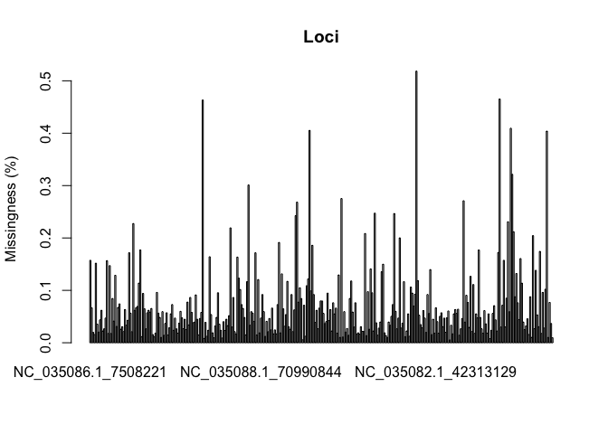
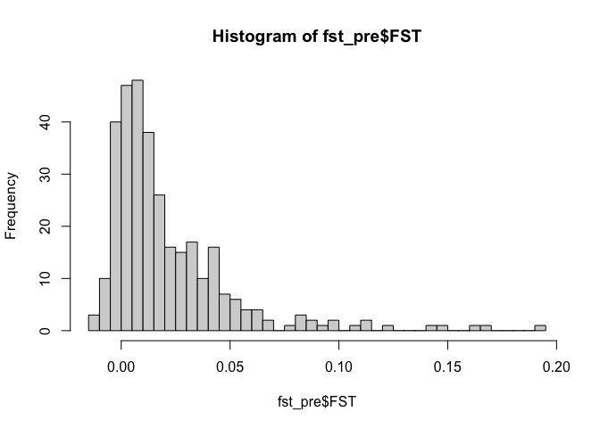
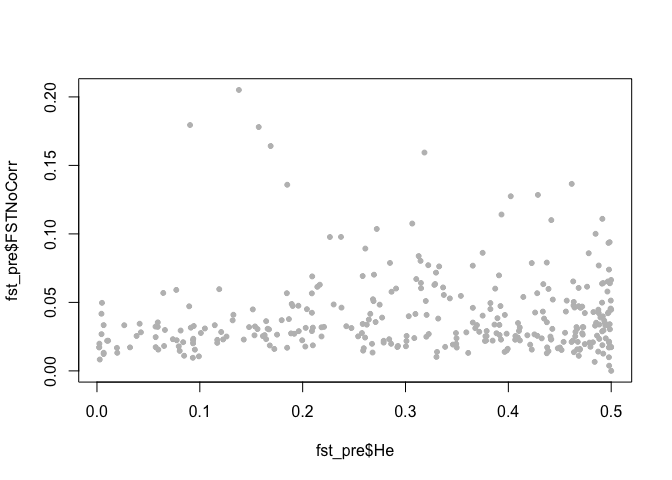
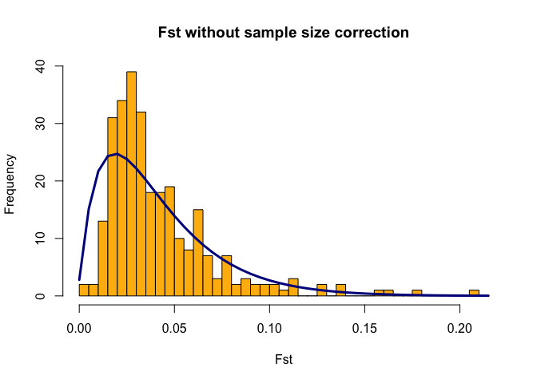

steelhead_outliertest
================
Kimberly Ledger
4/8/2022

### load libraries

``` r
library(vcfR) #this package is used to visualize and manipulate VCF files
library(adegenet) #this package is used for analysis of genetic/genomic data 
library(dplyr) # data manipulation
library(tidyr) # data manipulation
```

# Part 1: Prepare the data

## read in the steelhead (Oncorhynchus mykiss) metadata

### I changed Time == During individuals to Time == Pre in Elwha_Steelhead_Formatted_kjl.csv

``` r
onmy_metadata <- read.csv("~/Desktop/LG_Proj4/Elwha_datafiles/Elwha_Steelhead_Formatted_kjl.csv")
head(onmy_metadata)
```

    ##   Sample_ID Year   Smolt Fork_Length NvH_Origin  Sex    Date Time Location
    ## 1  33649_17 2004 Unknown          NA          N <NA> 7/14/04  Pre       ID
    ## 2  33649_18 2004 Unknown          NA          N <NA> 7/14/04  Pre       ID
    ## 3  33649_19 2004 Unknown          NA          N <NA> 7/14/04  Pre       ID
    ## 4  33649_20 2004 Unknown          NA          N <NA> 7/14/04  Pre       ID
    ## 5  33649_23 2004 Unknown          NA          N <NA> 7/14/04  Pre       ID
    ## 6  33649_26 2004 Unknown          NA          N <NA> 7/14/04  Pre       ID
    ##   Run_Timing Life_Stage Life_History_Type      Lat      Long rkm Sampling_Site
    ## 1    Unknown   Juvenile       Land_Locked 48.11933 -123.5535  NA  little_river
    ## 2    Unknown   Juvenile       Land_Locked 48.06303 -123.5770  NA  little_river
    ## 3    Unknown   Juvenile       Land_Locked 48.06303 -123.5770  NA  little_river
    ## 4    Unknown   Juvenile       Land_Locked 48.06303 -123.5770  NA  little_river
    ## 5    Unknown   Juvenile       Land_Locked 48.06303 -123.5770  NA  little_river
    ## 6    Unknown   Juvenile       Land_Locked 48.06303 -123.5770  NA  little_river

``` r
nrow(onmy_metadata)
```

    ## [1] 1693

### create column to represent both location (AD/ID/BD/SBLR) and time (pre/post)

``` r
onmy_metadata <- onmy_metadata %>%
  unite("Time_Location", c(Time, Location), sep= "_", remove = FALSE)
```

## read in the VCF file

``` r
onmy_vcf <- read.vcfR("~/Desktop/LG_Proj4/Elwha_datafiles/Elwha_GTSeq_Sans_CCT.vcf")
```

    ## Scanning file to determine attributes.
    ## File attributes:
    ##   meta lines: 35
    ##   header_line: 36
    ##   variant count: 334
    ##   column count: 1477
    ## Meta line 35 read in.
    ## All meta lines processed.
    ## gt matrix initialized.
    ## Character matrix gt created.
    ##   Character matrix gt rows: 334
    ##   Character matrix gt cols: 1477
    ##   skip: 0
    ##   nrows: 334
    ##   row_num: 0
    ## Processed variant: 334
    ## All variants processed

``` r
onmy_vcf
```

    ## ***** Object of Class vcfR *****
    ## 1468 samples
    ## 30 CHROMs
    ## 334 variants
    ## Object size: 3.9 Mb
    ## 7.133 percent missing data
    ## *****        *****         *****

# Part 2: seperate data into pre and post dam datasets and use Fst to identify outliers

## to id outliers i will use OutFLANK

this starts with extracting the genotypes from the vcfR object

``` r
geno <- extract.gt(onmy_vcf)
dim(geno)
```

    ## [1]  334 1468

``` r
head(geno[,1:10])
```

    ##                      33649_17 33649_18 33649_19 33649_20 33649_23 33649_26
    ## NC_035086.1_7508221  "0/1"    NA       NA       "0/1"    NA       "0/0"   
    ## NC_035086.1_10852282 "0/0"    "0/0"    "0/1"    "0/0"    "0/1"    "0/1"   
    ## NC_035086.1_30372084 "0/1"    "0/1"    "0/1"    "0/1"    "0/1"    "0/1"   
    ## NC_035086.1_32872704 "0/1"    "0/0"    "0/1"    "0/0"    "1/1"    "0/0"   
    ## NC_035086.1_38704654 "0/0"    "0/0"    "0/0"    "0/0"    "0/0"    "0/0"   
    ## NC_035086.1_40486618 "0/1"    "1/1"    "0/0"    "0/1"    "0/1"    "1/1"   
    ##                      33649_29 33649_30 33649_31 33649_32
    ## NC_035086.1_7508221  "0/0"    NA       NA       "0/1"   
    ## NC_035086.1_10852282 "1/1"    "0/1"    NA       "0/1"   
    ## NC_035086.1_30372084 "0/0"    "0/1"    "0/1"    "0/1"   
    ## NC_035086.1_32872704 "0/1"    "0/1"    "0/1"    "0/1"   
    ## NC_035086.1_38704654 "0/0"    "0/0"    NA       "0/0"   
    ## NC_035086.1_40486618 "0/0"    "0/0"    NA       "1/1"

## check vcf file for missing data

``` r
myMiss_loci <- apply(geno, MARGIN = 1, function(x){ sum(is.na(x)) })
myMiss_loci <- myMiss_loci/nrow(geno)

barplot(myMiss_loci, main = "Loci")
title(ylab = "Missingness (%)")
```

<!-- -->

``` r
myMiss_sample <- apply(geno, MARGIN = 2, function(x){ sum(is.na(x)) })
myMiss_sample <- myMiss_sample/ncol(geno)

barplot(myMiss_sample, main = "Samples")
title(ylab = "Missingness (%)")
```

<!-- -->

``` r
hist(myMiss_sample, main = "Samples with missing data")
```

<!-- -->

## for now just keep only samples with \<20% missing data - think about changing this later

``` r
onmy_vcf@gt <- onmy_vcf@gt[, c(TRUE, myMiss_sample < 0.2)]
onmy_vcf
```

    ## ***** Object of Class vcfR *****
    ## 1468 samples
    ## 30 CHROMs
    ## 334 variants
    ## Object size: 3.9 Mb
    ## 7.133 percent missing data
    ## *****        *****         *****

``` r
geno_filtered <- extract.gt(onmy_vcf)
dim(geno_filtered)
```

    ## [1]  334 1468

``` r
samples <- colnames(geno_filtered)
snp <- rownames(geno_filtered)
```

no samples have \>20% missing data so filtering does not change the
sample count… we have 1468 samples…

Notice that as our genotypes look like 0/0, 0/1, and 1/1. But OutFLANK
wants them to be 0, 1, or 2. The code below fixes this problem:

``` r
G <- geno_filtered  #we are doing this because we will be running a lot of different things with G, and if we mess up we want to be able to go back to geno

G[geno_filtered %in% c("0/0")] <- 0
G[geno_filtered  %in% c("0/1")] <- 1
G[geno_filtered %in% c("1/1")] <- 2
G[is.na(G)] <- 9
tG <- t(G)
dim(tG)
```

    ## [1] 1468  334

## seperate filtered genotype data into a pre-dam and post-dam datasets

``` r
pre_id <- onmy_metadata$Sample_ID[which(onmy_metadata$Time=="Pre")]
post_id <- onmy_metadata$Sample_ID[which(onmy_metadata$Time=="Post")]

geno_pre <- tG[rownames(tG) %in% pre_id,]
dim(geno_pre)
```

    ## [1] 531 334

``` r
geno_post <- tG[rownames(tG) %in% post_id,]
dim(geno_post)
```

    ## [1] 934 334

**note**: there are a few individuals with missing metadata so not all
samples get included here…

now i need to match the population metadata to the genotypes

``` r
samples_df <- data.frame(samples)
colnames(samples_df) <- "Sample_ID"

samples_pre <- samples_df %>%
  left_join(onmy_metadata, by = "Sample_ID") %>%
  filter(Time == "Pre")

samples_post <- samples_df %>%
  left_join(onmy_metadata, by = "Sample_ID") %>%
  filter(Time == "Post")
```

``` r
samples_pre %>%
  group_by(Location) %>%
  summarize(n())
```

    ## # A tibble: 4 × 2
    ##   Location `n()`
    ##   <chr>    <int>
    ## 1 AD         166
    ## 2 BD         132
    ## 3 ID         152
    ## 4 SBLR        81

``` r
samples_pre %>%
  group_by(Location, Sampling_Site) %>%
  summarize(n())
```

    ## `summarise()` has grouped output by 'Location'. You can override using the
    ## `.groups` argument.

    ## # A tibble: 16 × 3
    ## # Groups:   Location [4]
    ##    Location Sampling_Site             `n()`
    ##    <chr>    <chr>                     <int>
    ##  1 AD       cat_creek                    21
    ##  2 AD       elkhorn                      36
    ##  3 AD       geyser                       37
    ##  4 AD       hayes                        32
    ##  5 AD       whiskey_bend                 24
    ##  6 AD       wilder                       16
    ##  7 BD       elwha_river_lower           128
    ##  8 BD       elwha_river_mouth             3
    ##  9 BD       lekt_outlet                   1
    ## 10 ID       aldwell                      16
    ## 11 ID       altaire                      26
    ## 12 ID       campground_creek             29
    ## 13 ID       indian_creek                 13
    ## 14 ID       little_river                 44
    ## 15 ID       madison_creek                24
    ## 16 SBLR     south_branch_little_river    81

``` r
samples_post %>%
  group_by(Location) %>%
  summarize(n())
```

    ## # A tibble: 4 × 2
    ##   Location `n()`
    ##   <chr>    <int>
    ## 1 AD         411
    ## 2 BD         445
    ## 3 ID          53
    ## 4 SBLR        25

``` r
samples_post %>%
  group_by(Location, Sampling_Site) %>%
  summarize(n())
```

    ## `summarise()` has grouped output by 'Location'. You can override using the
    ## `.groups` argument.

    ## # A tibble: 22 × 3
    ## # Groups:   Location [4]
    ##    Location Sampling_Site     `n()`
    ##    <chr>    <chr>             <int>
    ##  1 AD       boulder               6
    ##  2 AD       chicago_camp          6
    ##  3 AD       elkhorn              85
    ##  4 AD       elwha_river_upper     6
    ##  5 AD       geyser               86
    ##  6 AD       hayes                96
    ##  7 AD       long_creek            5
    ##  8 AD       mills               105
    ##  9 AD       windy_arm            16
    ## 10 BD       elwha_river_lower    57
    ## # … with 12 more rows

Now tG should be in the input format OutFLANK needs, with SNPs as
columns and individuals as rows.

Now we can calculate Fst for each SNP: locusNames= names our loci 1,2,3
etc popNames= names our populations with the “Location” or
“Sampling_Site” labels

## first use pre dam samples

## use “Sampling_site” as population

``` r
library(OutFLANK)
```

    ## Loading required package: qvalue

``` r
fst_pre <- MakeDiploidFSTMat(geno_pre,locusNames=colnames(geno_pre),popNames=samples_pre$Sampling_Site)
```

    ## Calculating FSTs, may take a few minutes...

``` r
head(fst_pre)
```

    ##              LocusName          He          FST           T1         T2
    ## 1  NC_035086.1_7508221 0.465914281 0.0049436814 1.153793e-03 0.23338749
    ## 2 NC_035086.1_10852282 0.278244386 0.0032293359 4.499700e-04 0.13933825
    ## 3 NC_035086.1_30372084 0.497478273 0.0017480968 4.349585e-04 0.24881832
    ## 4 NC_035086.1_32872704 0.489716664 0.0008130234 1.992717e-04 0.24509962
    ## 5 NC_035086.1_38704654 0.002333719 0.0019447739 2.272331e-06 0.00116843
    ## 6 NC_035086.1_40486618 0.483792954 0.0063079720 1.528398e-03 0.24229633
    ##    FSTNoCorr     T1NoCorr    T2NoCorr meanAlleleFreq
    ## 1 0.02723758 6.363040e-03 0.233612535      0.6305483
    ## 2 0.02339095 3.262503e-03 0.139477190      0.8329832
    ## 3 0.00384773 9.574894e-04 0.248845259      0.5355086
    ## 4 0.01588725 3.896980e-03 0.245289807      0.5717054
    ## 5 0.01988925 2.325071e-05 0.001169009      0.9988318
    ## 6 0.02257943 5.475244e-03 0.242488138      0.5900196

Fst and He calcuated for each locus

``` r
hist(fst_pre$FST, breaks = 50)
```

<!-- -->

Once we’ve calculated Fst between the populations for each SNP
individually, we want to determine whether some SNPs are statistical
outliers - that is, more differentiated than we would expect. OutFLANK
does this by fitting a Chi-Squared distribution to the data and looking
to see if the tails of the Chi-Squared distribution have more SNPs than
expected:

### Before running OutFLANK, check for loci with low sample sizes or unusual values of uncorrected Fst

``` r
plot(fst_pre$FST, fst_pre$FSTNoCorr, 
     xlim=c(-0.01,0.2), ylim=c(-0.01,0.2),
     pch=20)
abline(0,1)
```

<!-- -->

i believe everything looks good here… no major outliers but some samples
do appear a bit off

### also check for that the Fst distribution looks chi-squared distributed

``` r
plot(fst_pre$He, fst_pre$FSTNoCorr, pch=20, col="grey")
```

<!-- -->

no large Fst values associated with loci of low heterozygosity… i think
we are good to go

``` r
hist(fst_pre$FSTNoCorr, breaks=seq(0,0.4, by=0.001))
```

<!-- -->

``` r
hist(fst_pre$FSTNoCorr[fst_pre$He>0.1], breaks=seq(0,0.4, by=0.001))
```

<!-- -->

it doesn’t look like much changes when i remove samples with \<0.1
heterozygosity…

details on OutFLANK can be found here:
<http://rstudio-pubs-static.s3.amazonaws.com/305384_9aee1c1046394fb9bd8e449453d72847.html>

``` r
OF_pre <- OutFLANK(fst_pre,LeftTrimFraction=0.05,RightTrimFraction=0.1,
         Hmin=0.1,NumberOfSamples=9,qthreshold=0.05)
## check paramaters... these are default except for a RightTrimFraction of 0.1
## the RightTrimFraction determines how many of the highest Fst values are removed before estimating th shape of the fst distribution through likelihood.  when there are potentially a large number of loci affected by spatially heterogeneous selection, it can be worth trying a higher RightTrimFraction. 
## the lowest RightTrimFraction that runs is 0.07 and there are 18 outliers
## RightTrimFraction of 0.1 has 19 outliers 
## RightTrimFraction of 0.15 has 18 outliers 
## WILL GO WITH RightTrimFraction = 0.1, because it will allow me to be more conservative in what i am considering neutral loci 
## NumberOfSamples= number of space/time populations - tried many values here and the result never changed


OutFLANKResultsPlotter(OF_pre,withOutliers=T,
                       NoCorr=T,Hmin=0.1,binwidth=0.005,
                       Zoom=F,RightZoomFraction=0.05,titletext=NULL)
```

<!-- -->

which SNPs are statistical outliers?

``` r
P1_pre <- pOutlierFinderChiSqNoCorr(fst_pre,Fstbar=OF_pre$FSTNoCorrbar,
                                dfInferred=OF_pre$dfInferred,qthreshold=0.05,Hmin=0.1)  

outliers_pre <- P1_pre$OutlierFlag==TRUE #which of the SNPs are outliers?
table(outliers_pre)
```

    ## outliers_pre
    ## FALSE 
    ##   280

``` r
outlier_table_pre <- P1_pre %>%
  filter(OutlierFlag == "TRUE")
head(outlier_table_pre)
```

    ##  [1] LocusName        He               FST              T1              
    ##  [5] T2               FSTNoCorr        T1NoCorr         T2NoCorr        
    ##  [9] meanAlleleFreq   pvalues          pvaluesRightTail qvalues         
    ## [13] OutlierFlag     
    ## <0 rows> (or 0-length row.names)

NO OUTLIERS IN PRE DAM DATASET…

## post dam samples

## use “Sampling_site” as population

``` r
library(OutFLANK)
fst_post <- MakeDiploidFSTMat(geno_post,locusNames=colnames(geno_post),popNames=samples_post$Sampling_Site)
```

    ## Calculating FSTs, may take a few minutes...

``` r
head(fst_post)
```

    ##              LocusName          He          FST           T1          T2
    ## 1  NC_035086.1_7508221 0.466886955 1.095049e-02 2.561797e-03 0.233943543
    ## 2 NC_035086.1_10852282 0.253977611 2.386123e-02 3.042775e-03 0.127519587
    ## 3 NC_035086.1_30372084 0.498683640 8.902048e-05 2.219816e-05 0.249360149
    ## 4 NC_035086.1_32872704 0.488076051 4.046647e-03 9.886382e-04 0.244310452
    ## 5 NC_035086.1_38704654 0.009767774 2.816965e-03 1.377181e-05 0.004888883
    ## 6 NC_035086.1_40486618 0.482898766 3.027002e-03 7.315963e-04 0.241690015
    ##     FSTNoCorr     T1NoCorr    T2NoCorr meanAlleleFreq
    ## 1 0.025874292 6.062017e-03 0.234287279      0.6286722
    ## 2 0.039355107 5.026934e-03 0.127732707      0.8507295
    ## 3 0.001576279 3.931232e-04 0.249399561      0.5256550
    ## 4 0.016739633 4.095258e-03 0.244644456      0.5772138
    ## 5 0.017748782 8.690984e-05 0.004896665      0.9950920
    ## 6 0.016615139 4.021474e-03 0.242036732      0.5924695

Fst and He calcuated for each locus

``` r
hist(fst_post$FST, breaks = 50)
```

<!-- -->

Once we’ve calculated Fst between the populations for each SNP
individually, we want to determine whether some SNPs are statistical
outliers - that is, more differentiated than we would expect. OutFLANK
does this by fitting a Chi-Squared distribution to the data and looking
to see if the tails of the Chi-Squared distribution have more SNPs than
expected:

### Before running OutFLANK, check for loci with low sample sizes or unusual values of uncorrected Fst

``` r
plot(fst_post$FST, fst_post$FSTNoCorr, 
     xlim=c(-0.01,0.2), ylim=c(-0.01,0.2),
     pch=20)
abline(0,1)
```

<!-- -->

i believe everything looks good here… no major outliers but some samples
do appear a bit off

### also check for that the Fst distribution looks chi-squared distributed

``` r
plot(fst_post$He, fst_post$FSTNoCorr, pch=20, col="grey")
```

<!-- -->

thre is one large Fst value associated with loci of low heterozygosity

``` r
hist(fst_post$FSTNoCorr, breaks=seq(0,0.8, by=0.001))
```

<!-- -->

``` r
hist(fst_post$FSTNoCorr[fst_post$He>0.1], breaks=seq(0,0.8, by=0.001))
```

<!-- -->

details on OutFLANK can be found here:
<http://rstudio-pubs-static.s3.amazonaws.com/305384_9aee1c1046394fb9bd8e449453d72847.html>

``` r
OF_post <- OutFLANK(fst_post,LeftTrimFraction=0.05,RightTrimFraction=0.1,
         Hmin=0.1,NumberOfSamples=9,qthreshold=0.05)
## check paramaters... these are default except for a RightTrimFraction of 0.1
## the RightTrimFraction determines how many of the highest Fst values are removed before estimating th shape of the fst distribution through likelihood.  when there are potentially a large number of loci affected by spatially heterogeneous selection, it can be worth trying a higher RightTrimFraction. 
## the lowest RightTrimFraction that runs is 0.07 and there are 18 outliers
## RightTrimFraction of 0.1 has 19 outliers 
## RightTrimFraction of 0.15 has 18 outliers 
## WILL GO WITH RightTrimFraction = 0.1, because it will allow me to be more conservative in what i am considering neutral loci 
## NumberOfSamples= number of space/time populations - tried many values here and the result never changed


OutFLANKResultsPlotter(OF_post,withOutliers=T,
                       NoCorr=T,Hmin=0.1,binwidth=0.005,
                       Zoom=F,RightZoomFraction=0.05,titletext=NULL)
```

<!-- -->

which SNPs are statistical outliers?

``` r
P1_post <- pOutlierFinderChiSqNoCorr(fst_post,Fstbar=OF_post$FSTNoCorrbar,
                                dfInferred=OF_post$dfInferred,qthreshold=0.05,Hmin=0.1)  

outliers_post <- P1_post$OutlierFlag==TRUE #which of the SNPs are outliers?
table(outliers_post)
```

    ## outliers_post
    ## FALSE  TRUE 
    ##   257    26

``` r
outlier_table_post <- P1_post %>%
  filter(OutlierFlag == "TRUE")
outlier_table_post
```

    ##               LocusName        He        FST          T1         T2  FSTNoCorr
    ## 1  NC_035101.1_60064021 0.4997032 0.09771124 0.024780934 0.25361396 0.10987154
    ## 2   NC_035077.1_7354513 0.4877072 0.11885228 0.029504202 0.24824263 0.13055170
    ## 3  NC_035081.1_28579373 0.3411411 0.09827509 0.017094159 0.17394193 0.11485089
    ## 4  NC_035081.1_31675278 0.3527041 0.09043648 0.016254701 0.17973612 0.10815104
    ## 5  NC_035081.1_34973485 0.3105392 0.12585922 0.019941496 0.15844287 0.13808619
    ## 6  NC_035081.1_47337540 0.3134748 0.12238796 0.019565743 0.15986656 0.13499746
    ## 7  NC_035081.1_53469295 0.4205136 0.07797347 0.016593272 0.21280664 0.08999768
    ## 8  NC_035081.1_56162785 0.3117088 0.12634779 0.020097604 0.15906574 0.13861997
    ## 9  NC_035081.1_61828903 0.2689936 0.12272890 0.016813035 0.13699328 0.13523376
    ## 10 NC_035081.1_67568174 0.1923722 0.08020638 0.007810889 0.09738488 0.09248537
    ## 11 NC_035087.1_24411085 0.1899652 0.12155974 0.011760136 0.09674368 0.13081320
    ## 12 NC_035084.1_16303316 0.3045957 0.06732033 0.010358804 0.15387336 0.08082760
    ## 13 NC_035084.1_69427037 0.4937607 0.06845309 0.017081463 0.24953529 0.08078615
    ## 14 NC_035078.1_32793123 0.2960296 0.07036132 0.010529044 0.14964250 0.08495567
    ## 15 NC_035078.1_38922611 0.4553393 0.07081337 0.016293070 0.23008465 0.08815820
    ## 16 NC_035104.1_11607954 0.3535123 0.07841369 0.014045206 0.17911677 0.09613658
    ## 17 NC_035104.1_11618027 0.4846344 0.52646281 0.138201629 0.26250977 0.53379498
    ## 18 NC_035104.1_11625241 0.4171516 0.61284861 0.141435658 0.23078401 0.62039123
    ## 19 NC_035104.1_11632591 0.4997382 0.29890044 0.078666242 0.26318544 0.31107014
    ## 20 NC_035104.1_11641623 0.4302511 0.61884197 0.146474667 0.23669155 0.62505785
    ## 21 NC_035104.1_11658853 0.4138949 0.61311140 0.140357638 0.22892681 0.62059757
    ## 22 NC_035104.1_11667578 0.3915750 0.60486993 0.133081857 0.22001731 0.61419285
    ## 23 NC_035104.1_11667915 0.4529824 0.60038870 0.149038004 0.24823586 0.60707375
    ## 24 NC_035104.1_11671116 0.4056729 0.63132753 0.147090739 0.23298642 0.64412641
    ## 25 NC_035104.1_11676622 0.4080582 0.54648571 0.123436583 0.22587340 0.55977585
    ## 26 NC_035104.1_11683204 0.3978954 0.58500478 0.129870590 0.22199920 0.59457836
    ##       T1NoCorr   T2NoCorr meanAlleleFreq      pvalues pvaluesRightTail
    ## 1  0.027901323 0.25394495      0.5121816 2.354700e-04     1.177350e-04
    ## 2  0.032448461 0.24854874      0.5783991 1.848964e-05     9.244822e-06
    ## 3  0.020027854 0.17438136      0.7818323 1.286670e-04     6.433350e-05
    ## 4  0.019494796 0.18025528      0.7713816 2.897542e-04     1.448771e-04
    ## 5  0.021910012 0.15866910      0.8077830 7.171772e-06     3.585886e-06
    ## 6  0.021613515 0.16010311      0.8053892 1.058605e-05     5.293026e-06
    ## 7  0.019176924 0.21308242      0.6993569 2.460661e-03     1.230330e-03
    ## 8  0.022081484 0.15929512      0.8068316 6.704015e-06     3.352008e-06
    ## 9  0.018550440 0.13717314      0.8398577 1.027592e-05     5.137961e-06
    ## 10 0.009018581 0.09751360      0.8921911 1.846415e-03     9.232074e-04
    ## 11 0.012667935 0.09683989      0.8937225 1.789468e-05     8.947338e-06
    ## 12 0.012454675 0.15408939      0.8125734 6.955768e-03     3.477884e-03
    ## 13 0.020185953 0.24986899      0.5558539 6.987987e-03     3.493994e-03
    ## 14 0.012732715 0.14987481      0.8193512 4.374414e-03     2.187207e-03
    ## 15 0.020315194 0.23044021      0.6494334 3.038626e-03     1.519313e-03
    ## 16 0.017256368 0.17949846      0.7706360 1.206902e-03     6.034511e-04
    ## 17 0.140240473 0.26272348      0.5876516 0.000000e+00     0.000000e+00
    ## 18 0.143311760 0.23100223      0.7035294 0.000000e+00     0.000000e+00
    ## 19 0.081999667 0.26360508      0.5114401 6.661338e-16     3.330669e-16
    ## 20 0.148050485 0.23685885      0.6867470 0.000000e+00     0.000000e+00
    ## 21 0.142204218 0.22914079      0.7074911 0.000000e+00     0.000000e+00
    ## 22 0.135326701 0.22033259      0.7328358 0.000000e+00     0.000000e+00
    ## 23 0.150810133 0.24842144      0.6533258 0.000000e+00     0.000000e+00
    ## 24 0.150425579 0.23353425      0.7171717 0.000000e+00     0.000000e+00
    ## 25 0.126683235 0.22631065      0.7144082 0.000000e+00     0.000000e+00
    ## 26 0.132185288 0.22231769      0.7259475 0.000000e+00     0.000000e+00
    ##         qvalues OutlierFlag
    ## 1  1.471687e-03        TRUE
    ## 2  1.300053e-04        TRUE
    ## 3  8.514728e-04        TRUE
    ## 4  1.715650e-03        TRUE
    ## 5  6.723537e-05        TRUE
    ## 6  8.506649e-05        TRUE
    ## 7  1.258292e-02        TRUE
    ## 8  6.723537e-05        TRUE
    ## 9  8.506649e-05        TRUE
    ## 10 9.891508e-03        TRUE
    ## 11 1.300053e-04        TRUE
    ## 12 3.023648e-02        TRUE
    ## 13 3.023648e-02        TRUE
    ## 14 2.050506e-02        TRUE
    ## 15 1.486284e-02        TRUE
    ## 16 6.788825e-03        TRUE
    ## 17 0.000000e+00        TRUE
    ## 18 0.000000e+00        TRUE
    ## 19 7.494005e-15        TRUE
    ## 20 0.000000e+00        TRUE
    ## 21 0.000000e+00        TRUE
    ## 22 0.000000e+00        TRUE
    ## 23 0.000000e+00        TRUE
    ## 24 0.000000e+00        TRUE
    ## 25 0.000000e+00        TRUE
    ## 26 0.000000e+00        TRUE

26 OUTLIERS IN POST DAM DATASET!!!

Now we can make a manhattan plot! We can even plot the outliers in a
different color:

``` r
P1_post$num <- c(1:334)
plot(P1_post$num,P1_post$FST,xlab="Position",ylab="FST",col=rgb(0,0,0,alpha=0.1))
points(P1_post$num[outliers_post],P1_post$FST[outliers_post],col="magenta")
```

<!-- -->

## compare Fst outliers (postdam) to GTseq panel w/ putitively neutral/adaptive designation

## read in loci metadata

``` r
onmy_loci_meta <- read.csv("~/Desktop/LG_Proj4/Elwha_datafiles/Steelhead_Locus_Key_kjl.csv")
```

## read in SNP coordinate data

``` r
onmy_snp_coord <- read.csv("~/Desktop/LG_Proj4/Elwha_datafiles/SNP_Coordinates_CRITFC.csv")
```

join loci metadata and SNP coords

``` r
onmy_locus_join <- onmy_snp_coord %>%
  left_join(onmy_loci_meta, by = "Locus")
```

join outlier info to metadata for only the loci included in the vcf

``` r
onmy_snp <- onmy_locus_join %>%
  rename(LocusName = SNP) %>%
  right_join(P1_post)
```

    ## Joining, by = "LocusName"

filter for only outliers

``` r
onmy_snp_outliers <- onmy_snp %>%
  filter(OutlierFlag == TRUE)
onmy_snp_outliers
```

    ##                Locus chromosome snp.coordinate.in.genome    Scaffold
    ## 1           OMS00153      omy08                 16303316 NC_035084.1
    ## 2           OMS00169      omy05                 67568174 NC_035081.1
    ## 3     Omy_BAMBI4.238      omy11                 24411085 NC_035087.1
    ## 4  Omy_bcAKala-380rd      omy05                 53469295 NC_035081.1
    ## 5      Omy_cd59b-112      omy02                 38922611 NC_035078.1
    ## 6       Omy_GREB1_05      omy28                 11618027 NC_035104.1
    ## 7       Omy_GREB1_09      omy28                 11641623 NC_035104.1
    ## 8       Omy_nkef-241      omy08                 69427037 NC_035084.1
    ## 9    Omy_RAD14033-46      omy25                 60064021 NC_035101.1
    ## 10   Omy_RAD15709-53      omy28                 11667915 NC_035104.1
    ## 11   Omy_RAD25042-68      omy02                 32793123 NC_035078.1
    ## 12   Omy_RAD47080-54      omy28                 11667915 NC_035104.1
    ## 13   Omy_RAD72528-44      omy01                  7354513 NC_035077.1
    ## 14    Omy_SECC22b-88      omy05                 61828903 NC_035081.1
    ## 15    Omy28_11607954      omy28                 11607954 NC_035104.1
    ## 16    Omy28_11625241      omy28                 11625241 NC_035104.1
    ## 17    Omy28_11632591      omy28                 11632591 NC_035104.1
    ## 18    Omy28_11658853      omy28                 11658853 NC_035104.1
    ## 19    Omy28_11667578      omy28                 11667578 NC_035104.1
    ## 20    Omy28_11671116      omy28                 11671116 NC_035104.1
    ## 21    Omy28_11676622      omy28                 11676622 NC_035104.1
    ## 22    Omy28_11683204      omy28                 11683204 NC_035104.1
    ## 23         OmyR14589      omy05                 56162785 NC_035081.1
    ## 24         OmyR19198      omy05                 34973485 NC_035081.1
    ## 25         OmyR24370      omy05                 28579373 NC_035081.1
    ## 26         OmyR33562      omy05                 47337540 NC_035081.1
    ## 27         OmyR40252      omy05                 31675278 NC_035081.1
    ##               LocusName Other Physical_Position      Locus_Name1   Status
    ## 1  NC_035084.1_16303316     0          16303316         OMS00153  Neutral
    ## 2  NC_035081.1_67568174     0          67568174         OMS00169  Neutral
    ## 3  NC_035087.1_24411085     0          24411085    Omy_BAMBI4238  Neutral
    ## 4  NC_035081.1_53469295     0          53469295 Omy_bcAKala380rd  Neutral
    ## 5  NC_035078.1_38922611     0          38922611     Omy_cd59b112  Neutral
    ## 6  NC_035104.1_11618027     0          11618027     Omy_GREB1_05 Adaptive
    ## 7  NC_035104.1_11641623     0          11641623     Omy_GREB1_09 Adaptive
    ## 8  NC_035084.1_69427037     0          69427037      Omy_nkef241  Neutral
    ## 9  NC_035101.1_60064021     0          60064021   Omy_RAD1403346 Adaptive
    ## 10 NC_035104.1_11667915     0          11667915   Omy_RAD1570953 Adaptive
    ## 11 NC_035078.1_32793123     0          32793123   Omy_RAD2504268 Adaptive
    ## 12 NC_035104.1_11667915     0          11667915   Omy_RAD4708054 Adaptive
    ## 13  NC_035077.1_7354513     0           7354513   Omy_RAD7252844 Adaptive
    ## 14 NC_035081.1_61828903     0          61828903    Omy_SECC22b88  Neutral
    ## 15 NC_035104.1_11607954     0          11607954   Chr28_11607954 Adaptive
    ## 16 NC_035104.1_11625241     0          11625241   Chr28_11625241 Adaptive
    ## 17 NC_035104.1_11632591     0          11632591   Chr28_11632591 Adaptive
    ## 18 NC_035104.1_11658853     0          11658853   Chr28_11658853 Adaptive
    ## 19 NC_035104.1_11667578     0          11667578   Chr28_11667578 Adaptive
    ## 20 NC_035104.1_11671116     0          11671116   Chr28_11671116 Adaptive
    ## 21 NC_035104.1_11676622     0          11676622   Chr28_11676622 Adaptive
    ## 22 NC_035104.1_11683204     0          11683204   Chr28_11683204 Adaptive
    ## 23 NC_035081.1_56162785     0          56162785        OmyR14589 Adaptive
    ## 24 NC_035081.1_34973485     0          34973485        OmyR19198 Adaptive
    ## 25 NC_035081.1_28579373     0          28579373        OmyR24370 Adaptive
    ## 26 NC_035081.1_47337540     0          47337540        OmyR33562 Adaptive
    ## 27 NC_035081.1_31675278     0          31675278        OmyR40252 Adaptive
    ##                                                         SNPeff.Annotation.output
    ## 1                                                                        Neutral
    ## 2                                                      Neutral. Possible linkage
    ## 3                                                                        Neutral
    ## 4                                                                        Neutral
    ## 5                                                                        Neutral
    ## 6                                                           Adaptive. Run timing
    ## 7                                                           Adaptive. Run Timing
    ## 8                                                                        Neutral
    ## 9  Adaptive. Maxiumum air temperature (warmest quarter). Basin-wide, top-outlier
    ## 10            Adaptive. Natal site Isothermality. Basin-wide, run-time - related
    ## 11             Adaptive. Maximum annual air temperature. Basin-wide, top-outlier
    ## 12                                                          Adaptive. Run Timing
    ## 13            Adaptive. Range of annual air temperature. Basin-wide, top-outlier
    ## 14                                                     Neutral. Possible linkage
    ## 15                                                          Adaptive. Run Timing
    ## 16                                                          Adaptive. Run Timing
    ## 17                                                          Adaptive. Run Timing
    ## 18                                                          Adaptive. Run Timing
    ## 19                                                          Adaptive. Run Timing
    ## 20                                                          Adaptive. Run Timing
    ## 21                                                          Adaptive. Run Timing
    ## 22                                                          Adaptive. Run Timing
    ## 23                                               Adaptive. Residency vs anadromy
    ## 24                                               Adaptive. Residency vs anadromy
    ## 25                                               Adaptive. Residency vs anadromy
    ## 26                                               Adaptive. Residency vs anadromy
    ## 27                                               Adaptive. Residency vs anadromy
    ##                                  Source
    ## 1                   Sánchez et al. 2009
    ## 2                   Sánchez et al. 2009
    ## 3                     Young unpublished
    ## 4                     Narum et al. 2010
    ## 5             DeKoning unpublished. WSU
    ## 6          Micheletti et al unpublished
    ## 7          Micheletti et al unpublished
    ## 8                  Campbell et al. 2009
    ## 9        Micheletti et al 2018 Mol Ecol
    ## 10           Gen Assess BPA report 2017
    ## 11       Micheletti et al 2018 Mol Ecol
    ## 12               Hess et al 2016, ProcB
    ## 13       Micheletti et al 2018 Mol Ecol
    ## 14                 Campbell unpublished
    ## 15 Micheletti et al. 2018, BMC Evol Bio
    ## 16 Micheletti et al. 2018, BMC Evol Bio
    ## 17 Micheletti et al. 2018, BMC Evol Bio
    ## 18       Micheletti et al 2018 Mol Ecol
    ## 19       Micheletti et al 2018 Mol Ecol
    ## 20       Micheletti et al 2018 Mol Ecol
    ## 21       Micheletti et al 2018 Mol Ecol
    ## 22       Micheletti et al 2018 Mol Ecol
    ## 23  Kathleen O Malley from Devon Pearse
    ## 24  Kathleen O Malley from Devon Pearse
    ## 25  Kathleen O Malley from Devon Pearse
    ## 26  Kathleen O Malley from Devon Pearse
    ## 27  Kathleen O Malley from Devon Pearse
    ##                                          Notes        He        FST          T1
    ## 1                                              0.3045957 0.06732033 0.010358804
    ## 2  Omy_SECC22b-88 and OMS00169 are linked loci 0.1923722 0.08020638 0.007810889
    ## 3                                              0.1899652 0.12155974 0.011760136
    ## 4                                              0.4205136 0.07797347 0.016593272
    ## 5                                              0.4553393 0.07081337 0.016293070
    ## 6                                              0.4846344 0.52646281 0.138201629
    ## 7                                              0.4302511 0.61884197 0.146474667
    ## 8                                              0.4937607 0.06845309 0.017081463
    ## 9                                              0.4997032 0.09771124 0.024780934
    ## 10                                             0.4529824 0.60038870 0.149038004
    ## 11                                             0.2960296 0.07036132 0.010529044
    ## 12                                             0.4529824 0.60038870 0.149038004
    ## 13                                             0.4877072 0.11885228 0.029504202
    ## 14 Omy_SECC22b-88 and OMS00169 are linked loci 0.2689936 0.12272890 0.016813035
    ## 15                                             0.3535123 0.07841369 0.014045206
    ## 16                                             0.4171516 0.61284861 0.141435658
    ## 17                                             0.4997382 0.29890044 0.078666242
    ## 18                                             0.4138949 0.61311140 0.140357638
    ## 19                                             0.3915750 0.60486993 0.133081857
    ## 20                                             0.4056729 0.63132753 0.147090739
    ## 21                                             0.4080582 0.54648571 0.123436583
    ## 22                                             0.3978954 0.58500478 0.129870590
    ## 23                                             0.3117088 0.12634779 0.020097604
    ## 24                                             0.3105392 0.12585922 0.019941496
    ## 25                                             0.3411411 0.09827509 0.017094159
    ## 26                                             0.3134748 0.12238796 0.019565743
    ## 27                                 Spike to 2X 0.3527041 0.09043648 0.016254701
    ##            T2  FSTNoCorr    T1NoCorr   T2NoCorr meanAlleleFreq      pvalues
    ## 1  0.15387336 0.08082760 0.012454675 0.15408939      0.8125734 6.955768e-03
    ## 2  0.09738488 0.09248537 0.009018581 0.09751360      0.8921911 1.846415e-03
    ## 3  0.09674368 0.13081320 0.012667935 0.09683989      0.8937225 1.789468e-05
    ## 4  0.21280664 0.08999768 0.019176924 0.21308242      0.6993569 2.460661e-03
    ## 5  0.23008465 0.08815820 0.020315194 0.23044021      0.6494334 3.038626e-03
    ## 6  0.26250977 0.53379498 0.140240473 0.26272348      0.5876516 0.000000e+00
    ## 7  0.23669155 0.62505785 0.148050485 0.23685885      0.6867470 0.000000e+00
    ## 8  0.24953529 0.08078615 0.020185953 0.24986899      0.5558539 6.987987e-03
    ## 9  0.25361396 0.10987154 0.027901323 0.25394495      0.5121816 2.354700e-04
    ## 10 0.24823586 0.60707375 0.150810133 0.24842144      0.6533258 0.000000e+00
    ## 11 0.14964250 0.08495567 0.012732715 0.14987481      0.8193512 4.374414e-03
    ## 12 0.24823586 0.60707375 0.150810133 0.24842144      0.6533258 0.000000e+00
    ## 13 0.24824263 0.13055170 0.032448461 0.24854874      0.5783991 1.848964e-05
    ## 14 0.13699328 0.13523376 0.018550440 0.13717314      0.8398577 1.027592e-05
    ## 15 0.17911677 0.09613658 0.017256368 0.17949846      0.7706360 1.206902e-03
    ## 16 0.23078401 0.62039123 0.143311760 0.23100223      0.7035294 0.000000e+00
    ## 17 0.26318544 0.31107014 0.081999667 0.26360508      0.5114401 6.661338e-16
    ## 18 0.22892681 0.62059757 0.142204218 0.22914079      0.7074911 0.000000e+00
    ## 19 0.22001731 0.61419285 0.135326701 0.22033259      0.7328358 0.000000e+00
    ## 20 0.23298642 0.64412641 0.150425579 0.23353425      0.7171717 0.000000e+00
    ## 21 0.22587340 0.55977585 0.126683235 0.22631065      0.7144082 0.000000e+00
    ## 22 0.22199920 0.59457836 0.132185288 0.22231769      0.7259475 0.000000e+00
    ## 23 0.15906574 0.13861997 0.022081484 0.15929512      0.8068316 6.704015e-06
    ## 24 0.15844287 0.13808619 0.021910012 0.15866910      0.8077830 7.171772e-06
    ## 25 0.17394193 0.11485089 0.020027854 0.17438136      0.7818323 1.286670e-04
    ## 26 0.15986656 0.13499746 0.021613515 0.16010311      0.8053892 1.058605e-05
    ## 27 0.17973612 0.10815104 0.019494796 0.18025528      0.7713816 2.897542e-04
    ##    pvaluesRightTail      qvalues OutlierFlag num
    ## 1      3.477884e-03 3.023648e-02        TRUE 162
    ## 2      9.232074e-04 9.891508e-03        TRUE 138
    ## 3      8.947338e-06 1.300053e-04        TRUE 141
    ## 4      1.230330e-03 1.258292e-02        TRUE 134
    ## 5      1.519313e-03 1.486284e-02        TRUE 225
    ## 6      0.000000e+00 0.000000e+00        TRUE 249
    ## 7      0.000000e+00 0.000000e+00        TRUE 252
    ## 8      3.493994e-03 3.023648e-02        TRUE 171
    ## 9      1.177350e-04 1.471687e-03        TRUE  16
    ## 10     0.000000e+00 0.000000e+00        TRUE 255
    ## 11     2.187207e-03 2.050506e-02        TRUE 224
    ## 12     0.000000e+00 0.000000e+00        TRUE 255
    ## 13     9.244822e-06 1.300053e-04        TRUE  19
    ## 14     5.137961e-06 8.506649e-05        TRUE 137
    ## 15     6.034511e-04 6.788825e-03        TRUE 248
    ## 16     0.000000e+00 0.000000e+00        TRUE 250
    ## 17     3.330669e-16 7.494005e-15        TRUE 251
    ## 18     0.000000e+00 0.000000e+00        TRUE 253
    ## 19     0.000000e+00 0.000000e+00        TRUE 254
    ## 20     0.000000e+00 0.000000e+00        TRUE 256
    ## 21     0.000000e+00 0.000000e+00        TRUE 257
    ## 22     0.000000e+00 0.000000e+00        TRUE 258
    ## 23     3.352008e-06 6.723537e-05        TRUE 135
    ## 24     3.585886e-06 6.723537e-05        TRUE 131
    ## 25     6.433350e-05 8.514728e-04        TRUE 129
    ## 26     5.293026e-06 8.506649e-05        TRUE 133
    ## 27     1.448771e-04 1.715650e-03        TRUE 130

``` r
#write.csv(onmy_snp_outliers, "outputs/fst_outlier_loci_post_onmy.csv")
```

there are now 27 rows because the SNP NC_035104.1_11667915 has duplicate
loci metadata.

filter vct gt to remove the outlier loci

``` r
remove1 <- onmy_snp_outliers$LocusName

geno_nonoutlier <- geno_filtered[!rownames(geno_filtered) %in% remove1, ]
dim(geno_nonoutlier)
```

    ## [1]  308 1468

## transpose nonoutlier genotypes and combine with sample metadata

``` r
tG_nonout <- t(geno_nonoutlier)
tG_nonout <- as.data.frame(tG_nonout)
tG_nonout$Sample_ID <- rownames(tG_nonout)

onmy_nonout_df <- tG_nonout %>%
  left_join(onmy_metadata, by = "Sample_ID")
```

## check for deviation from HWE

## create genind objects from pre and post dam samples

``` r
onmy_nonout_df_pre <- onmy_nonout_df %>%
  filter(Time == "Pre")

onmy_nonout_df_post <- onmy_nonout_df %>%
  filter(Time == "Post")

geno_n_pre <- onmy_nonout_df_pre[,c(1:308)]
rownames(geno_n_pre) <- onmy_nonout_df_pre$Sample_ID
col_geno_n_pre <- gsub("\\.", "_", colnames(geno_n_pre))
colnames(geno_n_pre) <- col_geno_n_pre

meta_pre <- onmy_nonout_df_pre[,-c(1:308)]

pre_loci <- colnames(geno_n_pre)
pre_ind <- rownames(geno_n_pre)
pre_location <- meta_pre$Location
#pre_rkm <- meta_pre$rkm
pre_site <- meta_pre$Sampling_Site

onmy_genind_pre_location <- df2genind(geno_n_pre,
                         sep="/",
                         ind.names=pre_ind,
                         loc.names=pre_loci, 
                         pop = pre_location,     
                         ploidy = 2)
onmy_genind_pre_location
```

    ## /// GENIND OBJECT /////////
    ## 
    ##  // 531 individuals; 308 loci; 610 alleles; size: 1.5 Mb
    ## 
    ##  // Basic content
    ##    @tab:  531 x 610 matrix of allele counts
    ##    @loc.n.all: number of alleles per locus (range: 1-2)
    ##    @loc.fac: locus factor for the 610 columns of @tab
    ##    @all.names: list of allele names for each locus
    ##    @ploidy: ploidy of each individual  (range: 2-2)
    ##    @type:  codom
    ##    @call: df2genind(X = geno_n_pre, sep = "/", ind.names = pre_ind, loc.names = pre_loci, 
    ##     pop = pre_location, ploidy = 2)
    ## 
    ##  // Optional content
    ##    @pop: population of each individual (group size range: 81-166)

``` r
# onmy_genind_pre_site <- df2genind(geno_n_pre,
#                          sep="/",
#                          ind.names=pre_ind,
#                          loc.names=pre_loci, 
#                          pop = pre_site,      
#                          ploidy = 2)
# onmy_genind_pre_site


geno_n_post <- onmy_nonout_df_post[,c(1:308)]
rownames(geno_n_post) <- onmy_nonout_df_post$Sample_ID
col_geno_n_post <- gsub("\\.", "_", colnames(geno_n_post))
colnames(geno_n_post) <- col_geno_n_post

meta_post <- onmy_nonout_df_post[,-c(1:308)]

post_loci <- colnames(geno_n_post)
post_ind <- rownames(geno_n_post)
post_location <- meta_post$Location
#post_rkm <- meta_post$rkm
post_site <- meta_post$Sampling_Site

onmy_genind_post_location <- df2genind(geno_n_post,
                         sep="/",
                         ind.names=post_ind,
                         loc.names=post_loci, 
                         pop = post_location,
                         ploidy = 2)
onmy_genind_post_location
```

    ## /// GENIND OBJECT /////////
    ## 
    ##  // 934 individuals; 308 loci; 613 alleles; size: 2.5 Mb
    ## 
    ##  // Basic content
    ##    @tab:  934 x 613 matrix of allele counts
    ##    @loc.n.all: number of alleles per locus (range: 1-2)
    ##    @loc.fac: locus factor for the 613 columns of @tab
    ##    @all.names: list of allele names for each locus
    ##    @ploidy: ploidy of each individual  (range: 2-2)
    ##    @type:  codom
    ##    @call: df2genind(X = geno_n_post, sep = "/", ind.names = post_ind, loc.names = post_loci, 
    ##     pop = post_location, ploidy = 2)
    ## 
    ##  // Optional content
    ##    @pop: population of each individual (group size range: 25-445)

``` r
# onmy_genind_post_site <- df2genind(geno_n_post,
#                          sep="/",
#                          ind.names=post_ind,
#                          loc.names=post_loci, 
#                          pop = post_site,
#                          ploidy = 2)
# onmy_genind_post_site
```

## check for deviations from hardy-weinberg equilibrium at the population level

### PRE-DAM samples with LOCATION as popultion

``` r
set.seed(5)
onmy_neutral_hw_test <- data.frame(sapply(seppop(onmy_genind_pre_location), 
                              function(ls) pegas::hw.test(ls, B = 1000)[,3])) # set B=0 to skip permutation test

onmy_neutral_hw_chisq <- t(data.matrix(onmy_neutral_hw_test))

Chisq.fdr <- matrix(p.adjust(onmy_neutral_hw_chisq,method="fdr"), 
                    nrow=nrow(onmy_neutral_hw_chisq))

# proportion of loci out of HWE 
alpha=0.05
Prop.loci.out.of.HWE <- data.frame(Chisq=apply(onmy_neutral_hw_chisq<alpha, 2, mean),
                                   Chisq.fdr=apply(Chisq.fdr<alpha, 2, mean))

# i will remove loci out of HWE in 3 or more of the populations 
loci_out_of_HWE_pre <- Prop.loci.out.of.HWE %>%
  filter(Chisq.fdr > 0.5)
loci_out_of_HWE_pre 
```

    ##                      Chisq Chisq.fdr
    ## NC_035086_1_30372084  1.00      1.00
    ## NC_035092_1_16334074  0.75      0.75
    ## NC_035092_1_44116456  1.00      1.00
    ## NC_035083_1_57239957  0.75      0.75
    ## NC_035080_1_68318464  1.00      0.75
    ## NC_035081_1_40927121  0.75      0.75
    ## NC_035087_1_37031757  0.75      0.75
    ## NC_035091_1_44094440  0.75      0.75
    ## NC_035079_1_38336651  1.00      1.00
    ## NW_24                 1.00      1.00

``` r
# for each population, the proportion of loci out of HWE
Prop.pops.out.of.HWE <- data.frame(Chisq=apply(onmy_neutral_hw_chisq<alpha, 1, mean), 
           Chisq.fdr=apply(Chisq.fdr<alpha, 1, mean))
Prop.pops.out.of.HWE             
```

    ##           Chisq  Chisq.fdr
    ## ID   0.21103896 0.11038961
    ## SBLR 0.12012987 0.04870130
    ## AD   0.14935065 0.06493506
    ## BD   0.09415584 0.03246753

## check for deviations from hardy-weinberg equilibrium at the population level

### POST-DAM samples with LOCATION AS POP

``` r
set.seed(5)
onmy_neutral_hw_test <- data.frame(sapply(seppop(onmy_genind_post_location), 
                              function(ls) pegas::hw.test(ls, B = 1000)[,3])) # set B=0 to skip permutation test 

onmy_neutral_hw_chisq <- t(data.matrix(onmy_neutral_hw_test))

Chisq.fdr <- matrix(p.adjust(onmy_neutral_hw_chisq,method="fdr"), 
                    nrow=nrow(onmy_neutral_hw_chisq))

# proportion of loci out of HWE 
alpha=0.05
Prop.loci.out.of.HWE <- data.frame(Chisq=apply(onmy_neutral_hw_chisq<alpha, 2, mean),
                                   Chisq.fdr=apply(Chisq.fdr<alpha, 2, mean))

# i will remove loci out of HWE in 3 or more of the populations 
loci_out_of_HWE_post <- Prop.loci.out.of.HWE %>%
  filter(Chisq.fdr > 0.5)
loci_out_of_HWE_post
```

    ##                      Chisq Chisq.fdr
    ## NC_035086_1_30372084  1.00      1.00
    ## NC_035092_1_16334074  0.75      0.75
    ## NC_035080_1_68318464  0.75      0.75
    ## NC_035081_1_61772669  0.75      0.75
    ## NC_035091_1_44094440  0.75      0.75
    ## NC_035078_1_52384497  0.75      0.75
    ## NC_035079_1_38336651  1.00      1.00
    ## NW_24                 0.75      0.75

``` r
# for each population, the proportion of loci out of HWE
Prop.pops.out.of.HWE <- data.frame(Chisq=apply(onmy_neutral_hw_chisq<alpha, 1, mean), 
           Chisq.fdr=apply(Chisq.fdr<alpha, 1, mean))
Prop.pops.out.of.HWE   
```

    ##           Chisq  Chisq.fdr
    ## BD   0.16883117 0.08116883
    ## ID   0.11038961 0.04870130
    ## AD   0.19155844 0.12012987
    ## SBLR 0.04545455 0.01298701

filter vct gt to remove the loci out of HWE in 3 or more populations pre
and/or post dam removal

``` r
rownames(loci_out_of_HWE_pre)
```

    ##  [1] "NC_035086_1_30372084" "NC_035092_1_16334074" "NC_035092_1_44116456"
    ##  [4] "NC_035083_1_57239957" "NC_035080_1_68318464" "NC_035081_1_40927121"
    ##  [7] "NC_035087_1_37031757" "NC_035091_1_44094440" "NC_035079_1_38336651"
    ## [10] "NW_24"

``` r
rownames(loci_out_of_HWE_post)
```

    ## [1] "NC_035086_1_30372084" "NC_035092_1_16334074" "NC_035080_1_68318464"
    ## [4] "NC_035081_1_61772669" "NC_035091_1_44094440" "NC_035078_1_52384497"
    ## [7] "NC_035079_1_38336651" "NW_24"

``` r
## need to convert second "_" back to a "." to remove 
remove2 <- c("NC_035086.1_30372084",  "NC_035092.1_16334074",  "NC_035092.1_44116456",  "NC_035083.1_57239957", 
"NC_035080.1_68318464",  "NC_035081.1_40927121",  "NC_035087.1_37031757",  "NC_035091.1_44094440", 
"NC_035079.1_38336651",  "NW_24", "NC_035081.1_61772669", "NC_035078.1_52384497")

geno_nonoutlier_HWE <- geno_nonoutlier[!rownames(geno_nonoutlier) %in% remove2, ]
dim(geno_nonoutlier_HWE)
```

    ## [1]  296 1468

## transpose nonoutlier genotypes and loci in HWE and combine with sample metadata

``` r
tG_nonout <- t(geno_nonoutlier_HWE)
tG_nonout <- as.data.frame(tG_nonout)
tG_nonout$Sample_ID <- rownames(tG_nonout)

onmy_nonout_HWE_df <- tG_nonout %>%
  left_join(onmy_metadata, by = "Sample_ID")
```

## output joined non-outlier genotypes and loci in HWE with metadata for further analyses using other scripts

``` r
#write.csv(onmy_nonout_HWE_df, "outputs/onmy_loci4genstr_outflank_hwe.csv")
```

look at putative adaptive non-outliers that are in HWE

``` r
onmy_snp_adapt_nonoutlier <- onmy_snp %>%
  filter(OutlierFlag != TRUE) %>%
  filter(Status == "Adaptive")

onmy_snp_adapt_nonoutlier_hwe <- onmy_snp_adapt_nonoutlier[!onmy_snp_adapt_nonoutlier$LocusName %in% remove2, ]
onmy_snp_adapt_nonoutlier_hwe
```

    ##              Locus chromosome snp.coordinate.in.genome    Scaffold
    ## 1  Omy_RAD10733-10      omy10                 41411754 NC_035086.1
    ## 2   Omy_RAD1186-59      omy25                 70252314 NC_035101.1
    ## 3  Omy_RAD12566-14      omy14                 44125336 NC_035090.1
    ## 4  Omy_RAD13034-67      omy26                 12537039 NC_035102.1
    ## 5  Omy_RAD13073-16      omy05                 13954598 NC_035081.1
    ## 6  Omy_RAD13499-13      omy03                 38408941 NC_035079.1
    ## 8  Omy_RAD19578-59      omy12                 67131514 NC_035088.1
    ## 10 Omy_RAD22123-69      omy17                 23756920 NC_035093.1
    ## 12 Omy_RAD24287-74      omy08                 28035734 NC_035084.1
    ## 13   Omy_RAD2567-8      omy07                 43793241 NC_035083.1
    ## 14 Omy_RAD26691-36      omy12                 47284987 NC_035088.1
    ## 15 Omy_RAD28236-38      omy08                 40399499 NC_035084.1
    ## 16 Omy_RAD30619-61      omy07                 42710419 NC_035083.1
    ## 17 Omy_RAD31408-67      omy16                 48341010 NC_035092.1
    ## 18  Omy_RAD3209-10      omy18                 50984953 NC_035094.1
    ## 19 Omy_RAD33122-47      omy12                 66078752 NC_035088.1
    ## 21 Omy_RAD35005-13      omy21                 37188435 NC_035097.1
    ## 22  Omy_RAD35149-9      omy06                 60182501 NC_035082.1
    ## 23  Omy_RAD35417-9      omy06                 15867514 NC_035082.1
    ## 24  Omy_RAD3651-48      omy23                 32029860 NC_035099.1
    ## 25    Omy_RAD366-7      omy07                  6230066 NC_035083.1
    ## 26 Omy_RAD37816-68      omy02                 73500031 NC_035078.1
    ## 27 Omy_RAD38406-19      omy12                 48181130 NC_035088.1
    ## 28  Omy_RAD3926-22      omy14                 45345547 NC_035090.1
    ## 29 Omy_RAD40132-55      omy16                 62784779 NC_035092.1
    ## 31 Omy_RAD40641-58      omy16                 17858278 NC_035092.1
    ## 32 Omy_RAD41594-34      omy26                  5600475 NC_035102.1
    ## 33 Omy_RAD42465-32      omy18                 25034287 NC_035094.1
    ## 34 Omy_RAD42793-59      omy11                 51408522 NC_035087.1
    ## 35 Omy_RAD43573-37      omy06                  1745954 NC_035082.1
    ## 36 Omy_RAD43694-41      omy17                 57728549 NC_035093.1
    ## 37 Omy_RAD46314-35      omy02                 78480158 NC_035078.1
    ## 38 Omy_RAD46452-51      omy28                 27516610 NC_035104.1
    ## 39 Omy_RAD46672-27      omy17                 58256353 NC_035093.1
    ## 40  Omy_RAD4848-14      omy23                  5493648 NC_035099.1
    ## 41 Omy_RAD49111-35      omy19                 40050111 NC_035095.1
    ## 42 Omy_RAD50632-21      omy01                 38986533 NC_035077.1
    ## 43  Omy_RAD5374-56      omy11                  6186937 NC_035087.1
    ## 44 Omy_RAD55404-54      omy14                 43876869 NC_035090.1
    ## 45 Omy_RAD55997-10      omy24                 27405886 NC_035100.1
    ## 46 Omy_RAD57916-29      omy01                 44429931 NC_035077.1
    ## 47 Omy_RAD59758-41      omy25                 40219356 NC_035101.1
    ## 48 Omy_RAD60135-12      omy06                 56110072 NC_035082.1
    ## 49   Omy_RAD619-59          *                       42          NW
    ## 50 Omy_RAD65808-68      omy01                 12187698 NC_035077.1
    ## 51 Omy_RAD65959-69      omy09                 36338472 NC_035085.1
    ## 53 Omy_RAD66834-17      omy13                 10112620 NC_035089.1
    ## 54  Omy_RAD7016-31      omy06                 51490760 NC_035082.1
    ## 55 Omy_RAD73204-63      omy03                 24670264 NC_035079.1
    ## 56   Omy_RAD739-59      omy19                 52923702 NC_035095.1
    ## 57 Omy_RAD76570-62      omy12                 56297752 NC_035088.1
    ## 58 Omy_RAD77789-54      omy04                 30976138 NC_035080.1
    ## 60 Omy_RAD78776-10      omy18                 25034326 NC_035094.1
    ## 61  Omy_RAD88028-7      omy15                  5676664 NC_035091.1
    ## 62  Omy_RAD9004-13      omy02                 54044836 NC_035078.1
    ## 64 Omy_RAD98715-53      omy27                 26443896 NC_035103.1
    ## 65  Omy28_11773194      omy28                 11773194 NC_035104.1
    ##               LocusName Other Physical_Position    Locus_Name1   Status
    ## 1  NC_035086.1_41411754     0          41411754 Omy_RAD1073310 Adaptive
    ## 2  NC_035101.1_70252314     0          70252314  Omy_RAD118659 Adaptive
    ## 3  NC_035090.1_44125336     0          44125336 Omy_RAD1256614 Adaptive
    ## 4  NC_035102.1_12537039     0          12537039 Omy_RAD1303467 Adaptive
    ## 5  NC_035081.1_13954598     0          13954598 Omy_RAD1307316 Adaptive
    ## 6  NC_035079.1_38408941     0          38408941 Omy_RAD1349913 Adaptive
    ## 8  NC_035088.1_67131514     0          67131514 Omy_RAD1957859 Adaptive
    ## 10 NC_035093.1_23756920     0          23756920 Omy_RAD2212369 Adaptive
    ## 12 NC_035084.1_28035734     0          28035734 Omy_RAD2428774 Adaptive
    ## 13 NC_035083.1_43793241     0          43793241   Omy_RAD25678 Adaptive
    ## 14 NC_035088.1_47284987     0          47284987 Omy_RAD2669136 Adaptive
    ## 15 NC_035084.1_40399499     0          40399499 Omy_RAD2823638 Adaptive
    ## 16 NC_035083.1_42710419     0          42710419 Omy_RAD3061961 Adaptive
    ## 17 NC_035092.1_48341010     0          48341010 Omy_RAD3140867 Adaptive
    ## 18 NC_035094.1_50984953     0          50984953  Omy_RAD320910 Adaptive
    ## 19 NC_035088.1_66078752     0          66078752 Omy_RAD3312247 Adaptive
    ## 21 NC_035097.1_37188435     0          37188435 Omy_RAD3500513 Adaptive
    ## 22 NC_035082.1_60182501     0          60182501  Omy_RAD351499 Adaptive
    ## 23 NC_035082.1_15867514     0          15867514  Omy_RAD354179 Adaptive
    ## 24 NC_035099.1_32029860     0          32029860  Omy_RAD365148 Adaptive
    ## 25  NC_035083.1_6230066     0           6230066    Omy_RAD3667 Adaptive
    ## 26 NC_035078.1_73500031     0          73500031 Omy_RAD3781668 Adaptive
    ## 27 NC_035088.1_48181130     0          48181130 Omy_RAD3840619 Adaptive
    ## 28 NC_035090.1_45345547     0          45345547  Omy_RAD392622 Adaptive
    ## 29 NC_035092.1_62784779     0          62784779 Omy_RAD4013255 Adaptive
    ## 31 NC_035092.1_17858278     0          17858278 Omy_RAD4064158 Adaptive
    ## 32  NC_035102.1_5600475     0           5600475 Omy_RAD4159434 Adaptive
    ## 33 NC_035094.1_25034287     0          25034287 Omy_RAD4246532 Adaptive
    ## 34 NC_035087.1_51408522     0          51408522 Omy_RAD4279359 Adaptive
    ## 35  NC_035082.1_1745954     0           1745954 Omy_RAD4357337 Adaptive
    ## 36 NC_035093.1_57728549     0          57728549 Omy_RAD4369441 Adaptive
    ## 37 NC_035078.1_78480158     0          78480158 Omy_RAD4631435 Adaptive
    ## 38 NC_035104.1_27516610     0          27516610 Omy_RAD4645251 Adaptive
    ## 39 NC_035093.1_58256353     0          58256353 Omy_RAD4667227 Adaptive
    ## 40  NC_035099.1_5493648     0           5493648  Omy_RAD484814 Adaptive
    ## 41 NC_035095.1_40050111     0          40050111 Omy_RAD4911135 Adaptive
    ## 42 NC_035077.1_38986533     0          38986533 Omy_RAD5063221 Adaptive
    ## 43  NC_035087.1_6186937     0           6186937  Omy_RAD537456 Adaptive
    ## 44 NC_035090.1_43876869     0          43876869 Omy_RAD5540454 Adaptive
    ## 45 NC_035100.1_27405886     0          27405886 Omy_RAD5599710 Adaptive
    ## 46 NC_035077.1_44429931     0          44429931 Omy_RAD5791629 Adaptive
    ## 47 NC_035101.1_40219356     0          40219356 Omy_RAD5975841 Adaptive
    ## 48 NC_035082.1_56110072     0          56110072 Omy_RAD6013512 Adaptive
    ## 49                NW_42     0                42   Omy_RAD61959 Adaptive
    ## 50 NC_035077.1_12187698     0          12187698 Omy_RAD6580868 Adaptive
    ## 51 NC_035085.1_36338472     0          36338472 Omy_RAD6595969 Adaptive
    ## 53 NC_035089.1_10112620     0          10112620 Omy_RAD6683417 Adaptive
    ## 54 NC_035082.1_51490760     0          51490760  Omy_RAD701631 Adaptive
    ## 55 NC_035079.1_24670264     0          24670264 Omy_RAD7320463 Adaptive
    ## 56 NC_035095.1_52923702     0          52923702   Omy_RAD73959 Adaptive
    ## 57 NC_035088.1_56297752     0          56297752 Omy_RAD7657062 Adaptive
    ## 58 NC_035080.1_30976138     0          30976138 Omy_RAD7778954 Adaptive
    ## 60 NC_035094.1_25034326     0          25034326 Omy_RAD7877610 Adaptive
    ## 61  NC_035091.1_5676664     0           5676664  Omy_RAD880287 Adaptive
    ## 62 NC_035078.1_54044836     0          54044836  Omy_RAD900413 Adaptive
    ## 64 NC_035103.1_26443896     0          26443896 Omy_RAD9871553 Adaptive
    ## 65 NC_035104.1_11773194     0          11773194 Chr28_11773194 Adaptive
    ##                                                                   SNPeff.Annotation.output
    ## 1                             Adaptive. Air and water temperature. Basin-wide, top-outlier
    ## 2                                                        Adaptive. Basin-wide, top-outlier
    ## 3                             Adaptive. Maximum Water Temperature. Basin-wide, top-outlier
    ## 4                                                              Adaptive-Thermal Adaptation
    ## 5                                                        Adaptive. Basin-wide, top-outlier
    ## 6                  Adaptive. Natal Site Diurnal Range. Basin-wide, precipitation-related; 
    ## 8             Adaptive. Natal Site precipitation (driest quarter). Basin-wide, top-outlier
    ## 10                          Adaptive. Migration Distance to Ocean. Basin-wide, top-outlier
    ## 12                                                       Adaptive. Basin-wide, top-outlier
    ## 13                                                       Adaptive. Basin-wide, top-outlier
    ## 14           Adaptive. Maxiumum air temperature (warmest quarter). Basin-wide, top-outlier
    ## 15                    Adaptive. Migration Distance to Ocean. Basin-wide, migration-related
    ## 16                                                             Adaptive-Thermal Adaptation
    ## 17                         Adaptive. Basin-wide, top-outlier;  Stacks Locus ID is 31408_14
    ## 18                                                       Adaptive. Basin-wide, top-outlier
    ## 19                                                       Adaptive. Basin-wide, top-outlier
    ## 21                               Adaptive. Number of Damns passed. Basin-wide, top-outlier
    ## 22                                                       Adaptive. Basin-wide, top-outlier
    ## 23                                                                              Adaptive. 
    ## 24                             Adaptive. Natal Site Diurnal Range. Basin-wide, top-outlier
    ## 25                                                       Adaptive. Basin-wide, top-outlier
    ## 26                                                       Adaptive. Basin-wide, top-outlier
    ## 27   Adaptive. Maxiumum air temperature (warmest quarter). Basin-wide, temperature-related
    ## 28              Adaptive. Migration Distance to Ocean. Basin-wide, precipitation-related; 
    ## 29                              Adaptive. Natal site canopy cover. Basin-wide, top-outlier
    ## 31           Adaptive. Maxiumum air temperature (warmest quarter). Basin-wide, top-outlier
    ## 32   Adaptive. Maxiumum air temperature (warmest quarter). Basin-wide, temperature-related
    ## 33           Adaptive. Maxiumum air temperature (warmest quarter). Basin-wide, top-outlier
    ## 34                                                                                Adaptive
    ## 35                                                       Adaptive. Basin-wide, top-outlier
    ## 36                                                       Adaptive. Basin-wide, top-outlier
    ## 37                                                             Adaptive-Thermal Adaptation
    ## 38                            Adaptive. Mean annual precipitation. Basin-wide, top-outlier
    ## 39                                                       Adaptive. Basin-wide, top-outlier
    ## 40                            Adaptive. Air and water temperature. Basin-wide, top-outlier
    ## 41                                                       Adaptive. Basin-wide, top-outlier
    ## 42                                                       Adaptive. Basin-wide, top-outlier
    ## 43                         Adaptive. Minimum annual precipitation. Basin-wide, top-outlier
    ## 44                         Adaptive. Minimum annual precipitation. Basin-wide, top-outlier
    ## 45                             Adaptive. Range of heat load index. Basin-wide, top-outlier
    ## 46                                                       Adaptive. Basin-wide, top-outlier
    ## 47             Adaptive. Minimum annual precipitation. Basin-wide, precipitation-related; 
    ## 48                          Adaptive. Migration Distance to Ocean. Basin-wide, top-outlier
    ## 49                                                       Adaptive. Basin-wide, top-outlier
    ## 50                  Adaptive. Mean precipitation (driest quarter). Basin-wide, top-outlier
    ## 51                                                       Adaptive. Basin-wide, top-outlier
    ## 53                                                                                Adaptive
    ## 54                                                       Adaptive. Basin-wide, top-outlier
    ## 55                                                                                Adaptive
    ## 56                                                       Adaptive. Basin-wide, top-outlier
    ## 57             Adaptive. Minimum annual precipitation. Basin-wide, precipitation-related; 
    ## 58                                                                                Adaptive
    ## 60 Adaptive. Maxiumum air temperature (warmest quarter). Basin-wide, temperature-related; 
    ## 61                                                                                Adaptive
    ## 62                Adaptive. Mean air temperature (driest quarter). Basin-wide, top-outlier
    ## 64           Adaptive. Maxiumum air temperature (warmest quarter). Basin-wide, top-outlier
    ## 65                                                                    Adaptive. Run Timing
    ##                                                Source
    ## 1                      Micheletti et al 2018 Mol Ecol
    ## 2                      Micheletti et al 2018 Mol Ecol
    ## 3                      Micheletti et al 2018 Mol Ecol
    ## 4  Chen et al. 2018, MEC. Micheletti et al. 2018, MEC
    ## 5                      Micheletti et al 2018 Mol Ecol
    ## 6                      Micheletti et al 2018 Mol Ecol
    ## 8                      Micheletti et al 2018 Mol Ecol
    ## 10                     Micheletti et al 2018 Mol Ecol
    ## 12                     Micheletti et al 2018 Mol Ecol
    ## 13                     Micheletti et al 2018 Mol Ecol
    ## 14                     Micheletti et al 2018 Mol Ecol
    ## 15                         Gen Assess BPA report 2017
    ## 16 Chen et al. 2018, MEC. Micheletti et al. 2018, MEC
    ## 17                             Micheletti unpublished
    ## 18                     Micheletti et al 2018 Mol Ecol
    ## 19                     Micheletti et al 2018 Mol Ecol
    ## 21                     Micheletti et al 2018 Mol Ecol
    ## 22                     Micheletti et al 2018 Mol Ecol
    ## 23                             Hess et al 2016, ProcB
    ## 24                     Micheletti et al 2018 Mol Ecol
    ## 25                     Micheletti et al 2018 Mol Ecol
    ## 26                     Micheletti et al 2018 Mol Ecol
    ## 27                         Gen Assess BPA report 2017
    ## 28                     Micheletti et al 2018 Mol Ecol
    ## 29                     Micheletti et al 2018 Mol Ecol
    ## 31                     Micheletti et al 2018 Mol Ecol
    ## 32                         Gen Assess BPA report 2017
    ## 33                     Micheletti et al 2018 Mol Ecol
    ## 34                             Hess et al 2016, ProcB
    ## 35                     Micheletti et al 2018 Mol Ecol
    ## 36                     Micheletti et al 2018 Mol Ecol
    ## 37 Chen et al. 2018, MEC. Micheletti et al. 2018, MEC
    ## 38                     Micheletti et al 2018 Mol Ecol
    ## 39                     Micheletti et al 2018 Mol Ecol
    ## 40                     Micheletti et al 2018 Mol Ecol
    ## 41                     Micheletti et al 2018 Mol Ecol
    ## 42                     Micheletti et al 2018 Mol Ecol
    ## 43                     Micheletti et al 2018 Mol Ecol
    ## 44                     Micheletti et al 2018 Mol Ecol
    ## 45                     Micheletti et al 2018 Mol Ecol
    ## 46                     Micheletti et al 2018 Mol Ecol
    ## 47                     Micheletti et al 2018 Mol Ecol
    ## 48                     Micheletti et al 2018 Mol Ecol
    ## 49                     Micheletti et al 2018 Mol Ecol
    ## 50                     Micheletti et al 2018 Mol Ecol
    ## 51                     Micheletti et al 2018 Mol Ecol
    ## 53                             Hess et al 2016, ProcB
    ## 54                     Micheletti et al 2018 Mol Ecol
    ## 55                             Hess et al 2016, ProcB
    ## 56                     Micheletti et al 2018 Mol Ecol
    ## 57                     Micheletti et al 2018 Mol Ecol
    ## 58                             Hess et al 2016, ProcB
    ## 60                     Micheletti et al 2018 Mol Ecol
    ## 61                             Hess et al 2016, ProcB
    ## 62                     Micheletti et al 2018 Mol Ecol
    ## 64                     Micheletti et al 2018 Mol Ecol
    ## 65                             Narum 2019 unpublished
    ##                                                                                                             Notes
    ## 1                                                                                                                
    ## 2                                                                                                                
    ## 3                                                                                                                
    ## 4                                                                                                                
    ## 5                                                                                                                
    ## 6                                                                                                                
    ## 8                                                                            This was corrected again after L1170
    ## 10                                                                                                               
    ## 12                                                                                                               
    ## 13                                                                                                               
    ## 14                                                                                                               
    ## 15                                                                                                               
    ## 16                                                                                                               
    ## 17                                                                                                               
    ## 18                                                                                                               
    ## 19                                                                                                               
    ## 21                                                                                                               
    ## 22                                                                                                               
    ## 23                                                                                                               
    ## 24                                                                                                               
    ## 25                                                                           This was corrected again after L1170
    ## 26                                                                                                               
    ## 27                                                                                                               
    ## 28                                                                                                               
    ## 29                                                                                                               
    ## 31                                                                                                               
    ## 32                                                                                       Minor 4th cluser in Bonn
    ## 33                                                                                                               
    ## 34                                                                                                               
    ## 35                                                                                                               
    ## 36                                                                                                               
    ## 37                                                                                                               
    ## 38                                                                                                               
    ## 39                                                                                                               
    ## 40                                                                                                               
    ## 41                                                                                                               
    ## 42                                                                                       Minor 4th cluser in Bonn
    ## 43                                                                                                               
    ## 44                                                                                                               
    ## 45                                                                                                               
    ## 46                                                                                                               
    ## 47                                                                                                               
    ## 48                                                                                                               
    ## 49                                                                                                               
    ## 50                                                                                                               
    ## 51                                                                                                               
    ## 53                                                                                                               
    ## 54                                                                                                               
    ## 55                                                                                                               
    ## 56                                                                                                               
    ## 57                                                                                                               
    ## 58                                                                                                               
    ## 60                                                                                                               
    ## 61                                                                                                               
    ## 62                                                                                      Poor GT% in Interior Pops
    ## 64 Tricky Correction Factor. I settled on 1.7. May still cause problems for interior. Corrected again after L1170
    ## 65                                                                                                               
    ##           He           FST            T1         T2  FSTNoCorr     T1NoCorr
    ## 1  0.4987308  0.0363552021  0.0091189210 0.25082851 0.04835379 0.0121440666
    ## 2  0.4394227  0.0300983827  0.0066453603 0.22078795 0.04368764 0.0096592299
    ## 3  0.4986273  0.0089896914  0.0022454243 0.24977769 0.02219073 0.0055505424
    ## 4  0.4719666  0.0280510636  0.0066504496 0.23708369 0.04132789 0.0098119486
    ## 5  0.4981394  0.0485113444  0.0121765391 0.25100395 0.06270009 0.0157618580
    ## 6  0.1134751  0.0038739110  0.0002200410 0.05680074 0.01752504 0.0009968285
    ## 8  0.3750000 -0.0006119660 -0.0001147908 0.18757708 0.01158743 0.0021762495
    ## 10 0.3835444  0.0247414719  0.0047644716 0.19257026 0.03756187 0.0072431407
    ## 12 0.4891396  0.0077258089  0.0018926121 0.24497268 0.02042683 0.0050107149
    ## 13 0.2146412  0.0196552910  0.0021166620 0.10768917 0.03300577 0.0035594013
    ## 14 0.3371014  0.0099289196  0.0016769194 0.16889243 0.02435447 0.0041194556
    ## 15 0.1101024  0.0033010547  0.0001819131 0.05510756 0.01659903 0.0009160096
    ## 16 0.4999253  0.0121220579  0.0030369526 0.25053111 0.02421542 0.0060745040
    ## 17 0.4271539  0.0063649863  0.0013613666 0.21388367 0.01878471 0.0040229974
    ## 18 0.4841541  0.0508757295  0.0124141553 0.24400938 0.06281444 0.0153467258
    ## 19 0.2220588 -0.0011778675 -0.0001308354 0.11107823 0.01313217 0.0014608604
    ## 21 0.1197157  0.0211257494  0.0012691717 0.06007700 0.03492615 0.0021013203
    ## 22 0.4363386  0.0320874745  0.0070371027 0.21930996 0.04547918 0.0099880351
    ## 23 0.2482290  0.0233884792  0.0029144031 0.12460849 0.03599659 0.0044913690
    ## 24 0.3893036  0.0237169866  0.0046350884 0.19543328 0.03635559 0.0071146698
    ## 25 0.3408621  0.0104340467  0.0017819855 0.17078565 0.02393143 0.0040929847
    ## 26 0.4790043  0.0064010472  0.0015353502 0.23985923 0.02023054 0.0048594487
    ## 27 0.1766835  0.0099880424  0.0008841687 0.08852272 0.02427809 0.0021524176
    ## 28 0.2002017  0.0284589897  0.0028620998 0.10056927 0.04077095 0.0041056453
    ## 29 0.4646653  0.0111215601  0.0025895439 0.23283999 0.02534210 0.0059093080
    ## 31 0.4983932  0.0263252517  0.0065893804 0.25030646 0.04035190 0.0101154311
    ## 32 0.3747054  0.0176851601  0.0033236622 0.18793509 0.03177381 0.0059796804
    ## 33 0.4276868  0.0138592117  0.0029712946 0.21439132 0.02810207 0.0060335728
    ## 34 0.2824187  0.0202349570  0.0028673873 0.14170464 0.03356464 0.0047629561
    ## 35 0.4988023  0.0348447812  0.0087396873 0.25081768 0.04876506 0.0122491201
    ## 36 0.3428410  0.0081619125  0.0014015616 0.17171975 0.02195235 0.0037750607
    ## 37 0.1923082  0.0220239862  0.0021258080 0.09652240 0.03573359 0.0034541864
    ## 38 0.3299162  0.0550165828  0.0091530138 0.16636827 0.06878201 0.0114594885
    ## 39 0.3917841  0.0203626045  0.0040029169 0.19658177 0.03359041 0.0066124755
    ## 40 0.4757212  0.0363623532  0.0086999415 0.23925683 0.04926582 0.0118032861
    ## 41 0.4645442  0.0100133546  0.0023304335 0.23273255 0.02338044 0.0054488369
    ## 42 0.4932496  0.0195912522  0.0048481183 0.24746342 0.03449999 0.0085503726
    ## 43 0.4953069 -0.0005449319 -0.0001350181 0.24777065 0.01301663 0.0032297430
    ## 44 0.4237194  0.0129532128  0.0027509283 0.21237420 0.02592767 0.0055139278
    ## 45 0.1850730  0.0507392354  0.0047327672 0.09327628 0.06294553 0.0058789596
    ## 46 0.3617752  0.0085418621  0.0015479500 0.18121927 0.02314906 0.0042014250
    ## 47 0.3209179  0.0419885253  0.0067824427 0.16153086 0.05496799 0.0088911627
    ## 48 0.3966942  0.0200350218  0.0039879144 0.19904717 0.03352974 0.0066834024
    ## 49 0.1084692  0.0119809327  0.0006512702 0.05435889 0.02500228 0.0013609764
    ## 50 0.4752007  0.0206529006  0.0049245754 0.23844473 0.03362093 0.0080277042
    ## 51 0.4027105  0.0058601820  0.0011817419 0.20165618 0.02137334 0.0043171855
    ## 53 0.1752456  0.0041186239  0.0003612998 0.08772343 0.01754342 0.0015411414
    ## 54 0.4310669  0.0331604981  0.0071865830 0.21672120 0.04851084 0.0105304760
    ## 55 0.4191233  0.0038680032  0.0008114929 0.20979634 0.01742638 0.0036612463
    ## 56 0.4892628  0.0320784473  0.0078884905 0.24591248 0.04621199 0.0113808267
    ## 57 0.3116944  0.0184376598  0.0028827675 0.15635213 0.03208241 0.0050233098
    ## 58 0.4150364  0.0035981472  0.0007474923 0.20774367 0.01732096 0.0036035452
    ## 60 0.1266288  0.0259796701  0.0016520138 0.06358872 0.03892652 0.0024786662
    ## 61 0.4046884  0.0380499406  0.0077463316 0.20358328 0.05031053 0.0102557865
    ## 62 0.1808834 -0.0015220032 -0.0001377185 0.09048506 0.01571162 0.0014242563
    ## 64 0.1263364  0.0337680145  0.0021446723 0.06351195 0.04479732 0.0028484307
    ## 65 0.3087480  0.0058295699  0.0009013421 0.15461555 0.02195679 0.0034012505
    ##      T2NoCorr meanAlleleFreq    pvalues pvaluesRightTail    qvalues OutlierFlag
    ## 1  0.25115024      0.5251917 0.19407442       0.09703721 0.40432170       FALSE
    ## 2  0.22109755      0.6740363 0.29279460       0.14639730 0.51536584       FALSE
    ## 3  0.25012882      0.5261984 0.69620299       0.65189850 0.74701956       FALSE
    ## 4  0.23741713      0.6183921 0.35715665       0.17857833 0.57400177       FALSE
    ## 5  0.25138495      0.5305011 0.04848334       0.02424167 0.15583929       FALSE
    ## 6  0.05688024      0.9396163 0.41060161       0.79469919 0.74925478       FALSE
    ## 8  0.18781117      0.7500000 0.13089969       0.93455015 0.76463194       FALSE
    ## 10 0.19283226      0.7413043 0.48335150       0.24167575 0.64734576       FALSE
    ## 12 0.24530068      0.5736900 0.58520543       0.70739728 0.74925478       FALSE
    ## 13 0.10784177      0.8777293 0.67835017       0.33917509 0.67007464       FALSE
    ## 14 0.16914575      0.7853933 0.83288032       0.58355984 0.74701956       FALSE
    ## 15 0.05518454      0.9415301 0.35865834       0.82067083 0.74925478       FALSE
    ## 16 0.25085276      0.5061111 0.82415228       0.58792386 0.74701956       FALSE
    ## 17 0.21416339      0.6908482 0.48458614       0.75770693 0.74925478       FALSE
    ## 18 0.24431843      0.5890110 0.04792076       0.02396038 0.15583929       FALSE
    ## 19 0.11124289      0.8727876 0.18980252       0.90509874 0.76463194       FALSE
    ## 21 0.06016466      0.9360529 0.59034985       0.29517493 0.66855074       FALSE
    ## 22 0.21961776      0.6784116 0.25071822       0.12535911 0.49483859       FALSE
    ## 23 0.12477207      0.8548035 0.54497935       0.27248967 0.66855074       FALSE
    ## 24 0.19569672      0.7352620 0.53035218       0.26517609 0.66855074       FALSE
    ## 25 0.17102970      0.7820796 0.80629035       0.59685482 0.74701956       FALSE
    ## 26 0.24020365      0.6024590 0.57299487       0.71350256 0.74925478       FALSE
    ## 27 0.08865680      0.9020675 0.82808751       0.58595625 0.74701956       FALSE
    ## 28 0.10070026      0.8871681 0.37393607       0.18696803 0.58046875       FALSE
    ## 29 0.23318145      0.6329186 0.89443745       0.55278128 0.74701956       FALSE
    ## 31 0.25068042      0.5283447 0.38697916       0.19348958 0.58046875       FALSE
    ## 32 0.18819525      0.7502945 0.73921335       0.36960668 0.67252554       FALSE
    ## 33 0.21470205      0.6901489 0.93958473       0.46979237 0.74701956       FALSE
    ## 34 0.14190398      0.8298343 0.65186882       0.32593441 0.66855074       FALSE
    ## 35 0.25118641      0.5244716 0.18696495       0.09348247 0.40432170       FALSE
    ## 36 0.17196610      0.7803204 0.68111734       0.65944133 0.74701956       FALSE
    ## 37 0.09666496      0.8922319 0.55588233       0.27794116 0.66855074       FALSE
    ## 38 0.16660589      0.7916195 0.02577228       0.01288614 0.09352844       FALSE
    ## 39 0.19685607      0.7326112 0.65066502       0.32533251 0.66855074       FALSE
    ## 40 0.23958366      0.6101790 0.17861945       0.08930973 0.40432170       FALSE
    ## 41 0.23305109      0.6331461 0.77152120       0.61423940 0.74701956       FALSE
    ## 42 0.24783698      0.5580964 0.60914741       0.30457370 0.66855074       FALSE
    ## 43 0.24812436      0.5484410 0.18501262       0.90749369 0.76463194       FALSE
    ## 44 0.21266580      0.6952954 0.93049129       0.53475436 0.74701956       FALSE
    ## 45 0.09339757      0.8968167 0.04728339       0.02364169 0.15583929       FALSE
    ## 46 0.18149439      0.7628924 0.75688773       0.62155613 0.74701956       FALSE
    ## 47 0.16175164      0.7992341 0.10450581       0.05225290 0.30939219       FALSE
    ## 48 0.19932762      0.7272727 0.65350184       0.32675092 0.66855074       FALSE
    ## 49 0.05443408      0.9424539 0.87335250       0.56332375 0.74701956       FALSE
    ## 50 0.23877105      0.6113537 0.64924115       0.32462058 0.66855074       FALSE
    ## 51 0.20198929      0.7205556 0.64455152       0.67772424 0.74701956       FALSE
    ## 53 0.08784726      0.9029605 0.41165546       0.79417227 0.74925478       FALSE
    ## 54 0.21707469      0.6856517 0.19133189       0.09566594 0.40432170       FALSE
    ## 55 0.21009796      0.7010929 0.40495904       0.79752048 0.74925478       FALSE
    ## 56 0.24627435      0.5732708 0.23506475       0.11753238 0.47222829       FALSE
    ## 57 0.15657518      0.8068433 0.72364968       0.36182484 0.67252554       FALSE
    ## 58 0.20804537      0.7061111 0.39895724       0.80052138 0.74925478       FALSE
    ## 60 0.06367551      0.9320713 0.43410545       0.21705273 0.61161786       FALSE
    ## 61 0.20384970      0.7183021 0.16226413       0.08113206 0.39626824       FALSE
    ## 62 0.09064988      0.8994475 0.31125148       0.84437426 0.75328838       FALSE
    ## 64 0.06358484      0.9322404 0.26607964       0.13303982 0.49675019       FALSE
    ## 65 0.15490656      0.8092345 0.68139778       0.65930111 0.74701956       FALSE
    ##    num
    ## 1    6
    ## 2   17
    ## 3   81
    ## 4  265
    ## 5  127
    ## 6  241
    ## 8  104
    ## 10 194
    ## 12 167
    ## 13  67
    ## 14  94
    ## 15 168
    ## 16  66
    ## 17  43
    ## 18 158
    ## 19 101
    ## 21 185
    ## 22 211
    ## 23 204
    ## 24  54
    ## 25  61
    ## 26 231
    ## 27  95
    ## 28  82
    ## 29  44
    ## 31  36
    ## 32 263
    ## 33 151
    ## 34 147
    ## 35 200
    ## 36 197
    ## 37 232
    ## 38 261
    ## 39 198
    ## 40  50
    ## 41 122
    ## 42  24
    ## 43 140
    ## 44  80
    ## 45  59
    ## 46  25
    ## 47  13
    ## 48 210
    ## 49 280
    ## 50  21
    ## 51 272
    ## 53 212
    ## 54 209
    ## 55 237
    ## 56 123
    ## 57  98
    ## 58 110
    ## 60 152
    ## 61 173
    ## 62 229
    ## 64  48
    ## 65 259

there are 57 loci in the GTSeq panel that were indicated as “adaptive”
that were not identified as Fst outliers and are in HWE

``` r
onmy_snp_adapt_nonoutlier_hwe %>%
  group_by(chromosome) %>%
  summarise(n())
```

    ## # A tibble: 27 × 2
    ##    chromosome `n()`
    ##    <chr>      <int>
    ##  1 *              1
    ##  2 omy01          3
    ##  3 omy02          3
    ##  4 omy03          2
    ##  5 omy04          1
    ##  6 omy05          1
    ##  7 omy06          5
    ##  8 omy07          3
    ##  9 omy08          2
    ## 10 omy09          1
    ## # … with 17 more rows

join measures of LD with these “adaptive” non-outlier loci to help
choose which to retain (max 1 “adaptive” loci per chromosome)

``` r
#ld <- read.table("~/Desktop/LG_Proj4/vcftool_analyses/ld.geno.ld", as.is=T, row.names=NULL, header=T)
#adapt_pos <- onmy_snp_adapt_nonoutlier$Physical_Position
```

``` r
#ld1 <- ld[ld$POS1 %in% adapt_pos,]
#ld2 <- ld[ld$POS2 %in% adapt_pos,]

#high_ld <- ld1 %>%
#  bind_rows(ld2) %>%
#  filter(R.2 > 0.02) %>%
#  arrange(desc(R.2))
```

in this file i have chosen which “adaptive” snps to keep and which to
remove from population structure analyses… this was based on removing
all loci with LD>0.02 and to only keep 1 “adaptive” snp per chromosome

``` r
onmy_snp_adapt_nonoutlier_removed <- read.csv("onmy_snp_adapt_outlier_edit.csv") %>%
  filter(remove == "yes")

onmy_snp_adapt_nonoutlier_removed
```

    ##     X remove           Locus chromosome snp.coordinate.in.genome    Scaffold
    ## 1  42    yes Omy_RAD50632-21      omy01                 38986533 NC_035077.1
    ## 2  46    yes Omy_RAD57916-29      omy01                 44429931 NC_035077.1
    ## 3  26    yes Omy_RAD37816-68      omy02                 73500031 NC_035078.1
    ## 4  62    yes  Omy_RAD9004-13      omy02                 54044836 NC_035078.1
    ## 5   6    yes Omy_RAD13499-13      omy03                 38408941 NC_035079.1
    ## 6   5    yes Omy_RAD13073-16      omy05                 13954598 NC_035081.1
    ## 7  22    yes  Omy_RAD35149-9      omy06                 60182501 NC_035082.1
    ## 8  35    yes Omy_RAD43573-37      omy06                  1745954 NC_035082.1
    ## 9  48    yes Omy_RAD60135-12      omy06                 56110072 NC_035082.1
    ## 10 54    yes  Omy_RAD7016-31      omy06                 51490760 NC_035082.1
    ## 11 13    yes   Omy_RAD2567-8      omy07                 43793241 NC_035083.1
    ## 12 25    yes    Omy_RAD366-7      omy07                  6230066 NC_035083.1
    ## 13 15    yes Omy_RAD28236-38      omy08                 40399499 NC_035084.1
    ## 14  1    yes Omy_RAD10733-10      omy10                 41411754 NC_035086.1
    ## 15 43    yes  Omy_RAD5374-56      omy11                  6186937 NC_035087.1
    ## 16  8    yes Omy_RAD19578-59      omy12                 67131514 NC_035088.1
    ## 17 19    yes Omy_RAD33122-47      omy12                 66078752 NC_035088.1
    ## 18 27    yes Omy_RAD38406-19      omy12                 48181130 NC_035088.1
    ## 19 57    yes Omy_RAD76570-62      omy12                 56297752 NC_035088.1
    ## 20  3    yes Omy_RAD12566-14      omy14                 44125336 NC_035090.1
    ## 21 44    yes Omy_RAD55404-54      omy14                 43876869 NC_035090.1
    ## 22 17    yes Omy_RAD31408-67      omy16                 48341010 NC_035092.1
    ## 23 31    yes Omy_RAD40641-58      omy16                 17858278 NC_035092.1
    ## 24 36    yes Omy_RAD43694-41      omy17                 57728549 NC_035093.1
    ## 25 39    yes Omy_RAD46672-27      omy17                 58256353 NC_035093.1
    ## 26 33    yes Omy_RAD42465-32      omy18                 25034287 NC_035094.1
    ## 27 60    yes Omy_RAD78776-10      omy18                 25034326 NC_035094.1
    ## 28 41    yes Omy_RAD49111-35      omy19                 40050111 NC_035095.1
    ## 29 24    yes  Omy_RAD3651-48      omy23                 32029860 NC_035099.1
    ## 30 47    yes Omy_RAD59758-41      omy25                 40219356 NC_035101.1
    ## 31 32    yes Omy_RAD41594-34      omy26                  5600475 NC_035102.1
    ## 32 65    yes  Omy28_11773194      omy28                 11773194 NC_035104.1
    ##               LocusName Other Physical_Position    Locus_Name1   Status
    ## 1  NC_035077.1_38986533     0          38986533 Omy_RAD5063221 Adaptive
    ## 2  NC_035077.1_44429931     0          44429931 Omy_RAD5791629 Adaptive
    ## 3  NC_035078.1_73500031     0          73500031 Omy_RAD3781668 Adaptive
    ## 4  NC_035078.1_54044836     0          54044836  Omy_RAD900413 Adaptive
    ## 5  NC_035079.1_38408941     0          38408941 Omy_RAD1349913 Adaptive
    ## 6  NC_035081.1_13954598     0          13954598 Omy_RAD1307316 Adaptive
    ## 7  NC_035082.1_60182501     0          60182501  Omy_RAD351499 Adaptive
    ## 8   NC_035082.1_1745954     0           1745954 Omy_RAD4357337 Adaptive
    ## 9  NC_035082.1_56110072     0          56110072 Omy_RAD6013512 Adaptive
    ## 10 NC_035082.1_51490760     0          51490760  Omy_RAD701631 Adaptive
    ## 11 NC_035083.1_43793241     0          43793241   Omy_RAD25678 Adaptive
    ## 12  NC_035083.1_6230066     0           6230066    Omy_RAD3667 Adaptive
    ## 13 NC_035084.1_40399499     0          40399499 Omy_RAD2823638 Adaptive
    ## 14 NC_035086.1_41411754     0          41411754 Omy_RAD1073310 Adaptive
    ## 15  NC_035087.1_6186937     0           6186937  Omy_RAD537456 Adaptive
    ## 16 NC_035088.1_67131514     0          67131514 Omy_RAD1957859 Adaptive
    ## 17 NC_035088.1_66078752     0          66078752 Omy_RAD3312247 Adaptive
    ## 18 NC_035088.1_48181130     0          48181130 Omy_RAD3840619 Adaptive
    ## 19 NC_035088.1_56297752     0          56297752 Omy_RAD7657062 Adaptive
    ## 20 NC_035090.1_44125336     0          44125336 Omy_RAD1256614 Adaptive
    ## 21 NC_035090.1_43876869     0          43876869 Omy_RAD5540454 Adaptive
    ## 22 NC_035092.1_48341010     0          48341010 Omy_RAD3140867 Adaptive
    ## 23 NC_035092.1_17858278     0          17858278 Omy_RAD4064158 Adaptive
    ## 24 NC_035093.1_57728549     0          57728549 Omy_RAD4369441 Adaptive
    ## 25 NC_035093.1_58256353     0          58256353 Omy_RAD4667227 Adaptive
    ## 26 NC_035094.1_25034287     0          25034287 Omy_RAD4246532 Adaptive
    ## 27 NC_035094.1_25034326     0          25034326 Omy_RAD7877610 Adaptive
    ## 28 NC_035095.1_40050111     0          40050111 Omy_RAD4911135 Adaptive
    ## 29 NC_035099.1_32029860     0          32029860  Omy_RAD365148 Adaptive
    ## 30 NC_035101.1_40219356     0          40219356 Omy_RAD5975841 Adaptive
    ## 31  NC_035102.1_5600475     0           5600475 Omy_RAD4159434 Adaptive
    ## 32 NC_035104.1_11773194     0          11773194 Chr28_11773194 Adaptive
    ##                                                                   SNPeff.Annotation.output
    ## 1                                                        Adaptive. Basin-wide, top-outlier
    ## 2                                                        Adaptive. Basin-wide, top-outlier
    ## 3                                                        Adaptive. Basin-wide, top-outlier
    ## 4                 Adaptive. Mean air temperature (driest quarter). Basin-wide, top-outlier
    ## 5                  Adaptive. Natal Site Diurnal Range. Basin-wide, precipitation-related; 
    ## 6                                                        Adaptive. Basin-wide, top-outlier
    ## 7                                                        Adaptive. Basin-wide, top-outlier
    ## 8                                                        Adaptive. Basin-wide, top-outlier
    ## 9                           Adaptive. Migration Distance to Ocean. Basin-wide, top-outlier
    ## 10                                                       Adaptive. Basin-wide, top-outlier
    ## 11                                                       Adaptive. Basin-wide, top-outlier
    ## 12                                                       Adaptive. Basin-wide, top-outlier
    ## 13                    Adaptive. Migration Distance to Ocean. Basin-wide, migration-related
    ## 14                            Adaptive. Air and water temperature. Basin-wide, top-outlier
    ## 15                         Adaptive. Minimum annual precipitation. Basin-wide, top-outlier
    ## 16            Adaptive. Natal Site precipitation (driest quarter). Basin-wide, top-outlier
    ## 17                                                       Adaptive. Basin-wide, top-outlier
    ## 18   Adaptive. Maxiumum air temperature (warmest quarter). Basin-wide, temperature-related
    ## 19             Adaptive. Minimum annual precipitation. Basin-wide, precipitation-related; 
    ## 20                            Adaptive. Maximum Water Temperature. Basin-wide, top-outlier
    ## 21                         Adaptive. Minimum annual precipitation. Basin-wide, top-outlier
    ## 22                         Adaptive. Basin-wide, top-outlier;  Stacks Locus ID is 31408_14
    ## 23           Adaptive. Maxiumum air temperature (warmest quarter). Basin-wide, top-outlier
    ## 24                                                       Adaptive. Basin-wide, top-outlier
    ## 25                                                       Adaptive. Basin-wide, top-outlier
    ## 26           Adaptive. Maxiumum air temperature (warmest quarter). Basin-wide, top-outlier
    ## 27 Adaptive. Maxiumum air temperature (warmest quarter). Basin-wide, temperature-related; 
    ## 28                                                       Adaptive. Basin-wide, top-outlier
    ## 29                             Adaptive. Natal Site Diurnal Range. Basin-wide, top-outlier
    ## 30             Adaptive. Minimum annual precipitation. Basin-wide, precipitation-related; 
    ## 31   Adaptive. Maxiumum air temperature (warmest quarter). Basin-wide, temperature-related
    ## 32                                                                    Adaptive. Run Timing
    ##                            Source                                Notes
    ## 1  Micheletti et al 2018 Mol Ecol             Minor 4th cluser in Bonn
    ## 2  Micheletti et al 2018 Mol Ecol                                     
    ## 3  Micheletti et al 2018 Mol Ecol                                     
    ## 4  Micheletti et al 2018 Mol Ecol            Poor GT% in Interior Pops
    ## 5  Micheletti et al 2018 Mol Ecol                                     
    ## 6  Micheletti et al 2018 Mol Ecol                                     
    ## 7  Micheletti et al 2018 Mol Ecol                                     
    ## 8  Micheletti et al 2018 Mol Ecol                                     
    ## 9  Micheletti et al 2018 Mol Ecol                                     
    ## 10 Micheletti et al 2018 Mol Ecol                                     
    ## 11 Micheletti et al 2018 Mol Ecol                                     
    ## 12 Micheletti et al 2018 Mol Ecol This was corrected again after L1170
    ## 13     Gen Assess BPA report 2017                                     
    ## 14 Micheletti et al 2018 Mol Ecol                                     
    ## 15 Micheletti et al 2018 Mol Ecol                                     
    ## 16 Micheletti et al 2018 Mol Ecol This was corrected again after L1170
    ## 17 Micheletti et al 2018 Mol Ecol                                     
    ## 18     Gen Assess BPA report 2017                                     
    ## 19 Micheletti et al 2018 Mol Ecol                                     
    ## 20 Micheletti et al 2018 Mol Ecol                                     
    ## 21 Micheletti et al 2018 Mol Ecol                                     
    ## 22         Micheletti unpublished                                     
    ## 23 Micheletti et al 2018 Mol Ecol                                     
    ## 24 Micheletti et al 2018 Mol Ecol                                     
    ## 25 Micheletti et al 2018 Mol Ecol                                     
    ## 26 Micheletti et al 2018 Mol Ecol                                     
    ## 27 Micheletti et al 2018 Mol Ecol                                     
    ## 28 Micheletti et al 2018 Mol Ecol                                     
    ## 29 Micheletti et al 2018 Mol Ecol                                     
    ## 30 Micheletti et al 2018 Mol Ecol                                     
    ## 31     Gen Assess BPA report 2017             Minor 4th cluser in Bonn
    ## 32         Narum 2019 unpublished                                     
    ##           He          FST           T1         T2  FSTNoCorr    T1NoCorr
    ## 1  0.4926149  0.018515214  0.004575305 0.24711058 0.03447359 0.008532317
    ## 2  0.3646258  0.009046629  0.001652501 0.18266481 0.02456534 0.004494339
    ## 3  0.4784180  0.006077437  0.001455933 0.23956366 0.02102613 0.005044809
    ## 4  0.1826423 -0.002927286 -0.000267409 0.09135039 0.01524756 0.001395490
    ## 5  0.1111018  0.003515859  0.000195524 0.05561191 0.01816982 0.001011949
    ## 6  0.4985031  0.046751318  0.011739555 0.25110639 0.06171326 0.015520900
    ## 7  0.4350274  0.033976830  0.007430813 0.21870236 0.04811298 0.010537682
    ## 8  0.4988116  0.038228229  0.009592878 0.25093702 0.05326800 0.013387672
    ## 9  0.3990992  0.018092053  0.003621985 0.20019757 0.03227382 0.006470569
    ## 10 0.4302353  0.028740797  0.006212562 0.21615831 0.04501735 0.009747357
    ## 11 0.2150183  0.024818781  0.002679377 0.10795763 0.03876147 0.004190669
    ## 12 0.3356716  0.010123885  0.001702624 0.16817887 0.02437290 0.004105052
    ## 13 0.1130878  0.002641836  0.000149523 0.05659820 0.01684764 0.000954940
    ## 14 0.4986117  0.032545665  0.008156586 0.25061973 0.04535944 0.011383230
    ## 15 0.4951299  0.000453147  0.000112257 0.24772780 0.01495475 0.003710255
    ## 16 0.3701897 -0.001075560 -0.000199157 0.18516588 0.01199139 0.002223300
    ## 17 0.2200782 -0.000276346 -0.000030400 0.11010586 0.01480754 0.001632901
    ## 18 0.1807429  0.008975468  0.000812690 0.09054570 0.02430305 0.002204052
    ## 19 0.3138710  0.015236872  0.002397841 0.15737094 0.02962730 0.004669349
    ## 20 0.4989792  0.007652259  0.001912363 0.24990827 0.02155658 0.005394977
    ## 21 0.4223221  0.010961713  0.002319656 0.21161434 0.02471747 0.005238029
    ## 22 0.4245114  0.004285447  0.000910666 0.21250195 0.01751503 0.003727092
    ## 23 0.4983115  0.031326124  0.007845405 0.25044290 0.04625100 0.011601271
    ## 24 0.3412820  0.005740622  0.000980979 0.17088369 0.02038784 0.003489178
    ## 25 0.3945695  0.021436004  0.004244582 0.19801183 0.03564694 0.007068929
    ## 26 0.4289397  0.016566073  0.003563372 0.21510061 0.03149848 0.006785393
    ## 27 0.1253370  0.024550220  0.001544858 0.06292644 0.03847586 0.002424634
    ## 28 0.4638444  0.012311330  0.002861921 0.23246239 0.02652796 0.006175589
    ## 29 0.3861180  0.024393553  0.004728683 0.19384968 0.03772207 0.007322601
    ## 30 0.3200000  0.043001709  0.006926950 0.16108545 0.05703389 0.009200624
    ## 31 0.3743711  0.019730168  0.003705762 0.18782211 0.03448599 0.006486482
    ## 32 0.3092324  0.005164619  0.000799723 0.15484642 0.02220348 0.003444853
    ##      T2NoCorr meanAlleleFreq    pvalues pvaluesRightTail   qvalues OutlierFlag
    ## 1  0.24750301      0.5607662 0.65183810       0.32591905 0.6111438       FALSE
    ## 2  0.18295451      0.7601675 0.80919297       0.59540352 0.6712072       FALSE
    ## 3  0.23993049      0.6038798 0.59277767       0.70361117 0.6712072       FALSE
    ## 4  0.09152220      0.8983452 0.27226753       0.86386623 0.6916102       FALSE
    ## 5  0.05569397      0.9409639 0.42519193       0.78740403 0.6712072       FALSE
    ## 6  0.25150026      0.5273574 0.06454503       0.03227252 0.2004808       FALSE
    ## 7  0.21901951      0.6802395 0.22424772       0.11212386 0.4460829       FALSE
    ## 8  0.25132673      0.5243757 0.14231844       0.07115922 0.3241698       FALSE
    ## 9  0.20048972      0.7246117 0.75638675       0.37819338 0.6170600       FALSE
    ## 10 0.21652444      0.6867682 0.29113498       0.14556749 0.4662709       FALSE
    ## 11 0.10811428      0.8774796 0.47779897       0.23889948 0.6049470       FALSE
    ## 12 0.16842687      0.7866430 0.79745090       0.60127455 0.6712072       FALSE
    ## 13 0.05668093      0.9398364 0.35298247       0.82350877 0.6887240       FALSE
    ## 14 0.25095613      0.5263466 0.28299270       0.14149635 0.4662709       FALSE
    ## 15 0.24809882      0.5493460 0.25842277       0.87078862 0.6916102       FALSE
    ## 16 0.18540804      0.7547649 0.13749256       0.93125372 0.6973145       FALSE
    ## 17 0.11027498      0.8741135 0.25158018       0.87420991 0.6916102       FALSE
    ## 18 0.09069033      0.8995354 0.79318423       0.60340788 0.6712072       FALSE
    ## 19 0.15760293      0.8050648 0.89506790       0.44753395 0.6712072       FALSE
    ## 20 0.25027059      0.5225922 0.62498441       0.68750779 0.6712072       FALSE
    ## 21 0.21191607      0.6970760 0.81846238       0.59076881 0.6712072       FALSE
    ## 22 0.21279387      0.6942789 0.38888525       0.80555738 0.6823936       FALSE
    ## 23 0.25083285      0.5290557 0.26267593       0.13133796 0.4563438       FALSE
    ## 24 0.17114018      0.7817073 0.55434765       0.72282618 0.6712072       FALSE
    ## 25 0.19830395      0.7295981 0.60028475       0.30014238 0.6049470       FALSE
    ## 26 0.21541971      0.6884945 0.79561713       0.39780857 0.6371153       FALSE
    ## 27 0.06301702      0.9328181 0.48817150       0.24408575 0.6049470       FALSE
    ## 28 0.23279553      0.6344538 0.92744820       0.53627590 0.6712072       FALSE
    ## 29 0.19411983      0.7386231 0.51637312       0.25818656 0.6049470       FALSE
    ## 30 0.16131854      0.8000000 0.10067691       0.05033845 0.2715627       FALSE
    ## 31 0.18809036      0.7506281 0.65127776       0.32563888 0.6111438       FALSE
    ## 32 0.15514923      0.8088427 0.66449266       0.66775367 0.6712072       FALSE

``` r
onmy_snp_adapt_nonoutlier_keep <- read.csv("onmy_snp_adapt_outlier_edit.csv") %>%
  filter(remove == "no")

onmy_snp_adapt_nonoutlier_keep 
```

    ##     X remove           Locus chromosome snp.coordinate.in.genome    Scaffold
    ## 1  49     no   Omy_RAD619-59          *                       42          NW
    ## 2  50     no Omy_RAD65808-68      omy01                 12187698 NC_035077.1
    ## 3  37     no Omy_RAD46314-35      omy02                 78480158 NC_035078.1
    ## 4  55     no Omy_RAD73204-63      omy03                 24670264 NC_035079.1
    ## 5  58     no Omy_RAD77789-54      omy04                 30976138 NC_035080.1
    ## 6  23     no  Omy_RAD35417-9      omy06                 15867514 NC_035082.1
    ## 7  16     no Omy_RAD30619-61      omy07                 42710419 NC_035083.1
    ## 8  12     no Omy_RAD24287-74      omy08                 28035734 NC_035084.1
    ## 9  51     no Omy_RAD65959-69      omy09                 36338472 NC_035085.1
    ## 10 34     no Omy_RAD42793-59      omy11                 51408522 NC_035087.1
    ## 11 14     no Omy_RAD26691-36      omy12                 47284987 NC_035088.1
    ## 12 53     no Omy_RAD66834-17      omy13                 10112620 NC_035089.1
    ## 13 28     no  Omy_RAD3926-22      omy14                 45345547 NC_035090.1
    ## 14 61     no  Omy_RAD88028-7      omy15                  5676664 NC_035091.1
    ## 15 29     no Omy_RAD40132-55      omy16                 62784779 NC_035092.1
    ## 16 10     no Omy_RAD22123-69      omy17                 23756920 NC_035093.1
    ## 17 18     no  Omy_RAD3209-10      omy18                 50984953 NC_035094.1
    ## 18 56     no   Omy_RAD739-59      omy19                 52923702 NC_035095.1
    ## 19 21     no Omy_RAD35005-13      omy21                 37188435 NC_035097.1
    ## 20 40     no  Omy_RAD4848-14      omy23                  5493648 NC_035099.1
    ## 21 45     no Omy_RAD55997-10      omy24                 27405886 NC_035100.1
    ## 22  2     no  Omy_RAD1186-59      omy25                 70252314 NC_035101.1
    ## 23  4     no Omy_RAD13034-67      omy26                 12537039 NC_035102.1
    ## 24 64     no Omy_RAD98715-53      omy27                 26443896 NC_035103.1
    ## 25 38     no Omy_RAD46452-51      omy28                 27516610 NC_035104.1
    ##               LocusName Other Physical_Position    Locus_Name1   Status
    ## 1                 NW_42     0                42   Omy_RAD61959 Adaptive
    ## 2  NC_035077.1_12187698     0          12187698 Omy_RAD6580868 Adaptive
    ## 3  NC_035078.1_78480158     0          78480158 Omy_RAD4631435 Adaptive
    ## 4  NC_035079.1_24670264     0          24670264 Omy_RAD7320463 Adaptive
    ## 5  NC_035080.1_30976138     0          30976138 Omy_RAD7778954 Adaptive
    ## 6  NC_035082.1_15867514     0          15867514  Omy_RAD354179 Adaptive
    ## 7  NC_035083.1_42710419     0          42710419 Omy_RAD3061961 Adaptive
    ## 8  NC_035084.1_28035734     0          28035734 Omy_RAD2428774 Adaptive
    ## 9  NC_035085.1_36338472     0          36338472 Omy_RAD6595969 Adaptive
    ## 10 NC_035087.1_51408522     0          51408522 Omy_RAD4279359 Adaptive
    ## 11 NC_035088.1_47284987     0          47284987 Omy_RAD2669136 Adaptive
    ## 12 NC_035089.1_10112620     0          10112620 Omy_RAD6683417 Adaptive
    ## 13 NC_035090.1_45345547     0          45345547  Omy_RAD392622 Adaptive
    ## 14  NC_035091.1_5676664     0           5676664  Omy_RAD880287 Adaptive
    ## 15 NC_035092.1_62784779     0          62784779 Omy_RAD4013255 Adaptive
    ## 16 NC_035093.1_23756920     0          23756920 Omy_RAD2212369 Adaptive
    ## 17 NC_035094.1_50984953     0          50984953  Omy_RAD320910 Adaptive
    ## 18 NC_035095.1_52923702     0          52923702   Omy_RAD73959 Adaptive
    ## 19 NC_035097.1_37188435     0          37188435 Omy_RAD3500513 Adaptive
    ## 20  NC_035099.1_5493648     0           5493648  Omy_RAD484814 Adaptive
    ## 21 NC_035100.1_27405886     0          27405886 Omy_RAD5599710 Adaptive
    ## 22 NC_035101.1_70252314     0          70252314  Omy_RAD118659 Adaptive
    ## 23 NC_035102.1_12537039     0          12537039 Omy_RAD1303467 Adaptive
    ## 24 NC_035103.1_26443896     0          26443896 Omy_RAD9871553 Adaptive
    ## 25 NC_035104.1_27516610     0          27516610 Omy_RAD4645251 Adaptive
    ##                                                         SNPeff.Annotation.output
    ## 1                                              Adaptive. Basin-wide, top-outlier
    ## 2         Adaptive. Mean precipitation (driest quarter). Basin-wide, top-outlier
    ## 3                                                    Adaptive-Thermal Adaptation
    ## 4                                                                       Adaptive
    ## 5                                                                       Adaptive
    ## 6                                                                     Adaptive. 
    ## 7                                                    Adaptive-Thermal Adaptation
    ## 8                                              Adaptive. Basin-wide, top-outlier
    ## 9                                              Adaptive. Basin-wide, top-outlier
    ## 10                                                                      Adaptive
    ## 11 Adaptive. Maxiumum air temperature (warmest quarter). Basin-wide, top-outlier
    ## 12                                                                      Adaptive
    ## 13    Adaptive. Migration Distance to Ocean. Basin-wide, precipitation-related; 
    ## 14                                                                      Adaptive
    ## 15                    Adaptive. Natal site canopy cover. Basin-wide, top-outlier
    ## 16                Adaptive. Migration Distance to Ocean. Basin-wide, top-outlier
    ## 17                                             Adaptive. Basin-wide, top-outlier
    ## 18                                             Adaptive. Basin-wide, top-outlier
    ## 19                     Adaptive. Number of Damns passed. Basin-wide, top-outlier
    ## 20                  Adaptive. Air and water temperature. Basin-wide, top-outlier
    ## 21                   Adaptive. Range of heat load index. Basin-wide, top-outlier
    ## 22                                             Adaptive. Basin-wide, top-outlier
    ## 23                                                   Adaptive-Thermal Adaptation
    ## 24 Adaptive. Maxiumum air temperature (warmest quarter). Basin-wide, top-outlier
    ## 25                  Adaptive. Mean annual precipitation. Basin-wide, top-outlier
    ##                                                Source
    ## 1                      Micheletti et al 2018 Mol Ecol
    ## 2                      Micheletti et al 2018 Mol Ecol
    ## 3  Chen et al. 2018, MEC. Micheletti et al. 2018, MEC
    ## 4                              Hess et al 2016, ProcB
    ## 5                              Hess et al 2016, ProcB
    ## 6                              Hess et al 2016, ProcB
    ## 7  Chen et al. 2018, MEC. Micheletti et al. 2018, MEC
    ## 8                      Micheletti et al 2018 Mol Ecol
    ## 9                      Micheletti et al 2018 Mol Ecol
    ## 10                             Hess et al 2016, ProcB
    ## 11                     Micheletti et al 2018 Mol Ecol
    ## 12                             Hess et al 2016, ProcB
    ## 13                     Micheletti et al 2018 Mol Ecol
    ## 14                             Hess et al 2016, ProcB
    ## 15                     Micheletti et al 2018 Mol Ecol
    ## 16                     Micheletti et al 2018 Mol Ecol
    ## 17                     Micheletti et al 2018 Mol Ecol
    ## 18                     Micheletti et al 2018 Mol Ecol
    ## 19                     Micheletti et al 2018 Mol Ecol
    ## 20                     Micheletti et al 2018 Mol Ecol
    ## 21                     Micheletti et al 2018 Mol Ecol
    ## 22                     Micheletti et al 2018 Mol Ecol
    ## 23 Chen et al. 2018, MEC. Micheletti et al. 2018, MEC
    ## 24                     Micheletti et al 2018 Mol Ecol
    ## 25                     Micheletti et al 2018 Mol Ecol
    ##                                                                                                             Notes
    ## 1                                                                                                                
    ## 2                                                                                                                
    ## 3                                                                                                                
    ## 4                                                                                                                
    ## 5                                                                                                                
    ## 6                                                                                                                
    ## 7                                                                                                                
    ## 8                                                                                                                
    ## 9                                                                                                                
    ## 10                                                                                                               
    ## 11                                                                                                               
    ## 12                                                                                                               
    ## 13                                                                                                               
    ## 14                                                                                                               
    ## 15                                                                                                               
    ## 16                                                                                                               
    ## 17                                                                                                               
    ## 18                                                                                                               
    ## 19                                                                                                               
    ## 20                                                                                                               
    ## 21                                                                                                               
    ## 22                                                                                                               
    ## 23                                                                                                               
    ## 24 Tricky Correction Factor. I settled on 1.7. May still cause problems for interior. Corrected again after L1170
    ## 25                                                                                                               
    ##           He         FST          T1         T2  FSTNoCorr    T1NoCorr
    ## 1  0.1092802 0.012175793 0.000666839 0.05476764 0.02609403 0.001431179
    ## 2  0.4756818 0.021894247 0.005226724 0.23872592 0.03556784 0.008502967
    ## 3  0.1918508 0.019758361 0.001901945 0.09626027 0.03443737 0.003320082
    ## 4  0.4187804 0.003920660 0.000821900 0.20963313 0.01843329 0.003870057
    ## 5  0.4150810 0.003451037 0.000717018 0.20776874 0.01817809 0.003782593
    ## 6  0.2458496 0.019970202 0.002463353 0.12335143 0.03336759 0.004121562
    ## 7  0.4998982 0.008972856 0.002246863 0.25040661 0.02196494 0.005507598
    ## 8  0.4893628 0.009199668 0.002255219 0.24514139 0.02274354 0.005583182
    ## 9  0.4026971 0.006145883 0.001239407 0.20166456 0.02273022 0.004591811
    ## 10 0.2783022 0.019220268 0.002683499 0.13961821 0.03354876 0.004690940
    ## 11 0.3363420 0.009021831 0.001520117 0.16849317 0.02429773 0.004100385
    ## 12 0.1735983 0.005448093 0.000473532 0.08691709 0.01947566 0.001695221
    ## 13 0.2011971 0.031046076 0.003138937 0.10110577 0.04417128 0.004472069
    ## 14 0.4048121 0.034970760 0.007118110 0.20354462 0.04791930 0.009766925
    ## 15 0.4656577 0.012385020 0.002890445 0.23338232 0.02756428 0.006442838
    ## 16 0.3849560 0.024286928 0.004693785 0.19326384 0.03799805 0.007354119
    ## 17 0.4840860 0.047641592 0.011617263 0.24384708 0.06036722 0.014739898
    ## 18 0.4889367 0.032715168 0.008040438 0.24577096 0.04782110 0.011771284
    ## 19 0.1192484 0.022757845 0.001362206 0.05985655 0.03757656 0.002252655
    ## 20 0.4751902 0.035762599 0.008545857 0.23896073 0.04962627 0.011875775
    ## 21 0.1822469 0.054629916 0.005020470 0.09189965 0.06770511 0.006230602
    ## 22 0.4417215 0.031651961 0.007026313 0.22198666 0.04589279 0.010202294
    ## 23 0.4708484 0.028280347 0.006688961 0.23652330 0.04226880 0.010012066
    ## 24 0.1221487 0.033579254 0.002061886 0.06140358 0.04537378 0.002789473
    ## 25 0.3323732 0.052339242 0.008768616 0.16753426 0.06709219 0.011257144
    ##      T2NoCorr meanAlleleFreq    pvalues pvaluesRightTail   qvalues OutlierFlag
    ## 1  0.05484700      0.9419954 0.90159526       0.54920237 0.6712072       FALSE
    ## 2  0.23906337      0.6102684 0.60366689       0.30183345 0.6049470       FALSE
    ## 3  0.09640925      0.8925234 0.65347634       0.32673817 0.6111438       FALSE
    ## 4  0.20994929      0.7015187 0.44007326       0.77996337 0.6712072       FALSE
    ## 5  0.20808534      0.7060570 0.42565685       0.78717157 0.6712072       FALSE
    ## 6  0.12351992      0.8564761 0.70313222       0.35156611 0.6111438       FALSE
    ## 7  0.25074496      0.5071344 0.64990123       0.67504939 0.6712072       FALSE
    ## 8  0.24548429      0.5729288 0.69759270       0.65120365 0.6712072       FALSE
    ## 9  0.20201353      0.7205707 0.69677538       0.65161231 0.6712072       FALSE
    ## 10 0.13982453      0.8329398 0.69455183       0.34727591 0.6111438       FALSE
    ## 11 0.16875587      0.7860577 0.79285929       0.60357035 0.6712072       FALSE
    ## 12 0.08704309      0.9039813 0.50026306       0.74986847 0.6712072       FALSE
    ## 13 0.10124379      0.8865248 0.31212634       0.15606317 0.4921992       FALSE
    ## 14 0.20382030      0.7181604 0.22800387       0.11400194 0.4460829       FALSE
    ## 15 0.23373869      0.6310386 0.98831164       0.50584418 0.6712072       FALSE
    ## 16 0.19353938      0.7398374 0.50590814       0.25295407 0.6049470       FALSE
    ## 17 0.24417056      0.5892019 0.07346247       0.03673123 0.2214677       FALSE
    ## 18 0.24615250      0.5743750 0.22992895       0.11496447 0.4460829       FALSE
    ## 19 0.05994841      0.9363208 0.52195589       0.26097794 0.6049470       FALSE
    ## 20 0.23930421      0.6113772 0.19671270       0.09835635 0.4200636       FALSE
    ## 21 0.09202558      0.8985932 0.03578793       0.01789397 0.1222754       FALSE
    ## 22 0.22230711      0.6707022 0.27068397       0.13534199 0.4624185       FALSE
    ## 23 0.23686660      0.6207303 0.36397397       0.18198699 0.5329619       FALSE
    ## 24 0.06147765      0.9346558 0.28265580       0.14132790 0.4662709       FALSE
    ## 25 0.16778621      0.7895054 0.03805019       0.01902509 0.1258111       FALSE

## filter vcf data again to get rid of multiple adapative loci on same chromosome

``` r
remove3 <- onmy_snp_adapt_nonoutlier_removed$LocusName

geno_nonoutlier_HWE_one_adapt <- geno_nonoutlier_HWE[!rownames(geno_nonoutlier_HWE) %in% remove3, ]
dim(geno_nonoutlier_HWE_one_adapt)
```

    ## [1]  264 1468

## transpose nonoutlier genotypes and combine with sample metadata

``` r
tG_nonout <- t(geno_nonoutlier_HWE_one_adapt)
tG_nonout <- as.data.frame(tG_nonout)
tG_nonout$Sample_ID <- rownames(tG_nonout)

onmy_nonoutlier_HWE_one_adapt <- tG_nonout %>%
  left_join(onmy_metadata, by = "Sample_ID")
```

## output joined non-outlier genotypes with metadata for further analyses using other scripts

``` r
#write.csv(onmy_nonoutlier_HWE_one_adapt, "outputs/omy_loci4genstr_outflank_hwe_oneadapt.csv")
```
