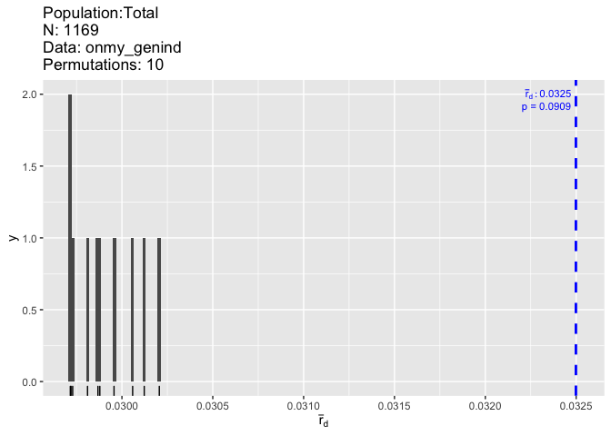

Elwha Steelhead Population Genetics
================
Kimberly Ledger
10 March 2022

This code will look at neutral population genetics of steelhead/rainbow
trout in the Elwha River, Washington - this dataset includes individuals
sampled before and after two dams were removed (lower dam removal
completed in 2012; upper dam removal completed in 2015)

### load libraries

``` r
library(vcfR) #this package is used to visualize and manipulate VCF files
library(adegenet) #this package is used for analysis of genetic/genomic data 
library(dplyr) # data manipulation
library(tidyr) # data manipulation
library(pegas) #a package for pop gen data analysis
library(poppr) #a package for pop gen data analysis
```

# Part 1: Prepare the data

## read in the steelhead (Oncorhynchus mykiss) metadata

``` r
onmy_metadata <- read.csv("~/Desktop/LG_Proj4/Elwha_datafiles/Elwha_Steelhead_Formatted.csv")
head(onmy_metadata)
```

    ##   Sample_ID Year   Smolt Fork_Length NvH_Origin  Sex    Date Time Location
    ## 1  33649_17 2004 Unknown          NA          N <NA> 7/14/04  Pre       ID
    ## 2  33649_18 2004 Unknown          NA          N <NA> 7/14/04  Pre       ID
    ## 3  33649_19 2004 Unknown          NA          N <NA> 7/14/04  Pre       ID
    ## 4  33649_20 2004 Unknown          NA          N <NA> 7/14/04  Pre       ID
    ## 5  33649_23 2004 Unknown          NA          N <NA> 7/14/04  Pre       ID
    ## 6  33649_26 2004 Unknown          NA          N <NA> 7/14/04  Pre       ID
    ##   Run_Timing Life_Stage Life_History_Type      Lat      Long rkm Sampling_Site
    ## 1    Unknown   Juvenile       Land_Locked 48.11933 -123.5535  NA  little_river
    ## 2    Unknown   Juvenile       Land_Locked 48.06303 -123.5770  NA  little_river
    ## 3    Unknown   Juvenile       Land_Locked 48.06303 -123.5770  NA  little_river
    ## 4    Unknown   Juvenile       Land_Locked 48.06303 -123.5770  NA  little_river
    ## 5    Unknown   Juvenile       Land_Locked 48.06303 -123.5770  NA  little_river
    ## 6    Unknown   Juvenile       Land_Locked 48.06303 -123.5770  NA  little_river

### check out a quick summary tables of the metadata

``` r
onmy_metadata %>%
  group_by(Time, Location, Life_Stage) %>%
  summarize(total = n())
```

    ## # A tibble: 11 × 4
    ## # Groups:   Time, Location [9]
    ##    Time   Location Life_Stage total
    ##    <chr>  <chr>    <chr>      <int>
    ##  1 During BD       Adult         44
    ##  2 Post   AD       Adult         61
    ##  3 Post   AD       Juvenile     420
    ##  4 Post   BD       Adult        512
    ##  5 Post   BD       Juvenile       1
    ##  6 Post   ID       Adult         61
    ##  7 Post   SBLR     Juvenile      27
    ##  8 Pre    AD       Juvenile     208
    ##  9 Pre    BD       Juvenile     104
    ## 10 Pre    ID       Juvenile     169
    ## 11 Pre    SBLR     Juvenile      86

``` r
onmy_metadata %>%
  group_by(Time, Sampling_Site) %>%
  summarize(total = n()) %>%
  pivot_wider(names_from = "Time", values_from = "total")
```

    ## # A tibble: 31 × 4
    ##    Sampling_Site      During  Post   Pre
    ##    <chr>               <int> <int> <int>
    ##  1 elwha_river_lower      40    71   104
    ##  2 elwha_river_mouth       3     4    NA
    ##  3 lekt_outlet             1   320    NA
    ##  4 altaire                NA    14    32
    ##  5 boulder                NA     6    NA
    ##  6 chicago_camp           NA     6     7
    ##  7 ds_fishermans_bend     NA    10    NA
    ##  8 ds_ranger_station      NA     7    NA
    ##  9 elkhorn                NA   117    37
    ## 10 elwha_river_middle     NA    11    NA
    ## # … with 21 more rows

## read in the VCF file and convert to genind object

``` r
onmy_vcf <- read.vcfR("~/Desktop/LG_Proj4/Elwha_datafiles/Elwha_GTSeq_Sans_CCT.vcf")
```

    ## Scanning file to determine attributes.
    ## File attributes:
    ##   meta lines: 35
    ##   header_line: 36
    ##   variant count: 336
    ##   column count: 1178
    ## Meta line 35 read in.
    ## All meta lines processed.
    ## gt matrix initialized.
    ## Character matrix gt created.
    ##   Character matrix gt rows: 336
    ##   Character matrix gt cols: 1178
    ##   skip: 0
    ##   nrows: 336
    ##   row_num: 0
    ## Processed variant: 336
    ## All variants processed

``` r
onmy_genind <- vcfR2genind(onmy_vcf, sep = "/")
onmy_genind
```

    ## /// GENIND OBJECT /////////
    ## 
    ##  // 1,169 individuals; 336 loci; 664 alleles; size: 3.3 Mb
    ## 
    ##  // Basic content
    ##    @tab:  1169 x 664 matrix of allele counts
    ##    @loc.n.all: number of alleles per locus (range: 1-2)
    ##    @loc.fac: locus factor for the 664 columns of @tab
    ##    @all.names: list of allele names for each locus
    ##    @ploidy: ploidy of each individual  (range: 2-2)
    ##    @type:  codom
    ##    @call: adegenet::df2genind(X = t(x), sep = sep)
    ## 
    ##  // Optional content
    ##    - empty -

note: there is a warning about “stack imbalance”. is this a problem?

## add population information into the genind object - Location or Sampling_Site????

``` r
# create empty data frame 
onmy_pop <- matrix(NA, nrow=nrow(onmy_genind@tab), ncol=2)
onmy_pop <- as.data.frame(onmy_pop)
names(onmy_pop) <- c("Sample_ID", "pop")

# add population info for each individual to data frame
for (i in 1:nrow(onmy_genind@tab)){
  onmy_pop$Sample_ID[i] <- rownames(onmy_genind@tab)[i]
  onmy_pop$pop[i] <- onmy_metadata %>% filter(Sample_ID == rownames(onmy_genind@tab)[i]) %>% select(Location)
}

# check for samples missing from metadata file
onmy_pop[which(onmy_pop$pop == "character(0)"),]
```

    ##          Sample_ID pop
    ## 143      50584_289    
    ## 144      50584_290    
    ## 145      50584_292    
    ## 146      50585_055    
    ## 458  52008_2018_02    
    ## 460  52008_2018_03    
    ## 962      52275_196    
    ## 990 52381_2019_170

``` r
# removed pop column for samples missing location ID 
#onmy_pop2 <- onmy_pop[-c(143,144,145,146,458,460,962,990),]

# add population info to the genind obj
strata(onmy_genind) <- onmy_pop
setPop(onmy_genind) <- ~pop

onmy_genind
```

    ## /// GENIND OBJECT /////////
    ## 
    ##  // 1,169 individuals; 336 loci; 664 alleles; size: 3.4 Mb
    ## 
    ##  // Basic content
    ##    @tab:  1169 x 664 matrix of allele counts
    ##    @loc.n.all: number of alleles per locus (range: 1-2)
    ##    @loc.fac: locus factor for the 664 columns of @tab
    ##    @all.names: list of allele names for each locus
    ##    @ploidy: ploidy of each individual  (range: 2-2)
    ##    @type:  codom
    ##    @call: adegenet::df2genind(X = t(x), sep = sep)
    ## 
    ##  // Optional content
    ##    @pop: population of each individual (group size range: 8-568)
    ##    @strata: a data frame with 2 columns ( Sample_ID, pop )

note: there are eight samples with missing genotypes from the metadata
file

# Part 1: Hardy-Weinburg Equilibrium

## HWE using complete datatset

### global hardy-weinberg equilibrium

``` r
onmy_hw <- data.frame(round(pegas::hw.test(onmy_genind, B = 0), digits = 3)) #skipping permutation test

onmy_out_of_hw <- onmy_hw %>%
  filter(Pr.chi.2... < 0.05)

nrow(onmy_out_of_hw)
```

    ## [1] 106

there are **106 loci** out of HWE

### check for deviations from hardy-weinberg equilibrium at the “population” level

for population, i am using location informaiton

``` r
onmy_hw_test <- data.frame(sapply(seppop(onmy_genind), 
                              function(ls) pegas::hw.test(ls, B = 0)[,3])) #skipping permutation test
```

    ## Warning in hw.test.loci(x = x, B = B, ...): The following locus was ignored: NC_035104_1_11609794
    ## (not the same ploidy for all individuals, or too many missing data)

``` r
# remove the column for the population that is just samples that did not have population metadata 
onmy_hw_test2 <- onmy_hw_test[,-4]

onmy_hw_chisq <- t(data.matrix(onmy_hw_test2))
#{cat("Chi-squared test (p-values):", "\n")
#round(onmy_hw_chisq ,3)}

# proportion of loci out of HWE 
alpha=0.05
Prop.loci.out.of.HWE <- data.frame(Chisq=apply(onmy_hw_chisq<alpha, 2, mean))
Prop.loci.out.of.HWE %>%
  filter(Chisq >= 0.5)
```

    ##                      Chisq
    ## NC_035086_1_30372084  1.00
    ## NC_035086_1_63650747  0.50
    ## NC_035077_1_55279296  0.50
    ## NC_035077_1_59464348  0.50
    ## NC_035092_1_16334074  0.75
    ## NC_035092_1_44116456  1.00
    ## NC_035092_1_46432462  0.75
    ## NC_035103_1_23730945  0.75
    ## NC_035083_1_19036977  0.50
    ## NC_035090_1_53660117  0.50
    ## NC_035088_1_40136309  0.50
    ## NC_035088_1_48181130  0.50
    ## NC_035088_1_66078752  0.50
    ## NC_035088_1_67131514  0.50
    ## NC_035080_1_3391469   0.50
    ## NC_035080_1_68318464  0.75
    ## NC_035095_1_6114061   0.50
    ## NC_035095_1_23702093  0.50
    ## NC_035081_1_13954598  0.75
    ## NC_035081_1_40927121  0.75
    ## NC_035081_1_61772669  0.75
    ## NC_035081_1_61828903  0.50
    ## NC_035087_1_24411085  0.50
    ## NC_035087_1_37031757  0.75
    ## NC_035087_1_51013177  0.50
    ## NC_035091_1_13042222  0.75
    ## NC_035091_1_24041111  0.50
    ## NC_035091_1_44094440  0.75
    ## NC_035093_1_14488587  0.50
    ## NC_035093_1_20693754  0.75
    ## NC_035093_1_41462973  0.75
    ## NC_035082_1_51490760  0.50
    ## NC_035078_1_38922611  0.75
    ## NC_035078_1_52384497  0.75
    ## NC_035078_1_54044836  0.75
    ## NC_035078_1_67119313  0.75
    ## NC_035079_1_38336651  1.00
    ## NC_035104_1_11607954  0.50
    ## NC_035104_1_11618027  0.75
    ## NC_035104_1_11625241  0.75
    ## NC_035104_1_11632591  0.50
    ## NC_035104_1_11641623  0.75
    ## NC_035104_1_11658853  0.75
    ## NC_035104_1_11667578  0.75
    ## NC_035104_1_11667915  0.75
    ## NC_035104_1_11671116  0.75
    ## NC_035104_1_11676622  0.75
    ## NC_035104_1_11683204  0.75
    ## NC_035098_1_24247865  0.50
    ## NC_035085_1_36338472  0.75
    ## NC_035085_1_43771325  0.50
    ## NC_035085_1_50381707  0.50
    ## NC_035085_1_60510483  0.50
    ## NW_24                 0.75

``` r
# for each population, the proportion of loci out of HWE
Prop.pop.out.of.HWE <- data.frame(Chisq=apply(onmy_hw_chisq<alpha, 1, mean))
Prop.pop.out.of.HWE
```

    ##           Chisq
    ## ID   0.15178571
    ## AD   0.24404762
    ## BD   0.20535714
    ## SBLR 0.04464286

-   there are **54 loci** out of HWE  
-   the “population” SBLR is also consistently out of HWE across loci

## read in loci metadata

``` r
onmy_loci_meta <- read.csv("~/Desktop/LG_Proj4/Elwha_datafiles/Steelhead_Locus_Key_kjl.csv")
```

## read in SNP coordinate data

``` r
onmy_snp_coord <- read.csv("~/Desktop/LG_Proj4/Elwha_datafiles/SNP_Coordinates_CRITFC_kjl.csv")
```

join loci metadata and SNP coords

``` r
onmy_locus_join <- onmy_snp_coord %>%
  left_join(onmy_loci_meta, by = "Locus")
```

note: loci on chromosome 25 do not have neutral/adaptive metadata
included

## filter the metatdata for only the neutral loci

``` r
onmy_loci_neutral <- onmy_locus_join %>%
  filter(Status == "Neutral")

onmy_snp_neutral <- onmy_loci_neutral$SNP
```

## filter the genind object to retain only neutral loci

``` r
onmy_genind_neutral <- onmy_genind[loc = onmy_snp_neutral]
```

    ## Warning: the following specified loci do not exist: NC_035092_1_44843440,
    ## NC_035080_1_52511964, NC_035090_1_72350872, NC_035105_1_33267127,
    ## NC_035084_1_29102820, NC_035080_1_16436234, NC_035082_1_17599731,
    ## NC_035089_1_39287232, NC_035090_1_14516742, NC_035084_1_17470364,
    ## NC_035090_1_7102407, NC_035080_1_10520793, NC_035091_1_39788784,
    ## NC_035091_1_12595806, NC_035098_1_18917430, NC_035094_1_42558654,
    ## NC_035085_1_12485117, NC_035105_1_39802221, NC_035077_1_79898098,
    ## NC_035093_1_41690956

``` r
onmy_genind_neutral
```

    ## /// GENIND OBJECT /////////
    ## 
    ##  // 1,169 individuals; 222 loci; 442 alleles; size: 2.3 Mb
    ## 
    ##  // Basic content
    ##    @tab:  1169 x 442 matrix of allele counts
    ##    @loc.n.all: number of alleles per locus (range: 1-2)
    ##    @loc.fac: locus factor for the 442 columns of @tab
    ##    @all.names: list of allele names for each locus
    ##    @ploidy: ploidy of each individual  (range: 2-2)
    ##    @type:  codom
    ##    @call: .local(x = x, i = i, j = j, loc = ..1, drop = drop)
    ## 
    ##  // Optional content
    ##    @pop: population of each individual (group size range: 8-568)
    ##    @strata: a data frame with 2 columns ( Sample_ID, pop )

Note: there are 20 neutral loci from the loci metadata that do not seem
to match loci names in the genind object  
for now, i will continue working with the **222 neutral loci**

## HWE using only the “neutral” loci

### recheck for deviations from hardy-weinberg equilibrium (global)

``` r
onmy_neutral_hw <- data.frame(round(pegas::hw.test(onmy_genind_neutral, B = 0), digits = 3)) #skipping permutation test

onmy_neutral_out_of_hw <- onmy_neutral_hw %>%
  filter(Pr.chi.2... < 0.05)

nrow(onmy_neutral_out_of_hw)
```

    ## [1] 53

note: there the **53 loci** that fall out of HWE

## check for deviations from hardy-weinberg equilibrium at the population level

``` r
onmy_neutral_hw_test <- data.frame(sapply(seppop(onmy_genind_neutral), 
                              function(ls) pegas::hw.test(ls, B = 0)[,3])) #skipping permutation test

# remove the column for the population that is just samples that did not have population metadata 
 onmy_neutral_hw_test2 <- onmy_neutral_hw_test[,-4]

onmy_neutral_hw_chisq <- t(data.matrix(onmy_neutral_hw_test2))
#{cat("Chi-squared test (p-values):", "\n")
#round(onmy_neutral_hw_chisq ,3)}

# proportion of loci out of HWE 
alpha=0.05
Prop.loci.out.of.HWE <- data.frame(Chisq=apply(onmy_neutral_hw_chisq<alpha, 2, mean))
Prop.loci.out.of.HWE %>%
  filter(Chisq >= 0.5)
```

    ##                      Chisq
    ## NC_035086_1_63650747  0.50
    ## NC_035077_1_55279296  0.50
    ## NC_035077_1_59464348  0.50
    ## NC_035092_1_16334074  0.75
    ## NC_035092_1_46432462  0.75
    ## NC_035103_1_23730945  0.75
    ## NC_035083_1_19036977  0.50
    ## NC_035090_1_53660117  0.50
    ## NC_035088_1_40136309  0.50
    ## NC_035080_1_3391469   0.50
    ## NC_035095_1_6114061   0.50
    ## NC_035095_1_23702093  0.50
    ## NC_035081_1_61828903  0.50
    ## NC_035087_1_24411085  0.50
    ## NC_035087_1_51013177  0.50
    ## NC_035091_1_13042222  0.75
    ## NC_035091_1_24041111  0.50
    ## NC_035091_1_44094440  0.75
    ## NC_035093_1_14488587  0.50
    ## NC_035093_1_20693754  0.75
    ## NC_035093_1_41462973  0.75
    ## NC_035078_1_38922611  0.75
    ## NC_035085_1_43771325  0.50
    ## NC_035085_1_50381707  0.50
    ## NC_035085_1_60510483  0.50

``` r
# for each population, the proportion of loci out of HWE
Prop.pop.out.of.HWE <- data.frame(Chisq=apply(onmy_neutral_hw_chisq<alpha, 1, mean))
Prop.pop.out.of.HWE
```

    ##           Chisq
    ## ID   0.10810811
    ## AD   0.17567568
    ## BD   0.16216216
    ## SBLR 0.04054054

Note: there are 25 loci that fall out of HWE for 2 or more of the
populations (BD/ID/AD/SBLR)  
Note: SBLR is consistently out of HWE across loci

### next steps?: repeat test of HWE with ‘false discovery rate’ correction

# Part 2: linkage disequilibrium

## check for linkage disequilibrium

just doing this for the exercise… we know where on the genome these
markers are located

``` r
LD <- poppr::ia(onmy_genind, sample = 10)  #should increase sample by a lot... 
```

<!-- -->

``` r
LD
```

    ##         Ia       p.Ia      rbarD       p.rD 
    ## 9.74016604 0.09090909 0.03249869 0.09090909

``` r
#LD_neutral <- poppr::ia(onmy_genind_neutral, sample = 10)  #should increase sample by a lot... 
#LD_neutral
```

pair-wise LD - this takes a long time to run so not including it for
now…

``` r
#LD.pair <- poppr::pair.ia(onmy_genind_neutral)
#LD.pair
```

# Part 3: use Fst to identify outliers

## to do this i will use OutFLANK

this starts with extracting the genotypes from the vcfR object

``` r
geno <- extract.gt(onmy_vcf)
dim(geno)
```

    ## [1]  336 1169

``` r
head(geno[,1:10])
```

    ##                      33649_30 34185_022 34185_023 34185_024 34185_025 34186_004
    ## NC_035086.1_7508221  NA       NA        "1/1"     NA        "0/0"     "0/1"    
    ## NC_035086.1_10852282 "0/1"    "0/1"     "0/1"     NA        "0/0"     "1/1"    
    ## NC_035086.1_30372084 "0/1"    "0/1"     "0/1"     "0/1"     "0/1"     "0/1"    
    ## NC_035086.1_32872704 "0/1"    "0/0"     "0/1"     "0/1"     "0/1"     "0/0"    
    ## NC_035086.1_38704654 "0/0"    "0/0"     "0/0"     NA        "0/0"     "0/0"    
    ## NC_035086.1_40486618 "0/0"    "0/1"     "0/1"     NA        "0/1"     "0/1"    
    ##                      34186_005 34186_007 34186_008 34186_010
    ## NC_035086.1_7508221  "0/1"     "0/1"     "0/1"     "0/1"    
    ## NC_035086.1_10852282 "0/0"     "0/0"     "0/0"     "0/0"    
    ## NC_035086.1_30372084 "0/1"     "0/1"     "0/1"     "0/1"    
    ## NC_035086.1_32872704 "0/1"     "0/1"     "0/1"     "0/1"    
    ## NC_035086.1_38704654 "0/0"     "0/0"     "0/0"     "0/0"    
    ## NC_035086.1_40486618 "0/1"     "0/1"     "0/0"     "0/0"

Notice that as our genotypes look like 0/0, 0/1, and 1/1. But OutFLANK
wants them to be 0, 1, or 2. The code below fixes this problem:

``` r
G <- geno  #we are doing this because we will be running a lot of different things with G, and if we mess up we want to be able to go back to geno

G[geno %in% c("0/0")] <- 0
G[geno  %in% c("0/1")] <- 1
G[geno %in% c("1/1")] <- 2
G[is.na(G)] <- 9
tG <- t(G)
dim(tG)
```

    ## [1] 1169  336

now i need to figure out how to match the population metadata to the
genotypes

``` r
samples <- data.frame(colnames(geno))
colnames(samples) <- "Sample_ID"

samples_pop <- samples %>%
  left_join(onmy_metadata, by = "Sample_ID")
```

note: there are a few individuals with missing metadata

Now tG should be in the input format OutFLANK needs, with SNPs as
columns and individuals as rows.

Now we can calculate Fst for each SNP: locusNames= names our loci 1,2,3
etc popNames= names our populations with the “Location” or
“Sampling_Site” labels

## use “Location” as population

``` r
library(OutFLANK)
```

    ## Loading required package: qvalue

``` r
fst_loc <- MakeDiploidFSTMat(tG,locusNames=1:ncol(tG),popNames=samples_pop$Location)
```

    ## Calculating FSTs, may take a few minutes...

``` r
head(fst_loc)
```

    ##   LocusName          He           FST            T1          T2    FSTNoCorr
    ## 1         1 0.467492579  0.0070814271  1.661016e-03 0.234559509 0.0097548522
    ## 2         2 0.257812395  0.0145565458  1.888787e-03 0.129755173 0.0172128719
    ## 3         3 0.498597791 -0.0001019820 -2.542419e-05 0.249300686 0.0001487886
    ## 4         4 0.489016494 -0.0015983036 -3.907048e-04 0.244449659 0.0005471954
    ## 5         5 0.008204989  0.0003192373  1.310511e-06 0.004105132 0.0029070106
    ## 6         6 0.483589455  0.0027479444  6.654881e-04 0.242176712 0.0050106155
    ##       T1NoCorr    T2NoCorr meanAlleleFreq
    ## 1 2.289450e-03 0.234698545      0.6274900
    ## 2 2.234759e-03 0.129830679      0.8479853
    ## 3 3.709511e-05 0.249314170      0.5264784
    ## 4 1.338240e-04 0.244563483      0.5741064
    ## 5 1.194008e-05 0.004107341      0.9958805
    ## 6 1.214050e-03 0.242295633      0.5905830

``` r
hist(fst_loc$FST, breaks = 50)
```

<!-- -->

Once we’ve calculated Fst between the populations for each SNP
individually, we want to determine whether some SNPs are statistical
outliers - that is, more differentiated than we would expect. OutFLANK
does this by fitting a Chi-Squared distribution to the data and looking
to see if the tails of the Chi-Squared distribution have more SNPs than
expected:

**check OutFLANK parameters** for now, i only adjusted the
RightTrimFraction from the tutorial’s values

``` r
OF <- OutFLANK(fst_loc,LeftTrimFraction=0.01,RightTrimFraction=0.05,
         Hmin=0.05,NumberOfSamples=2,qthreshold=0.01)
OutFLANKResultsPlotter(OF,withOutliers=T,
                       NoCorr=T,Hmin=0.1,binwidth=0.005,
                       Zoom=F,RightZoomFraction=0.05,titletext=NULL)
```

<!-- -->

which SNPs are statistical outliers?

``` r
P1 <- pOutlierFinderChiSqNoCorr(fst_loc,Fstbar=OF$FSTNoCorrbar,
                                dfInferred=OF$dfInferred,qthreshold=0.05,Hmin=0.1)
outliers <- P1$OutlierFlag==TRUE #which of the SNPs are outliers?
table(outliers)
```

    ## outliers
    ## FALSE  TRUE 
    ##   272    10

the Fst outlier test identified **10 outlier SNPs**

Now we can make a manhattan plot! We can even plot the outliers in a
different color:

``` r
plot(P1$LocusName,P1$FST,xlab="Position",ylab="FST",col=rgb(0,0,0,alpha=0.1))
points(P1$LocusName[outliers],P1$FST[outliers],col="magenta")
```

<!-- -->

okay, so fewer loci are detected as outliers than were filtered out by
the “neutral/adaptive” category

## repeat using “Sampling_Site” as population

``` r
fst_sam <- MakeDiploidFSTMat(tG,locusNames=1:ncol(tG),popNames=samples_pop$Sampling_Site)
```

    ## Calculating FSTs, may take a few minutes...

``` r
head(fst_sam)
```

    ##   LocusName          He          FST           T1          T2   FSTNoCorr
    ## 1         1 0.467492579 0.0066658467 1.560161e-03 0.234052879 0.021413427
    ## 2         2 0.257812395 0.0168905537 2.182904e-03 0.129238143 0.032160426
    ## 3         3 0.498597791 0.0003699466 9.223588e-05 0.249322142 0.001812437
    ## 4         4 0.489016494 0.0029795174 7.290835e-04 0.244698524 0.015285458
    ## 5         5 0.008204989 0.0029674996 1.218456e-05 0.004106003 0.017951483
    ## 6         6 0.483589455 0.0031618873 7.651560e-04 0.241993448 0.016221672
    ##       T1NoCorr    T2NoCorr meanAlleleFreq
    ## 1 5.018026e-03 0.234340170      0.6274900
    ## 2 4.161932e-03 0.129411585      0.8479853
    ## 3 4.519368e-04 0.249353148      0.5264784
    ## 4 3.744357e-03 0.244962038      0.5741064
    ## 5 7.379958e-05 0.004111058      0.9958805
    ## 6 3.929944e-03 0.242265012      0.5905830

``` r
hist(fst_sam$FST, breaks = 50)
```

<!-- -->

Once we’ve calculated Fst between the populations for each SNP
individually, we want to determine whether some SNPs are statistical
outliers - that is, more differentiated than we would expect. OutFLANK
does this by fitting a Chi-Squared distribution to the data and looking
to see if the tails of the Chi-Squared distribution have more SNPs than
expected:

**check OutFLANK parameters** for now, i only adjusted the
RightTrimFraction from the tutorial’s values

``` r
OF <- OutFLANK(fst_sam,LeftTrimFraction=0.01,RightTrimFraction=0.08,
         Hmin=0.05,NumberOfSamples=2,qthreshold=0.01)
OutFLANKResultsPlotter(OF,withOutliers=T,
                       NoCorr=T,Hmin=0.1,binwidth=0.005,
                       Zoom=F,RightZoomFraction=0.05,titletext=NULL)
```

<!-- -->

which SNPs are statistical outliers?

``` r
P1 <- pOutlierFinderChiSqNoCorr(fst_sam,Fstbar=OF$FSTNoCorrbar,
                                dfInferred=OF$dfInferred,qthreshold=0.05,Hmin=0.1)
outliers <- P1$OutlierFlag==TRUE #which of the SNPs are outliers?
table(outliers)
```

    ## outliers
    ## FALSE  TRUE 
    ##   257    25

the Fst outlier test identified **25 outlier SNPs**

Now we can make a manhattan plot! We can even plot the outliers in a
different color:

``` r
plot(P1$LocusName,P1$FST,xlab="Position",ylab="FST",col=rgb(0,0,0,alpha=0.1))
points(P1$LocusName[outliers],P1$FST[outliers],col="magenta")
```

<!-- -->

okay, so this detected more loci than when using “Location” as the
population… but maybe it is just due to the RightTrimFraction???

### next steps?: subset the vcf data for only the ‘neutral’ loci and rerun Fst outlier test

# Part 4: use pcadapt to look at population structure and identify possible outiers

``` r
library(pcadapt)
library(qvalue)
```

read in the genetic data from the vcf file

``` r
genos <- read.pcadapt("~/Desktop/LG_Proj4/Elwha_datafiles/Elwha_GTSeq_Sans_CCT.vcf", type=c("vcf"))
```

    ## Warning in file2other(input, type, match.arg(type.out), match.arg(allele.sep)):
    ## Converter vcf to pcadapt is deprecated. Please use PLINK for conversion to bed
    ## (and QC).

    ## No variant got discarded.
    ## Summary:
    ## 
    ##  - input file:               ~/Desktop/LG_Proj4/Elwha_datafiles/Elwha_GTSeq_Sans_CCT.vcf
    ##  - output file:              /var/folders/t2/wbsd_3lj75g73ymn1rtjbwj00000gn/T//Rtmp9YIoaJ/file1a8a1aa043f2.pcadapt
    ## 
    ##  - number of individuals detected:   1169
    ##  - number of loci detected:      336
    ## 
    ## 336 lines detected.
    ## 1169 columns detected.

    ## Warning in writeBed(input, is.pcadapt): You have more individuals than SNPs.
    ##   Are you sure of the type of your file? (pcadapt/lfmm)

``` r
x <- pcadapt(input = genos, K = 20)
plot(x, option="screeplot")
```

    ## Warning: `guides(<scale> = FALSE)` is deprecated. Please use `guides(<scale> =
    ## "none")` instead.

<!-- -->

``` r
plot(x, option="scores")
```

<!-- -->

``` r
plot(x, option="manhattan")
```

<!-- -->

``` r
plot(x, option = "qqplot", threshold = 0.1)
```

    ## Warning: `guides(<scale> = FALSE)` is deprecated. Please use `guides(<scale> =
    ## "none")` instead.

<!-- -->

now plot the scores and add color for the sampling locations

``` r
locations <- samples_pop$Location
sampling_site <- samples_pop$Sampling_Site
plot(x, option = "scores", pop = locations)
```

    ## Warning: Use of `df$Pop` is discouraged. Use `Pop` instead.

<!-- -->

``` r
plot(x, option = "scores", pop = sampling_site)
```

    ## Warning: Use of `df$Pop` is discouraged. Use `Pop` instead.

<!-- -->

plot additional PC axes

``` r
plot(x, option = "scores", i = 3, j = 4, pop = locations)
```

    ## Warning: Use of `df$Pop` is discouraged. Use `Pop` instead.

<!-- -->

``` r
plot(x, option = "scores", i = 4, j = 5, pop = locations)
```

    ## Warning: Use of `df$Pop` is discouraged. Use `Pop` instead.

<!-- -->

pc3 separates SBLR from all other samples; pc4 and above no longer
ascertain population structure  
for now, i will continue with using **K=3**

## compute the test statistic based on PCA

we will use K=3 based on the above plots

``` r
x3 <- pcadapt(genos, K = 3)
summary(x3)
```

    ##                 Length Class  Mode   
    ## scores          3507   -none- numeric
    ## singular.values    3   -none- numeric
    ## loadings        1008   -none- numeric
    ## zscores         1008   -none- numeric
    ## af               336   -none- numeric
    ## maf              336   -none- numeric
    ## chi2.stat        336   -none- numeric
    ## stat             336   -none- numeric
    ## gif                1   -none- numeric
    ## pvalues          336   -none- numeric
    ## pass             282   -none- numeric

plots

``` r
plot(x3, option = "scores", pop = locations)
```

    ## Warning: Use of `df$Pop` is discouraged. Use `Pop` instead.

<!-- -->

``` r
plot(x3, option = "manhattan")
```

<!-- -->

``` r
plot(x3, option = "qqplot")
```

    ## Warning: `guides(<scale> = FALSE)` is deprecated. Please use `guides(<scale> =
    ## "none")` instead.

<!-- -->

``` r
hist(x3$pvalues, xlab = "p-values", main = NULL, breaks = 50, col = "orange")
```

<!-- -->

from here there are several ways to detect outliers, q-values,
Benjamini-Hochberg, bonferroni correction…  
see: <https://bcm-uga.github.io/pcadapt/articles/pcadapt.html>

for now i will use the q-values to identify statistical outliers

``` r
qval <- qvalue(x3$pvalues)$qvalues
outliers <- which(qval<0.1)
length(outliers)
```

    ## [1] 23

23 outlier loci detected

# Part 5: evaluate if LD could be an issue for the dataset

display the loadings (contributions of each SNP to the PC) and to
evaluate if the loadings are clustered in a single or several genomic
regions

``` r
par(mfrow = c(2, 2))
for (i in 1:3)
  plot(x3$loadings[, i], pch = 19, cex = .3, ylab = paste0("Loadings PC", i))
```

<!-- -->

PC1 is determined mostly by 2 genomic regions - possibly a region of
strong LD PC2 is determined moslty by 1 genomic region - another
possible region of strong LD

now let’s try thinning the SNPs in order to compute the PCs for now i’m
just guessing on thinning parameters

``` r
x_reduced <- pcadapt(input = genos, K = 20, LD.clumping = list(size = 200, thr = 0.1))
plot(x_reduced, option = "screeplot")
```

    ## Warning: `guides(<scale> = FALSE)` is deprecated. Please use `guides(<scale> =
    ## "none")` instead.

<!-- -->

``` r
plot(x_reduced, option = "scores", pop = locations)
```

    ## Warning: Use of `df$Pop` is discouraged. Use `Pop` instead.

<!-- -->

``` r
plot(x_reduced, option = "scores", pop = sampling_site)
```

    ## Warning: Use of `df$Pop` is discouraged. Use `Pop` instead.

<!-- -->

``` r
plot(x_reduced, option = "scores", i = 3, j = 4, pop = locations)
```

    ## Warning: Use of `df$Pop` is discouraged. Use `Pop` instead.

<!-- -->

``` r
plot(x_reduced, option = "scores", i = 4, j = 5, pop = locations)
```

    ## Warning: Use of `df$Pop` is discouraged. Use `Pop` instead.

<!-- -->

after thinning, k=2 looks good

``` r
x2_res <- pcadapt(genos, K = 2, LD.clumping = list(size = 200, thr = 0.1))
par(mfrow = c(1, 2))
for (i in 1:2)
  plot(x2_res$loadings[, i], pch = 19, cex = .3, ylab = paste0("Loadings PC", i))
```

<!-- -->

plots look better now… but i’m really not sure how the LD.clumping
function worked…

``` r
plot(x2_res)
```

<!-- -->

now maybe there is one region involved in adaptation??

## Part 6: rerun the PCA excluding the outlier loci discovered using pcadapt and q-values

remove outlier loci - is there a way to remove loci from within the
pcadapt object? or the vcf object?

``` r
outliers
```

    ##  [1]  20  23 151 152 153 155 156 157 160 162 283 296 298 299 300 301 302 303 304
    ## [20] 305 306 307 316

``` r
dim(geno)
```

    ## [1]  336 1169

``` r
geno_reduced <- geno[-outliers,]
dim(geno_reduced)
```

    ## [1]  313 1169

``` r
#write.vcf(geno_reduced, "~/Desktop/LG_Proj4/Elwha_datafiles/Elwha_GTSeq_Sans_CCT_reduced.vcf.gz")
#this does not work. 
```

## Part 7: Clustering with SNMF (similar to ‘STRUCTURE’)

convert vcf to geno - this crashes my RStudio…

``` r
#library('LEA')

#mygeno <- vcf2geno("~/Desktop/LG_Proj4/Elwha_datafiles/Elwha_GTSeq_Sans_CCT.vcf")
```

estimate K

``` r
#snmf2 <- LEA::snmf("stickleback.geno", K=1:8, ploidy=2, entropy=T, 
#                   alpha=100, project="new")
#par(mfrow=c(1,1))
#plot(snmf2, col="blue4", cex=1.4, pch=19)
```
